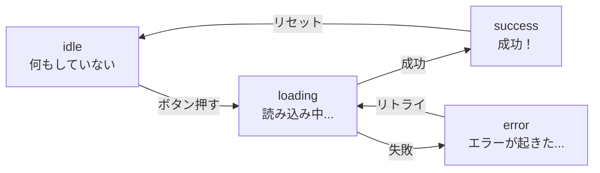

# 第34章：`useState`で明示的に型を付ける

---

## 1️⃣ 今日やること

この章のゴールは…

> 「`useState` に **自分でしっかり型を指定できるようになる** 💪」

ことです。

前の章では、

* `const [count, setCount] = useState(0);`
* `const [text, setText] = useState("こんにちは");`

みたいに、**最初の値から TypeScript に型を推論させる**パターンを見ましたよね。

でも、こんなときはそれだけだと足りません👇

* 「まだ選ばれてない状態」を表したくて `null` を使いたいとき
* 状態が `"idle" | "loading" | "success" | "error"` のどれか…みたいな **パターン名**で管理したいとき
* `[]` や `{}` から始めるけど、中身の型をちゃんと決めておきたいとき

そこで出てくるのが、この子です👇

> `useState<ここに型を書く>(初期値)`

### ざっくりイメージ

* `useState<string>("")` → 「これはずっと `string` ですよ〜」って宣言
* `useState<string | null>(null)` → 「最初は `null` だけど、あとで `string` も入るよ」
* `useState<string[]>([])` → 「中身が `string` の配列だよ」

こんな感じで、**「自分で型を決める」スタイル**を身に付けていきます ✨

---

## 2️⃣ `useState` の型ってどこに書くの？（ジェネリクス）

`useState` は、こんなイメージの関数だと思ってください👇

> 「`useState<T>` は、`T` 型の値を覚えておくフック」

なので、`<T>` のところに **「この State はこういう型です！」** って教えてあげるだけです。

```ts
useState<ここに型を書く>(初期値);
```

### 例：数値カウントの場合 🔢

```tsx
import { useState } from "react";

function Counter() {
  // 「私は number の state を使います！」って宣言している
  const [count, setCount] = useState<number>(0);

  return (
    <div>
      <p>回数: {count}</p>
      <button onClick={() => setCount(count + 1)}>+1</button>
    </div>
  );
}

export default Counter;
```

* `useState<number>(0)`
  → `count` は **必ず number**
  → `setCount("あ")` とか書くと、VS Code が怒ってくれます 😡（でもそれが優しさ）

---

## 3️⃣ `null` を使いたいときは「ユニオン型」が必須！

React では、「まだ選んでない」「何もない」状態を表すのに `null` を使うことが多いです。

例えば「選択中のユーザー」を覚えておく State 👇

* まだ誰も選んでない → `null`
* 誰か選んだ → `"alice"` とか `"bob"`

こういうとき、**型は `string | null`** にします。

```tsx
import { useState } from "react";

function SelectedUser() {
  // 最初は「誰も選んでない」ので null
  const [selectedUser, setSelectedUser] = useState<string | null>(null);

  return (
    <div>
      <p>選択中のユーザー: {selectedUser ?? "（未選択）"}</p>

      <button onClick={() => setSelectedUser("Alice")}>Alice を選ぶ</button>
      <button onClick={() => setSelectedUser("Bob")}>Bob を選ぶ</button>
      <button onClick={() => setSelectedUser(null)}>クリア</button>
    </div>
  );
}

export default SelectedUser;
```

ここでポイント👇

* `useState(null)` のままだと、**型が `null` 固定**になってしまう
  → あとで `setSelectedUser("Alice")` しようとすると怒られます ⚠️
* だから、**最初にちゃんと `string | null` を書いてあげる**のが大事 ✨

---

## 4️⃣ 状態を「文字列のパターン」で管理する例

`true / false` だけじゃなくて、状態を `"idle" / "loading" / "success" / "error"` みたいに名前で管理したいことも多いです。

例えばボタンを押して通信するようなイメージ👇

### 状態の流れイメージ（図）



これを `useState` で表現するなら：

```ts
type Status = "idle" | "loading" | "success" | "error";
```

としてから…

```tsx
import { useState } from "react";

type Status = "idle" | "loading" | "success" | "error";

function SaveButton() {
  const [status, setStatus] = useState<Status>("idle");

  const handleClick = async () => {
    setStatus("loading");

    try {
      // ここでサーバーに保存する処理があるイメージ
      await new Promise((resolve) => setTimeout(resolve, 1000));
      setStatus("success");
    } catch (e) {
      setStatus("error");
    }
  };

  return (
    <div>
      <button onClick={handleClick} disabled={status === "loading"}>
        {status === "loading" ? "保存中..." : "保存する"}
      </button>

      {status === "success" && <p>✅ 保存に成功しました！</p>}
      {status === "error" && <p>⚠️ 保存に失敗しました…</p>}
    </div>
  );
}

export default SaveButton;
```

この書き方の良いところは… 🥰

* `setStatus("LOADING")` みたいに、**変なスペル**を書いたら即エラー
* `"loading"` 以外の謎の状態は使えない
* 状態が **4パターンに限定される**ので、頭の中がスッキリ✨

---

## 5️⃣ 配列やオブジェクトにも型を付けてみよう

### ① 配列の State に型を付ける

`[]` から始めるときは、**ほぼ必ず明示的な型が必要**です。

```ts
// 悪い例：useState([]) だけだと、型が `never[]` になることも…
const [items, setItems] = useState([]); // ← これはやめたい
```

アイテムが `string` の配列なら、こう書きます👇

```tsx
import { useState } from "react";

function FavoriteFruits() {
  // string の配列であることを明示
  const [fruits, setFruits] = useState<string[]>([]);

  const addApple = () => {
    setFruits((prev) => [...prev, "りんご"]);
  };

  return (
    <div>
      <button onClick={addApple}>りんごを追加 🍎</button>
      <ul>
        {fruits.map((fruit, index) => (
          <li key={index}>{fruit}</li>
        ))}
      </ul>
    </div>
  );
}

export default FavoriteFruits;
```

### ② オブジェクトの State に型を付ける

`type` で形を決めてから `useState` に渡すと、とてもきれいになります ✨

```tsx
import { useState } from "react";

type Profile = {
  name: string;
  age: number;
};

function ProfileCard() {
  const [profile, setProfile] = useState<Profile>({
    name: "ミカ",
    age: 20,
  });

  const incrementAge = () => {
    setProfile((prev) => ({
      ...prev,
      age: prev.age + 1,
    }));
  };

  return (
    <div>
      <p>名前: {profile.name}</p>
      <p>年齢: {profile.age}</p>
      <button onClick={incrementAge}>1歳年をとる 🎂</button>
    </div>
  );
}

export default ProfileCard;
```

* `Profile` 型にないプロパティを追加しようとすると怒られる 😈
* `age` を `string` にしようとしても怒られる
  → **「データの形」をしっかり守らせてくれる**ので、バグが減ります 💐

---

## 6️⃣ `useState` 型指定の「よく使うパターン集」🌈

さっと見返せるように、よく出てくるパターンをまとめておきます。

### ✅ よく使う型指定パターン

```ts
// ① 数値カウンター
const [count, setCount] = useState<number>(0);

// ② 真偽値
const [isOpen, setIsOpen] = useState<boolean>(false);

// ③ 文字列
const [title, setTitle] = useState<string>("");

// ④ 文字列 or null（未選択）
const [selectedId, setSelectedId] = useState<string | null>(null);

// ⑤ 特定の文字列だけを許可（状態マシン）
type Status = "idle" | "loading" | "success" | "error";
const [status, setStatus] = useState<Status>("idle");

// ⑥ 文字列配列
const [tags, setTags] = useState<string[]>([]);

// ⑦ オブジェクト（型を別で定義）
type User = { id: number; name: string };
const [user, setUser] = useState<User | null>(null);
```

---

## 7️⃣ ちょこっと手を動かしてみよう 🧪✍️（ミニ練習）

### 🔹練習1：モード切り替えボタンを作る

**お題：**

* `mode` という state を作る
* 型は `"light" | "dark"` のどちらか
* 初期値は `"light"`
* ボタンを押すたびに `"light"` ↔ `"dark"` を切り替える

ヒント👇

* `type Mode = "light" | "dark";`
* `const [mode, setMode] = useState<Mode>("light");`

---

### 🔹練習2：選択中のタブを `string | null` で管理

**お題：**

* `selectedTab` という state を作る
* 型は `string | null`
* 最初は `null`（何も選ばれていない）
* `"プロフィール"`, `"設定"` の2つのボタンを作って、押したらその文字列を `selectedTab` に入れる
* 選ばれていないときは「タブが選択されていません」と表示する

ヒント👇

* `const [selectedTab, setSelectedTab] = useState<string | null>(null);`
* 表示は `selectedTab ?? "タブが選択されていません"` みたいに書けるよ ✨

---

## 8️⃣ つまずきポイント Q&A 💡

### Q1. `useState(null)` だけだとダメなの？

> A. **あとで別の型を入れたいならダメです。**

* `useState(null)` だけだと、**「これは `null` 型です」** と解釈されます。
* なので `setState("abc")` みたいに文字列を入れると怒られます⚠️
  → 最初から `useState<string | null>(null)` みたいに書くのが正解。

---

### Q2. 「型を書いても推論に任せてもいい」ってどんなとき？

**基本ルール**はこんな感じでOKです👇

* 初期値で型がハッキリしているとき
  → `useState(0)`, `useState("hello")`, `useState(false)`
  → **推論にまかせてOK** ✅
* `null` や `[]` や `{}` から始めたいとき
  → **必ず明示的に書く** ✏️

---

## 9️⃣ まとめ 🎀

この章でやったことをおさらいすると…

* `useState` には `<T>` で **明示的に型を付けられる**
* `null` を使うときは `string | null` みたいな **ユニオン型**が超大事
* 状態を `"idle" | "loading" | "success"` みたいに **文字列のパターン**で表すと、コードが分かりやすくなる
* 配列やオブジェクトは
  → `useState<string[]>([])`, `useState<User | null>(null)` みたいに **しっかり型を書く**

次の章では、この「状態の型付け」を使いながら、**イベント処理 (`onClick`)** の型も一緒に見ていきます 💻✨
少しずつ、「型のおかげでバグが減る感じ」を体で覚えていきましょ〜 🥰
