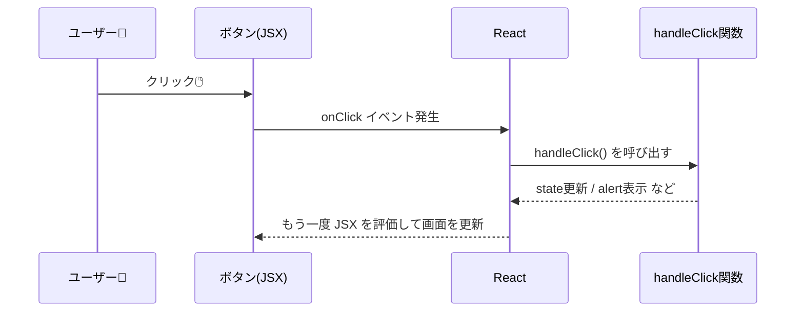

# 第35章：イベント処理 (`onClick`)

ボタンをクリックしたら画面が変わる。
Reactで「動くUI」を作るときの入り口が、この `onClick` です ✨

この章では、

* `onClick` が「何をしているのか」
* HTMLの `onclick` とどう違うのか
* `onClick={handleClick}` と `onClick={handleClick()}` の違い
* 引数つきで関数を呼びたいときの書き方

を、ゆっくり見ていきます 🌸

---

## 1. HTMLの `onclick` と React の `onClick` の違い 🌐

まずは、ふだんの HTML を思い出してみましょう。

### 👇 HTML の場合

例えば、こんなコードを書いたことがあるかもしれません：

```html
<button onclick="alert('クリックされたよ！')">クリック</button>
```

* 属性名：`onclick`（全部小文字）
* 中身：**ただの文字列**。その中に JavaScript を書いている。

---

### 👇 React (JSX) の場合

React では、こう書きます：

```tsx
<button onClick={handleClick}>クリック</button>
```

ポイントはここ👇

* 属性名：`onClick`（**先頭が小文字＋Cが大文字**のキャメルケース）
* 中身：`{}` で囲まれていて、**「JavaScriptの式」**として扱われる
* `handleClick` は **関数そのもの** を渡している

HTMLは「文字列の中にJSを書く」のに対して、
Reactは「関数をそのまま渡す」感じです 🎁

---

## 2. まずはシンプルな `onClick` を書いてみよう ✍️

`src/App.tsx` を、いったんすっきりした形にして試してみます。

### 🧪 サンプル：押したらアラートが出るボタン

`src/App.tsx` をこんな感じに書き換えてみてください。

```tsx
function App() {
  const handleClick = () => {
    alert("ボタンがクリックされました 🎉");
  };

  return (
    <div style={{ padding: "24px" }}>
      <h1>onClick の基本 💡</h1>
      <button onClick={handleClick}>ここをクリックしてね</button>
    </div>
  );
}

export default App;
```

### 動きを確認しよう 👀

1. ターミナルで
   `npm run dev` を実行（すでに動いていればそのままでOK）
2. ブラウザで表示されたページを開く
3. ボタンをクリック 👉
   → アラートが表示されれば成功です 🎊

---

## 3. `onClick={handleClick}` と `onClick={handleClick()}` の違い⚠️

ここ、めちゃくちゃつまずきポイントなので、しっかり押さえておきましょう ✋

### ✅ 正しい書き方

```tsx
<button onClick={handleClick}>クリック</button>
```

* **関数そのもの** を渡している
* 「クリックされたタイミングで React が `handleClick()` を呼び出す」

---

### ❌ よくある間違い

```tsx
<button onClick={handleClick()}>クリック</button>
```

* これは「関数を**その場で実行した結果**」を渡している
* コンポーネントが表示されるときに `handleClick()` が **勝手に実行されてしまう**
* `alert` がページ表示直後に出てきたりして、「え、なんで!?」ってなるやつです 😇

Reactのイメージとしては：

* `onClick={handleClick}`
  → 「**クリックされたら** この関数を呼んでね」と**登録している**だけ
* `onClick={handleClick()}`
  → 「**今すぐ** この関数を実行して、その結果を onClick に渡す」という意味

---

## 4. クリックの流れを図でイメージしてみる 🧠✨

`onClick` の裏側で何が起きているか、ざっくりイメージしてみましょう。



今はまだ「state更新」のところはなんとなくでOKです。
次の節で、`useState` と組み合わせて体験してみます 💪

---

## 5. `onClick` ＋ `useState` でカウンターを作る 🔢

「クリックした数」を画面に出すカウンターを作ってみましょう。

### 🧪 サンプル：シンプルカウンター

```tsx
import { useState } from "react";

function App() {
  const [count, setCount] = useState(0);

  const handleClick = () => {
    // 前の値に +1 する書き方
    setCount((prev) => prev + 1);
  };

  return (
    <div style={{ padding: "24px" }}>
      <h1>カウンター 🔢</h1>
      <p>今のカウント：{count}</p>
      <button onClick={handleClick}>+1 する</button>
    </div>
  );
}

export default App;
```

### ここで起きていること 🧐

1. 画面が表示されたとき
   `count` は `0` でスタート
2. ボタンをクリック
   → `onClick={handleClick}` が反応
   → React が `handleClick()` を呼ぶ
3. `handleClick` の中で
   `setCount((prev) => prev + 1);` が呼ばれる
4. `count` が 1 → 2 → 3... と増えるたびに
   React がコンポーネントを再実行して、`{count}` の表示も更新される ✨

---

## 6. 引数つきで関数を呼びたいときの `onClick` 🎯

「どのボタンが押されたか知りたい」「数字を渡したい」
そんなときは、**無名関数（アロー関数）** を使います。

### 🧪 サンプル：メッセージ付きボタン

```tsx
function App() {
  const handleLike = (target: string) => {
    alert(`${target} にいいねしました ❤️`);
  };

  return (
    <div style={{ padding: "24px" }}>
      <h1>いいねボタン 👍</h1>
      <button onClick={() => handleLike("React")}>React にいいね</button>
      <button onClick={() => handleLike("TypeScript")}>TS にいいね</button>
    </div>
  );
}

export default App;
```

ここでのポイントは：

* `onClick={() => handleLike("React")}`
  → クリックされた**その瞬間に**このアロー関数が呼ばれる
  → その中で `handleLike("React")` を実行している
* `() => ...` が「**あとで呼ぶための関数**」として渡されているイメージ 💡

---

## 7. ちょっとだけ発展：`e` ってなに？（チラ見だけ）👀

イベントハンドラのコードで、よくこういうのを見かけます：

```tsx
const handleClick = (e) => {
  console.log(e);
};
```

この `e` は「イベントオブジェクト」です。
「どの要素がクリックされたか」「Ctrlキーが押されていたか」など、クリックに関するいろんな情報が入っています。

ただし、**イベントの型（`React.MouseEvent` とか）** は、次の章でじっくり扱うので、
ここでは「`e` っていう情報も渡されるんだな〜」くらいでOKです ✅

---

## 8. 手を動かしてみよう！ミニ練習問題 ✍️✨

### 🔰 練習1：あいさつ切り替えボタン

**やりたいこと：**

* 最初は「こんにちは 👋」と表示
* ボタンを押すと「さようなら 👋」に変わる（もう1回押すと戻る、でもOK）

**ヒント：**

* `useState` で `message` を `useState("こんにちは 👋")` からスタート
* `handleClick` の中で、`setMessage` を使って表示を変える
* JSX側では `{message}` を表示するだけ

---

### 🔰 練習2：+1 / -1 ボタン

**やりたいこと：**

* 現在の数字を表示（最初は 0）
* 「+1」ボタンで1増える
* 「-1」ボタンで1減る

**ヒント：**

* `const [count, setCount] = useState(0);`
* `handlePlus` と `handleMinus` を分けて書いてもいいし、
  `handleChange(delta: number)` みたいにしてもOK

---

## 9. この章のまとめ 🌈

* `onClick` は「クリックされたときに呼んでほしい**関数を登録する場所**」 🧾
* React では `onclick` ではなく **`onClick`（Cが大文字）** を使う
* `onClick={handleClick}`
  → 関数をそのまま渡している（クリックされたときに実行）
* `onClick={handleClick()}`
  → その場で実行してしまうので、基本は **NG** ⚠️
* 引数を渡したいときは、`onClick={() => handleClick("React")}` のように
  **アロー関数で包む** 🎁
* `useState` と組み合わせると、「クリックしたら表示が変わるUI」が作れて一気に楽しくなる ✨

次の章では、
ここでチラッと出てきた `e`（イベントオブジェクト）にしっかり型をつけて、
「TypeScript的に正しいイベント処理」にステップアップしていきます 💪🧡
