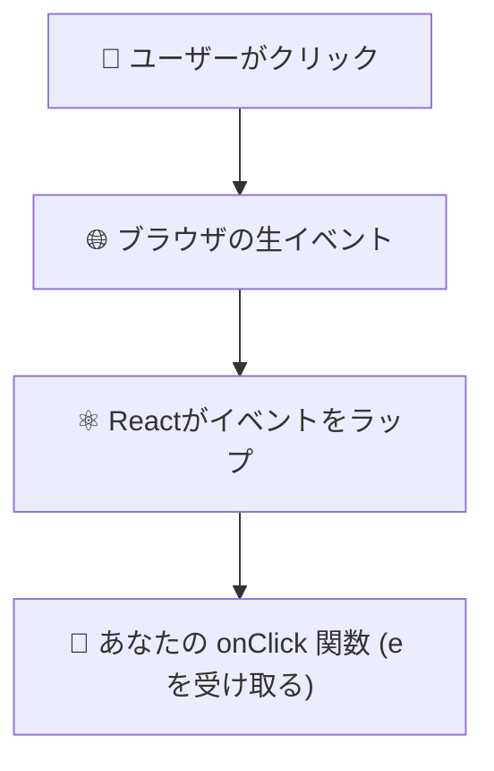

# 第37章：イベントの「型」(2) 〜フォームの `React.ChangeEvent<HTMLInputElement>` ✍️✨

## 今日のゴール🎯

* フォーム入力（`<input>`）の `onChange` で、イベント `e` にちゃんと型をつけられるようになる🙆‍♀️
* `e.target.value` を **安全に** 取り出して `useState` に入れられるようになる🧠✨

---

## まずは全体の流れをイメージしよ〜😽

```mermaid
flowchart LR
A[ユーザーが入力⌨️] --> B[onChange 発火⚡]
B --> C[handleChange(e)]
C --> D[e.target.value を取得📝]
D --> E[setState で保存📦]
E --> F[再レンダリング🔁]
F --> G[input の value が更新✨]
```

---

## `ChangeEvent<HTMLInputElement>` ってなに？🤔

* `ChangeEvent`：入力が変わったときのイベント（Reactのイベント）✨
* `<HTMLInputElement>`：**どのタグのイベントか**を指定するやつ（ここでは `<input>`）🧩

つまり、

✅ **「input の change イベントですよ〜」**ってTypeScriptに教えてあげる型だよ💡

---

## いちばん基本の形👑（これが覚えやすい！）

`src/App.tsx` をこんな感じに👇

```tsx
import { useState } from "react";

export default function App() {
  const [name, setName] = useState("");

  const handleChange = (e: React.ChangeEvent<HTMLInputElement>) => {
    setName(e.target.value);
  };

  return (
    <div style={{ padding: 16 }}>
      <h1>フォーム入力テスト📝</h1>

      <input
        value={name}
        onChange={handleChange}
        placeholder="名前を入力してね🍓"
      />

      <p>いまの入力：{name} ✨</p>
    </div>
  );
}
```

ポイントはここ👇

* `e: React.ChangeEvent<HTMLInputElement>` を付けるだけでOK🙆‍♀️
* すると `e.target.value` が **ちゃんと string** だって分かる🎉

---

## ちなみに…「インラインで書く」と型はだいたい自動でつくよ🪄

こういう書き方👇

```tsx
<input
  value={name}
  onChange={(e) => setName(e.target.value)}
/>
```

React + TS が `onChange` から推測してくれることが多いよ✨
でも、**関数を外に出したい時**は、さっきみたいに型を書けると安心😊

---

## よく使う別の書き方：`ChangeEventHandler` 版🎀

「イベントハンドラ専用の型」を使う書き方もあるよ！

```tsx
const handleChange: React.ChangeEventHandler<HTMLInputElement> = (e) => {
  setName(e.target.value);
};
```

どっちでもOK🙆‍♀️
最初は **第1推し：`(e: React.ChangeEvent<HTMLInputElement>) => {}`** で覚えるのが楽😺

---

## ⚠️ 注意1：`type="number"`でも `value` は文字列だよ😳

これ、めっちゃひっかかりポイント！

```tsx
const [age, setAge] = useState<number | "">("");

const handleAgeChange = (e: React.ChangeEvent<HTMLInputElement>) => {
  const v = e.target.value;        // v は string
  setAge(v === "" ? "" : Number(v));
};

<input type="number" value={age} onChange={handleAgeChange} />
```

✅ 数字にしたいなら `Number()`（または `parseInt`）が必要だよ〜🔢✨

---

## ⚠️ 注意2：チェックボックスは `value` じゃなくて `checked` ✅

```tsx
const [agree, setAgree] = useState(false);

const handleAgreeChange = (e: React.ChangeEvent<HTMLInputElement>) => {
  setAgree(e.target.checked);
};

<input type="checkbox" checked={agree} onChange={handleAgreeChange} />
```

* 文字入力：`e.target.value` 📝
* チェック：`e.target.checked` ✅

ここセットで覚えよ〜🧠💕

---

## ちょい豆知識：`target` と `currentTarget` って？🫘

* `target`：実際にイベントが起きた要素
* `currentTarget`：ハンドラを付けた要素

フォームだと同じことが多いけど、覚えておくと後で役立つよ🙂✨

---

## ミニ練習（5分）⏱️💪

次を追加してみてね👇

1. 「ひとこと」入力欄（普通のテキスト）
2. 「同意チェック」チェックボックス

ゴールはこれ🎯

* ひとこと：画面にそのまま表示🗣️
* 同意：`true/false` を表示✅

---

## まとめ🎁

* フォームの `onChange` はこれ！👇

  * ✅ `React.ChangeEvent<HTMLInputElement>`
* `value` は基本 string（`type="number"`でも！）😳
* チェックボックスは `checked` ✅

次の章（第38章）では、これを使って **型も意識しつつカウンターアプリ練習**に入るよ〜🎮✨
# 第37章：イベントの「型」 (2)

`React.MouseEvent` と `e` の正体をさぐろう 🕵️‍♀️🖱️

---

#### 1️⃣ この章でできるようになること ✨

この章では、ボタンの `onClick` などでよく出てくる **`e`（イベント引数）の正体** をはっきりさせます。

* `onClick={(e) => { ... }}` の **`e` が何者なのか** 分かる 🎓
* `e` にちゃんと **TypeScript の型 (`React.MouseEvent`)** をつけられる 🧩
* `e.target` / `e.currentTarget` を使って、
  「どの要素がクリックされたか」を **型付きで安全に扱える** 💪

---

#### 2️⃣ おさらい：今までの `onClick` はこんな感じだったよね 👆

前の章までで、だいたいこんな書き方をしていました：

```tsx
type Props = {
  label: string;
};

export const SimpleButton = ({ label }: Props) => {
  const handleClick = () => {
    alert("クリックされたよ！");
  };

  return <button onClick={handleClick}>{label}</button>;
};
```

または、もっと短く書いて：

```tsx
export const SimpleButton = () => {
  return (
    <button
      onClick={() => {
        alert("クリック！");
      }}
    >
      クリックしてね
    </button>
  );
};
```

ここまでは **`e` すら出てきてません** 🫠
でも実は、React は `onClick` に渡した関数に、こっそり **「イベントオブジェクト」** を渡してきています。

---

#### 3️⃣ `e` は「クリックのレポート用紙」だと思うと分かりやすい 📋

`onClick={(e) => { ... }}` の `e` の中には、例えばこんな情報が入っています：

* どの要素がクリックされたか 🧱（ボタン？ div？）
* どのボタン（左クリック・右クリック）だったか 🖱️
* マウスカーソルの位置（x, y）📍
* `Ctrl` や `Shift` が押されてたかどうか ⌨️

イメージとしては、

> 「**さっきのクリックはこんな感じでしたよ〜**」
> という報告書が `e` に入っているイメージ ✉️

---

#### 4️⃣ React のイベントの流れを図で見てみよう 🧠

ブラウザ・React・あなたのコードがどうつながっているかを、ざっくり図にするとこんな感じです：



* ブラウザが「クリックあったよ〜」と生のイベントを発生させる
* React がそれを **`React.MouseEvent` という型のオブジェクト** に整えてくれる
* そのオブジェクトが **`e` としてあなたの関数に渡ってくる**

だから、TypeScript から見ると `e` の正体は、

> **「React が用意してくれた、マウス用イベントオブジェクト」**
> → それを表す型が **`React.MouseEvent`** です 🎯

---

#### 5️⃣ `React.MouseEvent` ってなに？🖱️

`React.MouseEvent` は、TypeScript 的には **「React のマウスイベント用の型」** です。

もうちょっと形式ばって書くと：

* 名前：`React.MouseEvent`
* 役割：クリック・ホバー・マウスダウンなど、
  **マウス関連のイベント** の情報をまとめた型

さらに TypeScript では、
**「どのHTML要素に対するマウスイベントか」** まで型で表せます。

* ボタンに対するイベントなら：`React.MouseEvent<HTMLButtonElement>`
* div に対するイベントなら：`React.MouseEvent<HTMLDivElement>`
* 画像に対するイベントなら：`React.MouseEvent<HTMLImageElement>` など

この `<HTMLButtonElement>` の部分は、
**「このイベントは何のタグに対するもの？」** を教えてあげてる感じです 💡

---

#### 6️⃣ 実際に書いてみよう：`onClick` にイベント型をつける ✍️

では、実際に `onClick` の `e` に型をつけてみます。

ポイントは２つ 🌟

1. React から `MouseEvent` 型をインポートする
2. `onClick` の引数 `e` に `MouseEvent<HTMLButtonElement>` をつける

```tsx
import type { MouseEvent } from "react";

type Props = {
  label: string;
};

export const MouseEventButton = ({ label }: Props) => {
  // e に型をつける！
  const handleClick = (e: MouseEvent<HTMLButtonElement>) => {
    // クリックされた要素そのもの（ボタン）
    console.log("currentTarget:", e.currentTarget);

    // ボタンのテキストをログに出してみる
    console.log("ボタンのテキスト:", e.currentTarget.textContent);

    alert("MouseEvent の e をちゃんと受け取れたよ 🎉");
  };

  return (
    <button onClick={handleClick}>
      {label}
    </button>
  );
};
```

🔍 ここでのポイント

* `import type { MouseEvent } from "react";`
  → TypeScript に「React のマウスイベント型を使いたいよ」と教えているだけ。
  実際の動作には影響しない「型だけインポート」だと思ってOKです 📦

* `e: MouseEvent<HTMLButtonElement>`
  → 「このイベントは **ボタンに対するマウスイベントだよ**」と TypeScript に伝えている

こうしておくと、VS Code で `e.` と打つと、
候補がいっぱい出てきてめちゃ便利です 🧙‍♀️✨

---

#### 7️⃣ `e.target` と `e.currentTarget` の違いをちょこっとだけ 👀

よく出てくる２つのプロパティを、軽く触っておきます。

* `e.currentTarget`
  → **イベントが設定されている要素**（今回だと `<button>`）
* `e.target`
  → 実際に一番深いところでクリックされた要素（ボタンの中の `<span>` など）

初心者のうちは、

> **「とりあえず `currentTarget` を使う」**

くらいでOKです 👍
`MouseEvent<HTMLButtonElement>` と書いておけば、`e.currentTarget` は
**`HTMLButtonElement` 型として扱える**ので、こんなことができます：

```tsx
const handleClick = (e: MouseEvent<HTMLButtonElement>) => {
  // ボタンに付いている className を取得
  console.log(e.currentTarget.className);

  // ボタンを無効化してみる（disabled にする）
  e.currentTarget.disabled = true;
};
```

TypeScript 的にも、

* `e.currentTarget` → `HTMLButtonElement` と確定している ✅
* 間違ったプロパティを触ろうとするとエラーで教えてくれる ✅

ので、とても安心です 🌈

---

#### 8️⃣ ちょっと発展：無名関数に直接型をつけるパターン ✨

ハンドラを別関数に切り出さず、その場で書くこともあります。

```tsx
import type { MouseEvent } from "react";

export const InlineHandlerButton = () => {
  return (
    <button
      onClick={(e: MouseEvent<HTMLButtonElement>) => {
        console.log("クリック位置:", e.clientX, e.clientY);
        alert("座標も取れたよ！📍");
      }}
    >
      座標をログに出すボタン
    </button>
  );
};
```

どっちの書き方でもOKです 🙆‍♀️

* 「まずは分かりやすさ重視」なら → 関数を外に出すスタイル
* 「短く書きたい」なら → その場で書くスタイル

---

#### 9️⃣ ミニ演習：クリック回数＋座標を表示するアプリを作ろう 🧪

✅ ゴールイメージ

* 「ボタンを何回クリックしたか」を表示
* 直近でクリックした **マウス座標（x, y）** も画面に表示
* もちろん `e` にちゃんと `MouseEvent<HTMLButtonElement>` 型を付ける

こんな感じの骨組みを用意したので、
中身を自分で埋めてみてください ✍️

```tsx
import { useState } from "react";
import type { MouseEvent } from "react";

export const ClickInfo = () => {
  const [count, setCount] = useState(0);
  const [position, setPosition] = useState<{ x: number; y: number } | null>(
    null
  );

  const handleClick = (e: MouseEvent<HTMLButtonElement>) => {
    // TODO:
    // 1. クリック回数を 1 増やす
    // 2. e.clientX, e.clientY から { x, y } を作って position に保存する
  };

  return (
    <div>
      <p>クリック回数：{count} 回</p>
      <p>
        直近のクリック位置：
        {position ? `(${position.x}, ${position.y})` : "まだクリックしてないよ"}
      </p>
      <button onClick={handleClick}>ここをクリックしてみてね ✨</button>
    </div>
  );
};
```

ヒント 💡

* `setCount(count + 1)` でOK（※もっと安全な書き方は後の章で登場します）
* `setPosition({ x: e.clientX, y: e.clientY })` のように書けばOK

---

#### 🔟 まとめ：この章のキーワード 🧺

* `e` の正体は、**クリックなどの情報が詰まった「イベントオブジェクト」** 📋
* React では、マウス系のイベントに
  **`React.MouseEvent`（または `MouseEvent`）** という型を使う 🖱️
* どの要素に対するイベントかも型で表せる：
  **`MouseEvent<HTMLButtonElement>` / `MouseEvent<HTMLDivElement>`** など 🎯
* `e.currentTarget` を使うと、**イベントが付いている要素そのもの** を
  安心してさわれる（型が `HTMLButtonElement` として分かる）👍

次の章では、マウス以外（フォーム入力など）のイベント型、
`React.ChangeEvent<HTMLInputElement>` などを見ていきます 🧪📮
少しずつ「イベントの型辞書」を頭の中に増やしていきましょ〜 🌱✨
