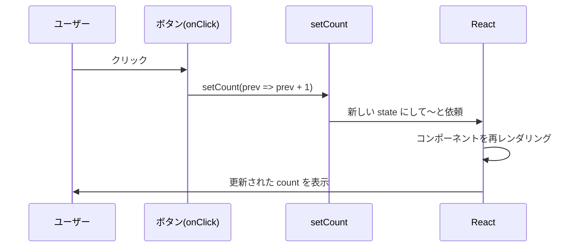

# 第38章：練習：カウンターアプリ (型も意識して！)

この章では、Reactの超定番「カウンターアプリ」を TypeScript 付きで作ってみます 🎉
`useState` とイベントハンドラを実際に使いながら、「型」がどう効いているのかも一緒に確認していきます。

---

## 38-1 🎯 この章のゴール

この章が終わるころには、こんなことができるようになります。

* ボタンを押すと数字が増えたり減ったりするカウンターを作れる ✨
* `useState<number>` で **状態に型を付ける** 感覚がつかめる
* `Props` と `useState` を一緒に使って、
  「最初の値（初期値）」を外から渡せるようになる
* `setCount(prev => prev + 1)` みたいな **“前の値から更新する書き方”** に慣れる ([codefinity.com][1])

React 19 でも、こういう基本的な `useState` はそのまま大事なフックとして使われています 💪([react.dev][2])

---

## 38-2 👀 完成イメージ

画面イメージはだいたいこんな感じです：

* 上にタイトル「カウンターアプリ」
* 真ん中に「現在のカウント: 0」
* その下に
  `+1` ボタン、`-1` ボタン、`リセット` ボタン

ボタンをポチポチすると数字が増えたり減ったりしてくれます 🧮✨

---

## 38-3 🚀 準備の確認（サクッと）

この章は、すでに以下が終わっている前提で進めます。

* Vite で `react-ts` プロジェクトを作成済み
* `npm install` 済み
* 開発サーバーを動かせる状態

開発サーバーは、プロジェクトのフォルダで：

```bash
npm run dev
```

ブラウザで `http://localhost:5173`（Viteのデフォルト）を開いて、
画面が表示されることだけサクッと確認しておいてください 🖥️

---

## 38-4 🧩 `Counter` コンポーネントを作る

まずはカウンター専用の部品を作ります。
`src` フォルダの中に、`Counter.tsx` を新しく作りましょう。

### 38-4-1 `Counter.tsx` を作成

`src/Counter.tsx` に、いったん **完成形のコード** を書いてしまいます。

```tsx
// src/Counter.tsx
import { useState } from "react";

type CounterProps = {
  /** 最初のカウント値（省略OK） */
  initialCount?: number;
};

export function Counter({ initialCount = 0 }: CounterProps) {
  // 👇 useState に <number> と型を付けているのがポイント！
  const [count, setCount] = useState<number>(initialCount);

  const handleIncrement = () => {
    // 前の値から +1 する「関数形式」の更新
    setCount((prev) => prev + 1);
  };

  const handleDecrement = () => {
    setCount((prev) => prev - 1);
  };

  const handleReset = () => {
    setCount(initialCount);
  };

  return (
    <div
      style={{
        padding: "16px",
        borderRadius: "12px",
        border: "1px solid #ddd",
        textAlign: "center",
        maxWidth: "260px",
        margin: "0 auto",
      }}
    >
      <p style={{ fontSize: "20px", marginBottom: "12px" }}>
        現在のカウント: <strong>{count}</strong>
      </p>

      <div style={{ display: "flex", gap: "8px", justifyContent: "center" }}>
        <button type="button" onClick={handleIncrement}>
          +1
        </button>
        <button type="button" onClick={handleDecrement}>
          -1
        </button>
        <button type="button" onClick={handleReset}>
          リセット
        </button>
      </div>
    </div>
  );
}
```

### ここでの型ポイント 🧠

* `type CounterProps = { initialCount?: number }`

  * `initialCount` は **オプショナル（あってもなくてもOK）** な `number`
  * `initialCount = 0` というデフォルト値を付けているので、
    `<Counter />` と書いても `<Counter initialCount={0} />` と同じ意味になります。

* `useState<number>(initialCount)`

  * `<number>` の部分が **状態の型** です。
  * これにより、`count` は必ず `number` 型になり、
    `setCount("あいうえお")` みたいな変な代入はコンパイルエラーになります 💥([react.dev][3])

* `setCount((prev) => prev + 1)`

  * 新しい値が「前の count から計算される」ときは、
    **関数形式のアップデート** を使うのが React のおすすめスタイルです。([codefinity.com][1])

---

## 38-5 🧱 `App.tsx` から使ってみる

次に、この `Counter` を画面に出してあげましょう。
`src/App.tsx` を開いて、シンプルな内容に書き換えます。

```tsx
// src/App.tsx
import "./App.css";
import { Counter } from "./Counter";

function App() {
  return (
    <main className="app">
      <h1>カウンターアプリ 🎉</h1>
      <p>ボタンを押して、数字がどう変わるか試してみよう！</p>

      {/* 初期値 5 でスタートしてみる例 */}
      <Counter initialCount={5} />
    </main>
  );
}

export default App;
```

`npm run dev` をしている状態なら、ブラウザをリロードすると
カウンターが表示されるはずです 👀

---

## 38-6 🎨 かんたんスタイルを当ててみる（おまけ）

見た目をちょっとだけ整えたい場合は、`src/App.css` を軽くこんな感じにしてもOKです（完全にお好み）。

```css
/* src/App.css */
.app {
  min-height: 100vh;
  display: flex;
  flex-direction: column;
  gap: 16px;
  align-items: center;
  justify-content: center;
  font-family: system-ui, -apple-system, BlinkMacSystemFont, "Segoe UI",
    sans-serif;
}

button {
  padding: 6px 12px;
  border-radius: 999px;
  border: 1px solid #ccc;
  background: white;
  cursor: pointer;
}

button:hover {
  background: #f5f5f5;
}
```

ふわっとでいいので、「あ、なんかちゃんとアプリっぽい！」くらいになれば十分です 🌈

---

## 38-7 🧠 型の流れを図でイメージしてみよう（Mermaid）

ボタンをクリックしてから、数字が変わるまでの流れを
Mermaid で図にしてみます 🖊️



この中で `state` の型はずっと `number` のまま流れていきます。

* `count`: `number`
* `prev`（`setCount` の中の引数）: `number`
* `prev + 1`: もちろん `number`

**どこかで型を間違えると、コンパイル時に止めてくれる** のが TypeScript の安心ポイントです 🔒

---

## 38-8 ✍️ ちょっとだけ発展練習（やってみよう！）

時間があれば、次のような “プラスアルファ練習” もやってみてください。

### お題1：2倍ボタンを追加する

* `×2` ボタンを追加して、
* クリックしたら `count` を 2倍 にしてみてください。

ヒント：

```tsx
const handleDouble = () => {
  setCount((prev) => prev * 2);
};
```

### お題2：0より小さくならないようにする

* `-1` ボタンを押しても、`count` が 0 より小さくならないようにしてみましょう。

ヒント：

```tsx
const handleDecrement = () => {
  setCount((prev) => {
    const next = prev - 1;
    return next < 0 ? 0 : next;
  });
};
```

### お題3：複数のカウンターを並べてみる

`App.tsx` で、`<Counter />` を2つ並べてみましょう。

```tsx
<Counter initialCount={0} />
<Counter initialCount={10} />
```

* それぞれがちゃんと**別々の state** を持って動いているか、
  ボタンを押しながら確認してみてください 👀

---

## 38-9 🌟 まとめ

この章では…

* `type` で Props（`initialCount`）の型を定義した
* `useState<number>` で **状態の型** をしっかり指定した
* `setCount((prev) => prev + 1)` のように
  「前の値から更新する」関数形式のアップデートを使った
* カウンターアプリを実際に動かしながら、
  型がちゃんと守ってくれている感覚をつかんだ

次の章からも、**「まず型をどうする？」** という視点を忘れずに、
少しずつ複雑なUIにチャレンジしていきましょう 💪✨

[1]: https://codefinity.com/blog/useState-Hook-in-React-with-TypeScript?utm_source=chatgpt.com "useState Hook in React with TypeScript"
[2]: https://react.dev/blog/2024/12/05/react-19?utm_source=chatgpt.com "React v19"
[3]: https://react.dev/learn/typescript?utm_source=chatgpt.com "Using TypeScript"
