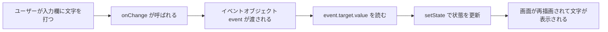

# 第40章：練習：型を付けたフォーム入力。`e.target.value` を安全に使う。

**練習：型を付けたフォーム入力。`e.target.value` を安全に使う。**

---

## 40-1 🎯 今日のゴール

この章のゴールは、

* フォームの入力イベントに **ちゃんと型を付ける**
* `e.target.value` を **TypeScript的に安全に扱う**
* 「文字 → 数値」みたいな変換も、エラーにならないように書ける

ようになることです💪

最終的にはこんなことができるミニアプリを作ります👇

* 名前を入力すると、すぐ下に「こんにちは、〇〇さん！」と表示される
* 年齢を入力すると、「〇〇歳なんだね！」と表示される（数字として扱う）

---

## 40-2 🧪 まずはシンプルなフォームから

まずは「名前を入力 → 画面に表示」だけの、超シンプルなフォームを作ってみます。

`src/SimpleForm.tsx` を作って、こんなコードを書いてみましょう👇

```tsx
import { useState } from "react";

export function SimpleForm() {
  const [name, setName] = useState<string>("");

  function handleChange(event: React.ChangeEvent<HTMLInputElement>) {
    setName(event.target.value);
  }

  return (
    <div style={{ padding: "16px" }}>
      <h2>お名前フォーム ✏️</h2>
      <input
        type="text"
        value={name}
        onChange={handleChange}
        placeholder="お名前を入力してね"
      />
      <p>こんにちは、{name || "名無しさん"}！</p>
    </div>
  );
}
```

`App.tsx` からこのコンポーネントを呼び出して動かしてみてください👇

```tsx
import { SimpleForm } from "./SimpleForm";

export function App() {
  return (
    <>
      <h1>フォーム練習ページ 🎉</h1>
      <SimpleForm />
    </>
  );
}
```

ブラウザでフォームに文字を入力してみて、
下のテキストがリアルタイムで変わればOKです ✨

---

## 40-3 🧬 イベントの「型」をちゃんと付ける

さっきのコードの、ここがポイントです👇

```tsx
function handleChange(event: React.ChangeEvent<HTMLInputElement>) {
  setName(event.target.value);
}
```

### 🧩 なんで `React.ChangeEvent<HTMLInputElement>` が必要なの？

型を付けないでこう書くと……

```tsx
function handleChange(event) {
  setName(event.target.value);
}
```

TypeScript によっては、こんなエラーが出ることがあります⚠️

> `Property 'value' does not exist on type 'EventTarget & ...'`

理由はカンタンで、

* `event` の中身（型）が **よくわからない**
* `event.target` が **本当に `<input>` なのか？** TS的には自信がない

だから、**「これは `<input>` の Change イベントだよ！」**と
はっきり教えてあげる必要があります。

### 💡 イベントの型のイメージ図

図で見ると、こんな感じです👇



ここで **C → D** のところが、
「イベントの型をちゃんと付けておかないと怒られる」ポイントです😌

---

## 40-4 ✅ `e.target.value` を安全に使う 3つのポイント

### ① イベントの型は `React.ChangeEvent<HTMLInputElement>`

イベントハンドラの引数に、ちゃんと型を付けます。

```tsx
import React, { useState } from "react";

export function SimpleForm() {
  const [name, setName] = useState<string>("");

  function handleChange(e: React.ChangeEvent<HTMLInputElement>) {
    // ここで e.target.value に安全にアクセスできる
    setName(e.target.value);
  }

  return (
    <input value={name} onChange={handleChange} />
  );
}
```

### ② `e.target` より `e.currentTarget` が安心 ✨

実は、さらに安全に書くなら **`e.currentTarget`** を使うのがオススメです。

* `e.target`

  * 「どこからイベントが発生したか」という“発生元”
* `e.currentTarget`

  * 「このイベントハンドラが直接くっついている要素」

React の型定義では、`React.ChangeEvent<HTMLInputElement>` を使うと
`currentTarget` がしっかり `HTMLInputElement` になります。

```tsx
function handleChange(e: React.ChangeEvent<HTMLInputElement>) {
  const value = e.currentTarget.value; // ← こっちがより「安全な」書き方
  setName(value);
}
```

### ③ 無名関数で書くときも「型」は同じ

イベントハンドラを直接 JSX に書くパターンもあります。

```tsx
<input
  value={name}
  onChange={(e: React.ChangeEvent<HTMLInputElement>) => {
    setName(e.currentTarget.value);
  }}
/>
```

どちらの書き方でもOKですが、この章では

* **関数として分けるパターン**
* `e.currentTarget.value` を使う

このスタイルをおすすめします🌸

---

## 40-5 🔢 数値を入力するときの「安全な」書き方

フォームでは、年齢や金額など **数字** を扱うことも多いですよね。
でも `e.currentTarget.value` の型は **文字列 (`string`)** です。

ここでは、

* 年齢を `<input type="number">` で受け取る
* State では **数値 (`number | null`)** として管理する

という練習をしてみましょう 💪

### 🧾 年齢フォームの例

`src/AgeForm.tsx` を作ります。

```tsx
import React, { useState } from "react";

export function AgeForm() {
  // 「まだ入力されてない」ことも表現したいので number | null にする
  const [age, setAge] = useState<number | null>(null);

  function handleChange(e: React.ChangeEvent<HTMLInputElement>) {
    const value = e.currentTarget.value;

    // 🔍 入力が空文字のときは null にしておく
    if (value === "") {
      setAge(null);
      return;
    }

    // 文字列 → 数値に変換（10進数として読み取る）
    const parsed = Number(value);

    // NaN（数字じゃない）だったら Stateを更新しない or null にする
    if (Number.isNaN(parsed)) {
      setAge(null);
    } else {
      setAge(parsed);
    }
  }

  return (
    <div style={{ padding: "16px", marginTop: "24px" }}>
      <h2>年齢フォーム 👶🧑‍🎓🧓</h2>
      <input
        type="number"
        min={0}
        max={120}
        onChange={handleChange}
        placeholder="年齢を入力してね"
      />

      <p>
        {age === null
          ? "まだ年齢が入力されていません。"
          : `あなたは ${age} 歳なんだね！`}
      </p>
    </div>
  );
}
```

`App.tsx` で両方呼び出してみましょう👇

```tsx
import { SimpleForm } from "./SimpleForm";
import { AgeForm } from "./AgeForm";

export function App() {
  return (
    <main style={{ padding: "16px" }}>
      <h1>フォーム入力の型練習ページ ✨</h1>
      <SimpleForm />
      <AgeForm />
    </main>
  );
}
```

---

## 40-6 🧠 「型」的に大事なポイントまとめ

この章で学んだ「型のツボ」をもう一度整理しておきます 📚

1. **イベントには必ず型を付ける**

   * 例：`React.ChangeEvent<HTMLInputElement>`
2. **`e.currentTarget.value` を使うとより安全**

   * `currentTarget` は「このハンドラが付いてる要素」なので、型がハッキリしている
3. **数値入力は `string → number` への変換が必要**

   * `Number(value)` や `parseInt(value, 10)` を使う
   * 空文字（`""`）の扱いも決めておく（`null` にするなど）
4. **State の型は「ありうる状態」をちゃんと表現する**

   * 入力前：`null`
   * 入力済み：`number`
   * → `number | null` というユニオン型が活躍する 🎉

---

## 40-7 ✍️ ミニ演習（チャレンジ問題）

最後に、自分の手で書いてみるコーナーです 🧪

### 🎵 演習1：好きなアーティスト入力フォーム

* 「好きなアーティスト名」を入力する `<input type="text">`
* State の名前は `favoriteArtist: string`
* 入力したら、下に
  `今ハマっているのは「〇〇」なんだね！` と表示する
* `onChange` のイベントに **型を付けること！**

👉 できたら、`SimpleForm` をマネしながら
`FavoriteArtistForm` コンポーネントを作ってみてください。

---

### ☕ 演習2：カフェでよく頼むドリンク

* 「よく頼むドリンクの値段（円）」を入力する `<input type="number">`
* State の型は `number | null`
* 1000円より高いときは
  `ちょっとリッチなドリンクだね ✨`
  それ以外は
  `ふだん使いにちょうどいいね ☕`
  と表示する

👉 ここでも `e.currentTarget.value` を使って、
数字への変換＆`null` の扱いを意識してみましょう。

---

## 40-8 🌈 次の章へのつながり

ここまでできるようになると、

* 「フォームから文字や数字を受け取る」
* 「それを型安全に State に保存する」

という、Reactアプリのかなり重要な部分が身についています 🥰

次の章では、この「安全なState更新」を使いながら、
**配列やオブジェクトのState** に広げていきます。
フォーム + リスト表示の世界に進んでいきましょう 🚀
