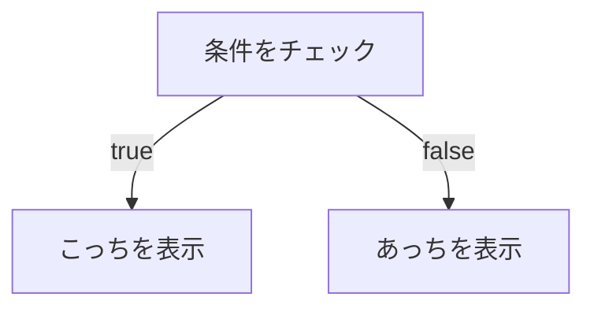

# 第41章：もしこうなら、これを見せる (1) 😊（三項演算子 `? :`）

この章では **「条件によって表示を切り替える」** を、Reactでいちばんよく使う書き方で身につけます✨
それが **三項演算子 `条件 ? A : B`** だよ〜！🧡

---

## 1) 今日のゴール 🎯

* ✅ ある条件のときだけ、表示を変えられる
* ✅ JSXの中で「Aを見せる / Bを見せる」をサクッと書ける
* ✅ ついでに読みやすくするコツも覚える

---

## 2) 三項演算子ってなに？🤔

「もし条件が `true` ならA、そうじゃなければB」を **1行で** 書けるルールだよ✨

* 形はこれ👇
  `条件 ? trueのとき : falseのとき`

---

## 3) イメージ図（分岐）🌿



---

## 4) Reactでよくある「困りごと」→ 解決！💡

JSXの中って、基本は「式（expression）」しか書けないの。
だから `if (...) { ... }` をそのまま JSX の中に書くと崩れがち🥲

そこで登場するのが三項演算子！✨
JSX内で自然に「条件で表示切り替え」できるよ〜😆💕

---

## 5) まずは超シンプル例 🌟（true/falseで表示切り替え）

`App.tsx` をこうしてみてね👇

```tsx
import { useState } from "react";

export default function App() {
  const [isOpen, setIsOpen] = useState(false);

  return (
    <div style={{ padding: 16 }}>
      <button onClick={() => setIsOpen((v) => !v)}>
        {isOpen ? "閉じる" : "開く"}
      </button>

      <div style={{ marginTop: 12 }}>
        {isOpen ? <p>中身が表示されました！🎉</p> : <p>まだ閉じてるよ🙈</p>}
      </div>
    </div>
  );
}
```

### ここがポイント📝

* `isOpen ? <p>表示</p> : <p>非表示</p>` みたいに **JSXをそのまま2択**で書ける✨
* ボタンの文字も `? :` で切り替えてるよ😊

---

## 6) よくあるパターン：ログイン状態で切り替える 🔐✨

「ログインしてるなら “ようこそ”、してないなら “ログインしてね”」みたいなやつ！

```tsx
type User = {
  name: string;
};

export default function App() {
  const user: User | null = { name: "Aki" }; // null にしたら未ログイン扱いになるよ👀

  return (
    <div style={{ padding: 16 }}>
      {user ? (
        <h2>ようこそ、{user.name}さん！🥳</h2>
      ) : (
        <h2>ログインしてください🙏✨</h2>
      )}
    </div>
  );
}
```

### 読みやすくするコツ💖

* JSXが長くなるときは、こうやって **改行してカッコで囲む** と超読みやすいよ〜！✨

---

## 7) 「三項演算子はJSXの外に逃がしてOK」🏃‍♀️💨（読みやすさ爆上がり）

JSXがごちゃごちゃしてきたら、**先に変数に入れちゃう** のがラク😆

```tsx
import { useState } from "react";

export default function App() {
  const [score, setScore] = useState(72);

  const message =
    score >= 80 ? "合格！おめでとう！🎉" : "あとちょっと！ファイト！🔥";

  return (
    <div style={{ padding: 16 }}>
      <p>点数：{score}</p>
      <p>{message}</p>

      <button onClick={() => setScore((s) => Math.min(100, s + 5))}>+5</button>
      <button onClick={() => setScore((s) => Math.max(0, s - 5))}>-5</button>
    </div>
  );
}
```

---

## 8) 注意：ネスト（入れ子）しすぎは読みにくい 😵‍💫

こういう「三項の中に三項」は、できれば避けたい…！

```tsx
// 😵‍💫 読みにくい例（避けたい）
const text = isVip ? (isLogin ? "VIPログイン中✨" : "VIPだけど未ログイン🥲") : "一般ユーザー🙂";
```

### じゃあどうする？✅

* `if` をJSXの外で使って変数を作る
* もしくは小さめのコンポーネントに分ける
  がキレイだよ〜✨

---

## 9) ミニ練習（5分）✍️🐣

### 練習1：購入ボタンを切り替えよう🛒

* `isSoldOut` が `true` なら「売り切れ😭」
* `false` なら「購入する💰」

ヒント👇
`{isSoldOut ? <button disabled>...</button> : <button>...</button>}`

---

### 練習2：入力できたらOK表示✅

* `name` が空なら「名前を入れてね✍️」
* 入ってたら「こんにちは、◯◯さん😊」

ヒント👇
`name.trim()` が空かどうかで判定するとキレイ✨

---

## 10) まとめ 🎀

* 三項演算子は **「条件で表示を2択に分ける」最強の書き方**✨
* JSXの中では `if` より `? :` が使いやすい場面が多い😊
* 長くなったら **改行** or **変数に逃がす** と読みやすい💕

---

次の第42章では、**「falseなら何も表示しない」** が得意な `&&` をやるよ〜！😆✨
