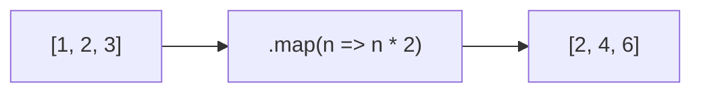
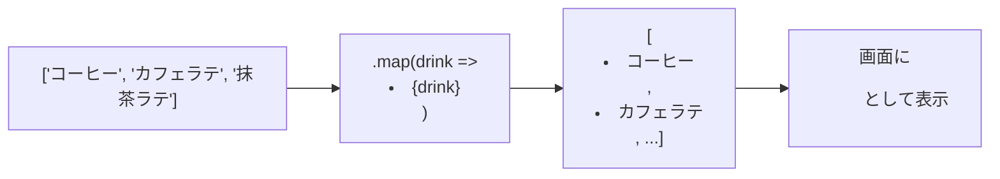

# 第43章：配列のデータを全部並べて表示する (`.map()`)

---

#### 1️⃣ この章のゴール 🎯

この章では、

* 配列の中身を **ぜんぶ画面に並べて表示** する
* そのために JavaScript の **`.map()`** を React でどう使うか
* TypeScript だと **型がどう関わってくるか**

を、ゆっくり身につけます 💪✨

---

#### 2️⃣ まずはおさらい：`.map()` ってなに？ 🧠

Reactから一回離れて、ふつうのJavaScriptとして `.map()` を思い出してみます。

配列があって、それを「変換して新しい配列にする」のが `.map()` でした👇

```ts
const numbers: number[] = [1, 2, 3];

const doubled = numbers.map((n) => n * 2);

console.log(doubled); // [2, 4, 6]
```

* `numbers`：元の配列
* `.map((n) => n * 2)`：1個ずつ取り出して、2倍にして新しい配列にする
* `doubled`：変換後の新しい配列

イメージ図はこんな感じ👇



Reactでやりたいことは、

> 「配列の中身を、**JSX（タグ）に変換して** 並べる」
> っていうだけです 💡

---

#### 3️⃣ React で配列 → JSX に変換する基本パターン 🍎

いちばんシンプルな例からいきましょ〜！

##### ✅ 例：好きな飲み物リストを表示する

`src/App.tsx` を、こんな感じに書きかえてみます ✍️

```tsx
type Drink = string; // まずはシンプルに文字列だけ

const drinks: Drink[] = ["コーヒー", "カフェラテ", "抹茶ラテ", "オレンジジュース"];

export function App() {
  return (
    <div>
      <h1>好きな飲み物リスト ☕️</h1>
      <ul>
        {drinks.map((drink) => (
          <li>{drink}</li>
        ))}
      </ul>
    </div>
  );
}
```

ポイントを分解すると…👇

* `drinks`：文字列の配列 (`string[]`)
* JSX の中の `{ ... }`：

  * 「ここだけ JavaScript の世界だよ〜」という意味
* `drinks.map((drink) => (...))`：

  * 1個ずつ取り出して
  * `<li>○○</li>` に変換する
  * 結果として、`<li>...</li>` の **配列** ができる
* Reactは、その配列をいい感じに展開して `<ul>` の中に並べてくれます ✨

図で見るとこんな流れです👇



「配列 → `.map()` → JSX の配列 → 画面」
この流れをイメージできたらバッチリです👌

---

#### 4️⃣ TypeScript 的にはどうなってるの？ 🔍

さっきの例を TypeScript 的な目線で見ると、

```ts
const drinks: string[] = ["コーヒー", "カフェラテ"];
```

* `drinks` の中身は **ぜんぶ文字列** なので、
* `.map((drink) => ...)` の `drink` も、ちゃんと `string` と推論されます

もし、明示的に書きたいなら、こうも書けます 👇

```tsx
{drinks.map((drink: string) => (
  <li>{drink}</li>
))}
```

でも、TypeScript が **勝手に推論してくれる** ので、普段は書かなくてOKです 🙆‍♀️

---

#### 5️⃣ ちょっとレベルアップ：オブジェクト配列を並べる 📚

実用っぽくするために、
「本のリスト」を表示するコンポーネントを作ってみます 📖

##### ✅ 型をちゃんと決める

```tsx
type Book = {
  id: number;
  title: string;
  author: string;
};

const books: Book[] = [
  { id: 1, title: "JavaScriptのきほん", author: "山田 花子" },
  { id: 2, title: "Reactではじめるフロントエンド", author: "佐藤 太郎" },
  { id: 3, title: "TypeScriptやさしい入門", author: "鈴木 さくら" },
];
```

* `Book` 型：1冊の本の「形」
* `Book[]`：本がいっぱい並んでいる配列

##### ✅ `.map()` で Book 配列 → JSX に変換

```tsx
export function App() {
  return (
    <div>
      <h1>読書リスト 📚</h1>
      <ul>
        {books.map((book) => (
          <li key={book.id}>
            <strong>{book.title}</strong>（{book.author}）
          </li>
        ))}
      </ul>
    </div>
  );
}
```

ここでもやっていることは同じです 👍

* `books.map((book) => (...))`
* `book` は `Book` 型なので、

  * `book.title` は `string`
  * `book.author` も `string`
* JSX の中で `{book.title}` `{book.author}` と書ける

`key={book.id}` という謎プロパティが出てきましたが、
これは **次の「第44章」でじっくり解説** します👀
今は「リスト表示ではだいたい `key` つけるんだな〜」くらいでOKです。

---

#### 6️⃣ よくあるつまずきポイント ⚠️

##### ❌ その1：`{}` を使った時の `return` 忘れ

これ、めちゃくちゃやりがちです…！

```tsx
// ❌ よくあるミス
{books.map((book) => {
  <li>{book.title}</li>;
})}
```

* アロー関数の中を `{ ... }` で囲むと、

  * 「ブロック」になってしまって
  * 何も `return` していないことになる → `undefined` だらけに…😇

✅ 直し方は2パターンあります。

**パターンA：丸カッコにして、そのまま返す**

```tsx
{books.map((book) => (
  <li>{book.title}</li>
))}
```

**パターンB：`return` をちゃんと書く**

```tsx
{books.map((book) => {
  return <li>{book.title}</li>;
})}
```

✨ 迷ったら「丸カッコバージョン」にしておくと楽です。

---

##### ❌ その2：配列そのまま書いちゃう

こう書きたくなるかもですが…

```tsx
// ❌ これだと単なる配列
<ul>{books}</ul>
```

これだと React は
「え、`Book` オブジェクトの配列出されても困るんですが…😇」
ってなっちゃいます。

✅ 必ず「**配列の中身 → JSX に変換してから**」渡します。

```tsx
<ul>
  {books.map((book) => (
    <li key={book.id}>{book.title}</li>
  ))}
</ul>
```

---

#### 7️⃣ まとめ 📝

この章で覚えておきたいことはこの3つです ✨

1. `.map()` は「配列の中身を1個ずつ見て、新しい配列を作る」関数
2. React では「**配列 → `.map()` → JSX の配列**」という流れでリスト表示する
3. TypeScript のおかげで、`.map((item) => ...)` の `item` の型もちゃんと守られる

---

#### 8️⃣ ミニ練習問題 ✍️💖

時間があったら、VSCode で実際にやってみてください！

##### 💡 練習1：好きなアーティストリスト

1. `type` で `Artist` 型を定義してみる

   * `name: string`（名前）
   * `genre: string`（ジャンル）
2. `Artist[]` の配列を作る（3〜5人くらい）
3. `.map()` で `<li>` にして並べて表示しよう 🎤

##### 💡 練習2：大学の授業リスト

1. `type Subject = { id: number; name: string; teacher: string }` を作る
2. なにかそれっぽい授業名で配列を作る
3. `.map()` で

   * `<strong>授業名</strong> - 教員名`
     の形で表示してみよう 👩‍🏫

---

次の **第44章** では、
リスト表示に欠かせない **`key` プロパティ** をしっかり解説していきます 🔑✨
リスト表示マスターへの第一歩、おつかれさま〜！👏💕
