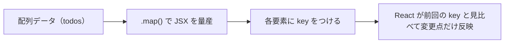

# 第44章：リストと `key` プロパティ

この章のゴールは、

> 「配列を `.map()` で並べるときは、**必ず `key` をつけるクセ**を身につけること ✨」

です。

---

## 44-1. `key` ってそもそもなに？🤔

React で `.map()` を使ってリストを表示するとき、こんな警告を見たことがあるかもしれません。

> Warning: Each child in a list should have a unique "key" prop.

これは

> 「**それぞれの子要素に、ユニーク（かぶらない）な `key` を付けてね**」

という React からのお願いです。

React は、リストが更新されたときに
「どの要素が**同じ子**で、どれが**新しく増えた子**なのか」
を見分けるために `key` を使います。([react.dev][1])

---

## 44-2. React の頭の中イメージ図 🧠✨

配列 → `.map()` → JSX → React が差分チェック
という流れを、図にしてみます。



`key` がないと、React は
「えーっと…これ前のどれだっけ？🤯」
となりやすく、無駄な書き換えや、State がズレる原因になります。([react.dev][2])

---

## 44-3. まずは `key` なしのリストを作ってみる 🛠

シンプルな配列を `.map()` で表示する例からスタートします。

### `App.tsx`（悪い例：`key` なし）

```tsx
type Fruit = {
  name: string;
};

const fruits: Fruit[] = [
  { name: "りんご" },
  { name: "みかん" },
  { name: "ぶどう" },
];

export function App() {
  return (
    <ul>
      {fruits.map((fruit) => (
        <li>{fruit.name}</li>
      ))}
    </ul>
  );
}
```

これをブラウザで開くと、画面は普通に表示されますが、
開発者ツールのコンソールに「`key` がないよ〜」という警告が出るはずです ⚠️([de.react.dev][3])

---

## 44-4. ちゃんと `key` をつけてみる ✅

`key` は「その配列の中でユニークな目印」になればOKです。
よくあるパターンは、データに `id` を持たせるやり方です。

### 型に `id` を足す

```tsx
type Fruit = {
  id: number; // ← これを追加
  name: string;
};

const fruits: Fruit[] = [
  { id: 1, name: "りんご" },
  { id: 2, name: "みかん" },
  { id: 3, name: "ぶどう" },
];
```

### `.map()` の中で `key` を設定

```tsx
export function App() {
  return (
    <ul>
      {fruits.map((fruit) => (
        <li key={fruit.id}>{fruit.name}</li>
      ))}
    </ul>
  );
}
```

ポイント👇

* `key` は **文字列か数値** が基本
* `key` は **配列の中でユニーク** ならOK（1,2,3…など）
* `key` は**画面には表示されない**（React の内部用の情報）

---

## 44-5. `key` に使っていいもの・ダメなもの 😈😇

### 👍 いい `key` の例

* データベースの `id`（`user.id`, `todo.id` など）
* メールアドレスやユーザー名（絶対にかぶらないなら）
* スラッグ（`"sengoku-oda-nobunaga"` みたいな一意な文字列）

### 👎 できるだけ避けたい `key`

1. **配列のインデックス**（`index`）

```tsx
{fruits.map((fruit, index) => (
  <li key={index}>{fruit.name}</li> // ← なるべくNG
))}
```

* 「途中にアイテムを挿入」「並び替え」「削除」などをすると、
  インデックスがズレて、**違う要素なのに同じものとみなされる**ことがあります。
* その結果、チェックボックスや入力中のテキストなど、
  **State が別のアイテムにくっついちゃうバグ**が起きがちです 🥲

2. **毎回変わるランダム値**（`Math.random()` や `Date.now()`）

```tsx
<li key={Math.random()}>{fruit.name}</li> // ← これもNG
```

* 毎回 `key` が変わってしまうので、
  React から見ると「全部別物」となり、**毎回全消し & 全部作り直し**になります。

3. **`useId()` で作ったID**

React の `useId` は「アクセシビリティ用のユニークID」を作るためのフックで、
**リストの `key` 用には使わないほうがいいよ**と公式で書かれています。([react.dev][4])

---

## 44-6. `key` はどこに書くの？（コンポーネント版）🧩

配列を `.map()` しているのが `<li>` じゃなくて、
自作コンポーネント `<TodoItem />` の場合もよくあります。

### やりたいことイメージ

* `todos` 配列を `.map()` して
* 1つずつ `<TodoItem />` を表示したい

このとき、**`key` を書く場所は「.map() の直下の要素」**です。

```tsx
type Todo = {
  id: number;
  title: string;
  done: boolean;
};

type TodoItemProps = {
  title: string;
  done: boolean;
};

function TodoItem({ title, done }: TodoItemProps) {
  return (
    <li>
      <label>
        <input type="checkbox" checked={done} readOnly />
        {title}
      </label>
    </li>
  );
}

const todos: Todo[] = [
  { id: 1, title: "Reactの教科書を読む", done: false },
  { id: 2, title: "TypeScriptの復習", done: true },
];

export function App() {
  return (
    <ul>
      {todos.map((todo) => (
        <TodoItem
          key={todo.id} // ← ここ！（TodoItem に key）
          title={todo.title}
          done={todo.done}
        />
      ))}
    </ul>
  );
}
```

**よくある間違い**

`TodoItem` の中の `<li>` に `key` を書いてしまうパターンがありますが、
それだと React から見ると「`.map()` 直下の要素に key がない」ことになり、
警告は消えません 🥲

---

## 44-7. なんで `key` がそんなに大事なの？（Stateとの関係）🧪

React は「**同じ場所に、同じ `key` のコンポーネントがあるなら、同じものとみなす**」
というルールで State を結びつけています。([react.dev][2])

例：コメント一覧 + それぞれに入力欄があるとします。

* `key` がちゃんと「コメントID」になっているとき
  → コメントを並べ替えても、**各コメントの入力状態が一緒に移動**してくれます。
* `key` が「インデックス」のとき
  → 並べ替えた瞬間、**別のコメントに入力状態がくっついてしまう**ことがあります。

「React が、State をどのコンポーネントに紐づけるか決めるためのタグ」
それが `key` だと思っておくとイメージしやすいです 👍

---

## 44-8. ミニ演習 🎓

### お題 📝

次のコードは、`key` がまだ付いていません。
TODO の `type` を活かして、正しく `key` をつけてみてください。

```tsx
type Todo = {
  id: number;
  title: string;
};

const todos: Todo[] = [
  { id: 101, title: "レポートを書く" },
  { id: 102, title: "友だちにLINEする" },
  { id: 103, title: "Reactの復習をする" },
];

export function App() {
  return (
    <div>
      <h1>今日やることリスト ✏️</h1>
      <ul>
        {todos.map((todo) => (
          <li>{todo.title}</li>
        ))}
      </ul>
    </div>
  );
}
```

---

### 解答例 💡

```tsx
export function App() {
  return (
    <div>
      <h1>今日やることリスト ✏️</h1>
      <ul>
        {todos.map((todo) => (
          <li key={todo.id}>{todo.title}</li> // ← id を key に！
        ))}
      </ul>
    </div>
  );
}
```

---

## 44-9. まとめ 📚

この章で覚えておきたいポイントはこの4つ ✨

* `.map()` で作るリストの子要素には、**必ず `key` をつける**
* `key` は「その配列の中でユニークな文字列 or 数値」
* できるだけ **`id` のような安定した識別子** を使う（インデックスやランダム値は避ける）([de.react.dev][3])
* `.map()` の**一番外側の要素**に `key` をつける（コンポーネントを並べる場合も同じ）

次の第45章では、この `key` の考え方を使って、
実際に「TODOリスト（表示のみ）」を作りながら、
TODOアイテムの `type` 定義も一緒に練習していきます 📝✨

[1]: https://react.dev/learn/rendering-lists?utm_source=chatgpt.com "Rendering Lists"
[2]: https://react.dev/learn/preserving-and-resetting-state?utm_source=chatgpt.com "Preserving and Resetting State"
[3]: https://de.react.dev/learn/rendering-lists?utm_source=chatgpt.com "Rendering Lists"
[4]: https://react.dev/reference/react/useId?utm_source=chatgpt.com "useId"
