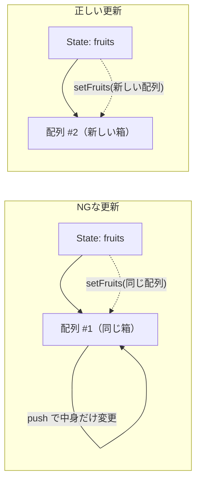

# 第48章：`useState` で配列（並んだデータ）を扱うときの注意

---

## 今日のゴール ✨

`useState` で **配列の State** を持つときに、

* どんな書き方をすると危ないのか ⚠️
* React に優しい「正しい更新のしかた」はどれか ✅

を、ちゃんと区別できるようになることがゴールです！

---

## 1️⃣ まずはシンプルな配列 State から

文字列の配列を `useState` で持つ例からいきます 🌈

```tsx
import { useState } from "react";

function FruitList() {
  const [fruits, setFruits] = useState<string[]>(["りんご", "みかん"]);

  return (
    <ul>
      {fruits.map((fruit) => (
        <li key={fruit}>{fruit}</li>
      ))}
    </ul>
  );
}

export default FruitList;
```

ここまでは OK ですね 👍
ポイントはこの1行：

* `const [fruits, setFruits] = useState<string[]>(["りんご", "みかん"]);`
  → `fruits` は「配列の State」、`setFruits` はその更新関数です。

---

## 2️⃣ 一番やりがちな「NGパターン」⚠️

配列の State でよくあるのが、

> `push` や `splice` で **直接書き換えちゃう** パターン

です 😵‍💫

例えば、ボタンを押したらフルーツを1つ追加したいときに、
ついやりたくなるコード：

```tsx
// ❌ よくない例
const handleAdd = () => {
  fruits.push("バナナ"); // ← これがダメ
  setFruits(fruits);     // ← 同じ配列を渡している
};
```

一見動きそうなんですが、これは **バグのもと** です 🧨

### なにがダメなの？

React は、

> 「**新しい配列** になったかどうか」を見て、画面を更新するか決めている

と思ってください 👀

`push` は「中身だけ変える」ので、箱（配列そのもの）は同じままなんです。

---

## 3️⃣ 配列 State のイメージ図 🧠

配列 State のイメージを Mermaid で図解してみます ✍️



* NG のパターンでは、**同じ配列（同じ箱）** をずっと使い回しています。
* 正しいパターンでは、**新しい配列（新しい箱）** を毎回作って渡します。

React は「箱が変わったか？」をチェックしているイメージです 📦✨

---

## 4️⃣ 正しい書き方：**新しい配列を作ってから渡す** ✨

じゃあどう書けばいいの？というと、答えはシンプルで：

> **元の配列をそのままにして、新しい配列を作る**

です 💡
そのためによく使うのが、この2つ！

* スプレッド構文 `...`（配列を展開する）
* `filter`, `map` などの配列メソッド（新しい配列を返してくれる）

### 例1：アイテムを追加する（OK版）

```tsx
const handleAdd = () => {
  setFruits((prevFruits) => {
    return [...prevFruits, "バナナ"];
  });
};
```

* `prevFruits` は「一つ前の State」のこと
* `[...prevFruits, "バナナ"]` で
  → 「前の中身をコピーした新しい配列」に `"バナナ"` を足してます 🍌

`prevFruits` をそのまま `push` したりはしていません ✅

---

## 5️⃣ `prev` を使う理由って？⏰

`setFruits` は、**すぐに反映されない** ことがあります。
（裏でまとめて処理されたりするからです）

なので、

```tsx
// ⚠️ こう書くのはあまりオススメじゃない
setFruits([...fruits, "バナナ"]);
```

だと、`fruits` が「ちょっと前の値」のまま、
更新されてしまうことがあります 🌀

そこで安全なのが、

```tsx
setFruits((prevFruits) => {
  return [...prevFruits, "バナナ"];
});
```

という **関数バージョン** です ✨

> 「一個前の（ちゃんとした）最新の値」を渡してくれる

ので、これから配列を扱うときは **基本この形** だと思っておいてOKです 🙆‍♀️

---

## 6️⃣ 他のパターンもチラ見せ 👀

詳しい実装は **第49章・第50章** でガッツリ練習しますが、
ここで「どんなイメージか」だけ軽く見ておきましょう 🧪

### ✅ 削除したいとき（`filter`）

```tsx
const handleRemove = (target: string) => {
  setFruits((prevFruits) => {
    return prevFruits.filter((fruit) => fruit !== target);
  });
};
```

`filter` は **条件に合うものだけを集めた「新しい配列」** を返してくれます。

---

### ✅ 一部だけ更新したいとき（`map`）

```tsx
type Todo = {
  id: number;
  title: string;
  done: boolean;
};

const [todos, setTodos] = useState<Todo[]>([]);

const toggleTodo = (id: number) => {
  setTodos((prevTodos) => {
    return prevTodos.map((todo) => {
      if (todo.id === id) {
        return { ...todo, done: !todo.done }; // ✅ 新しいオブジェクトを返す
      }
      return todo; // 変えないものはそのまま
    });
  });
};
```

ここでも、

* `map` で **新しい配列** を作って
* 中身のオブジェクトも `{ ...todo, ... }` で **新しいオブジェクト** にしている

ところがポイントです 💎

第47章の「オブジェクトのイミュータブル更新」と同じノリですね！

---

## 7️⃣ ミニ練習 📝（頭の中だけでOK）

想像してみてください 🧠💭

最初にこんな State があるとします：

```tsx
const [animals, setAnimals] = useState<string[]>(["ねこ", "いぬ"]);
```

1. 「ぱんだ」を追加するには、`setAnimals` をどう書く？ 🐼
2. 「ねこ」を消したいときは？ 🐱
3. 「いぬ」を「わんこ」に変えたいときは？ 🐶➡️🐕

解答例は第49章・第50章を読めば「あっ、これか！」ってなるはずです ✨

---

## まとめ 🎀

`useState` で配列を扱うときの超大事ポイントはこの3つ！

* `push`, `splice`, `sort` などで **直接 State を書き換えない** ❌
* 代わりに `...`（スプレッド）や `filter`, `map` で
  **新しい配列を作って渡す** ✅
* `setState((prev) => {...})` の **関数バージョン** を使うと安全 ⛑️

次の第49章では、
ここで学んだ「正しい配列更新」を使って、
実際に **配列 State にアイテムを追加する練習** をしていきます 🎯🍀
