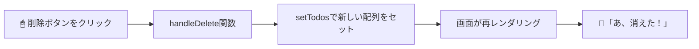

# 第50章：練習：配列のStateからアイテムを削除/更新する (`.filter()` / `.map()`)

`Array.prototype.filter` と `Array.prototype.map` 大活躍の回です 💪

---

### 1️⃣ この章でやること

この章では、前の章で作った「配列のStateにアイテムを追加するTODOリスト」をパワーアップして、

* ✅ TODOを「削除」する（`filter`）
* ✅ TODOの「状態（完了/未完了）を更新」する（`map`）

までできるようにします✨

イメージとしてはこんな流れです 👇



---

### 2️⃣ ベースになる TODO リストを用意しよう 📝

すでに Vite + React + TS のプロジェクトがあって、
`src/App.tsx` を編集する前提でいきます。

まずは「表示＋チェックボックス＋削除ボタン」だけのベースを作ります。

```tsx
import { useState } from "react";

type Todo = {
  id: number;
  title: string;
  done: boolean;
};

const initialTodos: Todo[] = [
  { id: 1, title: "React の勉強をする", done: false },
  { id: 2, title: "お散歩する", done: true },
  { id: 3, title: "友だちにメッセージする", done: false },
];

function App() {
  const [todos, setTodos] = useState<Todo[]>(initialTodos);

  return (
    <div style={{ padding: "16px" }}>
      <h1>TODOリスト ✨</h1>
      <ul>
        {todos.map((todo) => (
          <li key={todo.id}>
            <label>
              <input
                type="checkbox"
                checked={todo.done}
                /* ← ここで後で更新処理を書くよ！ */
              />
              <span
                style={{
                  textDecoration: todo.done ? "line-through" : "none",
                  marginLeft: "4px",
                }}
              >
                {todo.title}
              </span>
            </label>
            <button
              style={{ marginLeft: "8px" }}
              /* ← ここで後で削除処理を書くよ！ */
            >
              削除
            </button>
          </li>
        ))}
      </ul>
    </div>
  );
}

export default App;
```

ここまでで：

* `Todo` 型で **1件ぶんのTODOの形** を定義
* `Todo[]`（Todoの配列）を `useState` で管理
* `.map()` で `li` に並べて表示
  までができている状態です 👌

ここに「削除」と「更新」を追加していきます。

---

### 3️⃣ 削除：`filter` で「残したいものだけ」にする 🗑

**ポイント：元の配列は直接いじらない！**

* `filter` は「条件を満たす要素だけを集めた**新しい配列**」を返してくれます。
* 削除したいときは「**削除したいID以外のものを残す**」という考え方にします。

#### 🔸 削除用の関数を作る

`App` コンポーネントの中に、こんな関数を追加します。

```tsx
function App() {
  const [todos, setTodos] = useState<Todo[]>(initialTodos);

  const handleDelete = (id: number) => {
    setTodos((prevTodos) =>
      prevTodos.filter((todo) => todo.id !== id)
    );
  };

  // ... JSX はこの後
}
```

* `prevTodos` は「今の `todos` の値」
* `filter` の中で `todo.id !== id` と書くことで、

  * `id` が一致しないもの＝削除したい以外のやつだけ残す
* その結果できた **新しい配列** を `setTodos` に渡します 🌟

#### 🔸 ボタンから呼び出す 🖱

さっきの `button` に `onClick` をつけて、
押されたときにその行の `todo.id` を渡すようにします。

```tsx
<button
  style={{ marginLeft: "8px" }}
  onClick={() => handleDelete(todo.id)}
>
  削除
</button>
```

これで「削除ボタンを押す → `handleDelete` → `filter` で新配列 → 画面更新」という流れが完成です 🎉

---

### 4️⃣ 更新：`map` で「1件だけ中身を書きかえる」 ✏️

今度は「チェックボックスをクリックしたら `done` を切り替える（true/false）」をやってみます。

**考え方はこう👇**

* `map` は「配列の各要素を **変換した結果の新しい配列**」を返す
* `id` が一致する要素だけ `{ ...todo, done: !todo.done }` に差し替える
* 他の要素はそのまま返す

#### 🔸 更新用の関数を作る

```tsx
const handleToggleDone = (id: number) => {
  setTodos((prevTodos) =>
    prevTodos.map((todo) =>
      todo.id === id
        ? { ...todo, done: !todo.done }
        : todo
    )
  );
};
```

ここでやっていること：

* `prevTodos.map(...)` で **全TODOを1個ずつなめる**
* `todo.id === id` なら、その1件だけ

  * スプレッド構文 `{ ...todo, done: !todo.done }`
  * → 他のプロパティはそのまま、`done` だけ反転
* それ以外は `todo` をそのまま返す

※ こうすることで、「配列自体」も「各オブジェクト」も新しく作り直されます。
　Reactが「中身が変わった！」とちゃんと気づいてくれるので大事なポイントです 💡

#### 🔸 チェックボックスから呼び出す ✅

さっきコメントだけ書いていた `input` に `onChange` をつけます。

```tsx
<input
  type="checkbox"
  checked={todo.done}
  onChange={() => handleToggleDone(todo.id)}
/>
```

これで、

* チェックを入れたり外したりすると
* `done` が `true/false` 入れ替わって
* `textDecoration` が `line-through` になったり戻ったり 💫

という動きになります。

---

### 5️⃣ 完成したサンプルコード 🎉

ここまでの内容をまとめた `App.tsx` はこんな感じです。

```tsx
import { useState } from "react";

type Todo = {
  id: number;
  title: string;
  done: boolean;
};

const initialTodos: Todo[] = [
  { id: 1, title: "React の勉強をする", done: false },
  { id: 2, title: "お散歩する", done: true },
  { id: 3, title: "友だちにメッセージする", done: false },
];

function App() {
  const [todos, setTodos] = useState<Todo[]>(initialTodos);

  const handleDelete = (id: number) => {
    setTodos((prevTodos) =>
      prevTodos.filter((todo) => todo.id !== id)
    );
  };

  const handleToggleDone = (id: number) => {
    setTodos((prevTodos) =>
      prevTodos.map((todo) =>
        todo.id === id
          ? { ...todo, done: !todo.done }
          : todo
      )
    );
  };

  return (
    <div style={{ padding: "16px" }}>
      <h1>TODOリスト ✨</h1>

      <ul>
        {todos.map((todo) => (
          <li key={todo.id}>
            <label>
              <input
                type="checkbox"
                checked={todo.done}
                onChange={() => handleToggleDone(todo.id)}
              />
              <span
                style={{
                  textDecoration: todo.done ? "line-through" : "none",
                  marginLeft: "4px",
                }}
              >
                {todo.title}
              </span>
            </label>

            <button
              style={{ marginLeft: "8px" }}
              onClick={() => handleDelete(todo.id)}
            >
              削除
            </button>
          </li>
        ))}
      </ul>

      <p style={{ marginTop: "16px" }}>
        残りのTODO：{todos.filter((todo) => !todo.done).length} 件 💪
      </p>
    </div>
  );
}

export default App;
```

下の「残りのTODO数」も、こっそり `filter` の練習になってます 😆

---

### 6️⃣ よくあるつまづきポイント 🌀

1. **`todos.splice(...)` を使ってしまう**

   * これは配列を**直接書きかえてしまう**のでNG ❌
   * Reactでは「新しい配列を作る」が鉄則です。

2. **`setTodos(todos.filter(...))` と書いてしまう**

   * 完全にダメではないけど、
     `setTodos((prev) => prev.filter(...))` のように「関数版」を使うと、
     ちょっと難しいケース（非同期）でも安全になります 🛡

3. **`id` がカブっている**

   * `key` としても、削除・更新の判定としても `id` を使っているので、
   * `id` はかならず **ユニーク（一意）** にしておきましょう！

---

### 7️⃣ ミニ練習課題 💡

時間があれば、次のような機能も自分で追加してみてください ✨

1. ✏️ **タイトルを編集できるようにする**

   * `input type="text"` を表示して、
   * 入力が変わったら `map` を使って `title` を更新

2. 🎨 完了したTODOはグレーにする

   * `todo.done` が `true` のときだけ、
   * 文字色を `#888` にする（インラインスタイル or CSS）

3. 🗂 フィルタリング

   * 「すべて」「未完了だけ」「完了だけ」を切り替えるボタンを作り、
   * `.filter()` を使って表示するリストを変えてみる

---

この章が終わると、

* 配列のStateを

  * 追加（前の章）
  * 削除（`filter`）
  * 更新（`map`）
* という、実務でもよく使う流れをひととおり体験できました ✨

次の章から先も、同じ考え方がいろんな場面で出てくるので、
ここでしっかり手を動かして慣れておきましょう〜🙌
