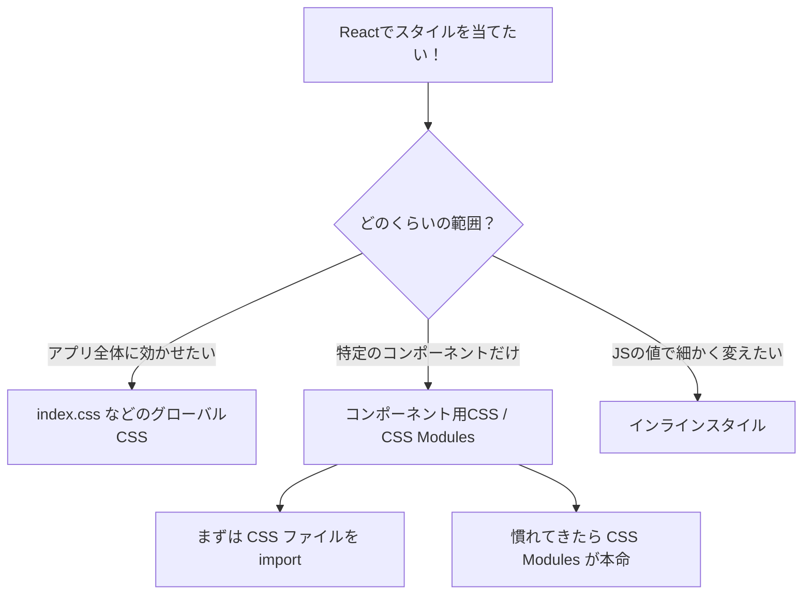

# 第51章：ReactでのCSSの当て方いろいろ

「見た目」を整え始めると、一気にアプリ作りが楽しくなります 💻🎨
この章では **「ReactでCSSを当てる代表的な方法」** を、ざっくり全部見渡してみます。

---

## 1️⃣ この章のゴール ✅

この章が終わるころには…

* 「Reactでは、どんな風にCSSを書けるのか？」がざっくりイメージできる 💡
* `index.css` みたいな **全体スタイル** と、コンポーネントごとのスタイルの違いがわかる 🎯
* `className` や `style={{ ... }}` を見てもビビらなくなる 💪
* 「とりあえず自分のプロジェクトなら、このパターンで行こうかな」が決められる 🧭

次の章（52〜55）で、特におすすめの **CSS Modules** をじっくりやっていきますが、
ここではまず **地図を広げる感じ** で、全体像をつかみましょう 🌏

---

## 2️⃣ いまのプロジェクトのCSSってどこにある？👀

Vite の `react-ts` テンプレートでプロジェクトを作ったとき、だいたいこんな構成になっているはずです：

* `src/main.tsx`
* `src/App.tsx`
* `src/App.css`
* `src/index.css`

このうち：

* `index.css` → アプリ全体に効くスタイル（`body` とか）
* `App.css` → `App.tsx` の中で使うクラス用のスタイル

…という感じになっています 🌸

まずは、この2つを中心に話を進めます。

---

## 3️⃣ ReactでCSSを当てる主なパターン 💄

Reactアプリでよく出てくるスタイリング方法を、ざっくり分類するとこんな感じです👇

1. **グローバルCSS**

   * 例：`src/index.css`
   * アプリ全体に効く。「背景色」「フォント」みたいな共通ルール向き 🌐

2. **コンポーネントごとのCSSファイル（ふつうのCSS）**

   * 例：`Button.tsx` と `Button.css`
   * `Button.tsx` の中で `import './Button.css'` して使うパターン 🧷

3. **CSS Modules（コンポーネント専用スタイル）**

   * 例：`Button.module.css`
   * クラス名がコンポーネントごとに自動で「かぶらない」ようになる。
   * この講座では **イチオシのやり方**。Module 6 のメインテーマ 💎

4. **インラインスタイル**

   * JSXの `style` プロパティにオブジェクトで書く
   * `style={{ color: 'hotpink', padding: '8px 12px' }}` みたいなやつ
   * 「ちょっとだけJSの値に合わせて変えたい」ときに便利 🔥

5. **CSSフレームワーク / CSS-in-JS**（名前だけ紹介）

   * Tailwind CSS、styled-components、Emotion など
   * プロジェクトが大きくなったり、チーム開発になったりすると選択肢に入ってくる 🧪

---

## 4️⃣ どの方法を選ぶ？ざっくりマップ 🗺️

図でイメージしてみます（Mermaid 図です）✨



この章では、**C・D・E** を軽く触りつつ、
次の章で **CSS Modules（G）を本格的にやる**、という流れで行きます ✨

---

## 5️⃣ ハンズオン①：`index.css` で全体の雰囲気を変える 🌈

まずは「アプリ全体」に効くスタイルから。

1. VSCode で `src/index.css` を開く
2. `body` のスタイルを、ちょっとだけかわいく変えてみます 💕

```css
/* src/index.css */

body {
  margin: 0;
  font-family: system-ui, -apple-system, BlinkMacSystemFont, "Segoe UI", sans-serif;
  background-color: #fff7fb; /* ほんのりピンク背景 🎀 */
  color: #333;
}
```

ブラウザを確認して、背景色が変わっていたらOKです ✅
**ポイント：**

* グローバルCSSは「アプリ全体の雰囲気づくり」に向いている
* `body` や `html`、`a` タグなど「どこでも出てくるタグ」に指定することが多い

---

## 6️⃣ ハンズオン②：コンポーネント専用のCSSファイル ✨

次は、**特定のコンポーネントだけ** にスタイルを当てるパターンです。

### 6-1. `CuteTitle.tsx` を作る 💕

`src` フォルダに `CuteTitle.tsx` を作ります：

```tsx
// src/CuteTitle.tsx

type CuteTitleProps = {
  text: string;
};

export function CuteTitle({ text }: CuteTitleProps) {
  return <h1 className="cute-title">{text}</h1>;
}
```

> JSXでは `class` じゃなくて **`className`** を使うのを忘れずに！🌟

### 6-2. `CuteTitle.css` を作る 🎀

同じ場所に `CuteTitle.css` を作ります：

```css
/* src/CuteTitle.css */

.cute-title {
  font-size: 2rem;
  text-align: center;
  padding: 16px;
  color: #ff5c9a;
  text-shadow: 0 2px 4px rgba(255, 92, 154, 0.4);
}
```

### 6-3. コンポーネントからCSSを読み込む 📥

`CuteTitle.tsx` の先頭にCSSを import します：

```tsx
// src/CuteTitle.tsx
import './CuteTitle.css';

type CuteTitleProps = {
  text: string;
};

export function CuteTitle({ text }: CuteTitleProps) {
  return <h1 className="cute-title">{text}</h1>;
}
```

### 6-4. `App.tsx` から使ってみる 🚀

`src/App.tsx` を開いて、`CuteTitle` を使ってみましょう：

```tsx
// src/App.tsx
import { useState } from 'react';
import './App.css';
import { CuteTitle } from './CuteTitle';

function App() {
  const [count, setCount] = useState(0);

  return (
    <>
      <CuteTitle text="React × CSS デビュー ✨" />
      <div className="card">
        <button onClick={() => setCount((c) => c + 1)}>
          count is {count}
        </button>
      </div>
    </>
  );
}

export default App;
```

ブラウザでタイトルがピンクっぽくなっていれば成功です 🎉

---

## 7️⃣ ハンズオン③：インラインスタイルも少しだけ 📝

次は、JSXの中で **直接スタイルを書く** パターンです。

* 「ボタンの色を、状態によって変えたい」
* 「一時的に幅を変えたい」

…みたいなときに便利です。

### 7-1. インラインスタイルの基本形

`style` は **オブジェクト** を渡します：

```tsx
<button
  style={{ backgroundColor: 'hotpink', color: 'white', padding: '8px 16px' }}
>
  クリックしてね 💕
</button>
```

* `background-color` → `backgroundColor`（キャメルケース）
* `font-size` → `fontSize`
* 値は **文字列** で書くことが多いです（`'16px'` など）

### 7-2. 状態によってスタイルを変える例 💡

カウントが偶数のときと奇数のときで色を変えてみましょう：

```tsx
// App.tsx の中の一部だけ差し替えイメージ

function App() {
  const [count, setCount] = useState(0);

  const isEven = count % 2 === 0;

  return (
    <>
      <CuteTitle text="React × CSS デビュー ✨" />

      <button
        onClick={() => setCount((c) => c + 1)}
        style={{
          padding: '10px 20px',
          borderRadius: '999px',
          border: 'none',
          cursor: 'pointer',
          backgroundColor: isEven ? '#ff9acb' : '#6c5ce7',
          color: 'white',
          transition: 'background-color 0.2s ease',
        }}
      >
        count is {count}（{isEven ? '偶数 💙' : '奇数 💜'}）
      </button>
    </>
  );
}
```

**ポイント：**

* JSの変数（ここでは `isEven`）をそのまま使ってスタイルを変えられる
* 「ちょっとした動き」に向いている
* 逆に、**たくさんのスタイルをインラインで書きすぎると読みにくくなる**ので注意 😵

---

## 8️⃣ ちら見せ：CSS Modulesってどんなもの？🧩

このあと詳しくやる **CSS Modules** を、ここで少しだけイメージだけつかんでおきましょう。

ふつうのCSSファイルの代わりに、
`Button.module.css` のように **`.module.css`** を使います。

```css
/* src/FancyButton.module.css */

.button {
  padding: 10px 20px;
  border-radius: 999px;
  border: none;
  cursor: pointer;
  background-color: #ff9acb;
  color: white;
}
```

TSX側では、`className="button"` ではなく、**オブジェクトから取り出す**イメージになります：

```tsx
// src/FancyButton.tsx
import styles from './FancyButton.module.css';

type FancyButtonProps = {
  label: string;
};

export function FancyButton({ label }: FancyButtonProps) {
  return <button className={styles.button}>{label}</button>;
}
```

* `styles.button` の中身（クラス名）はビルド時に自動で
  `button__abc123` みたいな **かぶらない名前** に変換されます ✨
* なので、他のコンポーネントに同じ `.button` って書いても **衝突しない** のがメリット！

→ **Module 6 のメインテーマはここ！**
この章では「そういうのがあるんだな〜」くらいでOKです 😊

---

## 9️⃣ 結局どれをメインで使えばいいの？🤔

この講座でのおすすめ構成はこんな感じです👇

* **`index.css`**

  * アプリ全体のベース（背景・フォント・全体レイアウトのざっくりしたルール）
* **CSS Modules**

  * コンポーネントごとの見た目は基本これで 🎯
* **インラインスタイル**

  * 「状態によって色を変える」「JavaScriptでサイズを計算したい」など
  * 必要なときだけ、ピンポイントで使う ✂️

**ふつうのCSSファイル（`CuteTitle.css` みたいなやつ）は：**

* Reactに慣れてきてからは、CSS Modules に少しずつ置き換えていくイメージでOKです 🌱

---

## 🔚 ミニまとめ

* Reactでも、基本は **ふつうのCSS**（`className` を付けてCSSを書く）
* 使い分けのイメージ：

  * 全体 → `index.css`
  * コンポーネント → CSSファイル or CSS Modules
  * 状態に応じてちょっと変えたい → インラインスタイル
* 次の章からは、特におすすめの **CSS Modules** をじっくりやっていきます ✨

---

## 📝 練習課題（やってみよう！）💪

時間があるときに、次のことをやってみてください：

1. **背景とフォントを自分好みにする**

   * `index.css` の `body` に、自分の好きなフォントファミリー・背景色を設定してみる
   * 「春っぽい」「夜っぽい」などテーマを決めると楽しい🌸🌙

2. **自作の `Header` コンポーネント＋CSSファイルを作る**

   * `Header.tsx` と `Header.css` を作って、

     * 左にアプリ名
     * 右にシンプルなナビ（`Home | About` みたいな文字だけでOK）
   * かわいい色でヘッダーを作ってみる 🎀

3. **インラインスタイルで「ON/OFFボタン」を作る**

   * `useState` を使って `isOn` という状態を持たせる
   * `isOn` が `true` のときだけボタンの背景を緑にする
   * ボタンのラベルも `ON` / `OFF` に切り替える

---

ここまでできたら、**Reactでのスタイリングの「全体マップ」**はバッチリです ✅
次の章では、いよいよ本命の **`index.css` と CSS Modules** を、
もっと丁寧に触っていきましょう〜 🌟💻
