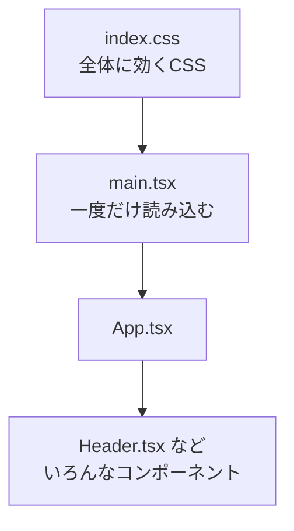

# 第52章：ぜんぶに効くCSS (`index.css`)

---

この章では、**「プロジェクト全体に効くCSS」＝ `index.css`** をちゃんと理解して、

* アプリ全体の**雰囲気（フォント・色・余白）**をまとめて整える
* 「どの画面でも使える共通クラス」を作れる
  ようになるのがゴールです 💪✨

---

## 1️⃣ `index.css` は「アプリ全体のドレスコード」👗

Vite の React＋TypeScript テンプレートだと、`src/main.tsx` の上のほうでこんな風に書かれています👇

```tsx
// src/main.tsx（一部）
import ReactDOM from 'react-dom/client'
import App from './App.tsx'
import './index.css'  // ← この1行がポイント！

ReactDOM.createRoot(
  document.getElementById('root') as HTMLElement,
).render(<App />)
```

`main.tsx` で `./index.css` を **一度だけ import** しているので、
`index.css` のスタイルは **アプリ全体（すべてのコンポーネント）に適用** されます。([zenryoku-kun.com][1])

イメージ図にするとこんな感じ👇



* `index.css` は「全体のルールブック」📘
* 各コンポーネントのCSS（`Button.module.css` みたいなやつ）は「その子専用の服」👚

この章では **「全体のルールブック」** を整える練習をしていきます ✨

---

## 2️⃣ まずは `index.css` をのぞいてみよう 👀

VS Code でこんな感じに開いてみてください：

* `src/index.css`

初期状態では、だいたいこんな内容が入っています（Viteのテンプレート用のスタイル）
→ ここは自分のアプリ用に**遠慮なく書き換えてOK** です 🙆‍♀️

---

## 3️⃣ 全体のフォントと背景色を決めてみる 🎨

まずは、アプリ全体の「雰囲気」を `index.css` で決めちゃいましょう。

### ✅ やること

1. `src/index.css` を開く
2. いったん中身を全部消して、次をコピペしてみましょう ✂️

```css
/* src/index.css */

:root {
  /* 全体で使い回す色たち（CSSカスタムプロパティ） */
  --color-bg: #f9fafb;
  --color-text: #111827;
  --color-accent: #6366f1;
  --color-accent-soft: #e0e7ff;
}

*,
*::before,
*::after {
  box-sizing: border-box;
}

body {
  margin: 0;
  font-family: system-ui, -apple-system, BlinkMacSystemFont, 'Segoe UI',
    sans-serif;
  background-color: var(--color-bg);
  color: var(--color-text);
}

/* アプリ全体で使える「共通レイアウト」例 */
.app-root {
  min-height: 100vh;
  padding: 24px;
}

/* よく使う見出し用クラス */
.page-title {
  font-size: 24px;
  font-weight: 700;
  margin-bottom: 16px;
}

/* 中身を中央寄せにしたい時のコンテナ */
.container {
  max-width: 960px;
  margin: 0 auto;
}
```

### 💡ポイント

* `:root` はほぼ `html` と同じ。ここで宣言した `--color-...` は
  **どのCSSからも `var(--color-xxx)` で使える共通の色** 💎
* `body` にフォント・文字色・背景色を設定すると、**全ページで一気に反映** 🙌
* `.app-root`, `.page-title`, `.container` は
  「どの画面でも使える共通クラス」の例です

---

## 4️⃣ `index.css` 由来のクラスをコンポーネントで使ってみる 🧩

次に、`App.tsx` からさっき作ったクラスを使ってみましょう。

```tsx
// src/App.tsx

type Todo = {
  id: number
  title: string
  done: boolean
}

const dummyTodos: Todo[] = [
  { id: 1, title: 'Reactの教科書を1ページ読む', done: false },
  { id: 2, title: 'CSSの動画を1本見る', done: true },
]

export function App() {
  return (
    <div className="app-root">
      <main className="container">
        <h1 className="page-title">マイ TODO リスト ✨</h1>

        <ul>
          {dummyTodos.map((todo) => (
            <li key={todo.id}>
              {todo.done ? '✅' : '⬜️'} {todo.title}
            </li>
          ))}
        </ul>
      </main>
    </div>
  )
}
```

ブラウザで確認してみてください 🖥️

* 余白・フォント・背景色が **ぜんぶ `index.css` で決めたルール** で整っているはずです 🎀
* どのコンポーネントからでも、`className="page-title"` みたいに書けば
  同じ見た目を使い回せます ✨

---

## 5️⃣ ぜんぶの `<button>` に効くスタイルを付けてみる 🔘

今度は、アプリ内の **すべてのボタン** に、やさしいデザインを当ててみましょう。

`index.css` に、次を追加してみてください👇

```css
/* すべての button に効く共通スタイル */
button {
  font: inherit; /* body と同じフォントにする */
  padding: 8px 16px;
  border-radius: 999px;
  border: 1px solid transparent;
  background-color: var(--color-accent);
  color: white;
  cursor: pointer;
  transition: background-color 0.15s ease, transform 0.1s ease;
}

button:hover {
  background-color: var(--color-accent-soft);
  color: var(--color-accent);
  transform: translateY(-1px);
}

button:disabled {
  opacity: 0.6;
  cursor: not-allowed;
  transform: none;
}
```

適当なボタンを App に置いて試してみます👇

```tsx
// App.tsx の中のどこか

<button>追加する ✏️</button>
<button disabled>送信中… ⏳</button>
```

### 👍 メリット

* どのコンポーネントで `<button>` と書いても、
  **同じデザインが勝手に適用** される
* フォームやダイアログを作るたびに、
  ボタンのスタイルを毎回書かなくてOK ✨

### ⚠️ 注意（ちょっとだけ）

* ライブラリ製のボタン（UIライブラリなど）にも影響する場合があります
* 本格的なアプリでは、
  「共通ボタンコンポーネント＋CSS Modules」を使うことが多いです
  → これは **第53〜55章** でじっくりやります 💡

---

## 6️⃣ 「ユーティリティクラス」をすこしだけ作ってみよう 🧰

Tailwind ほどガチじゃなくてOKなので、
「よく使いそうなクラス」を `index.css` に少しだけ用意しておくと便利です。

例：

```css
/* 小さなユーティリティクラスたち */

/* 文字を薄くしたいとき */
.text-muted {
  color: #6b7280;
}

/* 要素の上下に余白をつけたいとき */
.stack-sm {
  margin-top: 8px;
  margin-bottom: 8px;
}

.stack-md {
  margin-top: 16px;
  margin-bottom: 16px;
}

/* 画面いっぱいセンタリングしたいよ〜ってとき */
.full-center {
  min-height: 100vh;
  display: flex;
  align-items: center;
  justify-content: center;
}
```

使う側（TSX）はこんな感じ👇

```tsx
<p className="text-muted stack-sm">
  今日は「ぜんぶに効くCSS」の回です 🧴
</p>

<div className="full-center">
  <p>ど真ん中に配置されました 🎯</p>
</div>
```

「毎回同じスタイルを書いてるな〜」と思ったら、
それは **`index.css` に昇格させるサイン** です✨

---

## 7️⃣ ミニ演習 📝（手を動かして覚えるターン）

### 🔹演習1：サイト全体のテーマカラーを決める

1. `:root` の中に、`--color-bg`, `--color-accent` などを自分好みの色に変更
2. `body` の `background-color` や `button` の色に反映させる
3. 「自分のアプリのテーマカラー」を1セット作ってみる 🎨

> 例）ラベンダー系、ミント系、モノクロ系…なんでもOK

---

### 🔹演習2：共通タイトルスタイルを作る

1. `index.css` に `.page-title`, `.section-title` などのクラスを追加
2. `App.tsx` や他のコンポーネントで `className` に指定してみる
3. 「アプリ全体の見出しの雰囲気」が揃うかチェック ✅

---

### 🔹演習3：ボタン用クラスも作ってみる（ちょい発展）

今は `button { ... }` ですべてのボタンをスタイリングしていますが、
追加でこんなクラスも作ってみましょう👇

```css
.button-secondary {
  background-color: white;
  color: var(--color-accent);
  border-color: var(--color-accent);
}
```

TSX側：

```tsx
<button>メインボタン 🌟</button>
<button className="button-secondary">サブボタン 🪄</button>
```

→ 「共通スタイル＋クラスの追加」で、
ボタンのバリエーションを増やせる感覚をつかんでみてください ✨

---

## 8️⃣ まとめ：`index.css` で決めるのは「世界観」🌍

この章のポイントを整理すると…

* `index.css` は **アプリ全体に効くCSS**
* `main.tsx` で一度だけ import されているから、
  **どのコンポーネントからでも効果がある**
* ここでは主に

  * フォント、背景色、文字色
  * 共通レイアウト（`container`, `app-root` など）
  * ユーティリティクラス（`text-muted`, `full-center`など）
  * 全ての `<button>` に効くスタイル
    を定義するのがオススメ 🎀
* 「よく使うな〜」と思ったスタイルは `index.css` に昇格させよう ✨

次の **第53章からは「CSS Modules」** に入って、
「コンポーネントごとに効くCSS」を覚えていきます。

* 今回：**世界観を決めるグローバルCSS** 🌏
* 次回：**部品ごとのオシャレを決めるCSS** 👗

というイメージで頭の中を整理しておいてください〜😊💐

[1]: https://www.zenryoku-kun.com/new-post/vite?utm_source=chatgpt.com "ViteでReactプロジェクトを作成する方法 - 全力君。"
