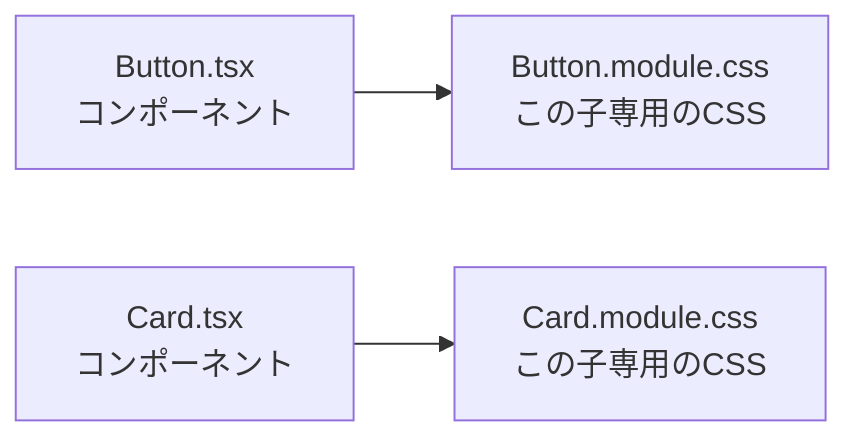

# 第53章：CSS Modules

---

この章では、
**「コンポーネントごとにCSSを分けて、キレイ＆安全にスタイルを当てる」**
ための仕組み、**CSS Modules** を使えるようになるのがゴールです ✨

---

## 53-1. まずはイメージから：なんで「部品ごと」にCSS？🤔

これまでのCSSって、こんな感じでしたよね：

* `index.css` にスタイルをどんどん足していく
* `.title` とか `.button` とか、けっこう適当なクラス名
* 別の画面でも `.button` をつけたら、**意図せずスタイルが変わっちゃう**…😱

つまり、**全部が「ひとつの大きなプール」みたいな状態**なんです。

CSS Modules を使うと、こんなイメージになります ⬇️



* `Button.tsx` は **Button用のCSSだけ** を見る
* `Card.tsx` は **Card用のCSSだけ** を見る
* お互いのクラス名がかぶってもOK（`container` が両方にあっても平気）🎉

---

## 53-2. CSS Modulesってなに？ざっくり定義 💡

**CSS Modules = 「CSSファイルを import して、オブジェクトみたいに使える仕組み」** です。

例えば：

1. `Button.module.css` にクラスを定義

   ```css
   /* src/components/Button.module.css */
   .button {
     padding: 8px 16px;
     border-radius: 999px;
     border: none;
     font-weight: bold;
     cursor: pointer;
   }

   .primary {
     background-color: #ff66a3;
     color: white;
   }
   ```

2. Reactコンポーネントで `import styles from './Button.module.css'` として使う

   ```tsx
   // src/components/Button.tsx
   type ButtonProps = {
     label: string;
   };

   export function Button({ label }: ButtonProps) {
     return (
       <button className={`${styles.button} ${styles.primary}`}>
         {label}
       </button>
     );
   }
   ```

ここでポイント ✨

* `styles` は「クラス名 → 実際のクラス文字列」の**マップ（オブジェクト）**
* `styles.button` や `styles.primary` が、それぞれ **実際のクラス名文字列** になります
* 実際のHTMLでは、例えばこんな感じのクラスになります：

  ```html
  <button class="button_abc123 primary_def456">...</button>
  ```

  みたいに、ビルド時にユニークな名前に変わります（ハッシュ付き）🧬
  だから **他のコンポーネントと絶対かぶらない** のです 💪

---

## 53-3. Vite + React でのCSS Modulesのルール 📝

Vite の React テンプレでは、**最初からCSS Modulesが使える設定**になっています。
ただし、いくつかルールがあります：

1. **ファイル名は `*.module.css` にする**

   * `Button.css` ではダメ
   * `Button.module.css` ならOK（これで「モジュールとして扱うよ」と教える）

2. React 側では `import styles from './Button.module.css'`

   * `styles` という名前は慣習だけど、ほとんどの人がそう書くのでマネしてOK👌

3. JSX側では `class` ではなく、**`className`** を使う

   * これは普通のReactのルール（おさらい 💡）

---

## 53-4. 実践：カワイイ「タグ風ボタン」を作ってみよう 💅

小さい実験として、**タグっぽいボタンコンポーネント**を作ってみましょう 🌸

### ① フォルダとファイルの用意

`src/components` フォルダに、次の2つを作ります：

* `TagButton.tsx`
* `TagButton.module.css`

### ② CSS Modules ファイルを書く（`TagButton.module.css`）

```css
/* src/components/TagButton.module.css */

.tagButton {
  display: inline-block;
  padding: 4px 10px;
  border-radius: 999px;
  border: 1px solid #ff99c8;
  font-size: 14px;
  color: #ff4d94;
  background-color: #fff0f7;
  cursor: pointer;
  transition: transform 0.1s ease, box-shadow 0.1s ease;
}

.tagButton:hover {
  transform: translateY(-1px);
  box-shadow: 0 2px 6px rgba(0, 0, 0, 0.08);
}

.tagButton:active {
  transform: translateY(0);
  box-shadow: none;
}
```

### ③ コンポーネントファイルを書く（`TagButton.tsx`）

```tsx
// src/components/TagButton.tsx
import styles from "./TagButton.module.css";

type TagButtonProps = {
  label: string;
};

export function TagButton({ label }: TagButtonProps) {
  return <button className={styles.tagButton}>#{label}</button>;
}
```

ポイント 🎯

* `import styles from "./TagButton.module.css";`

  * この1行で、CSSファイルが**オブジェクトとして読み込まれる**イメージ
* `styles.tagButton`

  * CSSの `.tagButton` クラスに対応
* JSXの `className` にセットすると、

  * 実際のHTMLではユニークなクラス名になる（他と衝突しない）

---

## 53-5. 仕組みのイメージを図で見てみよう 🧠✨

ビルド（`npm run dev` 中の裏側）で、だいたいこんなことが起きています：

```mermaid
graph LR;
  A[TagButton.tsx<br/>className={styles.tagButton}] --> B[ビルドツール<br/>(Vite)];
  B --> C[TagButton.module.css<br/>.tagButton {...}];
  B --> D[ユニークなクラス名生成<br/>tagButton__abc123];
  D --> E[ブラウザに出るHTML<br/>&lt;button class="tagButton__abc123"&gt;];
```

* 開発中は **`styles.tagButton` とだけ覚えておけばOK**
* 本番用のHTMLでは、**長いクラス名**に変身しているけど、意識しなくて大丈夫です🙆‍♀️

---

## 53-6. 複数クラスを組み合わせたいとき 🧩

CSS Modules でも、もちろんクラスを2つ以上つけられます。
さっきの `Button.module.css` を使って、こんな書き方もよくします：

```tsx
// 例：primaryとoutlineの両方をつけるパターン
<button className={`${styles.button} ${styles.primary}`}>
  送信する
</button>
```

もしくは、配列＋`join` で書く人もいます：

```tsx
<button className={[styles.button, styles.primary].join(" ")}>
  送信する
</button>
```

どちらでもOKなので、**自分が読みやすい方**で大丈夫です 💖

---

## 53-7. TypeScript的にはどう扱われてるの？🧐

Vite の React + TS テンプレートでは、だいたいこんな感じの型が用意されています（イメージ）：

```ts
// ざっくりイメージ
declare module "*.module.css" {
  const classes: { [key: string]: string };
  export default classes;
}
```

つまり、`styles` の型はだいたい：

```ts
{ [className: string]: string }
```

という「**文字列キー → 文字列**」のオブジェクトです。

### ここでのポイント

* `styles.xxx` と打つと、VS Code が**存在するクラス名をサジェスト**してくれることが多いので、とても楽 ✨
* 万が一、タイポすると `styles.tagButon`（nが抜けてる）みたいになって、

  * 実行時に `undefined` が入ってクラスが当たらない → 見た目がおかしい
* なので、**エディタの補完をちゃんと使うクセ**をつけるのがオススメです 🎓

---

## 53-8. よくあるつまづきポイント＆チェックリスト ✅

CSS Modules を初めて使うときに「あるある」なミスをまとめておきます👇

### ❌ その1：ファイル名が `.module.css` じゃない

```text
Button.css      ← これだと「普通のCSS」
Button.module.css  ← これならOK
```

**ファイル名に `module` を入れ忘れると、オブジェクトとして import できません。**

---

### ❌ その2：`class` を使っている

```tsx
// ❌ よくある間違い
<button class={styles.button}>送信</button>

// ✅ 正しくは
<button className={styles.button}>送信</button>
```

React では **`className`** を使うのを忘れずに 🌟

---

### ❌ その3：パスが微妙に違う

```tsx
import styles from "./Tagbutton.module.css"; // ❌ ファイル名と大文字小文字が違う

import styles from "./TagButton.module.css"; // ✅ OSに関係なく、ちゃんと一致させる！
```

VS Code の「ファイル名を右クリック → パスのコピー」や、
自動補完で選ぶようにすると安全です 🛟

---

## 53-9. ミニ練習：`App.tsx` にCSS Modulesを導入してみよう ✏️💕

> ここからは「自分の手でやってみる」コーナーです！

### ゴール

* `App.tsx` の見た目を、**CSS Modulesだけで整える**
* ざっくりこんな雰囲気を目指します：

  * 画面中央にカードっぽいボックス
  * タイトル
  * 説明文
  * さっき作った `TagButton` を1つ表示

### ステップ1：`App.module.css` を作成

`src/App.module.css` を新規作成して、こんな感じにしてみましょう（好きにアレンジしてOKです💗）

```css
/* src/App.module.css */

.appRoot {
  min-height: 100vh;
  display: flex;
  justify-content: center;
  align-items: center;
  background: linear-gradient(135deg, #ffe5f0, #e3f2ff);
  font-family: system-ui, -apple-system, BlinkMacSystemFont, "Segoe UI", sans-serif;
}

.card {
  background-color: white;
  padding: 24px 28px;
  border-radius: 16px;
  box-shadow: 0 8px 20px rgba(0, 0, 0, 0.08);
  text-align: center;
  max-width: 480px;
  width: 90%;
}

.title {
  font-size: 24px;
  margin-bottom: 8px;
  color: #ff4d94;
}

.description {
  font-size: 14px;
  color: #555;
  margin-bottom: 16px;
}
```

### ステップ2：`App.tsx` からCSS Modulesを読み込む

`src/App.tsx` を開いて、ざっくり次のように書き換えてみます（※ プロジェクトの元のコードに合わせて調整してくださいね）

```tsx
// src/App.tsx
import styles from "./App.module.css";
import { TagButton } from "./components/TagButton";

export function App() {
  return (
    <div className={styles.appRoot}>
      <div className={styles.card}>
        <h1 className={styles.title}>React & CSS Modules 入門 🌸</h1>
        <p className={styles.description}>
          このカード全体の見た目は、App.module.css にだけ書かれています。
          他の画面とはケンカしない、平和なスタイリングです ✌️
        </p>

        <TagButton label="css-modules" />
      </div>
    </div>
  );
}
```

### ステップ3：ブラウザで確認 👀

`npm run dev` をして、ブラウザで確認してみましょう。

* 背景がグラデーションになっているか
* カードが中央に表示されているか
* タイトル・説明文・タグボタンが、それっぽくスタイルされているか

うまくいっていたら、**CSS Modules デビュー成功です🎉🎉🎉**

---

## 53-10. この章のまとめ 🐣

この章で学んだことをおさらいしておきましょう ✨

* CSS Modules は、**コンポーネントごとにCSSを分けて安全に管理できる仕組み**
* ファイル名は必ず **`*.module.css`** にする
* `import styles from "./Xxx.module.css";` で読み込んで、

  * `className={styles.someClass}` として使う
* 実際のクラス名はビルド時にユニークになるので、

  * 他のコンポーネントとクラス名がかぶってもOK👌
* ちょっとしたデザインでも、**「部品専用CSS」** を意識すると、プロっぽいコードに近づきます ✨

次の **第54章** では、
**CSS Modules の「使い方とイイところ」を、もう少し深掘り**していきます。
「この書き方、現場だとどう使うの？」みたいな話もしていきましょう 🧑‍💻💖
