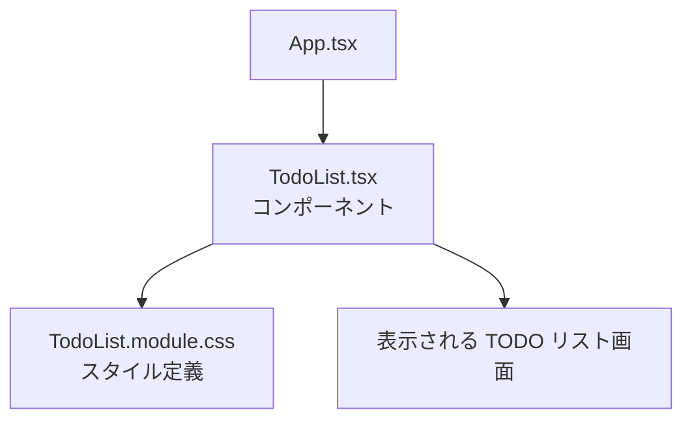

# 第55章：練習：CSS Modules でTODOリストをイイ感じにする

おつかれさま〜！🥰
ここまでで、

* 「CSS をどこに書くか？」（index.css / CSS Modules など）
* 「CSS Modules の使い方」

はだいたいイメージできてきたはずです 💪

この章ではいよいよ実戦編として、

> **「シンプルな TODO リスト」を CSS Modules でかわいく整える 💅**

ところまでやってみましょう！

---

## 1. 今日のゴール 🎯

この章のゴールはこんな感じです。

* `TodoList.tsx` というコンポーネントを作る
* `TodoList.module.css` を作って、

  * 全体のレイアウト
  * TODO アイテムの見た目
  * 完了済みの見た目（グレー＋取り消し線）
  * ボタンのスタイル（色・ホバー）
* 最終的に「ちょっとアプリっぽい」見た目にする ✨

イメージ図を Mermaid で描くとこんな感じ👇



---

## 2. 事前準備：フォルダとファイル構成 🗂️

Vite + React + TS プロジェクトがすでにある前提で進めます。

`src` フォルダの中に、こんな感じで作っていきます 👇

* `src/App.tsx`
* `src/components/TodoList.tsx` ← これを新しく作る
* `src/components/TodoList.module.css` ← これも新しく作る

エクスプローラーで `src` の中に `components` フォルダを作っておいてください 🧺

---

## 3. 最初の TODO リストコンポーネント（まだ地味）📝

まずは **見た目は気にせず**、TypeScript＋React の TODO リストをサクッと作ります。
`src/components/TodoList.tsx` を作成して、こんなコードを書いてみましょう。

> 💡 書いたあとに `npm run dev` して、ちゃんと動くかだけ先にチェックしておくと安心です。

```tsx
// src/components/TodoList.tsx
import { useState } from "react";

export type Todo = {
  id: number;
  title: string;
  done: boolean;
};

const initialTodos: Todo[] = [
  { id: 1, title: "React の復習をする", done: false },
  { id: 2, title: "レポートの資料をざっと読む", done: true },
  { id: 3, title: "友だちとカフェで勉強会 ☕", done: false },
];

export function TodoList() {
  const [todos, setTodos] = useState<Todo[]>(initialTodos);

  const handleToggleDone = (id: number) => {
    setTodos((prev) =>
      prev.map((todo) =>
        todo.id === id ? { ...todo, done: !todo.done } : todo
      )
    );
  };

  const handleDelete = (id: number) => {
    setTodos((prev) => prev.filter((todo) => todo.id !== id));
  };

  return (
    <div>
      <h2>今日のTODOリスト</h2>
      <ul>
        {todos.map((todo) => (
          <li key={todo.id}>
            <span
              style={
                todo.done
                  ? { textDecoration: "line-through", opacity: 0.6 }
                  : undefined
              }
            >
              {todo.title}
            </span>
            <button onClick={() => handleToggleDone(todo.id)}>
              {todo.done ? "戻す" : "完了"}
            </button>
            <button onClick={() => handleDelete(todo.id)}>削除</button>
          </li>
        ))}
      </ul>
    </div>
  );
}
```

そして、`App.tsx` からこのコンポーネントを呼び出します。

```tsx
// src/App.tsx
import { TodoList } from "./components/TodoList";

export default function App() {
  return (
    <div>
      <TodoList />
    </div>
  );
}
```

ここまでで、

* 動くけど
* 見た目はちょっと味気ない…😇

という状態になっていればOKです！
次から CSS Modules の出番です ✨

---

## 4. CSS Modules ファイルを作る 👗

同じ `components` フォルダの中に、
**`TodoList.module.css`** というファイルを作ります。

中身をこんな感じにしてみましょう。

```css
/* src/components/TodoList.module.css */

.wrapper {
  max-width: 480px;
  margin: 24px auto;
  padding: 20px;
  border-radius: 16px;
  background: #ffffff;
  box-shadow: 0 8px 24px rgba(0, 0, 0, 0.06);
  font-family: system-ui, -apple-system, BlinkMacSystemFont, "Segoe UI",
    sans-serif;
}

.title {
  margin: 0 0 16px;
  font-size: 1.4rem;
  font-weight: 700;
  text-align: center;
  color: #333333;
}

.counter {
  text-align: center;
  margin-bottom: 16px;
  font-size: 0.9rem;
  color: #666666;
}

.list {
  list-style: none;
  padding: 0;
  margin: 0;
}

.item {
  display: flex;
  align-items: center;
  gap: 8px;
  padding: 10px 12px;
  margin-bottom: 8px;
  border-radius: 10px;
  background: #f7f7ff;
  transition: background 0.2s ease, transform 0.1s ease;
}

.item:hover {
  background: #eef0ff;
  transform: translateY(-1px);
}

.itemDone {
  opacity: 0.6;
}

.itemText {
  flex: 1;
  font-size: 0.95rem;
  color: #333333;
}

.itemTextDone {
  text-decoration: line-through;
}

.badge {
  font-size: 0.7rem;
  padding: 2px 6px;
  border-radius: 999px;
  background: #e0e7ff;
  color: #4f46e5;
}

.badgeDone {
  background: #e5e7eb;
  color: #6b7280;
}

.buttonGroup {
  display: flex;
  gap: 6px;
}

.button {
  border: none;
  border-radius: 999px;
  padding: 6px 10px;
  font-size: 0.8rem;
  cursor: pointer;
  transition: background 0.15s ease, transform 0.05s ease, box-shadow 0.15s ease;
}

.buttonPrimary {
  background: #4f46e5;
  color: #ffffff;
}

.buttonPrimary:hover {
  background: #4338ca;
}

.buttonDanger {
  background: #fee2e2;
  color: #b91c1c;
}

.buttonDanger:hover {
  background: #fecaca;
}

.button:active {
  transform: translateY(1px);
  box-shadow: none;
}
```

ポイント ✨

* `.wrapper` … カードっぽく見せる外側の箱
* `.item` … 各 TODO 行の見た目
* `.itemDone` / `.itemTextDone` … 完了済みのときだけ足すクラス
* `.buttonPrimary` … 「完了 / 戻す」ボタン用
* `.buttonDanger` … 「削除」ボタン用

「クラス名がちょっと長いかな…？」と思うかもですが、
**CSS Modules ならクラス名がかぶる心配がほぼない**ので、
意味がわかる名前を優先してOKです 🙆‍♀️

---

## 5. TodoList.tsx で CSS Modules を読み込む 📦

さっきの `TodoList.tsx` を、CSS Modules 対応バージョンに書き換えます。

変更ポイントは大きく 3つ 💡

1. `TodoList.module.css` を `import` する
2. `<div>`, `<ul>`, `<li>`, `<button>` などに `className` をつける
3. 完了済みかどうかでクラスを出し分ける（`条件付き` クラス）

書き換えたコードはこちら 👇

```tsx
// src/components/TodoList.tsx
import { useState } from "react";
import type { Todo } from "./TodoList"; // 自分で定義した型を再利用してもOK
import styles from "./TodoList.module.css";

export type Todo = {
  id: number;
  title: string;
  done: boolean;
};

const initialTodos: Todo[] = [
  { id: 1, title: "React の復習をする", done: false },
  { id: 2, title: "レポートの資料をざっと読む", done: true },
  { id: 3, title: "友だちとカフェで勉強会 ☕", done: false },
];

export function TodoList() {
  const [todos, setTodos] = useState<Todo[]>(initialTodos);

  const handleToggleDone = (id: number) => {
    setTodos((prev) =>
      prev.map((todo) =>
        todo.id === id ? { ...todo, done: !todo.done } : todo
      )
    );
  };

  const handleDelete = (id: number) => {
    setTodos((prev) => prev.filter((todo) => todo.id !== id));
  };

  const totalCount = todos.length;
  const doneCount = todos.filter((todo) => todo.done).length;

  return (
    <div className={styles.wrapper}>
      <h2 className={styles.title}>今日のTODOリスト ✅</h2>

      <p className={styles.counter}>
        完了：
        <strong>
          {doneCount} / {totalCount}
        </strong>
      </p>

      <ul className={styles.list}>
        {todos.map((todo) => {
          const itemClassName = [
            styles.item,
            todo.done ? styles.itemDone : "",
          ]
            .filter(Boolean)
            .join(" ");

          const textClassName = [
            styles.itemText,
            todo.done ? styles.itemTextDone : "",
          ]
            .filter(Boolean)
            .join(" ");

          const badgeClassName = [
            styles.badge,
            todo.done ? styles.badgeDone : "",
          ]
            .filter(Boolean)
            .join(" ");

          return (
            <li key={todo.id} className={itemClassName}>
              <span className={badgeClassName}>
                {todo.done ? "Done ✨" : "Todo"}
              </span>
              <span className={textClassName}>{todo.title}</span>
              <div className={styles.buttonGroup}>
                <button
                  className={`${styles.button} ${styles.buttonPrimary}`}
                  onClick={() => handleToggleDone(todo.id)}
                >
                  {todo.done ? "戻す" : "完了"}
                </button>
                <button
                  className={`${styles.button} ${styles.buttonDanger}`}
                  onClick={() => handleDelete(todo.id)}
                >
                  削除
                </button>
              </div>
            </li>
          );
        })}
      </ul>
    </div>
  );
}
```

### ここで覚えておきたいポイント ✅

* `import styles from "./TodoList.module.css";`

  * `styles` という「オブジェクト」が手に入るイメージです
  * `styles.wrapper` が、CSS で書いた `.wrapper` のことになるよ、という仕組み
* `className` に文字列をつなげるときは
  `["a", "b", condition ? "c" : ""].filter(Boolean).join(" ")` という書き方が便利
* 完了しているかどうかで、**追加のクラスだけ切り替える**ようにすると、

  * ベースのデザインは共通
  * 差分だけを「状態」として管理
    という形にしやすくなります 💡

---

## 6. 画面イメージをイメージしてみよう 👀

完成イメージをざっくり Mermaid で表すとこんな感じです。

```mermaid
graph LR
  A[TODO カード全体<br/>(wrapper)] --> B[item 1]
  A --> C[item 2]
  A --> D[item 3]

  B --> B1[バッジ<br/>(badge)]
  B --> B2[テキスト<br/>(itemText)]
  B --> B3[ボタン群<br/>(buttonGroup)]

  C --> C1[バッジ<br/>(badgeDone)]
  C --> C2[テキスト<br/>(itemTextDone)]
  C --> C3[ボタン群]
```

だいたい、**カードの中に行が並んでいる**イメージができればOKです ✨

---

## 7. ちょっとアレンジしてみようチャレンジ 💪

ここからは「自分でアレンジしてみる」コーナーです。
ちょっとした工夫を入れると、一気に“自分のアプリ感”が出ますよ〜 🥳

### チャレンジ 1：色を自分好みに変える 🎨

`TodoList.module.css` の中で、

* `background` の色
* ボタンの色
* 影の強さ（`box-shadow`）

などを、自分の好きなカラーコードに変えてみましょう。
推しカラーで TODO アプリを作るのもアリです 💗💙💛

---

### チャレンジ 2：空のときメッセージを出す 🕊️

`todos` が 0 件のときに、

> 「今日はやることなし！おつかれさま〜 ✨」

みたいなメッセージを中央に出してみましょう。

ヒント：

* JSX 側で `todos.length === 0` をチェック
* `.emptyMessage` みたいなクラスを CSS Modules に追加して、かわいく表示

---

### チャレンジ 3：重要 TODO にマークをつける ⭐

`Todo` 型に `priority`（優先度）を追加してみましょう。

```ts
export type Todo = {
  id: number;
  title: string;
  done: boolean;
  priority?: "high" | "normal";
};
```

* `priority === "high"` のときだけ

  * バッジの色を変える
  * タイトルの前に `🔥` や `⭐` をつける
* そのための CSS クラスを追加して、`className` に条件付きで足してみる

「ロジック（状態）と見た目（CSS Modules）をセットで考える」練習になります 💡

---

## 8. まとめ 📝

この章でできるようになったことは…

* `TodoList.module.css` を作って **コンポーネント専用のスタイル** を書いた
* `import styles from "./TodoList.module.css";` で CSS Modules を読み込んだ
* `styles.xxx` という形でクラス名を指定した
* TODO の状態（`done`）に応じて、クラスを出し分けられるようになった

つまり：

> **「ロジック（状態）＋ CSS Modules」で、“それっぽい UI” を作れるようになった 🎉**

ということです。めちゃくちゃ大きな一歩です 👏👏👏

---

## 9. 次の章に向けて 🌈

次からは React のもう少し深い仕組みや、
他のスタイリングの方法を組み合わせて、
**「中規模なコンポーネント」** も自信を持って作れるようにしていきます 💻💕

もし時間と気力に余裕があれば、この章の TODO リストを

* ダークモード風 🎮
* ノートアプリ風 📒
* カフェメニュー風 ☕ などなど…

自分の好きなテーマに寄せてデザインし直してみてください。
CSS Modules なら、コンポーネントごとに世界観を変えるのもカンタンです ✨

おつかれさま！次の章も一緒にがんばろ〜 🌟
