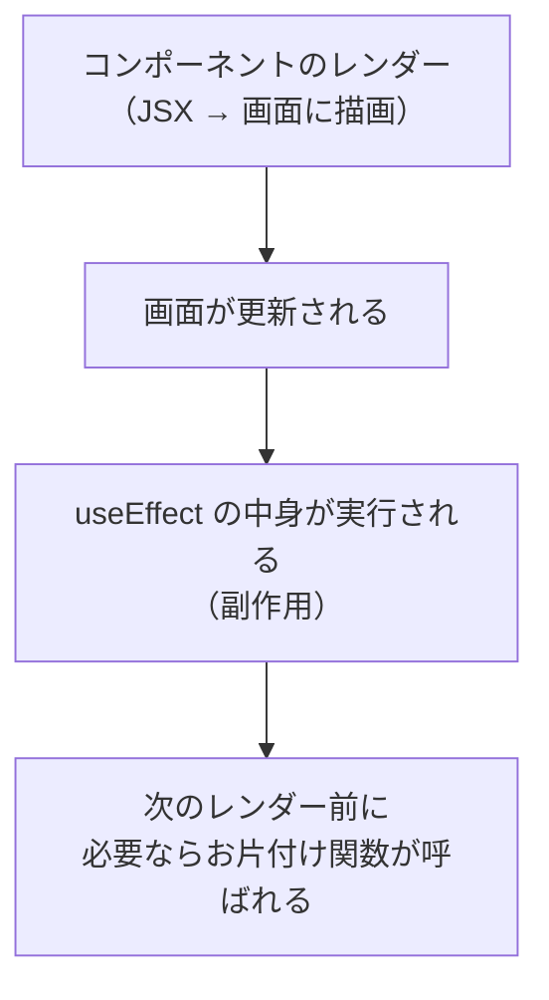

# 第57章：【フック】`useEffect` の基本

## 1. 今日この章でできるようになりたいこと 🎯

この章では、

* `useEffect` が「なにをするフック」なのかイメージできる
* いちばん基本的な書き方で `useEffect` を使える
* 「いつ実行されるの？」のタイミングをざっくり説明できる
* かんたんな実用例（ページタイトルを変える）が書ける

ここまで行けたら 💯 です！

---

## 2. `useEffect` は「外の世界と仲良くする係」🌏

React の公式ドキュメントでは、`useEffect` は

> コンポーネントをチャットサーバーやタイマーなどの **外部システム** と同期させるためのフック

と説明されています。([react.dev][1])

たとえばこんなときに使います：

* `document.title` を変える（ブラウザのタブタイトル）
* `setInterval` でタイマーを動かす
* `window.addEventListener` でスクロールイベントを監視する
* 外部ライブラリの `.start()` / `.stop()` を呼ぶ　など

React チームは「外部システムが関係ないなら、むしろ Effect はいらないことが多いよ」とも言っています。([react.dev][2])

> 👉 **ポイント**
> `useEffect` は「React の外の世界」との窓口。
> 画面に表示するだけなら、基本は `useState` や JSX で足ります。

---

## 3. `useEffect` のざっくり流れを図で見る 🧠

`useEffect` が動く流れを、ざっくり Mermaid で図にしてみます。



イメージとしては、

1. React が JSX をもとに画面を更新する
2. その「あとから」`useEffect` の中が走る
3. 次にもう一度同じコンポーネントが動くとき、前回分の「お片付け」が呼ばれる（あれば）

くらいでOKです ✨

---

## 4. `useEffect` のいちばん基本の形 ✏️

まずは **型とか難しいことは置いといて**、形から覚えちゃいましょう。

### 基本の構文

```ts
import { useEffect } from "react";

useEffect(() => {
  // ここに「副作用」の処理を書く
  console.log("useEffect が動いたよ！");
});
```

* `useEffect(コールバック関数)`
* コールバック関数の中に「外の世界とやりとりする処理」を書きます。

> ※ 第62章でやる「お片付け（クリーンアップ）」を入れたいときは
> `return () => { ... }` をこの中から返しますが、今日はまだ出てきません ✋

---

## 5. ハンズオン①：コンソールにメッセージを出してみる 🖥️

まずは「動いたかどうか」が一目でわかるログから始めます。

### 5-1. コンポーネントを作る

`src/App.tsx` を、こんな感じに書きかえてみましょう。

```tsx
import { useEffect } from "react";

export function App() {
  useEffect(() => {
    console.log("App コンポーネントの useEffect が実行されました 🎉");
  });

  return (
    <div>
      <h1>useEffect の最初の一歩 👣</h1>
      <p>ブラウザの開発者ツールのコンソールを見てみよう！</p>
    </div>
  );
}
```

### 5-2. 動かしてみる

1. ターミナルでプロジェクトフォルダに移動

2. 開発サーバーを起動

   ```bash
   npm run dev
   ```

3. ブラウザで `http://localhost:5173`（Vite のデフォルト）を開く

4. **F12キー** → 「Console」タブを開く

すると、こんなログが出ているはずです👇

```text
App コンポーネントの useEffect が実行されました 🎉
```

> 💡 開発モードでは、`StrictMode` の影響で **最初のレンダーだけ 2 回実行される** ことがあります。
> React 18 以降の開発モードの仕様で、「バグがないかチェックするため」の動きです。([Reddit][3])
> 本番ビルドでは 1 回になるので、「2回出る＝バグ」とは限らないよ〜ということだけ覚えておいてください。

---

## 6. `useEffect` は「いつ」動くの？⌚

さっきのコードでは、依存配列（`[]` のやつ）をつけていないので、

> コンポーネントがレンダーされるたびに `useEffect` が動く

という挙動になります。([react.dev][1])

つまり：

* `App` が最初に表示されたとき ✅
* `App` の中の state が変わって、もう一度レンダーされたとき ✅
  → そのたびに `console.log` が出る

> 🎗 依存配列ってなに？
> `useEffect(() => { ... }, [count])` みたいに書く **第2引数の配列** のことを
> この教材では「見張りリスト」と呼びます。
> **第58章〜第61章** でじっくりやるので、今はチラ見せだけにしておきます 👀

---

## 7. ハンズオン②：ページタイトルを「カウント」に合わせて変える 🧮✨

React 19 では、データ取得などは新しい `use` フックや Actions で書く流れになってきていますが、`document.title` の変更やタイマーのような「外部とのちょっとした同期」は、今でも `useEffect` の良い出番です。([Medium][4])

ここでは、

> カウンターの数字に合わせて、ブラウザタブのタイトルを変える

という、典型的な `useEffect` の例を作ってみましょう。

### 7-1. コード全体

`src/App.tsx` を次のようにしてみてください。

```tsx
import { useEffect, useState } from "react";

export function App() {
  const [count, setCount] = useState(0);

  // 👉 count が変わるたびに、タイトルを更新する
  useEffect(() => {
    document.title = `カウント: ${count}`;
  }, [count]); // ← 見張りリスト（依存配列）：count を見ている

  function handleClick() {
    setCount(count + 1);
  }

  return (
    <div style={{ padding: "16px" }}>
      <h1>useEffect でページタイトルを変えてみよう ✨</h1>
      <p>いまのカウント: {count}</p>
      <button onClick={handleClick}>+1 するボタン 🧮</button>
      <p>ブラウザのタブのタイトルにも注目してみてね！</p>
    </div>
  );
}
```

### 7-2. ここで覚えてほしいこと 💡

* `useEffect(() => { ... }, [count])`

  * `count` が変わったときだけ、この中身が実行される
* 中では `document.title = ...` と、React の外にいるブラウザ API を呼んでいる

  * だからこそ、`useEffect` の出番！

> 👀 いまは「`[count]` と書いたら、count が変わったとき専用の Effect になる」くらいの理解でOKです。
> 第58〜60章で、`[]` / `[state]` / 省略 のそれぞれの違いを丁寧にやります。

---

## 8. `useEffect` の書き方チートシート 📝

この章で出てきたことを、いったん整理しておきます。

### 8-1. 形はぜんぶでこんな感じ

```
useEffect(() => {
  // 副作用
});

// （依存配列あり）
useEffect(() => {
  // 副作用
}, [依存する値1, 依存する値2]);

// （お片付けもあるバージョン）
useEffect(() => {
  // 副作用の処理

  return () => {
    // お片付け（イベント解除・タイマー解除など）
  };
}, [依存する値]);
```

> 🧹 お片付け（クリーンアップ）版は、第62章でしっかりやります。
> 「`return () => { ... }` で前回の残りを片づける」とだけメモしておいてください。

### 8-2. 守ってほしいルール（超ざっくり）

* `useEffect` は **コンポーネントの「一番外側」だけに書く**

  * `if` の中や `for` の中に書かない
* React がレンダーするたびに、必要に応じて勝手に呼んでくれる

  * 自分で `useEffect()` を直接呼び出したりしない
* 「React の外」にあるもの（`document`, `window`, 外部ライブラリなど）を触るときに使う

---

## 9. ミニ練習＆チェックテスト ✍️✨

### Q1. これは何回動く？🤔

次のコードを見てください。

```tsx
import { useEffect, useState } from "react";

export function Sample() {
  const [value, setValue] = useState(0);

  useEffect(() => {
    console.log("Effect が実行されました");
  });

  return (
    <button onClick={() => setValue(value + 1)}>
      値を増やす（いま: {value}）
    </button>
  );
}
```

> 質問：
> （開発モードで StrictMode が有効な前提）
>
> * 最初に画面が表示されたとき
> * ボタンを 1 回クリックしたとき
>   コンソールには何回「Effect が実行されました」と出るでしょう？

**ヒント**：

* 依存配列がない＝レンダーのたびに実行
* 開発モードでは、最初のマウントが 2 回になることがある（チェックのため）

---

### Q2. この `useEffect` は何をしたい？🕵️‍♀️

```tsx
useEffect(() => {
  document.title = `ログインユーザー: ${userName}`;
}, [userName]);
```

`userName` が変わったときに、何をしたいコードでしょう？
自分なりの日本語で説明してみてください。

（例：「〇〇になったら、ブラウザのタブに△△と表示する」みたいに ☺）

---

### Q3. 実装お題 🎮

`useEffect` を使って、次のどれかを実装してみてください（好きなのを選んでOK）：

1. ページを開いたときだけ一度だけ `alert("ようこそ！")` を出すコンポーネント
2. コンポーネントがレンダーされるたびに、現在時刻をコンソールに表示するコンポーネント
3. 入力欄に文字を打つたびに、その文字数を `document.title` に反映するコンポーネント

> ✨ 次の章で「見張りリスト（依存配列）」をちゃんと理解すると、
> 「いつ1回で、いつ毎回なのか」を自信をもってコントロールできるようになります 💪

---

## 10. まとめ 🎀

* `useEffect` は **React の外の世界（ブラウザAPI・タイマー・外部ライブラリなど）と同期するためのフック**
* 画面がレンダーされた「あと」で動く（タイミングはレンダーとセット）
* 第2引数の配列（見張りリスト）で「いつ動かすか」をコントロールできる
  → これは 58〜61章でじっくり！
* React 19 ではデータ取得などは別の仕組みも増えてきたけど、
  `document.title` やイベント登録などの用途では、今でも主役級 💫

次の **第58章** では、この `useEffect` の「見張りリスト（依存配列）」を詳しく見ていきます。
「どの値を見張るか」をコントロールできるようになると、一気にプロっぽいコードになりますよ〜 😎🚀

[1]: https://react.dev/reference/react/useEffect?utm_source=chatgpt.com "useEffect"
[2]: https://react.dev/learn/you-might-not-need-an-effect?utm_source=chatgpt.com "You Might Not Need an Effect"
[3]: https://www.reddit.com/r/reactjs/comments/vddc37/what_happened_to_useeffect_hook_in_react_18/?utm_source=chatgpt.com "What happened to useEffect() hook in React 18? : r/reactjs"
[4]: https://medium.com/%40CodersWorld99/react-18-vs-react-19-a-full-breakdown-of-new-apis-the-compiler-rewrite-and-game-changing-async-cfbcf78bcdee?utm_source=chatgpt.com "React 18 vs React 19: A Full Breakdown of New APIs, the ..."
