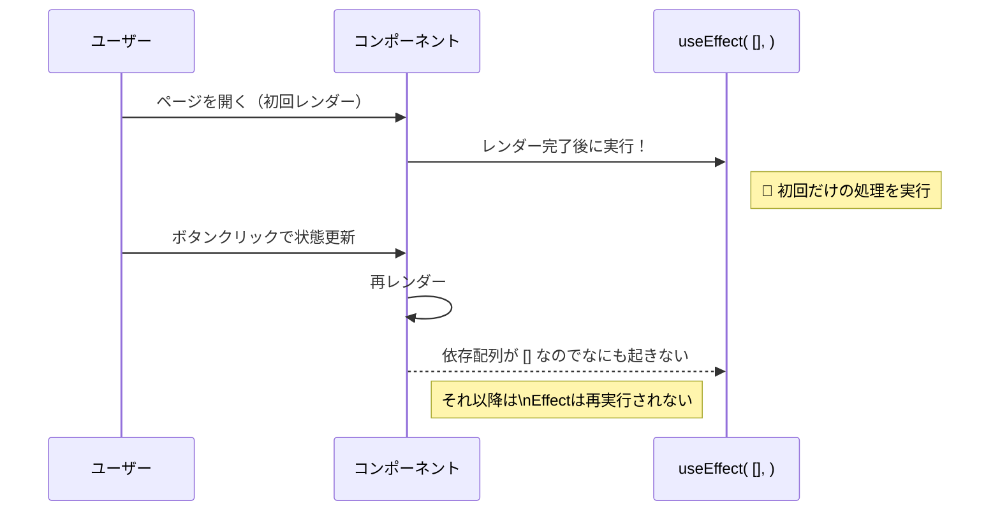

# 第59章：見張りリスト `[]`

---

この章では、

* `useEffect(() => { ... }, [])` が「最初の1回だけやってね」という意味になること
* どんなタイミングでそれを使うと便利か
* 「なんで ESLint に怒られるの？🥺」をざっくり理解すること
* Strict Mode だと「2回動いてるように見える」理由

をゆる〜く押さえていきます💪

---

## 1️⃣ おさらい：`useEffect` と「見張りリスト」って？

`useEffect` は「画面の表示以外の仕事（副作用）」をやらせるためのフックでしたね。
第58章でやったとおり、第二引数の「見張りリスト（依存配列・dependency array）」が

* **いつその処理をもう一度動かすか**

を決めています。([react.dev][1])

パターンとしてはこんな感じ👇

* 依存配列なし：`useEffect(() => { ... })`
  → **毎回のレンダー後に** 実行
* `[]`：`useEffect(() => { ... }, [])`
  → **最初の1回だけ** 実行
* `[someState]`：`useEffect(() => { ... }, [someState])`
  → **最初の1回 + `someState` が変わるたび** 実行([Strapi][2])

この章はこのうち
**「`[]` を渡したとき」専用**のお話です🌟

---

## 2️⃣ `[]` の意味：「初回マウント時だけやってね」

コードの形はこれ👇

```tsx
import { useEffect, useState } from "react";

function MountOnceDemo() {
  const [count, setCount] = useState(0);

  useEffect(() => {
    console.log("🎉 コンポーネントが初めて表示されました！");
  }, []); // ← 見張りリストが空！

  return (
    <div>
      <p>カウント: {count}</p>
      <button onClick={() => setCount((prev) => prev + 1)}>
        ＋1する
      </button>
    </div>
  );
}

export default MountOnceDemo;
```

ポイントはここです👇

* `useEffect(() => { ... }, [])`

  * **最初にコンポーネントが画面に出たあと** にだけ実行
  * その後、`count` が何回変わって再レンダーされても
    → この Effect は **もう呼ばれない**

クラスコンポーネントでいうと `componentDidMount` 的な動きと思ってOKです✨([Strapi][2])

---

## 3️⃣ 実験：App.tsx に組み込んでみよう 🧪

ちょっとだけ手を動かして、挙動を体感してみましょう。

### 3-1. コンポーネントを作る

`src/MountOnceDemo.tsx` を作って、さっきのコードをコピペします✍️

（ファイル名やフォルダ名はお好きにどうぞ〜）

### 3-2. `App.tsx` から呼び出す

```tsx
import MountOnceDemo from "./MountOnceDemo";

function App() {
  return (
    <div>
      <h1>第59章テスト ✨</h1>
      <MountOnceDemo />
    </div>
  );
}

export default App;
```

### 3-3. 動きを観察 👀

1. ターミナルで `npm run dev` を実行
2. ブラウザでアプリを開く
3. DevTools のコンソールを開く
4. 画面が表示された瞬間に
   → `🎉 コンポーネントが初めて表示されました！` が **一度だけ** 出ているはず
5. ボタンを何回押しても
   → ログは増えない（`useEffect` は動いていない）

「初回だけ仕事して、あとは静かにしてるスタッフ」みたいなイメージです🤵‍♀️

---

## 4️⃣ 時系列で見る：Mermaid 図でイメトレ 🧠✨

「いつ動いて、いつ動かないのか」を図で見てみましょう。



* 最初のレンダー後 → `useEffect` が **1回だけ** 動く
* そのあとの再レンダーでは → `[]` のおかげで **完全スルー**

という流れがつかめればOKです🙆‍♀️

---

## 5️⃣ どんな時に `[]` を使う？💡

`[]` は「**初期設定だけしたいとき**」に向いています。

例としては…

* ✅ ページを開いたタイミングで一度だけログを送る
* ✅ 一度だけイベントリスナーを登録する（`addEventListener` など）
* ✅ 一度だけ初期値を外から取ってくる（`localStorage` からテーマ設定など）([DEV Community][3])

ただし、**注意ポイント** があります⚠️

### ⚠️ 中で「変わる値（state / props）」を読むときは要注意

`useEffect` の依存配列は、本来

> 「Effectの中で読む *すべての* 状態やpropsは、ここに書きましょう」

というルールがあります。([react.dev][1])

もし `[]` にしているのに、中で `count` を読んだりすると…

* ESLint に
  → *“React Hook useEffect has a missing dependency”*
  みたいに怒られたりします😇([Kinsta®][4])

これは

> 「`count` を読んでるのに、`[count]` って書いてないよ？」

という指摘です。

**なので `[]` で書くときは**：

* 一度きりの初期化
* 変わらない値だけを扱う処理

に絞るのが安全です💡

---

## 6️⃣ 「え？2回動いてない？」Strict Mode の小ネタ 🤔

React 18 以降、開発モードで `StrictMode` がオンになっていると

> **マウント → アンマウント → もう一回マウント**

という「わざとの2回試し」が行われることがあります。
その結果、`useEffect(..., [])` の処理が **開発中だけ 2回動いているように見える** ことがあります。([OneClick IT Consultancy][5])

* 本番ビルド（`npm run build` → deploy）では
  → 通常どおり **1回だけ** 実行
* 開発中だけ「ストレステスト」されてるイメージです🏋️‍♀️

なので、

> 「コンソールログが2回出るんだけど！？バグ！？」

と慌てなくて大丈夫です。
**Strict Mode の仕様** だと思っておいてOKです✨

---

## 7️⃣ ミニ練習 📝（自分で書いてみよう）

時間があれば、次の2つを自分で作ってみてください：

### 🏅 練習1：タイトル変更

1. `TitleOnMount.tsx` を作る
2. 中で `useEffect(() => { document.title = "React v19 勉強中🎓"; }, []);` を書く
3. ページを開いたとき **1回だけ** タイトルが変われば成功！

→ 「あ、これが“初回だけ”か〜」が実感できればOK。

### 🏅 練習2：一度だけアラート

1. `AlertOnMount.tsx` を作る
2. `useEffect` の中で `alert("ようこそ！このページは第59章の練習ページです✨");`
3. 再レンダーしても（ボタン押しても）アラートが **増えない** ことを確認

---

## まとめ 🎀

* `useEffect(() => { ... }, [])`
  → コンポーネントが **最初に画面に出たときだけ** 実行される
* 初期設定や一度きりの処理に使うと便利✨
* 中で「変わる値」を読むなら、本来は依存配列に書く必要がある
* Strict Mode のせいで、開発中だけ2回動いてるように見えることもあるけど
  → 本番では1回なのであわてなくてOK👌

次の章では、`[state]` みたいに「**特定の値が変わったときだけ動く**」パターンを見ていきます。
`[]` と `[something]` の違いが分かると、`useEffect` が一気に扱いやすくなりますよ〜🌈

[1]: https://react.dev/reference/react/useEffect?utm_source=chatgpt.com "useEffect"
[2]: https://strapi.io/blog/what-is-react-useeffect-hook-complete-guide?utm_source=chatgpt.com "What is React useEffect - Complete Guide and Examples"
[3]: https://dev.to/joodi/stop-misusing-useeffect-in-react-1g5o?utm_source=chatgpt.com "Stop Misusing useEffect in React! 🚨"
[4]: https://kinsta.com/blog/react-hook-useeffect-has-a-missing-dependency/?utm_source=chatgpt.com "How To Fix the “React Hook useEffect Has a Missing ..."
[5]: https://www.oneclickitsolution.com/centerofexcellence/reactjs/how-to-handle-useeffect-running-multiple-times-in-react?utm_source=chatgpt.com "Why useEffect Runs Multiple Times in React and How to Fix It"
