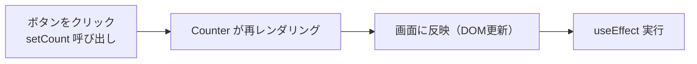

# 第61章：見張りリストなし

✨「画面が変わるたびにやる。あんま使わん」の正体✨

「`useEffect` の見張りリストって、前の章で `[]` と `[state]` やったよね？
じゃあ、**なにも書かないパターン**ってどうなるの？🤔」
というのがこの章のテーマです。

結論から言うと…

> **見張りリストなしの `useEffect` は、ほぼ毎回の再レンダリング後に走る。だから基本は “あまり使わない” 🧯**

でも、「なぜそうなるのか」「どう危ないのか」をちゃんと知っておくと、バグを防ぐ力が一気に上がります ✨

---

## 61-1. まずはおさらい：`useEffect` の3パターン 🧠

ざっくり復習すると、`useEffect` はこんな感じで使ってきました：

1. **見張りリストなし**（この章の主役）

```tsx
useEffect(() => {
  console.log("毎回よばれるよ");
});
```

2. **空の見張りリスト `[]`**（マウント時だけ）

```tsx
useEffect(() => {
  console.log("最初の1回だけ");
}, []);
```

3. **状態付きの見張りリスト `[count]`**（`count` が変わった時だけ）

```tsx
useEffect(() => {
  console.log("count が変わったときだけ");
}, [count]);
```

この中で、
**「見張りリストなし」だけ、特別に“回数が多すぎる”** という性質があります 🌀

---

## 61-2. 見張りリストなし：何が起きているの？🔍

試しに、こんなカウンターを考えてみます。

```tsx
import { useEffect, useState } from "react";

export function Counter() {
  const [count, setCount] = useState(0);

  useEffect(() => {
    console.log("useEffect が動いたよ！ count =", count);
  });

  return (
    <div>
      <p>今のカウント: {count}</p>
      <button onClick={() => setCount((prev) => prev + 1)}>
        +1 する
      </button>
    </div>
  );
}
```

### このコンポーネントで起きる流れ 🧬

ボタンを1回押すと、ざっくりこんな感じになります：



* `setCount` が呼ばれる 👉 **再レンダリング**
* 再レンダリング後 👉 **`useEffect` が実行される**
* 見張りリストがないので
  👉 **「毎回の再レンダリングのあとで、必ず実行」** される

つまり、
「**コンポーネントが表示される最初の1回**」も、
「**ボタンを押して再レンダリングされたとき**」も、
**全部この `useEffect` が走る** というイメージです 🏃‍♀️💨

---

## 61-3. なんで「あんま使わん」の？💣

理由はシンプルで、

> ちょっと書き方を間違えると、**無限ループの沼にハマりやすい** からです 😇

### ❌ よくある危険パターン

```tsx
useEffect(() => {
  // 状態を毎回更新しちゃう
  setCount((prev) => prev + 1);
});
```

これ、どうなるかというと…

1. コンポーネント描画
2. `useEffect` 実行 → `setCount` を呼ぶ
3. `setCount` → 再レンダリング
4. 再レンダリング後、また `useEffect` 実行 → `setCount`
5. 無限ループ 🔁🔁🔁

ブラウザがフリーズしたり、
Vite のコンソールが怒涛のログまみれになったりします…😱

本来やりたかったのは、

* 「最初の1回だけ増やす」とか
* 「特定の値が変わった時だけやる」

みたいなケースが多いので、
そのときは **ちゃんと依存配列を書くべき** なんですね ✍️

### ✅ 正しい書き方の例

**「マウント時に1回だけ、初期値を読み込む」** なら：

```tsx
useEffect(() => {
  setCount(100);
}, []); // ← 空の配列で「最初の1回だけ」
```

**「`userId` が変わったときだけデータを読み込む」** なら：

```tsx
useEffect(() => {
  fetchUser(userId);
}, [userId]); // ← userId が変わったときだけ
```

こうやって *「いつ実行したいのか」* を
**依存配列でちゃんと書くほうが、安全でわかりやすい** んです 💡

---

## 61-4. じゃあ、見張りリストなしはいつ使うの？🤔

正直に言うと…

> **「ほぼ使わなくてOK」** です。

でも、知識として「こういう場面ならありかも」という例も置いておきます。

### 例1：デバッグ用のログ 👀

「レンダリングのたびに何が起きているか見たい」ときだけ、一時的に使うやつ。

```tsx
useEffect(() => {
  console.log("レンダリングされたよ");
  console.log("今の count:", count);
});
```

✅ 特徴

* プロダクション用（本番コード）では消す
* 学習中・調査中の **一時的なツール** くらいのイメージ

### 例2：どうしても「毎回」必要な副作用（かなりレア）

例えば、React のレンダリングに合わせて
「毎回、外部ライブラリにイベントを送る」とか
「毎回、レイアウトの結果をログに飛ばす」とか。

でも、こういうのも

* `useLayoutEffect` の方が向いていたり
* 依存配列をちゃんと書いたり

別の書き方をすることが多いです。

---

## 61-5. 手を動かしてみよう！🧪ミニ練習

### 📝 練習1：ログで挙動を観察する

1. さっきの `Counter` コンポーネントを作る
2. `useEffect` を **見張りリストなし** で書く
3. ボタンを何回か押して、ブラウザの開発者ツールのコンソールを見る

👉 「レンダリングのたびに `useEffect` が動いてる！」
というのを、体感してみてください 👀

---

### 🧨 練習2：あえて無限ループを起こしてみる（※テスト用）

1. 新しいコンポーネントを作る
2. 中で `useState` と `useEffect` を使う
3. `useEffect` の中で `setState` を呼ぶ（依存配列なし）

```tsx
useEffect(() => {
  setCount((prev) => prev + 1);
});
```

👉 多分、ブラウザがぐるぐるしたり、エラーになったりします。
**「あ、こういう書き方はダメなんだな」** って体で覚えるのが目的です 💥

終わったら、このコードはちゃんと消しておきましょうね 🧹

---

### 🛡️ 練習3：依存配列で直してみる

同じ `setCount` を

* 「最初の1回だけ」
* 「`flag` が `true` になったときだけ」

みたいに動かすにはどう書けばいいか、考えてみてください ✨

例：

```tsx
// 最初の1回だけ
useEffect(() => {
  setCount(1);
}, []);

// flag が true に変わったときだけ
useEffect(() => {
  if (flag) {
    setCount(999);
  }
}, [flag]);
```

自分で書けたら、かなり理解できている証拠です 💮

---

## 61-6. まとめ：この章のポイント 🎀

* 見張りリストなしの `useEffect` は
  👉 **毎回の再レンダリング後に実行される**
* `setState` を中で呼ぶと、
  👉 **簡単に無限ループ地獄に落ちる** 🌀
* だから、

  * 本番コードではほぼ使わない
  * 使うとしても「デバッグ用ログ」など一時的な用途が多い
* 普段は
  👉 `[]` や `[state]` など、**依存配列をちゃんと書く** のが基本 🧱

次の章では、`useEffect` の「お片付け」（クリーンアップ）について見ていきます ✂️
タイマーを止めたり、イベントリスナーを外したりする大事な話なので、お楽しみに〜🥰✨
