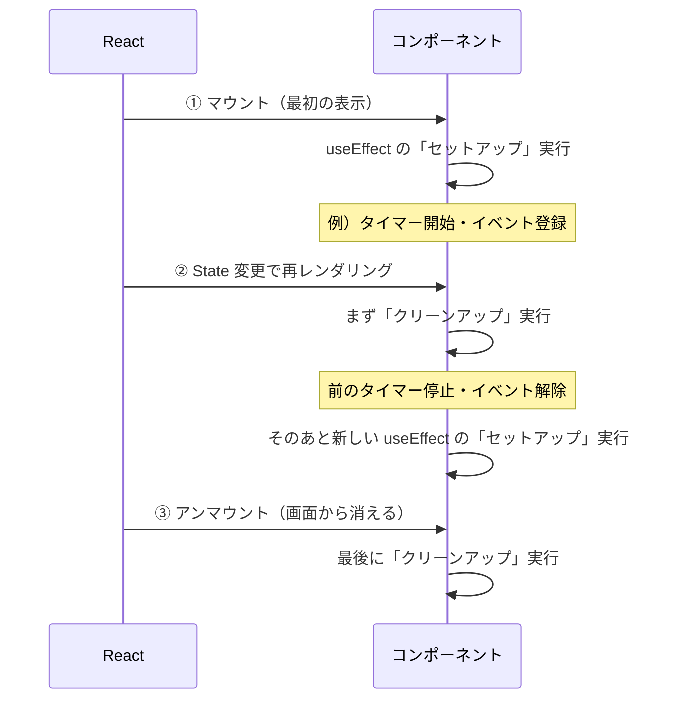

# 第62章：`useEffect` の「お片付け」

---

この章では、
**「`useEffect` で始めたことを、ちゃんと終わらせる」**
という超だいじな考え方＝**クリーンアップ（お片付け）** をやっていきます 💪

---

## 1️⃣ 「お片付け」ってなに？ざっくりイメージ

`useEffect` は、

* ✅ 画面に表示されたあとに
* ✅ 「副作用（通信・タイマー・イベント登録など）」を実行するためのフックでしたね。

でも…

* つけっぱなしのタイマー ⏰
* 登録しっぱなしのイベントリスナー 🧏
* 開きっぱなしの接続 🔌

…を放っておくと、**バグやメモリリークの原因**になります 🫠

そこで登場するのが、
**「クリーンアップ関数（お片付け関数）」** です。

`useEffect` の中で

* 「はじめの処理（セットアップ）」と
* 「最後の処理（お片付け＝クリーンアップ）」

を**セットで書く**のが基本の形です。

---

## 2️⃣ React とクリーンアップの流れを図で見てみよう 🧠

`useEffect` とクリーンアップがいつ動くのか、
ざっくりの流れを Mermaid で図解してみます ✏️



ポイントはこの2つ ✨

1. **再レンダリングのたびに**
   → 先に「前回のクリーンアップ」、その後に「新しいセットアップ」
2. **コンポーネントが画面から消えるとき**
   → 最後のクリーンアップが呼ばれる

---

## 3️⃣ クリーンアップ関数の書き方の基本形 ✍️

`useEffect` の中で、**関数を `return` する**と
それが「お片付け関数（クリーンアップ）」になります。

### 🔹 一番シンプルな形

```tsx
import { useEffect } from "react";

function Example() {
  useEffect(() => {
    console.log("👀 Effect: はじめてのセットアップ");

    // ここで何か「始める」処理を書く

    // 👇 これが「お片付け」用の関数
    return () => {
      console.log("🧹 Cleanup: お片付け実行！");
      // ここで「終わらせる」処理を書く
    };
  }, []);

  return <p>コンソールを確認してみてね 🖥️</p>;
}

export default Example;
```

* `useEffect(() => { ... }, [])` の

  * `...` の中で → **始める処理**
  * `return () => { ... }` の中で → **片付ける処理**

というペアになっています 💡

---

## 4️⃣ どんなときにクリーンアップが必要？🧩

React の公式ドキュメントでも、
**「外の世界」とつながる処理はクリーンアップが必要だよ〜**
と説明されています。([react.dev][1])

よくある例はこんな感じ👇

* ⏰ **タイマー系**

  * `setInterval`, `setTimeout`
  * → `clearInterval`, `clearTimeout` で止める

* 🧏 **イベントリスナー**

  * `window.addEventListener("resize", ...)`
  * → `window.removeEventListener("resize", ...)` で解除

* 📡 **WebSocket / サーバーとの接続**

  * `socket.connect()`
  * → `socket.close()` で切断

* 🌐 **AbortController などでキャンセル可能な通信**

  * `fetch(..., { signal })`
  * → クリーンアップで `controller.abort()` を呼ぶ

> **覚え方✨**
> 「なにか**登録した / 開いた / 始めた**なら、
> `useEffect` の中で **必ずクリーンアップもセットで書く**」

---

## 5️⃣ 依存配列とクリーンアップの関係 🔁

第58〜61章でやった「見張りリスト（依存配列）」と、
クリーンアップの動きの組み合わせを整理してみましょ 🧮

### 🟣 パターン1：`[]`（空配列）の場合

```tsx
useEffect(() => {
  console.log("セットアップ！");
  return () => {
    console.log("お片付け！");
  };
}, []);
```

* `セットアップ！`

  * 👉 **最初の1回だけ**（マウント直後）
* `お片付け！`

  * 👉 **アンマウント時に1回だけ**

→ つまり、「**一度だけ始めて、一度だけ終わらせる**」タイプの処理に向いてます。

---

### 🟢 パターン2：`[count]` みたいに依存がある場合

```tsx
useEffect(() => {
  console.log("セットアップ: count =", count);

  return () => {
    console.log("お片付け: count =", count);
  };
}, [count]);
```

この場合は…

* 初回マウント時：

  * セットアップ（`count` の初期値）
* `count` が変わるたび：

  * 👉 まず **前回のクリーンアップ**
  * 👉 そのあと **新しいセットアップ**
* アンマウント時：

  * 最後にクリーンアップが1回

---

### 🔴 パターン3：依存配列なし（非推奨気味）

```tsx
useEffect(() => {
  console.log("毎回セットアップ");
  return () => {
    console.log("毎回お片付け");
  };
});
```

* **すべてのレンダリングのあと**にセットアップ
* そのたびに、前回分のお片付け

かなり頻繁に動いてしまうので、
「どうしても全部のレンダリングで必要！」なとき以外は
**あまり使わない方がよき**です 🥲

---

## 6️⃣ 実例①：`window` のイベントリスナーを片付ける 🧏‍♀️

よくあるのが「画面サイズが変わったらなにかする」やつです。

### ✨ やりたいこと

* 画面サイズが変わるたびに `console.log` したい
* でも、コンポーネントが消えたら
  → `resize` のリスナーは**ちゃんと解除したい**

### 🧪 コンポーネント例

```tsx
import { useEffect } from "react";

function ResizeWatcher() {
  useEffect(() => {
    const handleResize = () => {
      console.log("📏 window width:", window.innerWidth);
    };

    console.log("🛠️ resize リスナー登録！");
    window.addEventListener("resize", handleResize);

    // 🧹 お片付け（クリーンアップ）
    return () => {
      console.log("🧽 resize リスナー解除！");
      window.removeEventListener("resize", handleResize);
    };
  }, []); // ← 最初に1回だけ登録して、最後に解除

  return (
    <div>
      <h2>Resize Watcher 👀</h2>
      <p>画面サイズを変えて、コンソールを見てみてね！</p>
    </div>
  );
}

export default ResizeWatcher;
```

**ポイント💡**

* `handleResize` 関数を **同じもの** で登録・解除したいので、

  * `useEffect` の中で **1回定義して、そのまま使う**
* `addEventListener` と `removeEventListener` は **必ずペア**

---

## 7️⃣ 実例②：タイマーを開始して、ちゃんと止める ⏰（軽い予習）

第64章でガッツリやりますが、
ここでも**「お片付け」の形だけ」**見ておきましょ 👀

### ⏰ 秒ごとにカウントアップするコンポーネント

```tsx
import { useEffect, useState } from "react";

function SimpleTimer() {
  const [count, setCount] = useState(0);

  useEffect(() => {
    console.log("⏱️ タイマー開始！");
    const id: number = window.setInterval(() => {
      setCount((prev) => prev + 1);
    }, 1000);

    // 🧹 お片付け：タイマーを止める
    return () => {
      console.log("🛑 タイマー停止！");
      window.clearInterval(id);
    };
  }, []); // タイマーは1回だけ作る

  return (
    <div>
      <h2>Simple Timer ⏰</h2>
      <p>{count} 秒 経過中…</p>
    </div>
  );
}

export default SimpleTimer;
```

TypeScript 的ポイント ✨

* ブラウザでは `setInterval` の返り値の型はだいたい `number`
* なので `const id: number = window.setInterval(...);` としておくと安心

---

## 8️⃣ 「開発モードだと2回動いてるっぽい？」問題 🤯

React 18 以降（そして 19 でも継続予定）では、
`<StrictMode>` が有効だと **開発モードだけ**、

* `useEffect` の「セットアップ」
* `useEffect` の「クリーンアップ」

が **もう一周（テスト用に）余分に実行** されます。([react.dev][1])

> これは「クリーンアップがちゃんと書けてるか？」を
> テストするための**安全確認モード**です 🧪

### 🧷 覚えておきたいこと

* 本番ビルド（`npm run build` → デプロイしたもの）では
  👉 **1回だけ** 正しく動く
* 開発中に

  * 「あれ？`console.log` が2回出てる…」
    と思ったら → `StrictMode` のせいかも、と思い出す
* 正しいクリーンアップを書いていれば
  👉 2回動いても挙動はおかしくならないように設計できる

---

## 9️⃣ よくあるミス & チェックリスト ✅

### 😵‍💫 ミス1：クリーンアップを忘れる

```tsx
useEffect(() => {
  window.addEventListener("scroll", handleScroll);
}, []); // ← return 書いてない！
```

→ コンポーネントが消えたあともイベントが残ってしまい、
別の画面で `handleScroll` が動き続けちゃう…みたいなバグに 🥲

---

### 😵‍💫 ミス2：違う関数を `removeEventListener` に渡す

```tsx
useEffect(() => {
  window.addEventListener("resize", () => {
    console.log("resize!");
  });

  return () => {
    window.removeEventListener("resize", () => {
      console.log("resize!");
    });
  };
}, []);
```

→ 見た目は同じだけど、
**「別の無名関数」** として扱われるので解除されません 🚫

✅ 対策：必ず**同じ変数**を使う！

```tsx
useEffect(() => {
  const handleResize = () => {
    console.log("resize!");
  };

  window.addEventListener("resize", handleResize);

  return () => {
    window.removeEventListener("resize", handleResize);
  };
}, []);
```

---

### 😵‍💫 ミス3：依存配列を忘れて、何度も登録される

```tsx
useEffect(() => {
  window.addEventListener("scroll", handleScroll);

  return () => {
    window.removeEventListener("scroll", handleScroll);
  };
}); // ← 依存配列なし
```

→ レンダリングのたびに
「登録 → 解除 → 登録 → 解除…」を繰り返すことに。

✅ 本当に毎回必要か考えて、
「最初の1回だけでいいなら」`[]` を付ける ✨

---

## 🔚 まとめ：この章で覚えてほしいこと ✨

* `useEffect` の「お片付け」は
  → **`return () => { ... }` で書くクリーンアップ関数** 🧹
* **始めたら、必ず片付ける**

  * タイマー → `clearInterval / clearTimeout`
  * イベントリスナー → `removeEventListener`
  * 接続 → `close` や `abort` など
* 依存配列との組み合わせで

  * `[]` → マウント時にセットアップ、アンマウント時に1回だけクリーンアップ
  * `[state]` → その値が変わるたびに「前回お片付けして、また始める」
* StrictMode の開発モードでは

  * **セットアップ＋クリーンアップがテスト用に余分に1周する**
    → クリーンアップをちゃんと書くほど安全になる 💪

---

## 🎓 ミニ課題（やってみよ〜）

1. `ResizeWatcher` コンポーネントに
   **現在のウィンドウ幅を State に保存して画面にも表示**してみる。
2. `SimpleTimer` をちょっと改造して、

   * ボタンで「スタート / ストップ」を切り替えられるようにしてみる。
   * タイマーを止めるのも `useEffect` のクリーンアップでやってみる。

どちらも、
**「始める処理」と「片付ける処理」がセットになっているか？** を
意識しながら書いてみてください ✨

次の章では、実際に
**ページタイトルを変えたり ⏱️ タイマーを作ったり**しながら、
`useEffect` をもっと手になじませていきます 💖

[1]: https://react.dev/reference/react/useEffect?utm_source=chatgpt.com "useEffect"
