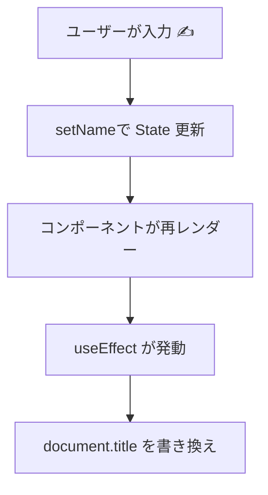

# 第63章：練習：`useEffect` でページのタイトルを変える

この章では、`useEffect` の**超定番の使いどころ**として
「ブラウザのタブに出る **ページタイトル（`document.title`）を React から操作する」
というミニアプリを作ってみます 🍀

> React v19 ではデータ取得には `use()` など新しいやり方もありますが、
> 「ブラウザAPIや外部ライブラリと同期する」場面では、今でも `useEffect` が主役です。([React][1])

---

## 1️⃣ どんなアプリを作るの？

ゴールはこんな感じです 💡

* 画面に **テキスト入力** が1つある
* 入力した内容に合わせて
  → ブラウザのタブに表示される **タイトル** が変わる
* 何も入力していないときは
  → 「ようこそ React 練習 ✨」みたいなデフォルトタイトル

イメージとしては：

* 入力欄に `さくら` と打つと
  → タブのタイトルが `さくら さんのページ` に変わる 🌸
* 消して空にすると
  → `ようこそ React 練習` に戻る

---

## 2️⃣ `useEffect` とページタイトルの関係を図で見る 🌈

`useEffect` がいつ動いて、どうやってタイトルを変えているのか、
流れを Mermaid の図で見てみましょう 🧠



ポイントはこの4ステップです 👇

1. 入力欄の文字が変わる（イベント発生）
2. `setName(...)` で **state が変わる**
3. state が変わると **コンポーネントが再レンダー**
4. そのあとで `useEffect` が走って、`document.title` を更新する

---

## 3️⃣ 新しいコンポーネントを作ろう 🧩

プロジェクトの `src` フォルダに
**`PageTitleExample.tsx`** というファイルを作って、次のコードを書いてみましょう ✍️

> すでに Vite + React + TS の環境がある前提でいきます。

```tsx
// src/PageTitleExample.tsx
import { useEffect, useState, type ChangeEvent } from "react";

export function PageTitleExample() {
  // 入力された名前を state に持つ
  const [name, setName] = useState("");

  // 入力が変わったときにページタイトルも変える
  useEffect(() => {
    const previousTitle = document.title; // 元のタイトルを覚えておく（お片付け用）

    if (name === "") {
      document.title = "ようこそ React 練習 ✨";
    } else {
      document.title = `${name} さんのページ`;
    }

    // 第62章でやった「お片付け」版
    // このコンポーネントが画面から消えるときにタイトルを元に戻す
    return () => {
      document.title = previousTitle;
    };
  }, [name]); // ← name が変わるたびにこの useEffect が動く

  // 入力イベントの型付きハンドラ
  const handleChange = (e: ChangeEvent<HTMLInputElement>) => {
    setName(e.target.value);
  };

  return (
    <div style={{ padding: "1.5rem" }}>
      <h1>useEffect でページタイトルを変えてみよう 🧪</h1>
      <p>下の入力欄に名前を入れてみてね ✨</p>

      <input
        type="text"
        value={name}
        onChange={handleChange}
        placeholder="あなたの名前を入力…"
        style={{ padding: "0.5rem", fontSize: "1rem", width: "250px" }}
      />

      <p style={{ marginTop: "1rem" }}>
        いまのタイトル候補：{" "}
        {name === "" ? "ようこそ React 練習 ✨" : `${name} さんのページ`}
      </p>
    </div>
  );
}
```

---

## 4️⃣ `App.tsx` に組み込む 🌟

つぎに、`App.tsx` からこのコンポーネントを表示してみましょう。

```tsx
// src/App.tsx
import { PageTitleExample } from "./PageTitleExample";

function App() {
  return (
    <div>
      <PageTitleExample />
    </div>
  );
}

export default App;
```

あとはターミナルで：

```bash
npm run dev
```

ブラウザで `http://localhost:5173/` を開いて、
**タブのタイトル** をよ〜く見ながら、入力欄に文字を入れてみてください 👀✨

---

## 5️⃣ コードの中身をゆっくり分解してみる 🔍

### 🧊 `useState` で名前を持っているところ

```tsx
const [name, setName] = useState("");
```

* `name`：いま入力欄に入っている文字列
* `setName`：`name` を更新する関数
* 初期値は空文字 `""`

---

### 🔁 `useEffect` の中身

```tsx
useEffect(() => {
  const previousTitle = document.title;

  if (name === "") {
    document.title = "ようこそ React 練習 ✨";
  } else {
    document.title = `${name} さんのページ`;
  }

  return () => {
    document.title = previousTitle;
  };
}, [name]);
```

ここがこの章の主役です 🌟

* `useEffect(() => { ... }, [name]);`

  * **`name` が変わるたびに** 中の関数が呼ばれる
* `document.title = ...`

  * ブラウザタブに表示される文字を変えるブラウザAPI
* `const previousTitle = document.title;`

  * Effect が走る「前」のタイトルをとっておく
* `return () => { ... }`

  * **お片付け関数（クリーンアップ）**
  * コンポーネントが画面から消えるときに、一度だけ呼ばれる
  * ここではタイトルを元に戻してあげている

> 第62章でやった「クリーンアップ関数」の復習になってます ✅

---

### ✍️ 入力イベントの型付きハンドラ

```tsx
const handleChange = (e: ChangeEvent<HTMLInputElement>) => {
  setName(e.target.value);
};
```

* `ChangeEvent<HTMLInputElement>` は

  * 「これは `<input>` で起きた `change` イベントですよ〜」という型
* `e.target.value`

  * 入力欄にいま入っている文字
* それを `setName` に渡して state を更新

TypeScript でちゃんと型を付けておくと：

* `e.` と打ったときに VS Code がサジェストを出してくれる 👍
* `e.target.xxx` を間違えたときにすぐ赤線で怒ってくれる 😈

---

## 6️⃣ 「依存配列 `[name]`」の復習 🧠

`useEffect` の第2引数にあるこれ：

```tsx
}, [name]);
```

これが **「見張りリスト」** でしたね（第58〜60章でやったところ）。

* `[name]`

  * `name` が変わったときだけ Effect を実行
* `[]`

  * 最初の1回だけ（この章では使っていない）
* 何も書かない（`useEffect(() => {...})`）

  * すべてのレンダー後に毎回実行（あまり使わない）

ここでは
「**名前が変わったときだけタイトルも変えたい**」ので `[name]` がピッタリです ✅

---

## 7️⃣ 動作チェックリスト ✅

実際にブラウザで試して、次のことを確認してみてください 👀

1. 何も入力してないとき
   → タイトルは `ようこそ React 練習 ✨` になっている
2. 入力欄に `あやか` と入れる
   → タイトルが `あやか さんのページ` に変わる
3. 名前を別のものに変える
   → そのたびにタイトルも更新される
4. ページをリロードする
   → もう一度最初から動作する（state がリセットされる）

**＋おまけで実験 🧪**

* `useEffect` の中身をコメントアウトしてみる

  * → タイトルが変わらなくなるのを確認
* `document.title` の代わりに `console.log("effect!")` を入れてみる

  * → 入力するたびにコンソールに出るのを確認（Effect が動いている証拠）

---

## 8️⃣ さらにレベルアップしてみるチャレンジ課題 💪✨

余裕があったら、次のようなアレンジにも挑戦してみてください 🔥

### 🎯 チャレンジ1：文字数をタイトルに入れる

* 入力された文字数を数えて
* タイトルを
  → `名前入力中（3文字）`
  みたいにしてみる

ヒント：

* `name.length` を使う
* `name === ""` のときは別メッセージにする など

---

### 🎯 チャレンジ2：TODO の残り件数をタイトルに

もし前の章で作った TODO リストがあるなら…

* TODO の配列 `todos` があったとする
* 残り件数 `todos.length` をタイトルに入れて

  * `TODO残り 3件 🔥` みたいなタイトルにしてみる

---

### 🎯 チャレンジ3：時間帯に合わせたタイトル

* 朝：`おはよう 🌅 React タイム`
* 昼：`こんにちは 🌞 React タイム`
* 夜：`こんばんは 🌙 React タイム`

みたいに、`new Date().getHours()` を使って
時間帯でタイトルを変えてみましょう ⏰

---

## 9️⃣ この章で覚えてほしいこと 📌

* `useEffect` は「画面表示のあとにやる裏仕事」を書く場所
* React v19 でも、**ブラウザAPI（`document.title` など）との同期** にはバリバリ使う
* 依存配列 `[name]` で「いつ動くか」をコントロールできる
* クリーンアップ関数 `return () => { ... }` で「お片付け」も書ける

ここまでできたら、
`useEffect` で**ページタイトルを操れる React 魔法使い🧙‍♀️** になりました ✨

次の章では、`setInterval` を使ったタイマーと、その「お片付け」を扱っていきましょう ⏰💨

[1]: https://react.dev/reference/react/useEffect?utm_source=chatgpt.com "useEffect"
