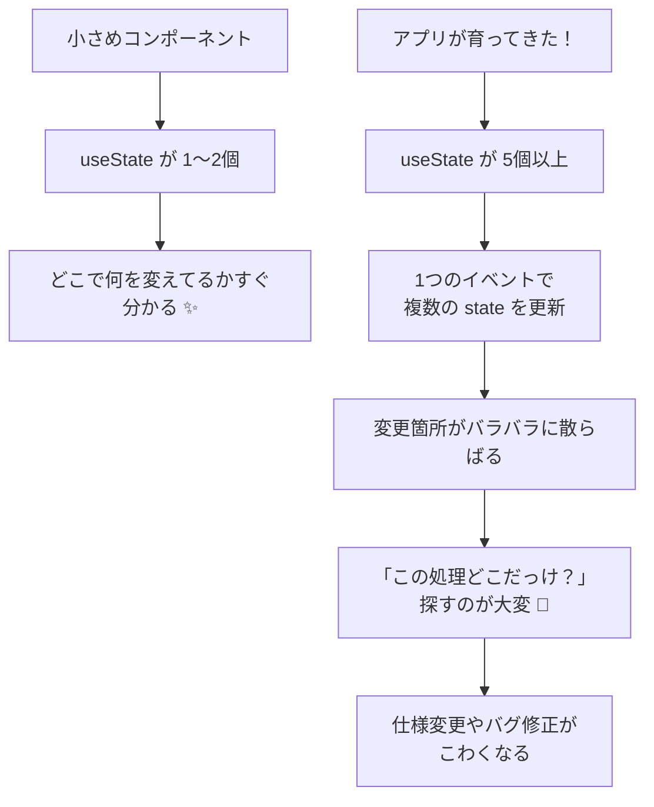

# 第66章：`useState` だけじゃ大変になるとき

「`useState` って便利だしこれだけで全部いけるんじゃ？✨」
──と思いきや、アプリがちょっと大きくなると
「え？これどこで変えてるの？？🥲」ってなる場面が出てきます。

この章では、

* どんなときに `useState` だけだと厳しくなるのか
* そのとき、コードの中で何が起きているのか
* 「あ、これはそろそろ別のやり方使ったほうがいいな」のサイン

をゆるっと理解するのがゴールです 🚩

---

### 1. 今日のゴール 🎯

この章が終わるころには……

* ✅ `useState` がピッタリなケースと、つらくなるケースのイメージがつく
* ✅ 「状態が増えてきたら危険信号かも…」と気づけるようになる
* ✅ 次の章の `useReducer` が「なんで必要なのか」がスッと入るようになる

「書き方」よりも「考え方」をメインで行きます 🧃✨

---

### 2. `useState` がキラキラ活躍する場面 ✨

まずはおさらい。
`useState` は「**シンプルな状態**」を持ちたいときにめちゃくちゃ便利でしたよね。

たとえば、よくあるカウンター：

```tsx
import { useState } from "react";

export function Counter() {
  const [count, setCount] = useState(0);

  function handleClick() {
    setCount(prev => prev + 1);
  }

  return (
    <div>
      <p>カウント: {count}</p>
      <button onClick={handleClick}>+1</button>
    </div>
  );
}
```

* 状態は `count` ひとつだけ
* 更新のタイミングも「ボタンを押したとき」だけ
* どこで何が起きているか、すぐ読める 👀

こういう小さい部品なら、`useState` だけで十分かわいくまとまります 🐣

---

### 3. ちょっと実用的になると…状態がドカドカ増える 😇→😱

じゃあ、もう少し現実っぽい「TODOアプリ」を考えてみます。

* TODOのリスト（配列）
* 入力中のテキスト
* 表示のフィルター（全部 / 完了 / 未完了）
* 読み込み中フラグ
* エラーメッセージ

などなど、持ちたい状態が一気に増えます。

とりあえず `useState` だけで書くと、こんな雰囲気になります：

```tsx
import { useState } from "react";

type Todo = {
  id: number;
  title: string;
  done: boolean;
};

export function TodoApp() {
  const [todos, setTodos] = useState<Todo[]>([]);
  const [input, setInput] = useState("");
  const [filter, setFilter] =
    useState<"all" | "done" | "undone">("all");
  const [loading, setLoading] = useState(false);
  const [error, setError] = useState<string | null>(null);

  function handleAdd() {
    if (!input.trim()) return;
    const newTodo: Todo = {
      id: Date.now(),
      title: input.trim(),
      done: false,
    };
    setTodos(prev => [...prev, newTodo]);
    setInput("");
  }

  function handleToggle(id: number) {
    setTodos(prev =>
      prev.map(todo =>
        todo.id === id
          ? { ...todo, done: !todo.done }
          : todo
      )
    );
  }

  function handleDelete(id: number) {
    setTodos(prev => prev.filter(todo => todo.id !== id));
  }

  async function handleFetchFromServer() {
    try {
      setLoading(true);
      setError(null);
      // 本当はここで fetch するイメージ
      await new Promise(resolve => setTimeout(resolve, 500));
      // 仮データ
      setTodos([
        { id: 1, title: "レポートを書く", done: false },
        { id: 2, title: "友だちとご飯", done: true },
      ]);
    } catch (e) {
      setError("読み込みに失敗しちゃいました…🥲");
    } finally {
      setLoading(false);
    }
  }

  // フィルタリング処理
  const visibleTodos = todos.filter(todo => {
    if (filter === "done") return todo.done;
    if (filter === "undone") return !todo.done;
    return true;
  });

  // JSX はいったん省略…
  return (
    <div>
      {/* 入力欄やボタン、TODOリストの表示… */}
    </div>
  );
}
```

一見「まあまあ普通のコードかな？」って感じですが、
落ち着いて眺めてみると、こんなことが起きています 👇

* `todos` / `input` / `filter` / `loading` / `error` …
  → **状態がバラバラに並んでいる**
* `handleFetchFromServer` の中で

  * `loading` を `true` にする
  * `error` を `null` にする
  * `todos` を新しくセットする
  * 最後に `loading` を `false` にする
    → **ひとつの操作で、いろんな状態をあちこちでいじっている**

今はまだ読めますが、機能を足していくと……

* 「サーバーからの読み込み結果をマージする処理を足したい」
* 「削除したときもエラーメッセージをリセットしたい」
* 「ローディング中はボタンを無効にしたい」

など「この操作のときにどの状態を変えるんだっけ？」が
どんどんカオスになっていきます 😵‍💫

---

### 4. 状態が増えるとどう見えちゃう？を図でイメージ 🧩

状態が増えるときの「つらみ」を、ざっくり図にしてみます。



`useState` は小さいコンポーネントだとめちゃくちゃ使いやすいんですが、
**「たくさんの状態が1つの画面にギュッと集まっている」**
という状況になると、だんだんしんどくなってくる、というイメージです。

---

### 5. 「そろそろ `useState` だけはキツいかも？」チェックリスト ⚠️

こんなサインが見えたら、「別のやり方を検討しようかな？」と
頭の片隅に置いておくと◎です 🧠💡

1. **`useState` が 4〜5 個を超えてきた**

   * `const [xxx, setXxx] = useState(...);` がズラッと並んでいて、
     スクロールしないと全部見えない…

2. **1つのイベントで、複数の state をよく変えている**

   * `handleSubmit` の中で `loading`・`error`・`formValue` を
     まとめて何度も更新している、など

3. **「この状態が変わるときは、必ずあの状態も変える」みたいなセットがある**

   * たとえば:

     * 新しくアイテムを追加 → `input` を空文字に戻す ＋ `error` を消す
     * サーバーエラー → `error` をセット ＋ `loading` を `false` に戻す

4. **状態の「パターン」がはっきりしてきた**

   * 例：フォームの状態がだいたいこの3パターンになる

     * 「入力中」
     * 「送信中」
     * 「成功 or 失敗」
   * でもコード上は、`isSubmitting` や `error` フラグなどにバラバラに分解されている

5. **バグが「状態の矛盾」として出てくる**

   * ローディング中なのにボタンが押せちゃう
   * エラー表示が消えない
   * 状態を戻したつもりが、一部のフラグだけ戻ってない

こういうときは、

> 「状態をバラバラに持つんじゃなくて、
> **『ルール』でまとめて管理したいな…🤔**」

となってきます。

---

### 6. じゃあどうするの？ 👉 「状態を変えるルール」を1か所に集める発想 🧾

ここで登場するのが、次の章から学ぶ **`useReducer`** です 🎉

`useReducer` の一番大事な考え方はざっくりいうと：

> 「**状態そのもの** と
> **それをどう変えるかの“ルール”** を
> 1か所にまとめておこう！」

という発想です。

`useState` のときは、

* `setTodos(...)`
* `setLoading(...)`
* `setError(...)`

みたいに、**「どの状態をどう変えるか」をイベントの中で直接書いていました**。

`useReducer` を使うと、こんな感じのイメージになります（ざっくり）👇

```ts
type State = {
  todos: Todo[];
  loading: boolean;
  error: string | null;
};

type Action =
  | { type: "fetch/start" }
  | { type: "fetch/success"; payload: Todo[] }
  | { type: "fetch/error"; payload: string };

function reducer(state: State, action: Action): State {
  switch (action.type) {
    case "fetch/start":
      return {
        ...state,
        loading: true,
        error: null,
      };
    case "fetch/success":
      return {
        ...state,
        loading: false,
        todos: action.payload,
      };
    case "fetch/error":
      return {
        ...state,
        loading: false,
        error: action.payload,
      };
    default:
      return state;
  }
}
```

ここでは「書き方を覚える」というより、

* `State`（状態のかたまり）
* `Action`（「こうしてね」という指示書）
* `reducer`（「指示書にしたがって State をどう変えるか」を決める場所）

という3つの役割があるんだな〜くらいをふんわり掴んでおけばOKです 🥰

具体的に `useReducer` をどう使うかは、**次の第67章でじっくりやります！**

---

### 7. 今日のまとめ 📝 ＆ ミニ練習チャレンジ 💪

#### ✅ まとめ

* `useState` はシンプルな状態には最高だけど、
  **状態が増えてくると「どこで何を変えているのか」追いかけるのが大変になる** 💦
* 特に

  * `useState` がいっぱい
  * 1つのイベントで、いろんな状態を同時にいじる
  * 「こういうときは必ずこの3つの状態をセットで変える」
    みたいなルールが増えてきたときは、要注意 ⚠️
* そういうときは、

  * 「状態」と「変え方のルール」をひとまとめにできる
    **`useReducer`** が活躍してくれる 🦸‍♀️

#### ✍️ ミニ練習

1. これまで自分で作ったコンポーネント（カウンターでもOK）を思い出して、

   * `useState` がいくつあるか数えてみる
   * 「全部まとめて 1つのオブジェクトにしてもよさそう？」と考えてみる

2. 頭の中で、こんなコンポーネントを想像してみてください：

   * 「買い物かご」画面

     * 商品リスト
     * 合計金額
     * 割引クーポン
     * ローディング中フラグ
     * エラーメッセージ
       → これを `useState` だけで作ろうとしたら、
       どんな状態を持ちそう？ ノートに書き出してみるのもおすすめです 📝

「うわ、けっこうゴチャゴチャしそう…」と思えたら、
**`useReducer` を使う準備ができたサイン** です ✨

次の第67章では、いよいよ `useReducer` の実際の使い方を
コード付きでじっくり見ていきます。お楽しみに〜 🎉🎉
