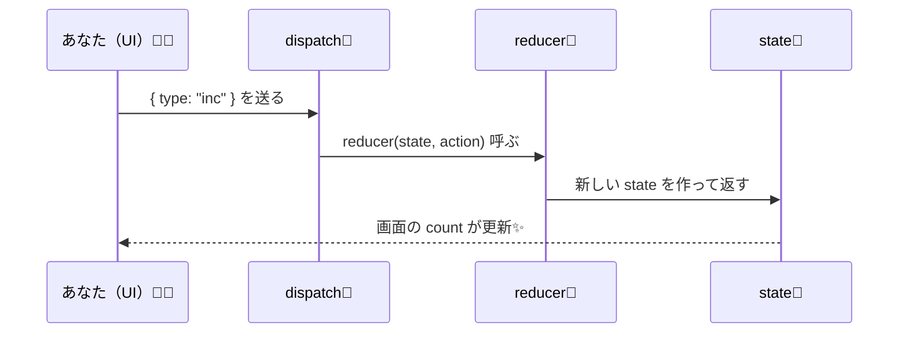

# 第67章：【フック】`useReducer` の基本（「指示書」で状況を変える仕組み）🧠✨

## この章でわかること💡

* `useReducer` が「何のためにあるのか」✅
* `state / action / reducer / dispatch` の関係✅
* いちばん小さい実用例（カウンター）を作れる✅

---

## 1) `useReducer` ってなに？🤔

一言でいうと…

**「状態（state）を、ルール（reducer）に沿って、指示（action）で更新する仕組み」**だよ〜📝✨

`useState` は「直接 set する」感じだけど、`useReducer` は…

* ✅ **指示書（action）を投げる**
* ✅ **更新ルール（reducer）が判断する**
* ✅ **新しい state を返す**

っていう流れになるよ🧸💕

---

## 2) 登場人物はこの4人！🧑‍🤝‍🧑

* **state**：今の状態（例：カウントの数字）🔢
* **action**：やりたいことの指示（例：増やす・減らす）📩
* **reducer**：更新ルール（「この指示ならこう変える」）📜
* **dispatch**：action を reducer に届ける係📮

---

## 3) どんな流れで動くの？（図解）🗺️

```mermaid
flowchart LR
  UI[ボタン押す🖱️] --> D[dispatch(action)📮]
  D --> R[reducer(state, action)📜]
  R --> NS[新しい state を返す✨]
  NS --> UI2[画面が更新される🪄]
```

「UIは“指示を出すだけ”」で、**判断は reducer が担当**って感じだね😺👍

---

## 4) まずは最小のサンプル：`useReducer` カウンター🎮✨

### ✅ `App.tsx` をこれにしてみよう

```tsx
import { useReducer } from "react";

type State = { count: number };

type Action =
  | { type: "inc" }
  | { type: "dec" }
  | { type: "reset" };

const initialState: State = { count: 0 };

function reducer(state: State, action: Action): State {
  switch (action.type) {
    case "inc":
      return { count: state.count + 1 };
    case "dec":
      return { count: state.count - 1 };
    case "reset":
      return { count: 0 };
    default:
      // ここには基本来ない（Actionの型で守られてる）けど保険🛡️
      return state;
  }
}

export default function App() {
  const [state, dispatch] = useReducer(reducer, initialState);

  return (
    <div style={{ padding: 24, fontFamily: "system-ui" }}>
      <h1>useReducer カウンター✨</h1>

      <p style={{ fontSize: 24 }}>
        count: <b>{state.count}</b> 🔢
      </p>

      <div style={{ display: "flex", gap: 8 }}>
        <button onClick={() => dispatch({ type: "dec" })}>-1 👇</button>
        <button onClick={() => dispatch({ type: "inc" })}>+1 👆</button>
        <button onClick={() => dispatch({ type: "reset" })}>リセット 🔄</button>
      </div>
    </div>
  );
}
```

### ✅ ポイント解説（ここ超大事）💖

* `useReducer(reducer, initialState)` の戻り値は **`[state, dispatch]`** 🎁
* ボタンは `dispatch({ type: "inc" })` みたいに **指示を投げるだけ**📮
* `reducer` が「じゃあこう更新ね！」って **新しい state を返す**🪄
* **state を直接書き換えない**（`state.count++` みたいなのはNG）🙅‍♀️

---

## 5) “指示書”ってこういうこと！（イメージ図）📦



---

## 6) いつ `useReducer` を使うの？🧭

`useState` でもいけるけど、こういう時に `useReducer` が強いよ💪✨

* ✅ 状態が増えてきて更新がゴチャつく😵‍💫
* ✅ 更新のパターンが多い（追加/削除/編集/リセット…）📚
* ✅ 「更新ルールを1か所に集めたい」🧹

---

## 7) ミニ練習問題（その場で強くなる）🏋️‍♀️✨

### 練習①：「+10」ボタンを追加してみよう➕🔟

ヒント：Action に `{ type: "inc10" }` を足して、reducer に case を追加💡

### 練習②：「0より下に行かない」ルールを入れよう🛑

ヒント：`dec` のところで `Math.max(0, state.count - 1)` を使うと楽ちん😺

---

## 8) よくあるミス集（先に潰す🧨→✅）

* ❌ reducer の中で `state.count++` しちゃう

  * ✅ **必ず新しいオブジェクトを返す**（`return { count: ... }`）
* ❌ reducer の中で `alert()` とか通信とか「別の仕事」をする

  * ✅ reducer は基本 **計算だけの“純粋関数”**にする（落ち着いてる子）🧘‍♀️

---

## まとめ🎀

* `useReducer` は **「指示（action）→ ルール（reducer）→ 新しい状態（state）」** の流れ✨
* UIは dispatch するだけでスッキリするよ🧼💕
* 次の章（第68章）で **State型とAction型をもっとガッチリ**やって、さらに強くなるよ🔥😊
