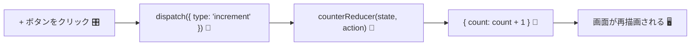

# 第68章：`useReducer`のキモ！

**Stateの型とActionの型をガッチリ定義しよう 🎯**

---

この章では、`useReducer` を「なんとなく使える」から
**「型までちゃんと守れててドヤ顔できるレベル」**に引き上げます 💪✨

ポイントはこの2つだけです：

1. **State の型**をハッキリ決める
2. **Action の型**をハッキリ決める（＝「どんな指示が飛んでくるか」を全部書き出す）

React v19 では `useReducer` の型推論もかなり賢くなっていて、
**「reducer 関数＋初期値」からいい感じに型を推論してくれます。**
なので、ジェネリクスをゴリゴリ書くよりも、
**State と Action の型をちゃんと定義して、reducer の引数に型を付ける**のが今どきのおすすめスタイルです。([k8o][1])

---

## 1️⃣ ミニ例：カウンターを題材にするよ 🧮

この章では、次のようなシンプルなカウンターを例にします：

* 「＋」ボタンでカウントアップ
* 「－」ボタンでカウントダウン
* 「リセット」ボタンで `0` に戻す

UIは次の章でじっくり作り直すとして、
ここでは**型と reducer の書き方**に集中します 👀

---

## 2️⃣ State の型を決める 🧾

まずは「このカウンターアプリの状態ってなに？」を言葉で整理します。

> 「いまのカウントの数字（`count`）だけあれば十分だよね？」

なので State はこんな形でOKです：

```ts
// CounterState: アプリが覚えておきたい「状況」
type CounterState = {
  count: number;
};
```

これで、

* `state.count` は必ず `number`
* `count` 以外の謎プロパティは登場しない

という**安心できる土台**ができます 😊

---

## 3️⃣ Action の型を決める ✉️

次に、「どんな指示で state を変えるのか？」をぜんぶ列挙します。

今回のカウンターだと：

* カウントアップ → `"increment"`
* カウントダウン → `"decrement"`
* リセット（0 に戻す） → `"reset"`

みたいな「指示書（Action）」をイメージできます 📮

これを TypeScript の**ユニオン型**で表現するとこうなります：

```ts
// CounterAction: 「どんな指示が飛んでくるか」の一覧
type CounterAction =
  | { type: 'increment' }
  | { type: 'decrement' }
  | { type: 'reset'; payload: number };
```

ポイント ✨

* `type` プロパティの文字列で「どの指示か」を見分ける
* 必要に応じて**追加情報**を `payload` などの名前でくっつける

  * ここでは「どの値にリセットするか」を `payload` で受け取る例にしてます

たとえば、こんな Action が有効です：

```ts
{ type: 'increment' }
{ type: 'decrement' }
{ type: 'reset', payload: 0 }
{ type: 'reset', payload: 10 }
```

逆に、こういうのは **全部エラーにできる** のが型定義のうれしいところ 🥰

* `{ type: 'incremnt' }` ← スペルミス ❌
* `{ type: 'reset' }` ← `payload` が足りない ❌
* `{ type: 'reset', payload: '0' }` ← `payload` が文字列 ❌

---

## 4️⃣ reducer 関数に State と Action の型をつける 🧠

`useReducer` の中心人物が **reducer 関数** でしたね。

> 「古い state」と「action（指示）」を渡したら、
> 「新しい state」が返ってくる関数

これを TypeScript で書くと、こうなります 👇

```ts
function counterReducer(
  state: CounterState,
  action: CounterAction
): CounterState {
  switch (action.type) {
    case 'increment': {
      return { count: state.count + 1 };
    }
    case 'decrement': {
      return { count: state.count - 1 };
    }
    case 'reset': {
      return { count: action.payload };
    }
    default: {
      // ここには絶対来ないはず！
      const _exhaustiveCheck: never = action;
      return state;
    }
  }
}
```

ここが **第68章のいちばん大事なポイント** です ✨

* `state` の型 → `CounterState`
* `action` の型 → `CounterAction`
* 戻り値の型 → ふたたび `CounterState`

こうしておくことで、

* `state.count` を変な型にしようとするとエラー
* `action.type` に存在しない文字列を書いたらエラー
* `reset` なのに `payload` を忘れたらエラー

…という感じで、**「変なバグ」がコンパイル時点で止まってくれます** 💘

### 🧪 おまけ：`default` で Action の漏れを検出するテク

`default` の中で

```ts
const _exhaustiveCheck: never = action;
```

と書いているのは、

> 「もし `CounterAction` に新しいパターンを追加したのに、
> switch に `case` を書き忘れたらエラーしてほしい！」

という**保険**です。

たとえば、新しく `{ type: 'multiply'; payload: number }` を追加したのに、
`switch` に `case 'multiply':` を書き忘れると、
TypeScript が「`action` は `never` じゃないよ！」と怒って教えてくれます 🥹💡

---

## 5️⃣ React v19 での `useReducer` の型推論 🧬

React v19 / `@types/react@19` では、`useReducer` の型推論が強化されています。

* React 18 までは「reducer 関数だけ」から state の型を推論
* React 19 からは **reducer 関数＋初期値** から state を推論するスタイルに変更されました ([k8o][1])

その結果、たとえばこんな書き方でも：

```ts
const [state, dispatch] = useReducer(
  (prevCount: number) => prevCount + 1,
  0
);
```

ちゃんと `state` が `number` と推論されるようになっています 🎉([k8o][1])

さらに、React 19 のアップグレードガイドでは、
**`useReducer<React.Reducer<State, Action>>` みたいなジェネリクス指定は基本もう不要で、
reducer 関数に型を付けて、`useReducer(reducer, initialState)` と書くのが推奨**と説明されています。([angularminds.com][2])

👉 この章でやった

* `type CounterState = { ... }`
* `type CounterAction = ...`
* `function counterReducer(state: CounterState, action: CounterAction): CounterState { ... }`

というスタイルは、まさに**React 19 時代の正攻法**です ✨

---

## 6️⃣ いよいよ `useReducer` を呼び出す ✨

では、実際にコンポーネントの中で `useReducer` を使ってみましょう。

`Counter.tsx` みたいなファイルをイメージしてOKです 🙆‍♀️

```ts
import { useReducer } from 'react';

type CounterState = {
  count: number;
};

type CounterAction =
  | { type: 'increment' }
  | { type: 'decrement' }
  | { type: 'reset'; payload: number };

function counterReducer(
  state: CounterState,
  action: CounterAction
): CounterState {
  switch (action.type) {
    case 'increment': {
      return { count: state.count + 1 };
    }
    case 'decrement': {
      return { count: state.count - 1 };
    }
    case 'reset': {
      return { count: action.payload };
    }
    default: {
      const _exhaustiveCheck: never = action;
      return state;
    }
  }
}

const initialState: CounterState = { count: 0 };

export function Counter() {
  const [state, dispatch] = useReducer(counterReducer, initialState);

  const handleIncrement = () => {
    dispatch({ type: 'increment' });
  };

  const handleDecrement = () => {
    dispatch({ type: 'decrement' });
  };

  const handleReset = () => {
    dispatch({ type: 'reset', payload: 0 });
  };

  return (
    <div>
      <p>Count: {state.count}</p>
      <button onClick={handleIncrement}>＋1</button>
      <button onClick={handleDecrement}>−1</button>
      <button onClick={handleReset}>リセット</button>
    </div>
  );
}
```

### 🧡 ここでの「型のいいところ」まとめ

* `dispatch` に渡せるオブジェクトは **必ず `CounterAction` のどれか**
* ボタンごとの `dispatch` コードが**自己紹介みたいにわかりやすい**

  * `dispatch({ type: 'increment' })` → 「インクリメントしなさい」
* reducer の `switch` が **Action 一覧の「対応表」** になっていて読みやすい

---

## 7️⃣ 図でイメージしてみる 🎨（Mermaid）

`useReducer` の流れをカンタンな図で整理しておきます 🧠



この図のイメージ：

1. ボタンがクリックされる（ユーザー操作）
2. コンポーネント内で `dispatch({ type: 'increment' })` を呼ぶ
3. `counterReducer` が呼ばれて、新しい `state` を計算
4. React が新しい `state` で画面を描き直す

**State と Action の型**をガッチリ決めることで、
この流れのどこかで変なオブジェクトが紛れ込むのを、
TypeScript がしっかりガードしてくれます 🛡️✨

---

## 8️⃣ ミニ練習問題 💪（ノートに書いてみて！）

時間があれば、VSCode かノートに次の型だけ考えてみてください ✍️

> 「ToDoリストの reducer を作るとしたら、
> State と Action の型はどう定義する？」

ヒント：

* State の候補 👉 `Todo` の配列 (`Todo[]`)
* `Todo` の型 👉 `{ id: number; title: string; done: boolean }` みたいなイメージ
* Action の候補 👉

  * 追加：`{ type: 'add'; payload: { title: string } }`
  * 完了フラグ切り替え：`{ type: 'toggle'; payload: { id: number } }`
  * 削除：`{ type: 'remove'; payload: { id: number } }`

「どんな指示が飛んできそう？」を日本語で書き出してから
**Action のユニオン型**に落とし込むのがコツだよ 🧡

---

## 9️⃣ この章のゴールおさらい 🎉

* ✅ State の「形」を `type` でハッキリさせられるようになった
* ✅ Action を「指示書」としてユニオン型で定義できるようになった
* ✅ reducer 関数の引数に `State` と `Action` の型を付けて、
  **「型安全で読みやすい」** `useReducer` パターンを理解できた
* ✅ React v19 では `useReducer` の型推論が強くなっていて、
  reducer と初期値から自動で型をいい感じに出してくれる、ってことも知れた ([k8o][1])

次の **第69章** では、

> 「じゃあ `useState` と `useReducer`、
> 実際どっちをいつ使うのがいいの？」

という実践的な選び方を一緒に見ていきます 🌈
その次の **第70章** で、この章のカウンターを**フルで `useReducer` 版に作り直し**て、
がっつり手を動かしていきましょ〜 ✨🧃

[1]: https://www.k8o.me/blog/react19-usereducer-ts-type-inference?utm_source=chatgpt.com "React19で変化したuseReducerの型から学ぶTypeScript ... - k8o"
[2]: https://www.angularminds.com/blog/react-19-upgrade-guide?utm_source=chatgpt.com "React 19 Upgrade Guide"
