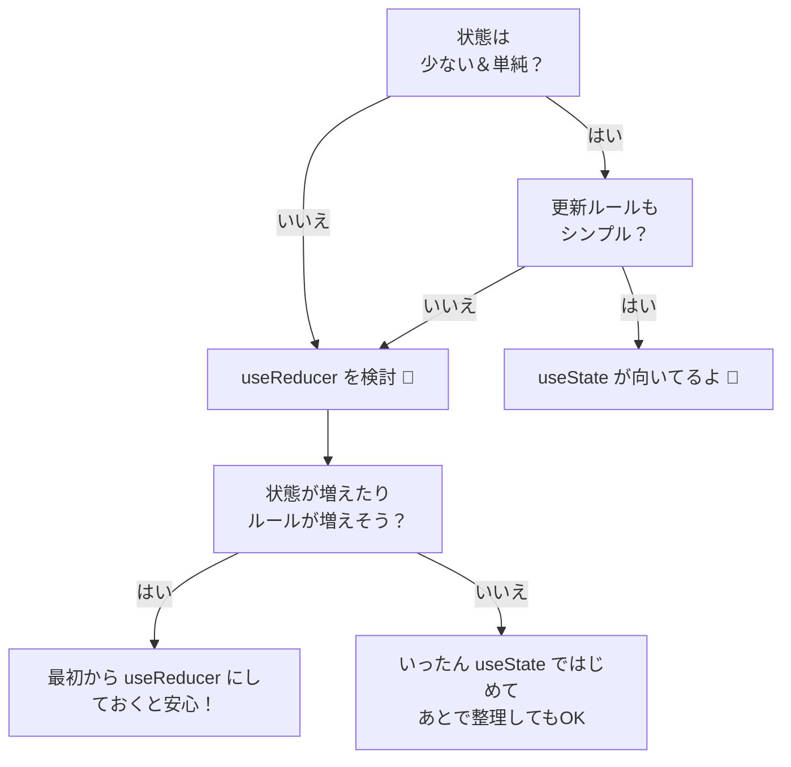

# 第69章：`useReducer` と `useState`、どっち使う？

この章は、**設計のセンスを育てる回**です ✨
「とりあえず `useState` で書いちゃうけど、`useReducer` を使った方がよかったのかな…？」
そんなモヤモヤをスッキリさせましょう 🧠💡

---

## 1. この章のゴール 🎯

この章が終わるころには、

* 「これは **絶対 `useState` でいいやつ**」
* 「これはそろそろ **`useReducer` にした方が安全かも**」

が、**自分で判断できるようになる**のがゴールです ✌️

---

## 2. まずは共通点をサクッと整理 🧩

`useState` も `useReducer` も、どちらも

> 「コンポーネントの“状態（state）”を覚えておくためのフック」

です。React公式ドキュメントでも、
**どちらも「State Hooks」グループ**として紹介されています。([React][1])

ざっくりいうとこんな感じ👇

* `useState`

  * **値そのもの**と、それを変える関数を返す
  * 「その場でサクッと更新」するイメージ

* `useReducer`

  * **値（state）**と、**「何が起きたか」を投げる `dispatch` 関数**を返す
  * 「ルール（reducer関数）」にしたがって更新するイメージ([React][2])

どっちも「状態を持つ」ための道具で、
**どっちが“えらい”とかはない**です。
大事なのは「どんな状態を扱いたいか」👀

---

## 3. `useState` が得意なパターン 🎀

まずは `useState` のおいしい使いどころから 🌸

### 👍 向いているケース

1. **状態がシンプル**

   * 例：`boolean`, `number`, `string` 1〜2個くらい
   * 「モーダル開いてるかどうか」「カウント数」など

2. **更新ルールが単純**

   * 例：`+1` するだけ、`true/false` を切り替えるだけ
   * 「ボタンを押したらフラグを反転」「フォームの入力値をそのまま入れる」

3. **状態どうしの関係がほぼない**

   * `isOpen` と `count` が全然関係ない…みたいな

React公式ガイドでも、
**シンプルな状態管理には `useState` を使うのが基本だよ**と説明されています。([legacy.reactjs.org][3])

---

### 🌼 例1：シンプルなモーダル（`useReducer` はまだいらない）

```tsx
import { useState } from "react";

export function SimpleModal() {
  const [isOpen, setIsOpen] = useState(false);

  return (
    <div>
      <button onClick={() => setIsOpen(true)}>
        詳細をひらく 📖
      </button>

      {isOpen && (
        <div>
          <p>ここに詳細テキストが入ります ✨</p>
          <button onClick={() => setIsOpen(false)}>
            とじる
          </button>
        </div>
      )}
    </div>
  );
}
```

このくらいなら、**`useState` 一択**でOKです 🙆‍♀️

---

## 4. `useReducer` が得意なパターン 🧠

次は `useReducer` の出番が増えてくるケース ✍️

React公式やいろんな解説記事でも、共通してだいたいこう説明されています：

> **「状態が複雑になってきたら `useReducer` を検討しよう」**([legacy.reactjs.org][3])

### 💪 向いているケース

1. **値の種類が多くて、ひとまとまりで意味がある**

   * 例：ユーザー情報フォーム

     * `name`, `email`, `age`, `address` など
   * それぞれ別々に `useState` で持つと、更新ロジックがバラバラになりがち

2. **「こういう操作をしたら、状態はこう変わる」という“ルール”が多い**

   * 例：

     * 「入力を変更した」
     * 「サーバーからデータを読んできた」
     * 「リセットボタンを押した」
   * こういう「イベント」が増えてくると、
     ひとつの `reducer` に「ルール」としてまとめた方がスッキリ ✨

3. **前の状態をもとに次の状態を決める**

   * 例：カウンターを複雑に増減させる
   * 「今の値から〇〇引いて、条件によっては別のフラグも変える」みたいなやつ

4. **複数のイベントハンドラが、似たような更新をする**

   * `handleChangeName`
   * `handleChangeEmail`
   * `handleReset`
     みたいな関数が増えてきたら、`reducer` で一元管理した方が読みやすいことが多いです。([React][4])

5. **あとで Context と組み合わせて“アプリ全体の状態”にしたくなりそう**

   * `dispatch` を Context 経由で配るパターンはよく使われます。([React][5])

---

### 🌟 例2：ちょっと複雑なフォーム（`useReducer` が活きるパターン）

「名前・メール・年齢」を持つフォームを考えてみます。
これを全部 `useState` で書くと、だんだんイベントハンドラが増えて大変…というケース。

```tsx
import { useReducer } from "react";

type FormState = {
  name: string;
  email: string;
  age: string;
};

type FormAction =
  | { type: "changeField"; field: keyof FormState; value: string }
  | { type: "reset" };

const initialState: FormState = {
  name: "",
  email: "",
  age: "",
};

function formReducer(state: FormState, action: FormAction): FormState {
  switch (action.type) {
    case "changeField":
      return {
        ...state,
        [action.field]: action.value,
      };
    case "reset":
      return initialState;
    default:
      // TS的にはここには来ない想定！
      return state;
  }
}

export function ProfileForm() {
  const [state, dispatch] = useReducer(formReducer, initialState);

  return (
    <form>
      <div>
        <label>
          名前：
          <input
            value={state.name}
            onChange={(e) =>
              dispatch({
                type: "changeField",
                field: "name",
                value: e.target.value,
              })
            }
          />
        </label>
      </div>

      <div>
        <label>
          メール：
          <input
            value={state.email}
            onChange={(e) =>
              dispatch({
                type: "changeField",
                field: "email",
                value: e.target.value,
              })
            }
          />
        </label>
      </div>

      <div>
        <label>
          年齢：
          <input
            value={state.age}
            onChange={(e) =>
              dispatch({
                type: "changeField",
                field: "age",
                value: e.target.value,
              })
            }
          />
        </label>
      </div>

      <button
        type="button"
        onClick={() => dispatch({ type: "reset" })}
      >
        リセット 🔁
      </button>
    </form>
  );
}
```

💡ポイント

* 「状態をどう変えるか」のルールは **`formReducer` に全部集約**
* 画面側は「何が起きたか（Action）」だけ投げる

  * `type: "changeField"`
  * `type: "reset"`

フォーム項目が増えたり、
「サーバーから読み込んだ値で全部書き換える」
みたいな動きが増えても、**`reducer` を見れば全体の動きが分かる**のが強みです 💪

---

## 5. ざっくり判断フローチャート 🌈

「どっち使う？」を図でイメージしてみましょう 🧭



> 「ちょっと複雑になってきたな…」と感じたら
> **`useReducer` に“昇格”させるタイミングかも**、くらいの気持ちで大丈夫です 😊

---

## 6. 実務寄りな「3つのチェックリスト」✅

コードを書いていて迷ったとき、
この3つを自分に質問してみてください ✋

### Q1. 「状態の数」と「関連性」はどう？

* ✅ 状態が少ない / 互いにあまり関係ない
  → **`useState` でOK**
* ⚠️ プロパティがたくさんあって、
  「この値が変わったら、あれも一緒に直さないと…」が増えてきた
  → **`useReducer` を検討**

---

### Q2. 更新ロジックの説明、口でスラスラ言える？

* ✅ 「ボタン押したら +1 」「押したら開く・閉じる」レベル
  → `useState`
* ⚠️ 「このボタンだと… A の値がこうで、B も変わって、条件によっては C も…」と
  口頭説明が長くなる
  → ルールを **`reducer` に“日本語のif文”みたいにまとめた方が安全**

---

### Q3. この状態、あとで**別のコンポーネントにも共有**したくなりそう？

* ✅ 1つのコンポーネントの中だけで完結しそう
  → `useState`
* ⚠️ Context にのせてアプリ全体で共有しそう
  → `useReducer + Context` の組み合わせは鉄板パターン 🔧

---

## 7. 「迷ったらこうする」ガイドライン 💖

最後に、超シンプルな**マイルール案**です。
（慣れてきたら自分なりにアレンジしてOK！）

1. **最初は素直に `useState` から始める**
2. こんなサインが出てきたら `useReducer` を検討 👇

   * `setXxx` が増えすぎてきた
   * 関数名が `handleChangeName`, `handleChangeEmail`, `handleChangeAge` …と増殖
   * バグが「状態が食い違ってる」系で出てくる
3. 「これはフォーム全体のルールっぽいな」「一連の操作の“ストーリー”があるな」
   → **`useReducer` で“物語（Action）とルール（Reducer）”に整理する**

---

## 8. ミニ練習問題 ✍️✨

「これ、あなたならどっちを選ぶ？」を考えてみてください 🧠

1. **いいねボタン**

   * 押したら `liked` フラグが `true/false` になるだけ
   * → `useState` or `useReducer` ？

2. **買い物カゴ**

   * 商品を追加・削除
   * 合計金額も一緒に更新
   * 「全部削除」ボタンもある
   * → どっち？

3. **プロフィール編集画面**

   * 名前・メール・自己紹介文・アイコン画像URL
   * 「サーバーから読み込んだ値で初期化」「変更を保存」「リセット」
   * → どっち？

💬 もし答えに迷ったら、「こう思ったんだけど合ってる？」って聞いてくれてOKです 🌟
一緒に「設計の勘どころ」を育てていきましょ〜 🐣💻💖

[1]: https://react.dev/reference/react/hooks?utm_source=chatgpt.com "Built-in React Hooks"
[2]: https://react.dev/reference/react/useReducer?utm_source=chatgpt.com "useReducer"
[3]: https://legacy.reactjs.org/docs/hooks-reference.html?utm_source=chatgpt.com "Hooks API Reference"
[4]: https://react.dev/learn/extracting-state-logic-into-a-reducer?utm_source=chatgpt.com "Extracting State Logic into a Reducer"
[5]: https://react.dev/learn/managing-state?utm_source=chatgpt.com "Managing State"
