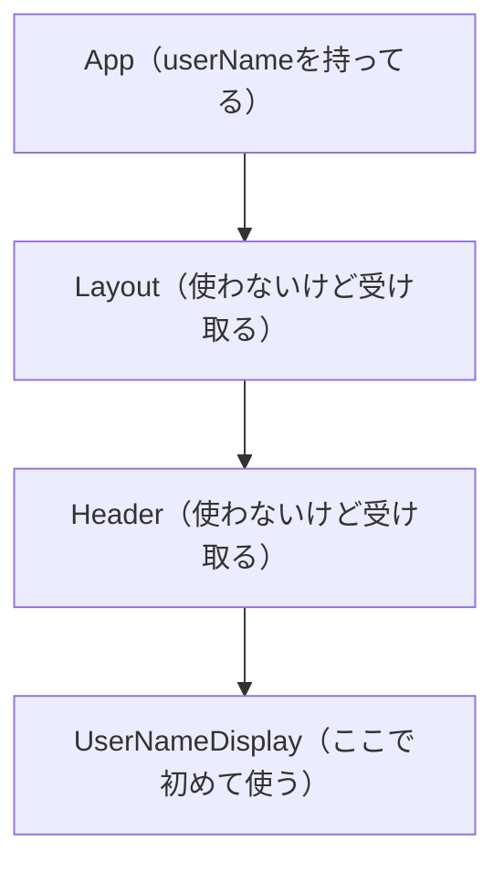
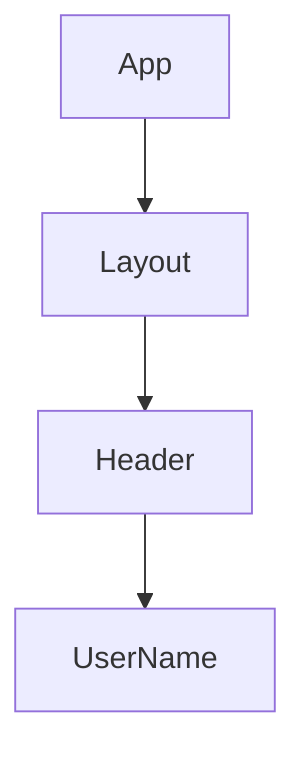
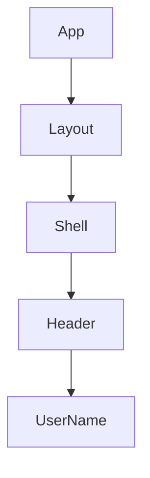

# 第71章：Propsのバケツリレー問題

---

### 1️⃣ この章のゴール 🎯

この章では、「**Propsのバケツリレー（prop drilling）ってなにが問題なの？**」をしっかりイメージできるようになることがゴールです ✨

* 「親コンポーネントから子、孫、ひ孫…って延々と `props` を渡す」のがどういう状態か
* それが**小さいアプリならまだしも、ちょっと大きくなると一気にツラくなる理由**
* 「あ、これバケツリレーになってるな…」と自分で気づけるようになること

を目指します 🧠💡

次の章から登場する `createContext` / `useContext` が、**このバケツリレー問題を解決するヒーロー**なので、まずは「何がつらいのか」を体感しておきましょう 👀

---

### 2️⃣ まずはイメージ：水のバケツリレー🚰➡️➡️➡️

「バケツリレー」って、ちょっと昔の消火方法みたいなイメージです 🔥

1. 一番上の人がバケツに水をくむ
2. 隣の人に渡す
3. その人はさらに隣の人へ…
4. 最後の人が火にかける

**ReactのPropsでも、似たことが起きます。**

* 一番上のコンポーネント（`App`）が **ユーザー名** を持っている
* でも、実際に名前を表示したいのは画面の一番奥の部品（ひ孫コンポーネント）
* だから、途中のコンポーネントも全部「いったん受け取って、そのまま次へ渡す」ことになります

この「**自分はそのデータ使わないのに、とりあえず受け取って次へ渡す**」という状態を、よく「propsのバケツリレー」と呼びます 🪣💦

---

### 3️⃣ 図で見る：どんな感じで流れてるの？📊

小さなアプリ構成を、図で見てみましょう 👇

* `App`：アプリ全体。`userName` を持ってる
* `Layout`：レイアウト用。`userName` は使わない
* `Header`：ヘッダー。ここも `userName` は使わない
* `UserNameDisplay`：実際にユーザー名を表示する

こんな関係だとします。



矢印の流れに沿って、`userName` が **ひたすら横流しされている** と思ってください 🪣➡️🪣➡️🪣

---

### 4️⃣ 実際のコードで「バケツリレー」を体験しよう 🧪

では、TypeScript + React で書くとどうなるか見てみます 👀

#### ✅ 1. 一番上：`App.tsx`

`App` は `userName` の状態を持っていて、`Layout` に渡しています。

```tsx
// App.tsx
type AppProps = {};

function App({}: AppProps) {
  const userName = "さくら"; // 本当は useState などで管理する想定

  return <Layout userName={userName} />;
}

export default App;
```

#### ✅ 2. 中間コンポーネント：`Layout.tsx`

`Layout` は **自分では `userName` を使わない** のに、`Header` へ渡すためだけに `props` に持っています。

```tsx
// Layout.tsx
type LayoutProps = {
  userName: string;
};

function Layout({ userName }: LayoutProps) {
  return (
    <div>
      <Header userName={userName} />
      <main>メインコンテンツだよ〜✨</main>
    </div>
  );
}

export default Layout;
```

#### ✅ 3. さらに中間：`Header.tsx`

`Header` も同じく、「自分では使わないけど次に渡す係」です。

```tsx
// Header.tsx
type HeaderProps = {
  userName: string;
};

function Header({ userName }: HeaderProps) {
  return (
    <header>
      <h1>My Awesome App ✨</h1>
      <UserNameDisplay userName={userName} />
    </header>
  );
}

export default Header;
```

#### ✅ 4. やっと使うところ：`UserNameDisplay.tsx`

やっとここで `userName` を使います。

```tsx
// UserNameDisplay.tsx
type UserNameDisplayProps = {
  userName: string;
};

function UserNameDisplay({ userName }: UserNameDisplayProps) {
  return <p>ログイン中：{userName} さん 🌸</p>;
}

export default UserNameDisplay;
```

👀 ポイント

* `userName` を本当に使っているのは `UserNameDisplay` だけ
* でも、`Layout` と `Header` もいちいち `userName` を Props に追加しないといけない

これがまさに「**Propsのバケツリレー問題**」です 🚰

---

### 5️⃣ どこがツラいの？問題点を整理しよう 🧩

小さい例だと「まあいいか〜」で済むんですが、アプリが大きくなると**かなりストレス**になります 🥲

#### 😵‍💫 問題1：中間コンポーネントのPropsがパンパンになる

`Layout` や `Header` のように、**自分では使わないデータなのに** Propsに書かないといけません。

* 「これ何に使うんだっけ？」ってなりやすい
* そのコンポーネントのコードを読んだときに、**本当に必要なPropsとそうでないPropsの区別がつきにくい**

```tsx
type LayoutProps = {
  userName: string;
  theme: "light" | "dark";
  isLoggedIn: boolean;
  // さらにいろいろ増えていく…
};
```

こんな感じで、**ただの“通り道”なのに、Propsがどんどん増えていきます** 🧳🧳🧳

#### 🧵 問題2：コンポーネントの階層を変えるだけで修正が大量発生

例えば、「デザイン的に `Header` と `Layout` の間に `Shell` ってコンポーネントを挟みたいな」と思ったとします。

いま：



これをこう変えたい：



このときに何が起きるかというと…

* 新しく作る `Shell` コンポーネントにも、**全部のPropsを通過させる処理を追加**しないといけない
* `ShellProps` の型を定義
* `Shell` に渡すときのJSXも直す
* さらに、**そのPropsの型が変わると全部直すハメになる**

つまり、

> ただ**階層を一段増やしただけ**なのに、コード修正があちこちに飛び火する 🔥

という状態になります。
これ、アプリが大きくなるほど**リファクタリングの敵**になります👿

#### 🧪 問題3：テストや再利用性も下がる

例えば、「`UserNameDisplay` を別の場所でも使いたいな〜」と思ったとき、

* 「あれ、このコンポーネントに `userName` をどうやって届けてたっけ？」
* 「上の階層にも渡さないといけない？」

など、**コンポーネント同士のつながりをたどる必要**が出てきます。

テストを書こうとしたときも、

* 「テスト対象のコンポーネントより上の階層のPropsも用意しないと動かない…」

みたいになって、**シンプルにテストしづらい**という問題も出てきます 🧪💥

---

### 6️⃣ 「バケツリレーっぽい？」と気づくチェックリスト ✅

自分のコードを見ながら、次の項目に当てはまるか考えてみてください 👀

* [ ] あるデータ（例：`userName`）を、**3階層以上** 下のコンポーネントで使っている
* [ ] 途中のコンポーネントが、**自分では使わないPropsをそのまま次へ渡しているだけ**
* [ ] コンポーネント階層をちょっと変えようとしただけで、**Propsの修正があちこちに波及**する
* [ ] あるデータを使っている場所を探すために、**上から下までファイルを何枚も開く**ことがある

2〜3個くらい当てはまるなら、そこには**Propsのバケツリレー問題**が潜んでいるかもしれません 🕵️‍♀️

---

### 7️⃣ ミニ練習問題 ✍️（頭の中でOK）

💡 以下のような構成を想像してみてください：

* `App`：ログイン中ユーザー名 `loggedInUserName` を持っている
* `Page`：ページ全体のレイアウト
* `Sidebar`：左側のメニュー
* `UserInfoBox`：ユーザー名を表示するボックス（ここでだけ `loggedInUserName` を使う）

#### Q1. どのコンポーネントに `loggedInUserName` のPropsを書くことになりそう？

→ 自分の頭の中 or メモ帳に、どこからどこまで渡すかを書き出してみてください 💭

#### Q2. 将来「`Sidebar` の中身を2つに分けたい」となったとき、

新しいコンポーネントにも `loggedInUserName` を通さないといけないか？想像してみてください 👀

「うわ、めんどくさそう…」と感じたら、それは**大事な感覚**です ✨

---

### 8️⃣ この先の予告：Contextという“給水タンク” 🏞️

この章ではあえて「バケツリレー問題」をちゃんと眺めて、

> なんかこれ、規模が大きくなったらしんどそう…😇

と感じてもらうことが目的でした。

**次の章（第72章〜）では**、

* `createContext` という「**みんなが見に行けるデータ置き場**」
* `Provider` という「**この中の子たちは自由に飲んでいいよ〜っていう給水タンク**」

を使って、バケツリレーをやめる方法を学んでいきます 🚰❌✨

「Propsのバケツリレー、たしかにめんどくさそうだな〜」と思えたら、この章はクリアです 🎉

おつかれさま！次は **第72章：`createContext` で「データ置き場」を作る** に進んでいきましょう 🌈💻
