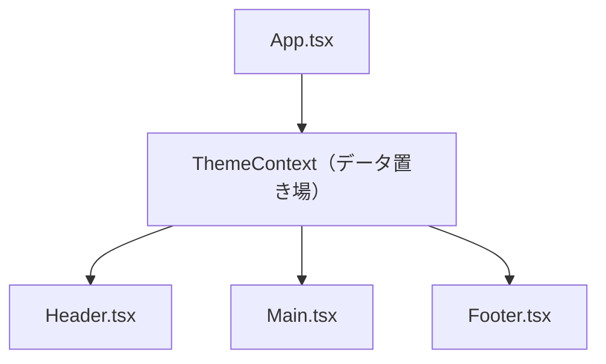

# 第72章：`createContext` で「データ置き場」を作る

---

### 0. この章でやること 🎯

この章では、

* 「みんなで共有したいデータ」を入れておく **データ置き場（Context）** を作る
* `createContext` を使って、その「置き場」をコードで定義する
* React 19 でちょっとキレイになった Context の使い方をチラ見する

ところまでやります ✨

ここでは「**箱を作るところ**」がメインです。
箱の中身を**取り出すフック（`useContext`）** は、少し先の章でゆっくりやるので安心してね😊

---

## 1. Context のイメージを固めよう 🧺

前の章で出てきた「Props のバケツリレー問題」覚えてるかな？
親 → 子 → 孫 → ひ孫…と、関係ないコンポーネントを経由しながら `props` を渡していく、あのしんどいやつです。

**Context は、それを解決するための仕組み** です。
ざっくり言うと：

> アプリのどこからでもアクセスできる「みんなのデータ置き場」を作る仕組み

代表的な例だと…

* 🎨 テーマ（ライト / ダーク）
* 🌐 選択中の言語（`"ja"` / `"en"` …）
* 🙋‍♀️ ログイン中のユーザー情報
* ⚙️ アプリの設定（「通知ON/OFF」みたいなやつ）

みたいな **「アプリ全体で使い回したいもの」** を入れておくのにピッタリです。
この「置き場」を作る関数が **`createContext`** です。([ウィキペディア][1])

---

## 2. `createContext` の正体をチラ見 👀

`createContext` は React 本体から import する関数です。

```ts
import { createContext } from 'react';
```

この関数に「中に入れるデータの型」と「初期値」を渡すと、
**Context オブジェクト** というものが返ってきます。

この Context オブジェクトには、ざっくり次の役割があります：

* ✅ 「この名前のデータ置き場がありますよ〜」と React に教える
* ✅ 後から `useContext` で中身を読むときの目印になる
* ✅ React 19 からは、そのまま `<MyContext value={…}>` という **Provider コンポーネント** としても使える（後で実例を見るよ）([Angular Minds][2])

---

## 3. 手を動かそう！`ThemeContext` を作る 🎨

まずは一番イメージしやすい **「テーマ（ライト / ダーク）」** を共有する Context を作ってみます。

### 3-1. フォルダを用意する 📁

1. VS Code でプロジェクトを開く
2. `src` フォルダの中に `contexts` フォルダを作る
   （パス的には `src\contexts` な感じ）

### 3-2. `ThemeContext.tsx` を作成 ✏️

`src\contexts\ThemeContext.tsx` というファイルを新規作成して、こんなコードを書きます👇

```ts
// src/contexts/ThemeContext.tsx
import { createContext } from 'react';

// テーマとして扱う文字列の型
export type Theme = 'light' | 'dark';

// テーマ用の「データ置き場」を作る
export const ThemeContext = createContext<Theme>('light');
```

#### 行ごとの解説 🧐

* `export type Theme = 'light' | 'dark';`
  → テーマとしてありえる値を **型で固定** しています。
  これで VS Code が「`theme = 'blue'` はダメだよ〜」と教えてくれるようになります。

* `createContext<Theme>('light');`
  → `createContext` に **ジェネリクス (`<Theme>`)** を付けてあげることで、
  「この Context に入るのは `Theme` 型だけだよ」と TypeScript に教えています。

* `'light'`
  → Context の **初期値**。
  まだどこからも値が上書きされていないときは、この値が使われます。

この一行で

> 「`ThemeContext` という名前の『テーマ置き場』を定義した」

状態になります 🎉

---

## 4. 図でイメージしてみる 🧠✨

`ThemeContext` を使うと、最終的にはこんな感じのイメージになります👇

（まだ「使う」部分は先の章でやるけど、雰囲気だけつかんでおこう！）



* `ThemeContext` が「テーマのデータ置き場」
* `App` がその置き場を使って、`Header` / `Main` / `Footer` にテーマを配る
* 各コンポーネントは `useContext(ThemeContext)`（75章で登場）で中身を読む

今はまだ **「ThemeContext という置き場を作っただけ」** の段階ですが、
このあと `Provider` や `useContext` を覚えると、この図みたいな形でデータが流れるようになります😊

---

## 5. React 19 らしい書き方をちょっとだけ ✨

React 19 から、**Context オブジェクトをそのまま Provider として使える** ようになりました。([Angular Minds][2])

昔（〜React 18）まではこんな書き方でした：

```ts
// 従来の書き方（React 18 まで）
<ThemeContext.Provider value="dark">
  <AppContent />
</ThemeContext.Provider>
```

React 19 では、これをもっとシンプルに書けます👇

```ts
// React 19 の新しい書き方（Context をそのまま Provider に）
<ThemeContext value="dark">
  <AppContent />
</ThemeContext>
```

`ThemeContext` そのものがコンポーネントとして使えて、
`value` に渡した値が「みんなのデータ置き場」に流れていきます。

### 5-1. ちょっとだけ App で使ってみる（プレビュー）

「詳しく使う」のは 74章以降に取っておいて、
ここでは **「置き場を作ったら、こうやって囲うんだな〜」** くらいの軽い感じで眺めてみましょう。

`src\App.tsx` を、ちょっとだけこういう形にするイメージです：

```ts
// src/App.tsx
import { ThemeContext } from './contexts/ThemeContext';

export function App() {
  return (
    <ThemeContext value="light">
      {/* ここにアプリ全体のコンポーネント */}
      {/* 例：<Header /> や <Main /> など */}
    </ThemeContext>
  );
}
```

* `ThemeContext value="light"`
  → 「この中にあるコンポーネントは、テーマが `light` だよ〜」と教えている状態

まだ中で `useContext(ThemeContext)` を使っていないので、見た目は変わりませんが、
**「データ置き場を作って、アプリをその置き場で包んだ」** という、一番大事な土台はこれで完成です 💪

---

## 6. Context に入れるデータって、どんなのがいいの？🤔

よくある質問に、こんなものがあります。

> なんでもかんでも Context に入れていいの？

答えは **NO** です✋
Context はとても便利ですが、入れすぎると逆にコードが分かりにくくなります。

**Context 向きのデータ**

* アプリ全体で使う設定

  * テーマ（ライト / ダーク）
  * 言語（`'ja' | 'en'` など）
* ログインユーザー情報（名前・アイコン・権限など）
* 「どこからでも同じものを見ていてほしい」もの

**あまり向いていないデータ**

* あるページの中だけで完結している一時的な入力内容
* そのコンポーネント内だけで完結している状態

そういうものは、ふつうに `useState` で十分です。
**「グローバルっぽいものだけ Context」**、くらいの感覚で覚えておくとOKです👌

---

## 7. ミニ演習タイム ✏️💕

実際に TypeScript で Context を定義する練習をしてみましょう。

### 演習1：`UserNameContext` を作る 🙋‍♀️

1. `src\contexts\UserNameContext.tsx` を作る
2. 中身を自分で考えて書いてみる（ヒントだけ出すね）

ヒント：

* 型は `string` でOK（`type UserName = string;` でも良いし、いきなり `string` を使ってもOK）
* 初期値は `"ゲスト"` とか `"Guest"` とか自分の好きな感じで決めてみる

イメージとしては、こんな形になります👇

```ts
import { createContext } from 'react';

// 好きならこう書いてもOK
// export type UserName = string;

export const UserNameContext = createContext<string>('ゲスト');
```

### 演習2：`App` で包んでみる（コードは自分で）🧠

* `ThemeContext` と同じように、`UserNameContext` でも `App` を包んでみよう
* `value` には、自分の名前でもニックネームでもOK ✨

※ 詳しい「読み取り」は 75章以降でやるので、
今は「Context で包む」という形だけ作れれば大成功です🎉

---

## 8. まとめ 💐

この章でできるようになったこと：

* `createContext` で「みんなのデータ置き場」を作れるようになった
* どんなデータを Context に入れると気持ちいいか、イメージがついた
* React 19 で導入された「`<Context>` をそのまま Provider にする」書き方をちょっと覗いた ([ウィキペディア][3])

次の章では、この Context に **どんな型を付けるか（`null` を許容するテクニックなど）** をしっかりやっていきます。
だんだん「型付きグローバル状態管理」ができるようになっていくので、お楽しみに〜🌈✨

[1]: https://pt.wikipedia.org/wiki/Context_API?utm_source=chatgpt.com "Context API"
[2]: https://www.angularminds.com/blog/whats-new-in-react-v19?utm_source=chatgpt.com "React 19: What are the new features and updates?"
[3]: https://en.wikipedia.org/wiki/React_%28software%29?utm_source=chatgpt.com "React (software)"
