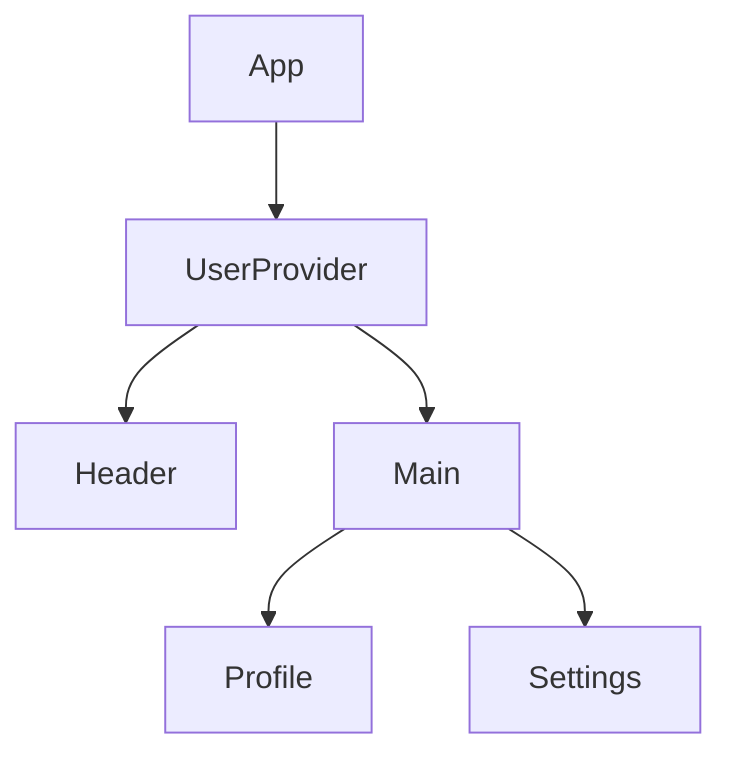

# 第74章：`Provider` でデータを配る

---

### 1. 今日やること 📝

この章では、「**Context に入れたデータを、アプリ全体に配る人＝Provider**」をしっかり理解するのがゴールです ✨

* `createContext` で作った「データ置き場」に **中身（value）を入れる**
* そのデータを使いたいコンポーネントたちを **`Provider` で包み込む**
* React 19 の新しい書き方
  → `<UserContext.Provider>` ではなく **`<UserContext>` 自体を Provider として使える** 🥳 ([GeeksforGeeks][1])

---

### 2. Provider のイメージ 🌈

Context は「**みんなで共有するロッカー**」みたいなものでしたよね 👟

* `createContext` …「ロッカー」を用意する
* `Provider` …「ロッカーに中身を入れて、そのエリアの子たちに使わせてあげる人」

イメージ図 🧠

* 学校のフロア全部に効く **Wi-Fi ルーター** みたいな存在
* ルーターの内側（電波が届く範囲）にいる子は、**パスワードを個別にもらわなくてもネットが使える**

React でいうと：

* `Provider` の**内側にあるコンポーネント** → Context のデータを読める
* `Provider` の**外側のコンポーネント** → その Context のことは知らない（読めない）

---

### 3. React 19 の Provider の書き方 ✨

React 19 では、**Context 自体を Provider として書ける**ようになりました。

昔:

```tsx
<UserContext.Provider value={value}>
  {children}
</UserContext.Provider>
```

今（React 19 の書き方）：

```tsx
<UserContext value={value}>
  {children}
</UserContext>
```

`<UserContext.Provider>` じゃなくて、
**`<UserContext>` にそのまま `value` を渡す**スタイルです 💡 ([GeeksforGeeks][1])

もちろん古い書き方もまだ動きますが、
**これからは `<Context>` を使う書き方が「新しい普通」**になっていく想定です 🌱

---

### 4. 実例：`UserProvider` で「ユーザー名」を配る 👩‍💻

「アプリ全体でユーザー名を共有したい」というよくあるパターンで考えてみます。

#### 4-1. Context の型と本体を用意する

`src/contexts/UserContext.tsx` を作るイメージで OK です 📁

```tsx
// src/contexts/UserContext.tsx
import { createContext, useState, ReactNode } from 'react';

// Context の中身の型（なにが入っているか）
export type UserContextValue = {
  userName: string;
  setUserName: (name: string) => void;
};

// null を許容しておく書き方（第73章でやったやつ）
export const UserContext = createContext<UserContextValue | null>(null);

// Provider が受け取る props（子コンポーネントたち）
type UserProviderProps = {
  children: ReactNode;
};
```

ここまでで、

* `UserContextValue` …「ユーザー名の文字列」と「名前を変える関数」が入るよ、という約束
* `UserContext` …その型を持った Context 本体
* `UserProviderProps` …「中に子供を入れられるコンポーネント」の型

が定義できました ✅

#### 4-2. `UserProvider` コンポーネントを作る

次に、**データを実際に持って、Context に流し込む役**を作ります 🌊

```tsx
// src/contexts/UserContext.tsx （続き）

export function UserProvider({ children }: UserProviderProps) {
  // ユーザー名を state で管理
  const [userName, setUserName] = useState('ゲスト');

  // Context に流す「ひとかたまり」の値
  const value: UserContextValue = {
    userName,
    setUserName,
  };

  return (
    <UserContext value={value}>
      {children}
    </UserContext>
  );
}
```

ポイント ✨

* `useState('ゲスト')`
  → 最初は「ゲスト」という名前でスタート
* `value` というオブジェクトに、

  * 現在の `userName`
  * 名前を変える `setUserName`
    をまとめて入れる
* その `value` を **`<UserContext value={value}>`** として渡す

**これで `UserProvider` の内側にいるコンポーネントは、
ユーザー名と更新関数を「みんなで共有」できる準備が整いました 🎉**

---

### 5. `App.tsx` で Provider をかぶせる 🪂

今度はアプリ全体を `UserProvider` で包みます。

`src/App.tsx` のイメージ：

```tsx
// src/App.tsx
import { UserProvider } from './contexts/UserContext';
import { HomePage } from './HomePage';

export default function App() {
  return (
    <UserProvider>
      <HomePage />
    </UserProvider>
  );
}
```

こうすると：

* `HomePage` の中にいるすべてのコンポーネントは、
  **「ユーザー名 Context」の電波が届くエリアの中**に入ります 📶
* 逆に `UserProvider` の外にあるコンポーネントからは、この Context は見えません

---

### 6. 図で見る：どこまでデータが届く？📊（Mermaid）

`UserProvider` の **内側だけ** が「ユーザー情報使い放題エリア」です 💁‍♀️



* `Header`, `Main`, `Profile`, `Settings` は
  **全部 `UserProvider` の内側**なので `UserContext` を使えます ✅
* もし `App` 直下に `Footer` があって、`UserProvider` の外なら、
  そこからは `UserContext` は見えません 🙅‍♀️

---

### 7. 「受け取る側」は次の章で 🪄

この章はあくまで **「データを配る側（Provider）」担当**です。

* `UserProvider` …データを持って配る人
* 次の章（第75章）以降でやること

  * `useContext(UserContext)` や
  * React 19 の新しい `use(UserContext)` を使って、
    **実際にデータを読み取る**書き方をやっていきます。([React][2])

「置き場（Context）を作って、`Provider` で中身を配る」までできていれば、
あとは**受け取るだけ**なのでかなり楽になります 💃

---

### 8. よくあるハマりポイント ⚠️

最後に、つまずきがちなポイントをまとめておきます 👀

1. **`UserProvider` で包み忘れる**

   * `useContext(UserContext)` や `use(UserContext)` を呼ぶ前に、
     必ずどこかの上の階層で `<UserProvider>` で包むこと！

2. **`children` を返し忘れる**

   * `UserProvider` の `return` の中で `{children}` をちゃんと描いてないと、
     中身のコンポーネントが表示されません 😇

3. **`createContext<UserContextValue | null>(null)` にしているのに、
   受け取る側で `null` チェックをしない**

   * これは第76章でカスタムフックを作りながら、
     「`null` じゃないことを保証する」書き方をやります 💪

---

### 9. ミニ練習 💪✨

時間があれば、こんな練習をしてみてください 🏋️‍♀️

1. `ThemeContext` を作る

   * `mode: 'light' | 'dark'`
   * `toggleMode: () => void`
     の2つを持った `ThemeContextValue` を定義してみる

2. `ThemeProvider` を作る

   * `useState<'light' | 'dark'>('light')` でテーマを管理
   * `toggleMode` で `'light'` と `'dark'` を切り替える

3. `App.tsx` で

   * `<ThemeProvider>` → `<UserProvider>` → `<HomePage>`
     みたいな感じで **Provider を二重にかぶせてみる**

ここまでできたら、
**「Context を作って、Provider でデータを配る」力はバッチリ**です 🎊

次の章では、いよいよ **`useContext` / `use` で「受け取る側」の書き方**に進んでいきましょう〜！ 🎓💻✨

[1]: https://www.geeksforgeeks.org/reactjs/react-19-new-features-and-updates/?utm_source=chatgpt.com "React 19 : New Features and Updates"
[2]: https://react.dev/reference/react/use?utm_source=chatgpt.com "use"
