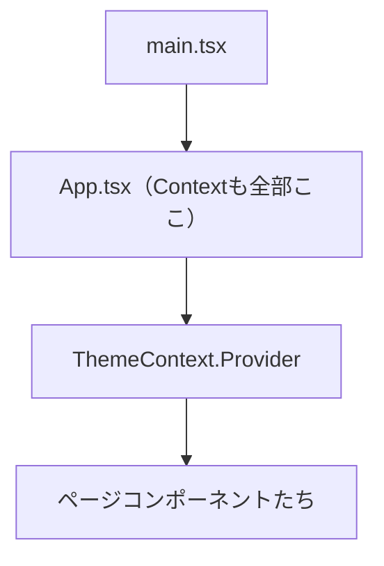
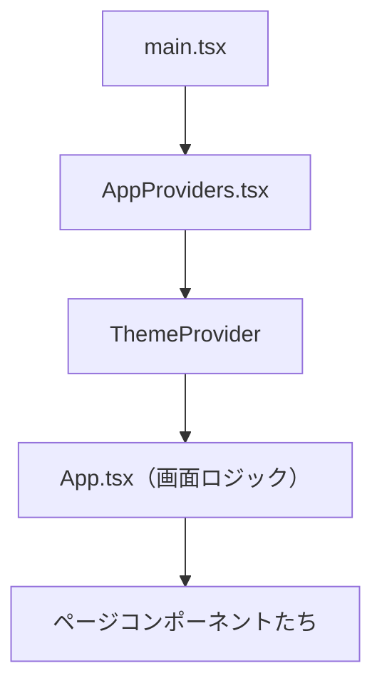

# 第77章：`Provider` を分ける

---

#### 1️⃣ 今日のゴール 🎯

この章のゴールは、これです👇

> **「Context の `Provider` を、`App.tsx` から外に出してスッキリさせる」**

* Context 自体はもう知ってる想定だよね（`createContext` / `Provider` / `useContext` / カスタムフックなど）。([React][1])
* でも、その **`Provider` をどこに置くか** は、設計の話になるので、ちゃんとパターンとして覚えておくとめちゃ便利です ✨

---

#### 2️⃣ よくある「App.tsx がギュウギュウ問題」😵‍💫

まずは「よくない例」から。

**全部 `App.tsx` に書いちゃってるパターン**をイメージしてみましょう。

* `App.tsx` の中で

  * `ThemeContext` を作って
  * `useState` でテーマを管理して
  * そのまま `<ThemeContext.Provider>` で全体を包む

みたいな状態です。

```tsx
// src/App.tsx（イマイチな例）💦
import { createContext, useState } from "react";

type Theme = "light" | "dark";

type ThemeContextValue = {
  theme: Theme;
  toggleTheme: () => void;
};

export const ThemeContext = createContext<ThemeContextValue | undefined>(
  undefined
);

export function App() {
  const [theme, setTheme] = useState<Theme>("light");

  const value: ThemeContextValue = {
    theme,
    toggleTheme: () =>
      setTheme((prev) => (prev === "light" ? "dark" : "light")),
  };

  return (
    <ThemeContext.Provider value={value}>
      {/* 本当はここにページやルーティングがいろいろ並ぶ */}
      <h1>こんにちは！</h1>
    </ThemeContext.Provider>
  );
}
```

これでも**動く**し、最初はこれで全然OKなんだけど…

* Context が増えるたびに
  `UserContext.Provider`
  `SettingsContext.Provider`
  `ThemeContext.Provider`
  …みたいに、**`App.tsx` がネストだらけ**になります 🌀
* `App.tsx` は

  * ルーティング
  * レイアウト
  * ページの組み立て
    などの「画面構成」に集中させたいのに、**状態管理ロジックまで入り込んでくる**のがつらいポイントです。

---

#### 3️⃣ 図でイメージしてみる 🧠✨

まずは「全部 `App.tsx` に書いている」パターンを図にします。



これでも悪くはないんだけど、Context が増えると…

* `App.tsx` が「**なんでも倉庫**」になってしまう、というイメージです 🧳🧳🧳

---

#### 4️⃣ 方針：Provider を「専用コンポーネント」にする ✂️

そこで第77章のアイデアはこれ👇

> **Context ごとに「Provider 専用コンポーネント」を作って、`App.tsx` から追い出す**

今回の例では `ThemeContext` を使って説明しますが、この考え方は
**どんな Context にも共通**で使えます ☺️

---

#### 5️⃣ ステップ①：Context を専用ファイルにお引っ越し 📦

まずは、`ThemeContext` 用のファイルを作ります。

👉 例：`src/contexts/ThemeContext.tsx`

この中に

* 型定義（`Theme` と `ThemeContextValue`）
* `ThemeContext` 本体
* `ThemeProvider` コンポーネント
* `useTheme` カスタムフック

までを**全部まとめて**しまいます。

```tsx
// src/contexts/ThemeContext.tsx ✨
import {
  createContext,
  useContext,
  useState,
  type ReactNode,
} from "react";

type Theme = "light" | "dark";

type ThemeContextValue = {
  theme: Theme;
  toggleTheme: () => void;
};

// 76章でやった「undefined を許す」スタイルと同じノリ 🧠
const ThemeContext = createContext<ThemeContextValue | undefined>(undefined);

type ThemeProviderProps = {
  children: ReactNode;
};

export function ThemeProvider({ children }: ThemeProviderProps) {
  const [theme, setTheme] = useState<Theme>("light");

  const value: ThemeContextValue = {
    theme,
    toggleTheme: () =>
      setTheme((prev) => (prev === "light" ? "dark" : "light")),
  };

  return (
    <ThemeContext.Provider value={value}>{children}</ThemeContext.Provider>
  );
}

// 76章の復習：安全なカスタムフック 🔒
export function useTheme() {
  const context = useContext(ThemeContext);
  if (context === undefined) {
    throw new Error("useTheme は ThemeProvider の中で使ってください 🌙");
  }
  return context;
}
```

これで、

* **Context 関連のものは `ThemeContext.tsx` に集結**
* 他のファイルからは
  `ThemeProvider` と `useTheme` だけ知っていればOK

という、きれいな状態になります ✨

---

#### 6️⃣ ステップ②：`App.tsx` からロジックを追い出す 🏃‍♀️💨

次に `App.tsx` を、**画面構成だけ担当する子**にしてあげます。

👉 例：`src/App.tsx`

```tsx
// src/App.tsx 🎀
import { useTheme } from "./contexts/ThemeContext";

export function App() {
  const { theme, toggleTheme } = useTheme();

  return (
    <div
      style={{
        padding: "16px",
        backgroundColor: theme === "light" ? "#fff" : "#222",
        color: theme === "light" ? "#222" : "#fff",
      }}
    >
      <h1>第77章：Provider を分けてみたよ ✨</h1>
      <p>いまのテーマ: {theme}</p>
      <button onClick={toggleTheme}>テーマを切り替える🌗</button>
    </div>
  );
}
```

ここでポイントは 👇

* `App` は **もう `useState` もしないし `createContext` もしない**
* ただ `useTheme()` で「コンテキストの値」をもらうだけ
* 「Theme をどう管理しているか」は `ThemeProvider` の責任

→ `App.tsx` がかなりスッキリしてきましたね 🧼

---

#### 7️⃣ ステップ③：どこで `ThemeProvider` で包むの？🤔

じゃあ、`ThemeProvider` は**どこで使う**の？という話です。

一番よくあるのは、`main.tsx`（Vite が作ってくれたエントリーポイント）でアプリ全体を包むパターンです。

👉 例：`src/main.tsx`

```tsx
// src/main.tsx 🌸
import React from "react";
import ReactDOM from "react-dom/client";
import { App } from "./App";
import { ThemeProvider } from "./contexts/ThemeContext";

ReactDOM.createRoot(
  document.getElementById("root") as HTMLElement
).render(
  <React.StrictMode>
    <ThemeProvider>
      <App />
    </ThemeProvider>
  </React.StrictMode>
);
```

こうすると、**アプリ全体**のどのコンポーネントからでも `useTheme()` が使えるようになります 💡

そして `App.tsx` 自体は、ただの「画面の組み立て係」に専念できます。

---

#### 8️⃣ ステップ④：Provider が増えたら「AppProviders」で束ねよう 🎁

アプリが大きくなると、だいたいこんな感じになります👇

* `AuthProvider`（ログイン状態）
* `ThemeProvider`（テーマ）
* `UserSettingsProvider`（ユーザー設定）
* `CartProvider`（カート情報）

そのたびに `main.tsx` でこんなふうにネストしていくと…🌀

```tsx
// よくある「ネスト地獄」例 😇
ReactDOM.createRoot(...).render(
  <React.StrictMode>
    <AuthProvider>
      <ThemeProvider>
        <UserSettingsProvider>
          <CartProvider>
            <App />
          </CartProvider>
        </UserSettingsProvider>
      </ThemeProvider>
    </AuthProvider>
  </React.StrictMode>
);
```

これでも**動く**んだけど、見た目がちょっとツラい…。

そこで登場するのが、**「まとめ役 Provider」** です ✨

##### 🧺 `AppProviders` という「まとめコンポーネント」を作る

👉 例：`src/providers/AppProviders.tsx`

```tsx
// src/providers/AppProviders.tsx 💐
import type { ReactNode } from "react";
import { ThemeProvider } from "../contexts/ThemeContext";
// 将来的にここに追加していくイメージ
// import { AuthProvider } from "../contexts/AuthContext";
// import { UserSettingsProvider } from "../contexts/UserSettingsContext";

type AppProvidersProps = {
  children: ReactNode;
};

export function AppProviders({ children }: AppProvidersProps) {
  return (
    // ここに「アプリ共通の Provider」を全部まとめる
    // 順番もここで管理できるのがポイント 💡
    // <AuthProvider>
    //   <UserSettingsProvider>
    //     <ThemeProvider>
    //       {children}
    //     </ThemeProvider>
    //   </UserSettingsProvider>
    // </AuthProvider>

    // 今回は Theme だけにしてシンプルに ✨
    <ThemeProvider>{children}</ThemeProvider>
  );
}
```

そして `main.tsx` はこうなります 👇

```tsx
// src/main.tsx（スッキリ版）✨
import React from "react";
import ReactDOM from "react-dom/client";
import { App } from "./App";
import { AppProviders } from "./providers/AppProviders";

ReactDOM.createRoot(
  document.getElementById("root") as HTMLElement
).render(
  <React.StrictMode>
    <AppProviders>
      <App />
    </AppProviders>
  </React.StrictMode>
);
```

これで

* `main.tsx` → 「アプリの一番外側」を担当
* `AppProviders.tsx` → 「共通 Provider の並べ方」を担当
* `App.tsx` → 「画面（ルーティング・レイアウト）」を担当

と、**いい感じに役割分担**ができました👏

---

#### 9️⃣ 図で「まとめ Providers パターン」を確認 🧩

さっきの構成を Mermaid で図にしてみます。



* `Provider` のネストは **`AppProviders` の中だけ** に閉じ込める
* `App.tsx` からは Context の管理ロジックが消えて、
  かなり読みやすくなります ✨

---

#### 🔟 どこまで分ければいいの？という感覚の話 🎈

「なんでもかんでも分ければいい」というわけではなくて、ざっくり次の感覚でOKです👇

1. **Context の数が 1〜2 個くらい**

   * 最初は `App.tsx` にあってもそこまで困らない
2. **3 個以上になってきたら**

   * `ThemeProvider` などを専用ファイルに出す
3. **「アプリ全体で使う Provider」が増えてきたら**

   * `AppProviders` でまとめる
4. **あるページだけで使う Context**

   * そのページのフォルダの中で `Provider` を作って、
   * そのページのルートコンポーネントだけ包む
     → 「必要なところにだけかける」のがポイント 🎯

---

#### 1️⃣1️⃣ ミニ練習問題 ✏️✨

時間があれば、こんな練習をしてみてね👇

1. **`UserContext` を作ってみる**

   * `type User = { id: number; name: string };`
   * `UserContextValue = { user: User | null; setUser: (...) => void }`
   * `UserProvider` と `useUser` を `src/contexts/UserContext.tsx` に作る

2. **`AppProviders` に追加する**

   * `AppProviders` の中で
     `<UserProvider>` → `<ThemeProvider>` → `{children}`
     の順にネストしてみる

3. **`App.tsx` から `useUser()` を呼んでみる**

   * `user` が `null` なら「未ログイン」表示
   * テスト用にボタンでダミーのユーザーをセットしてみる

ここまでできたら、

> 「Provider を専用の場所に分ける」＋「まとめて管理する」

という、第77章のテーマはバッチリです 💯🎉

---

#### 1️⃣2️⃣ まとめ 🌸

* `App.tsx` に Context ロジックを全部詰め込むと、あとで読みにくくなる😵‍💫
* `ThemeContext.tsx` のように、**Context ごとに専用ファイル＋Provider コンポーネント**を作るとスッキリ ✨
* `AppProviders` で **共通 Provider をひとまとめ**にすると、

  * `main.tsx` も
  * `App.tsx` も
    読みやすくてメンテしやすい構成になる 🧹
* このパターンは、このあと出てくる

  * ユーザー名 Context（第78章）
  * ダークモード Context（第80章）
    でもそのまま使える「守備範囲広めのテクニック」です 💪

次の章からは、この分けた `Provider` を使って、実際にいろいろな場所にデータを配っていきますよ〜🥰

[1]: https://react.dev/reference/react/useContext?utm_source=chatgpt.com "useContext"
