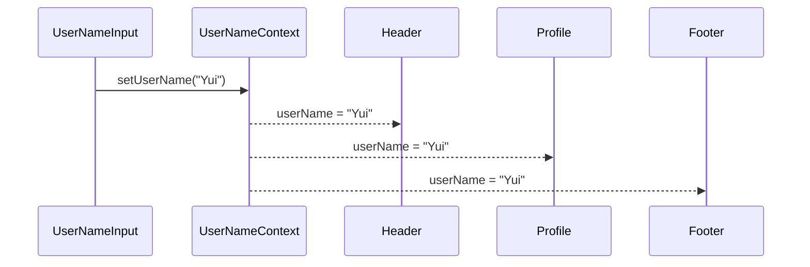

# 第78章：練習：`useContext` で「ユーザー名」をいろんな場所に表示する

---

## 🎯 この章のゴール

この章では、こんなミニアプリを作ります 🧸✨

* 画面のどこかに「ユーザー名」を入力するフォームがある
* ユーザー名を入力すると…

  * 画面上部のヘッダー
  * プロフィールカード
  * フッター
  * など、**いろんな場所の表示が一気に変わる**
* 「Props のバケツリレー」は一切ナシ！
  → `createContext` + `useContext`（をラップしたカスタムフック）で、スマートに共有します 💡([React][1])

React v19 では `<UserNameContext>` 自体を Provider として使えるので、その書き方で行きます 🐣([React][1])

---

## 🗂 つくるファイル

`src` フォルダの中を、こんな感じにしていきます 👇

* `src/contexts/UserNameContext.tsx`
* `src/components/Header.tsx`
* `src/components/UserNameInput.tsx`
* `src/components/UserProfile.tsx`
* `src/components/Footer.tsx`
* `src/App.tsx`（既存のものを少し書き換え）

---

## 1️⃣ UserNameContext を作ろう

まずは「ユーザー名の置き場所（Context）」を作ります。
`src/contexts/UserNameContext.tsx` を新規作成して、こんなコードを書きます 💻

```ts
// src/contexts/UserNameContext.tsx
import { createContext, useContext, useState, ReactNode } from "react";

// Context に入れる「中身」の型
export type UserNameContextValue = {
  userName: string;
  setUserName: (name: string) => void;
};

// null を許可して作る（最初はまだ Provider で包まれていないかもしれないから）
const UserNameContext = createContext<UserNameContextValue | null>(null);

// Provider 用の props 型
type UserNameProviderProps = {
  children: ReactNode;
};

// アプリ全体を包む Provider コンポーネント
export const UserNameProvider = ({ children }: UserNameProviderProps) => {
  const [userName, setUserName] = useState("ゲスト");

  const value: UserNameContextValue = {
    userName,
    setUserName,
  };

  // ★ React 19 スタイル: <UserNameContext> をそのまま Provider として使う
  return <UserNameContext value={value}>{children}</UserNameContext>;
};

// null チェック込みのカスタムフック
export const useUserName = (): UserNameContextValue => {
  const value = useContext(UserNameContext);
  if (!value) {
    // Provider で包み忘れたときに気付きやすくする
    throw new Error("useUserName must be used within <UserNameProvider>.");
  }
  return value;
};
```

### 📝 ここで覚えておきたいポイント

* `createContext<UserNameContextValue | null>(null)`
  → 型に `| null` を含めておくことで、「まだ Provider で包まれていないかも」を表現しています。([React][2])
* React 19 では
  `SomeContext.Provider` ではなく **`<SomeContext value={...}>`** と書けます（`.Provider` はレガシー扱い）。([React][1])
* `useUserName` カスタムフックの中で `useContext` を呼び、`null` だったら `Error` を投げて安全にしています ✅

---

## 2️⃣ App 全体を UserNameProvider で包む

次に、アプリ全体を `UserNameProvider` で包みます。
`src/App.tsx` をこんな形にしてみましょう ✍️

```ts
// src/App.tsx
import "./App.css";
import { UserNameProvider } from "./contexts/UserNameContext";
import { Header } from "./components/Header";
import { UserNameInput } from "./components/UserNameInput";
import { UserProfile } from "./components/UserProfile";
import { Footer } from "./components/Footer";

function App() {
  return (
    <UserNameProvider>
      <div className="app">
        <Header />
        <main className="main">
          <UserNameInput />
          <UserProfile />
        </main>
        <Footer />
      </div>
    </UserNameProvider>
  );
}

export default App;
```

これで、`App` の中にいるコンポーネントたちは、
**どこからでも `useUserName()` でユーザー名にアクセスできる** ようになります 🌈([React][2])

---

## 3️⃣ ヘッダーでユーザー名を表示する

まずは一番わかりやすい場所、ヘッダーから 💫

`src/components/Header.tsx` を作成します。

```ts
// src/components/Header.tsx
import { useUserName } from "../contexts/UserNameContext";

export const Header = () => {
  const { userName } = useUserName();

  return (
    <header className="header">
      <h1>ようこそ、{userName} さん 👋</h1>
    </header>
  );
};
```

たったこれだけで、`Header` は
「いまのユーザー名」を常に最新の状態で表示できるようになります ✨

---

## 4️⃣ 入力欄でユーザー名を更新する

次は「変更する側」のコンポーネントです。
`UserNameInput` という名前で作りましょう。

`src/components/UserNameInput.tsx`:

```ts
// src/components/UserNameInput.tsx
import { ChangeEvent } from "react";
import { useUserName } from "../contexts/UserNameContext";

export const UserNameInput = () => {
  const { userName, setUserName } = useUserName();

  const handleChange = (event: ChangeEvent<HTMLInputElement>) => {
    setUserName(event.target.value);
  };

  return (
    <section className="userNameInput">
      <h2>ユーザー名の設定 ✏️</h2>
      <label>
        ユーザー名：
        <input
          type="text"
          value={userName}
          onChange={handleChange}
          placeholder="好きな名前を入れてね"
        />
      </label>
      <p>いまのユーザー名：{userName}</p>
    </section>
  );
};
```

ポイントはここ 👇

* `ChangeEvent<HTMLInputElement>`
  → `onChange` のイベント引数の型。`event.target.value` を安全に使えます 🛟
* `setUserName(event.target.value)`
  → Context の中の state を更新すると、**それを読んでいる他のコンポーネントも全部再レンダリング** されます。([React][2])

---

## 5️⃣ プロフィールとフッターでも表示しよう

「読むだけ」のコンポーネントをもう 2 つ作ります。
同じ Context を使い回せるのがうれしいところです 🥰

### 👤 UserProfile

`src/components/UserProfile.tsx`:

```ts
// src/components/UserProfile.tsx
import { useUserName } from "../contexts/UserNameContext";

export const UserProfile = () => {
  const { userName } = useUserName();

  return (
    <section className="userProfile">
      <h2>プロフィール 🧾</h2>
      <p>ユーザー名：{userName}</p>
      <p>{userName} さん、今日もいい一日になりますように ✨</p>
    </section>
  );
};
```

### 👣 Footer

`src/components/Footer.tsx`:

```ts
// src/components/Footer.tsx
import { useUserName } from "../contexts/UserNameContext";

export const Footer = () => {
  const { userName } = useUserName();

  return (
    <footer className="footer">
      <small>👤 ログイン中: {userName}</small>
    </footer>
  );
};
```

これで、

* `Header`
* `UserProfile`
* `Footer`

の 3 か所で同じユーザー名が表示されるようになりました 🎉

---

## 6️⃣ 画面の動きを図でイメージしよう（Mermaid）

入力 → Context → いろんな表示、のイメージを Mermaid で描いてみます 🎨



* `UserNameInput` で `setUserName("Yui")` を呼ぶ
* `UserNameContext` の中の state が `"Yui"` に変わる
* その値を読んでいる `Header`, `UserProfile`, `Footer` が再レンダリングされて、
  **すべて「Yui さん」に変わる**、という流れです 💫

---

## 7️⃣ ちょっとだけ React 19 の話（コラム）

今回の練習は「`useContext` を使う書き方」にフォーカスしましたが、React 19 では **`use(SomeContext)` で Context を読む書き方** も追加されています。([React][3])

イメージとしてはこんな感じです：

```ts
import { use } from "react";
import { UserNameContext } from "./contexts/UserNameContext";

function SomeComponent() {
  const value = use(UserNameContext); // useContext と似たイメージ
  // ...
}
```

`use` は Promise から値を読むこともできて、`Suspense` と組み合わせたデータ取得でも使われます（これはもっと後の章でじっくりやる想定 ✨）。([React][3])

---

## ✅ まとめ

この章でできるようになったこと 🎉

* `createContext` + `useContext`（＋カスタムフック）で

  * 「ユーザー名」をアプリ全体で共有できた
* `UserNameProvider` でアプリを包むことで

  * Props を何段も渡さなくても、どこからでもユーザー名にアクセスできた
* `setUserName` で Context の state を更新すると

  * それを読んでいるコンポーネントが全部自動で更新されることを体感した

ここまでできれば、**「みんなで共有したい小さな情報」** を Context で扱うイメージはかなりつかめているはずです 💪

次の章では、この「みんなのデータ」をもう少しパワーアップさせて、
状態（`useState` など）と組み合わせるパターンも見ていきましょう 🚀✨

[1]: https://react.dev/reference/react/createContext "createContext – React"
[2]: https://react.dev/reference/react/useContext?utm_source=chatgpt.com "useContext"
[3]: https://react.dev/reference/react/use?utm_source=chatgpt.com "use"
