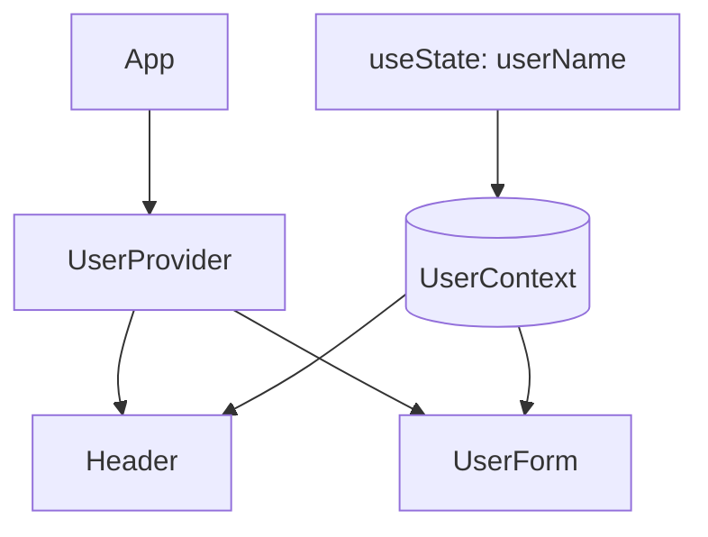

# 第79章：`useContext` と `useState` を組み合わせる
**「`useContext` と `useState` を組み合わせて、みんなで同じ状態を共有する」** ✨
という超よく使うパターンをやっていきます 🎉

---

## 79-1. この章でできるようになること 🎯

この章のゴールはこんな感じです👇

* `useState` で作った「状態」を Context 経由でアプリ全体に配る 💌
* どのコンポーネントからでもその状態を「読む・書く」ことができるようにする ✏️
* Contextの「中身の型」を、**状態＋それを変更する関数**のセットとして定義できる 💡

イメージとしては、

> 「`UserProvider` っていう管理人さんが、
> みんなが見れるホワイトボード（Context）に “ユーザー名” を書いておく」

みたいな感じです ✍️🧑‍🏫

---

## 79-2. ざっくり構成イメージ（Mermaid図）🧠✨

作る流れを図にするとこんな感じになります👇



* `UserProvider` の中で `useState` を使って `userName` を持つ 💾
* その `userName` と、名前を変える関数を `UserContext` に入れて配る 📦
* `Header` と `UserForm` は `useUserContext()` でそのデータにアクセスする 🔍

---

## 79-3. 今回つくるミニアプリのゴール 🧩

**「ユーザー名をアプリ全体で共有する」** ミニアプリを作ります 💻

* 上のほう（ヘッダー）に
  👉 「こんにちは、○○ さん」 と表示する
* 下のほうに
  👉 名前入力フォームを置いて、変えるとヘッダーの表示も変わる

つまり、**フォームで変えた名前が、アプリ全体に反映される**状態を作ります ✨

---

## 79-4. Context の「中身の型」を決める 🧾

まずは、Context で配るデータの「形（型）」を決めます。

* 今回配りたいものはこの2つ 👇

  * 現在のユーザー名 `userName: string`
  * ユーザー名を変えるための関数 `updateUserName: (name: string) => void`

`src/UserContext.tsx` を作って、まずは型から定義してみましょう ✏️

```tsx
// src/UserContext.tsx
import { createContext, useContext, useState, type ReactNode } from "react";

// ✅ Context の中身の型
type UserContextValue = {
  userName: string;
  updateUserName: (name: string) => void;
};
```

ここまでは「ただの型」なので、TSの世界の準備運動です 🧘‍♀️

---

## 79-5. `UserProvider` の中で `useState` を使う 💾

次は、**実際に状態を持つ `UserProvider` コンポーネント** を作ります。

ポイントはこの3つ 💡

1. `useState` で `userName` の状態を持つ
2. `updateUserName` という「名前を変える関数」を用意する
3. それらをまとめて `UserContext.Provider` の `value` に入れて配る

```tsx
// src/UserContext.tsx
import { createContext, useContext, useState, type ReactNode } from "react";

// Context の中身の型
type UserContextValue = {
  userName: string;
  updateUserName: (name: string) => void;
};

// 🔸 まだ中身は「ない」状態で Context を作る（型だけ指定）
const UserContext = createContext<UserContextValue | undefined>(undefined);

// Provider が受け取る props の型（子どもを包むだけ）
type UserProviderProps = {
  children: ReactNode;
};

// 🔹 状態を持って、みんなに配る役
export function UserProvider({ children }: UserProviderProps) {
  const [userName, setUserName] = useState("ゲスト");

  // 状態を変更するための関数（ラッパー）
  function updateUserName(name: string) {
    setUserName(name);
  }

  const value: UserContextValue = {
    userName,
    updateUserName,
  };

  return <UserContext.Provider value={value}>{children}</UserContext.Provider>;
}
```

ここまでで、

* `UserProvider` の中で `useState` が動いていて 🧠
* その結果（状態と、それを変える関数）を
  `UserContext.Provider` 経由でアプリ全体に配っている 🎁

という形になります。

---

## 79-6. `useUserContext` カスタムフックで楽に使う 🧪

毎回 `useContext(UserContext)` を直接書くと、
`undefined` チェックを書き忘れてバグりやすいので、
**「必ず Provider の中で使うよ」チェックまでセットにしたカスタムフック**を作ります ✅

```tsx
// src/UserContext.tsx の続き

export function useUserContext(): UserContextValue {
  const context = useContext(UserContext);

  if (context === undefined) {
    // Provider の外で使ったらすぐ気づけるようにエラーにしておく
    throw new Error("useUserContext は UserProvider の中で使ってください。");
  }

  return context;
}
```

これで、他のコンポーネントからは

* `const { userName } = useUserContext();`
* `const { updateUserName } = useUserContext();`

みたいに、型付きでサクッと使えるようになります 🎉

---

## 79-7. `App` を `UserProvider` で包む 🌎

アプリ全体で状態を共有したいので、
**いちばん外側で `UserProvider` を使って包みます**。

`src/App.tsx` はこんなイメージにしてみます👇

```tsx
// src/App.tsx
import { UserProvider } from "./UserContext";
import { Header } from "./Header";
import { UserForm } from "./UserForm";

export function App() {
  return (
    <UserProvider>
      <div style={{ maxWidth: 480, margin: "0 auto", padding: "1.5rem" }}>
        <Header />
        <hr />
        <UserForm />
      </div>
    </UserProvider>
  );
}
```

ここでのポイント ✨

* `UserProvider` の「内側」にあるコンポーネントは、
  ぜんぶ `useUserContext()` で同じ `userName` にアクセスできます 💬

---

## 79-8. ヘッダーでユーザー名を「読む」だけのコンポーネント 🪪

次に、**読むだけ**のコンポーネントを作ります。

`src/Header.tsx`：

```tsx
// src/Header.tsx
import { useUserContext } from "./UserContext";

export function Header() {
  const { userName } = useUserContext();

  return (
    <header style={{ marginBottom: "1rem" }}>
      <h1>こんにちは、{userName} さん 👋</h1>
      <p>この名前はアプリ全体で共有されています 🌍</p>
    </header>
  );
}
```

* `useUserContext()` で `userName` を取り出して表示しているだけ ✨
* ここではまだ `updateUserName` は使っていません（参照専用）👀

---

## 79-9. フォームからユーザー名を「書き換える」コンポーネント ✏️

最後に、**フォームから名前を変更するコンポーネント**を作ります。

* 入力が変わるたびに `updateUserName` を呼ぶ
* その結果が Context に入り、アプリ全体に反映される

`src/UserForm.tsx`：

```tsx
// src/UserForm.tsx
import { useUserContext } from "./UserContext";
import type { ChangeEvent } from "react";

export function UserForm() {
  const { userName, updateUserName } = useUserContext();

  function handleChange(e: ChangeEvent<HTMLInputElement>) {
    updateUserName(e.target.value);
  }

  return (
    <section style={{ display: "flex", flexDirection: "column", gap: "0.5rem" }}>
      <label>
        表示する名前を変えてみよう 🎨
        <input
          type="text"
          value={userName}
          onChange={handleChange}
          placeholder="例: さくら / ゆい / まい など"
          style={{ padding: "0.5rem", width: "100%", marginTop: "0.25rem" }}
        />
      </label>
      <p>ここで変えた名前が、上のヘッダーにもすぐ反映されます ✨</p>
    </section>
  );
}
```

これで、

1. 入力欄に文字を打つ ✍️
2. `handleChange` が呼ばれる
3. `updateUserName` に新しい文字列が渡される
4. `UserProvider` の中の `useState` が更新される
5. Context の値が変わり、`Header` も `UserForm` も再レンダリングされる

という流れになります 🚀

---

## 79-10. もう一度、全体の流れを整理しよう 🧹

整理すると、`useContext` と `useState` の組み合わせはこんな感じです👇

1. **Provider の中で `useState`** を使って、
   「みんなで共有したい状態」を持つ 💾

2. 状態（`userName`）と、それを変える関数（`updateUserName`）を
   **Context の `value` にまとめて入れる** 🎁

3. アプリの外側で `UserProvider` でコンポーネントを包むことで、
   その内側のコンポーネントは **どこからでも `useUserContext()` で状態を使える** 🌍

4. 読みたいコンポーネント → `userName` を取り出して表示 👀

5. 書き換えたいコンポーネント → `updateUserName("新しい名前")` を呼ぶ ✏️

---

## 79-11. よくあるハマりポイント 🔥

最後に、よくハマりがちなポイントもチェックしておきましょう ✅

* 🔸 **Provider の外で `useUserContext()` を呼んでしまう**
  → 今回のカスタムフックでは `Error` を投げるようにしてあるので、
  「あ、包むの忘れてた！」ってすぐ気づけます。

* 🔸 Context の型に「状態だけ」しか入れてない
  → 「状態を変える関数」も一緒に入れておくと、
  どこからでも書き換えられて超便利になります ✨

* 🔸 `UserProvider` を複数箇所にバラバラに置いてしまう
  → それぞれ別々の状態になるので、
  「アプリ全体で一つだけ共有したい状態」は、
  なるべく上の方で一回だけ包むのがオススメです 🙆‍♀️

---

## 79-12. 発展アイデア（余力があれば）💡

時間と気力に余裕があれば、試してみてください ✨

* `userName` だけじゃなくて、

  * `isLoggedIn: boolean`
  * `theme: "light" | "dark"`
    なども同じ Context に入れてみる 🌙

* 別の Context を作って、

  * 「ログイン情報用」
  * 「テーマ用」
    みたいに分けてみるのもアリです 🧺

---

これで **「`useContext` と `useState` を組み合わせて、全員で状況を共有する」** パターンはバッチリです 🎉
次の章（第80章）では、この流れを使って **ダークモード切り替え** を作っていきましょう 🌙☀️
