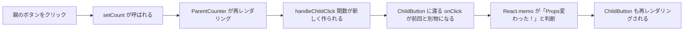

# 第83章：`React.memo` が効かない時

「`React.memo` 使えばサクサクになるんでしょ？😊」と思って書いてみたのに、
**全然レンダリング減ってないんだけど！？😨** …というときの典型パターンが、

> 👉 **「関数を Props で渡している」**

この章ではここをしっかり押さえます✨

---

## 今日のゴール 🎯

この章が終わるころには、こんなことが分かります。

* `React.memo` がどんな仕組みで「再レンダリングをスキップ」しているか
* **関数を Props で渡すと、なぜ `React.memo` が効きにくいのか**
* どんな書き方をすると `React.memo` の意味が薄くなるのか
* 「あ、ここは `React.memo` しても意味ないな〜」と判断できる感覚

次の章で出てくる **`useCallback`** の布石にもなります 💡

---

## 1. `React.memo` の中で何が起きているの？🧠

まずはおさらいです。

`React.memo` は、**「同じ Props なら再レンダリングをスキップするよ」** という仕組みでしたね。
公式ドキュメントでは、こんな感じに説明されています：

* `React.memo` は **「浅い比較（shallow equality）」** で古い Props と新しい Props を比べる
* つまり、各 Props が **前回と「同じ参照（reference）」かどうか** を見ている ([React][1])

ここで大事なキーワードが **「参照の比較（referential equality）」** です。 ([Medium][2])

### ざっくりイメージ 🧊🔥

* **数値・文字列（プリミティブ）**
  `1` → `1` とか `"A"` → `"A"` なら「同じ」とみなされやすい

* **オブジェクト / 配列 / 関数**
  中身が同じでも、「毎回新しく作り直される」と
  React から見ると **「別物」** になってしまう

関数も **オブジェクトの一種** なので、
「同じ内容の関数」を毎回作っていても、React からは

> 前回の `onClick` と今回の `onClick` は別物だな〜

と判断されます。

---

## 2. 「関数を Props で渡す」と何が起こるの？🤔

React のコンポーネントではよく、

* 親 👩‍💻 → 子 👧 に「クリックされたよ〜」と伝えるために
* 親から **関数を Props として渡す**

ということをします。

```tsx
// こんなイメージ（※ここではまだ TypeScript 型は省略）
<Child onClick={handleChildClick} />
```

とてもよくあるパターンです。
でも、この **`onClick` という関数 Props が「毎回新しくなる」** と、

> `React.memo` が「Props変わってるやん！」と判断して、
> 結局 子コンポーネントが毎回レンダリングされる 🥲

という残念なことが起きます。

---

## 3. 実験：`React.memo` してるのに毎回レンダリングされちゃう例 🔬

一緒に、小さなデモコンポーネントを書いてみましょう ✍️

### 3-1. 子コンポーネント：`ChildButton`

`src/ChildButton.tsx` を作って、こんなコードを書きます。

```tsx
// src/ChildButton.tsx
import { memo } from "react";

type ChildButtonProps = {
  onClick: () => void;
};

const ChildButtonComponent = ({ onClick }: ChildButtonProps) => {
  console.log("ChildButton がレンダリングされたよ 🧸");
  return (
    <button onClick={onClick}>
      子ボタン（押すとアラートが出るよ）
    </button>
  );
};

// React.memo でラップ！
export const ChildButton = memo(ChildButtonComponent);
```

* `console.log` で「いつレンダリングされたか」を見えるようにしています 👀
* `React.memo` でちゃんとラップしているので、
  **同じ Props なら再レンダリングされないはず…** ですよね？（フラグ）

### 3-2. 親コンポーネント：`ParentCounter`

次に、親コンポーネントを作ります。

```tsx
// src/ParentCounter.tsx
import { useState } from "react";
import { ChildButton } from "./ChildButton";

export const ParentCounter = () => {
  const [count, setCount] = useState(0);

  console.log("ParentCounter がレンダリングされたよ 🐱");

  const handleChildClick = () => {
    alert("子ボタンがクリックされました ✨");
  };

  return (
    <div style={{ padding: "16px", border: "1px solid #ccc" }}>
      <h2>ParentCounter</h2>
      <p>count: {count}</p>
      <button onClick={() => setCount(count + 1)}>
        親のカウントを増やす
      </button>

      <hr />

      <ChildButton onClick={handleChildClick} />
    </div>
  );
};
```

そして `App.tsx` などから `ParentCounter` を表示しておきます。

```tsx
// src/App.tsx
import { ParentCounter } from "./ParentCounter";

export const App = () => {
  return (
    <div>
      <h1>React.memo 実験コーナー 🧪</h1>
      <ParentCounter />
    </div>
  );
};
```

ブラウザのコンソールを開いて、
「親のボタン（カウントを増やす）」を何回かクリックしてみてください 👆

* `ParentCounter がレンダリングされたよ 🐱`
* `ChildButton がレンダリングされたよ 🧸`

が **毎回** 両方とも出てきませんか？ 🥶

> えっ！？ 子は `React.memo` してるのに？？

そう、これが **「関数 Props の罠」** です。

---

## 4. なんで `React.memo` が効かないの？🧩

ポイントはここです👇

```tsx
const handleChildClick = () => {
  alert("子ボタンがクリックされました ✨");
};
```

この関数、**コンポーネントの中で定義**していますよね。

* 親コンポーネント `ParentCounter` が

  * `setCount` で state を更新
  * それによって再レンダリングされる
* すると…

  * `const handleChildClick = () => { ... }` が **毎回新しく作り直される**
  * React から見ると「前回の `handleChildClick` と今回の `handleChildClick` は別の関数」
  * つまり `onClick` Prop が「変わった」とみなされる

公式ドキュメントでも、

> 親コンポーネントのレンダー時に新しい関数を作ると、
> その関数を Props で受け取る子は「Props が変わった」とみなされて再レンダリングされる

という話が出てきます。([React][1])

`React.memo` がやっているのは **「前回の Props と今回の Props が同じ参照か？」** のチェックだけなので、

> 前回: `onClick` → 関数A
> 今回: `onClick` → 関数B（中身は同じでも、メモリ上では別）

となると、**「違うものだね」** と判断されてしまうんですね。

---

## 5. 図でイメージしてみよう（Mermaid）🗺️

関数 Props が原因で再レンダリングされる流れを、
図でざっくり追ってみましょう ✨



こんな感じで、

* `count` が変わる
* 親が再レンダリングされる
* そのたびに **新しい関数が作られる**
* そのせいで **`React.memo` がうまく効かない**

という流れになっています。

---

## 6. よくある「やっちゃいがち」パターン 😵

関数 Props が絡むと、`React.memo` が効きにくいパターンはいくつかあります。

### 6-1. JSX の中で匿名関数（アロー関数）を毎回作る

```tsx
<ChildButton onClick={() => alert("クリック")} />
```

これも毎回 **新しい関数** が作られるので、
`React.memo` していても子コンポーネントは再レンダリングされます。

### 6-2. ID 付きの関数を渡したいとき

```tsx
<TodoItem
  todo={todo}
  onDelete={() => handleDelete(todo.id)}
/>
```

これも毎回 `() => handleDelete(todo.id)` が新しく作られます。

こういう書き方自体は **React としては普通にアリ** なのですが、

* `TodoItem` が重いコンポーネント
* リストが大量にある

みたいなときは、**パフォーマンス的にちょっとつらくなってくる**ことがあります。 ([strapi.io][3])

---

## 7. 「じゃあどうしたらいいの？」の入口 🚪

この章のテーマは

> 「`React.memo` が効かないパターンを知ること」

なので、**本格的な対策は次の章（`useCallback`）でじっくりやります** 💪

ここでは、軽く「こういう方向に解決していくんだな〜」くらいをつかんでおきましょう。

### 解決の方向性イメージ ✨

* **関数の「参照」を安定させてあげる** ことで、

  * 親が何度か再レンダリングされても
  * 子に渡す `onClick` の中身（参照）が変わらないようにする

これを React で実現する代表的なやり方が **`useCallback`** です。
（`useCallback` の詳しい書き方や型付けは「第84章」でやります📚）

---

## 8. ちょっとだけ練習問題 📝

最後に、自分の手で試してみるコーナーです。

### 練習1：`React.memo` を外してみよう

さっきの `ChildButton` から `memo` を一旦外してみてください。

```tsx
// export const ChildButton = memo(ChildButtonComponent);
export const ChildButton = ChildButtonComponent;
```

もう一度、親のボタンをカチカチしてみて、

* コンソールログの様子が **`memo` ありのときとどう違うか**
* そもそも **「あんまり変わらないな？」** と感じるかどうか

を観察してみましょう 👀

> 実は、**コンポーネントが軽い間は `React.memo` の効果がほぼなくて、
> むしろ比較コストでちょっとだけ遅くなる** こともあります。([contentful.com][4])

「とりあえず全部 `React.memo` にしとこ！」はおすすめできない、という感覚も大事です。

### 練習2：関数 Props をやめてみる（できる範囲で）

簡単な例として、`ChildButton` の中に `alert` を直接書いてしまうとどうなるでしょう？

```tsx
// ChildButton.tsx
const ChildButtonComponent = () => {
  console.log("ChildButton がレンダリングされたよ 🧸");
  return (
    <button
      onClick={() => {
        alert("子ボタンがクリックされました ✨");
      }}
    >
      子ボタン（押すとアラートが出るよ）
    </button>
  );
};
```

この場合は、

* 親から関数を Props として渡していないので、
* **「関数 Props が毎回変わる」問題はそもそも起きない**

という状態になります。

もちろん、現実のアプリでは

* 親の state を変更したい
* 親に「どの TODO が押されたか」を教えたい

などの理由で **親から関数を渡す必要が出てきます**。
だからこそ、次の章で **`useCallback` による「関数の安定化」** を学ぶわけです ✨

---

## 9. まとめ 🌟

この章のポイントをぎゅっとまとめると…

* `React.memo` は「前回と今回の Props を浅く比較」して、
  **同じ参照なら再レンダリングをスキップ** する仕組み
* 関数もオブジェクトの一種なので、

  * コンポーネントの中で毎回新しく作られると
  * React から見ると **毎回「別物の Props」** に見えてしまう
* その結果、**関数を Props で渡している子コンポーネントは、`React.memo` を付けていても再レンダリングされがち**
* 解決の方向性は

  * 「関数の参照を安定させる」
  * ＝ 次の章で学ぶ **`useCallback`** の出番 💪

次の **第84章** では、
この「関数を安定させる」ためのフック **`useCallback`** を、
型定義も含めてじっくり扱っていきます！🎉

ここまでおつかれさまです〜 🥰🍵

[1]: https://react.dev/reference/react/memo?utm_source=chatgpt.com "memo"
[2]: https://medium.com/%40abhikshirsagar1999/understanding-referential-equality-in-react-a-key-to-optimizing-performance-45342c753dea?utm_source=chatgpt.com "Understanding Referential Equality in React: A Key to ..."
[3]: https://strapi.io/blog/react-memo-optimize-functional-components-guide?utm_source=chatgpt.com "React.memo Optimization Guide for Functional Components"
[4]: https://www.contentful.com/blog/react-memo-improve-performance/?utm_source=chatgpt.com "What is React memo? How to improve React performance"
