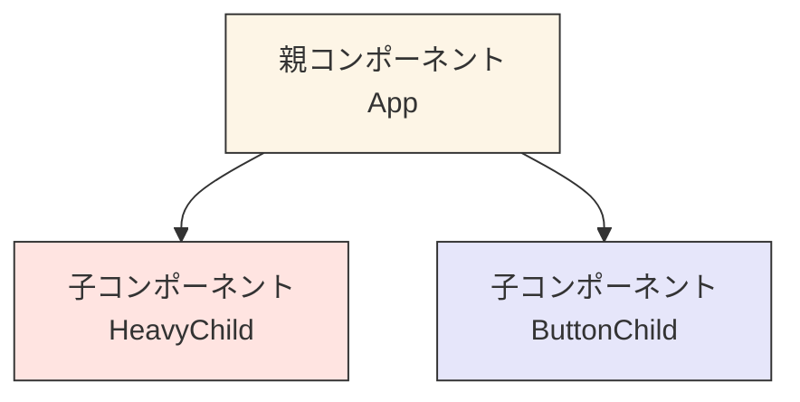

# 第85章：練習：`React.memo` と `useCallback` で子部品がムダに動かないようにする

「ボタンを1回押しただけなのに、関係ない部品まで毎回レンダリングされてたらイヤだなぁ…🤔」
そんなときに活躍するのが **`React.memo`** と **`useCallback`** です。

この章では、小さなサンプルアプリを作りながら、

* 親が再レンダリングされても
* 子コンポーネントが **ムダに動かないようにする**

というテクニックを体で覚えていきます 💪✨

---

## 🎯 今日のゴール

* 「再レンダリング」が何を意味しているか、ざっくりイメージできる
* `React.memo` が **どんなときに効くのか / 効かないのか** を体験できる
* `useCallback` を使って、**関数のProps**を安定させる書き方が分かる
* コンソールログを見ながら「おぉ、止まった！😳」という感覚を味わう

---

## 👀 まずイメージ：親と子の再レンダリング

Reactコンポーネントは、**親のStateが変わると親が再レンダリング**されて、
その子コンポーネントもいっしょにレンダリングされることが多いです。

図でイメージしてみましょう 🖼️



* `App` の State が変わるたびに
* `HeavyChild` も `ButtonChild` もいっしょに描き直されがち…😇

**`React.memo` + `useCallback`** を使うと、

> 「この子は、Propsの中身が変わらないなら描き直さなくていいよ〜」

とReactにお願いできるようになります✨

---

## 🧪 ステップ1：ベースのカウンターアプリを用意しよう

まずはシンプルな `App.tsx` を用意します。
（ViteのReact-TSプロジェクトができている前提です）

`src/App.tsx` を、いったん次のようにします👇

```tsx
import { useState } from "react";

function App() {
  const [parentCount, setParentCount] = useState(0);

  console.log("App がレンダリングされました ✨");

  return (
    <div style={{ padding: "24px", fontFamily: "sans-serif" }}>
      <h1>React.memo &amp; useCallback 練習 🎮</h1>

      <p>親カウンター: {parentCount}</p>

      <button
        onClick={() => setParentCount((prev) => prev + 1)}
        style={{ padding: "8px 16px", marginRight: "8px" }}
      >
        親カウンターを +1
      </button>
    </div>
  );
}

export default App;
```

ブラウザを開いて、ボタンを何回か押してみてください。
そのうえで、**ブラウザの開発者ツール（F12）→ Consoleタブ** を見てみましょう 👀

* ボタンを押すたびに
  `App がレンダリングされました ✨`
  が表示されているはずです。

👉 これが「再レンダリング」のイメージです。

---

## 🧸 ステップ2：子コンポーネントを作って、ログを出してみる

親の中に、ちょっと「重そうな子」を用意して、
**本当に毎回再レンダリングされているのか** を確認します。

### 2-1. `ChildCounter.tsx` を作成する

`src/components/ChildCounter.tsx` を新規作成します 🗂️

```tsx
import React from "react";

type ChildCounterProps = {
  label: string;
  count: number;
};

export const ChildCounter = ({ label, count }: ChildCounterProps) => {
  console.log(`ChildCounter "${label}" がレンダリングされました 🐣`);

  // 実際のアプリでは、ここで重そうな処理をしているイメージ
  // for (let i = 0; i < 1_000_000; i++) {
  //   // 何か計算する…（コメントアウトのままでOK）
  // }

  return (
    <div
      style={{
        border: "1px solid #ccc",
        padding: "12px",
        borderRadius: "8px",
        marginTop: "16px",
      }}
    >
      <p style={{ margin: 0 }}>
        <strong>{label}</strong> の値は <strong>{count}</strong> です 🎯
      </p>
    </div>
  );
};
```

### 2-2. 親でこの子を使う

`App.tsx` を少し書き換えて、`ChildCounter` を表示してみます。

```tsx
import { useState } from "react";
import { ChildCounter } from "./components/ChildCounter";

function App() {
  const [parentCount, setParentCount] = useState(0);

  console.log("App がレンダリングされました ✨");

  return (
    <div style={{ padding: "24px", fontFamily: "sans-serif" }}>
      <h1>React.memo &amp; useCallback 練習 🎮</h1>

      <p>親カウンター: {parentCount}</p>

      <button
        onClick={() => setParentCount((prev) => prev + 1)}
        style={{ padding: "8px 16px", marginRight: "8px" }}
      >
        親カウンターを +1
      </button>

      <ChildCounter label="子カウンター" count={0} />
    </div>
  );
}

export default App;
```

再びブラウザでボタンをポチポチして、Consoleを見てください👇

* `App がレンダリングされました ✨`
* `ChildCounter "子カウンター" がレンダリングされました 🐣`

が **毎回** 両方出ているはずです。

> え、`ChildCounter` は `count={0}` で、
> 何も変わってないのに毎回描き直されてる…？🤯

はい、その通りです。
**親がレンダリングされると、子もふつうは一緒にレンダリングされます。**

---

## 🧊 ステップ3：`React.memo` で子を「メモ化」してみる

ここで登場するのが `React.memo` です ✨

> 「この子は、**Propsが変わらなければ** もう一回描き直さなくていいよ」

とReactにお願いするラッパー関数です。

`ChildCounter.tsx` を、次のように書き換えます👇

```tsx
import React from "react";

type ChildCounterProps = {
  label: string;
  count: number;
};

// React.memo でコンポーネントをラップ
export const ChildCounter = React.memo(function ChildCounter(
  { label, count }: ChildCounterProps
) {
  console.log(`ChildCounter "${label}" がレンダリングされました 🐣`);

  return (
    <div
      style={{
        border: "1px solid #ccc",
        padding: "12px",
        borderRadius: "8px",
        marginTop: "16px",
      }}
    >
      <p style={{ margin: 0 }}>
        <strong>{label}</strong> の値は <strong>{count}</strong> です 🎯
      </p>
    </div>
  );
});
```

ポイント 💡

* 関数を `React.memo(...)` に渡してあげるだけ
* Props (`label`, `count`) が前回と同じなら、**再レンダリングをスキップ** してくれます

もう一度ブラウザでボタンをカチカチしてみてください 🖱️

* `App がレンダリングされました ✨` は毎回出る
* でも `ChildCounter "子カウンター" がレンダリングされました 🐣` は
  **最初の1回だけ** になっているはずです 🎉

> Props が変わってないなら、描き直す必要ないよね〜
> という賢い最適化をしてくれるイメージです。

---

## 🔥 ステップ4：関数をPropsで渡すと、なぜかまた動き出す…？

次は、子コンポーネントに「ボタン」と「クリック時の関数」を渡してみます。

### 4-1. 子に `onClick` を追加

`ChildCounter.tsx`：

```tsx
import React from "react";

type ChildCounterProps = {
  label: string;
  count: number;
  onClick: () => void;
};

export const ChildCounter = React.memo(function ChildCounter(
  { label, count, onClick }: ChildCounterProps
) {
  console.log(`ChildCounter "${label}" がレンダリングされました 🐣`);

  return (
    <div
      style={{
        border: "1px solid #ccc",
        padding: "12px",
        borderRadius: "8px",
        marginTop: "16px",
      }}
    >
      <p style={{ margin: 0 }}>
        <strong>{label}</strong> の値は <strong>{count}</strong> です 🎯
      </p>
      <button
        onClick={onClick}
        style={{ marginTop: "8px", padding: "4px 12px" }}
      >
        子のボタンをクリック ✨
      </button>
    </div>
  );
});
```

### 4-2. 親から `onClick` 関数を渡す

`App.tsx`：

```tsx
import { useState } from "react";
import { ChildCounter } from "./components/ChildCounter";

function App() {
  const [parentCount, setParentCount] = useState(0);

  console.log("App がレンダリングされました ✨");

  // 親の中でその場で関数を作って渡す
  const handleChildClick = () => {
    console.log("子のボタンがクリックされました 🎀");
  };

  return (
    <div style={{ padding: "24px", fontFamily: "sans-serif" }}>
      <h1>React.memo &amp; useCallback 練習 🎮</h1>

      <p>親カウンター: {parentCount}</p>

      <button
        onClick={() => setParentCount((prev) => prev + 1)}
        style={{ padding: "8px 16px", marginRight: "8px" }}
      >
        親カウンターを +1
      </button>

      <ChildCounter
        label="子カウンター"
        count={0}
        onClick={handleChildClick}
      />
    </div>
  );
}

export default App;
```

もう一度、親の「+1」ボタンを押しながらコンソールを見てみましょう 👀

* `App がレンダリングされました ✨`
* `ChildCounter "子カウンター" がレンダリングされました 🐣`

が、**また毎回出てきてしまっていませんか？** 😱

### 4-3. なぜ `React.memo` が効かなくなったの？

`React.memo` は、「前回のProps」と「今回のProps」を
**浅い比較（shallow equal）** でチェックしています。

* `number` や `string` などの「値」は比較しやすい
* でも `関数` は **毎回「新しいオブジェクト」扱い**

> 見た目は同じ関数でも、
> 「前回の関数」と「今回の関数」は別モノとして扱われる 💣

その結果、

* `onClick` Props が「前回と違う」と判断される
* → `React.memo` が「違うPropsだからレンダリングしよ〜」となる
* → 子コンポーネントが毎回レンダリングされてしまう

ここで登場するのが… **`useCallback`** です ✨

---

## 🧠 ステップ5：`useCallback` で関数を「覚えておく」

`useCallback` は、

> 「この関数、**依存している値が変わらない限り** 同じ関数を使い回してね」

とReactにお願いするフックです。

### 5-1. `useCallback` で `handleChildClick` を安定させる

`App.tsx` を修正します👇

```tsx
import { useState, useCallback } from "react";
import { ChildCounter } from "./components/ChildCounter";

function App() {
  const [parentCount, setParentCount] = useState(0);

  console.log("App がレンダリングされました ✨");

  const handleChildClick = useCallback(() => {
    console.log("子のボタンがクリックされました 🎀");
  }, []); // 依存している値がないので、ずっと同じ関数になる

  return (
    <div style={{ padding: "24px", fontFamily: "sans-serif" }}>
      <h1>React.memo &amp; useCallback 練習 🎮</h1>

      <p>親カウンター: {parentCount}</p>

      <button
        onClick={() => setParentCount((prev) => prev + 1)}
        style={{ padding: "8px 16px", marginRight: "8px" }}
      >
        親カウンターを +1
      </button>

      <ChildCounter
        label="子カウンター"
        count={0}
        onClick={handleChildClick}
      />
    </div>
  );
}

export default App;
```

ここがポイント 🌟

* `useCallback(() => { ... }, [])`

  * `[]` は「依存している値がない」という意味
  * 初回レンダリング時に作られた関数を、**それ以降も再利用**します
* つまり、`handleChildClick` は
  親が再レンダリングされても **同じ関数のまま**

その結果…

* `ChildCounter` に渡される `onClick` Props が **変わらない**
* `React.memo` の比較で「前回と同じPropsだね」と判断される
* → **子コンポーネントの再レンダリングがスキップ** 🎉

実際にもう一度、親の「+1」ボタンを何度か押して、Consoleを確認してみてください。

* `App がレンダリングされました ✨` は毎回出ている
* `ChildCounter "子カウンター" がレンダリングされました 🐣` は
  **最初の1回だけのはず** です 😎

---

## 🧩 もう少しだけ：依存配列がある場合

もし `handleChildClick` の中で、何かStateを使っていたらどうでしょう？

例：親のカウンターの値をログに出したい場合

```tsx
const handleChildClick = useCallback(() => {
  console.log(`今の親カウンター: ${parentCount}`);
}, [parentCount]);
```

* この場合、`parentCount` が変わるたびに
  `handleChildClick` も **新しく作り直される**
* なので、そのときだけは `React.memo` の比較で
  「Propsが変わった」と判断され、子がレンダリングされます

👉 つまり、

* **最新の値を使いたい** → 依存配列に入れる（レンダリングも起こる）
* **常に同じ処理でOK** → 依存配列を空にする `[]`（レンダリングを抑える）

というトレードオフがあります ⚖️

---

## ✅ この章のまとめ

* 親のStateが変わると、**子コンポーネントも連鎖的に再レンダリング**されがち
* `React.memo` は「Propsが同じならレンダリングをスキップ」してくれる ✨
* でも **関数Props** は毎回別物扱いになるので、`React.memo` が効きにくい 😢
* `useCallback` で関数をメモ化すると、

  * 関数の参照が安定して
  * `React.memo` がちゃんと効くようになる 💪
* 依存配列 `[]` / `[value]` をうまく使い分けるのがコツ 🎓

---

## 🎒 ミニ練習問題（やってみよう！）

1. **子カウンターにもStateを持たせてみる**

   * `ChildCounter` の中で `useState` を使って、
     「子だけのカウンター」を増やすボタンを作ってみてください。
   * `React.memo` と `useCallback` を使って、
     「親のカウンターを増やしても、子カウンターは再レンダリングされない」状態を目指してみましょう。

2. **`useCallback` をあえて外してみる**

   * `handleChildClick` をふつうの関数に戻して
     （`const handleChildClick = () => { ... }`）
   * もう一度コンソールログの違いを観察してみてください。
   * 「何が原因で無駄なレンダリングが起きるのか」を、目で見て確認してみましょう 👀

3. **ログメッセージを工夫してみる**

   * `App` と `ChildCounter` のログに、絵文字やラベルを増やして、
   * どのタイミングでどれが呼ばれているか、さらに分かりやすくしてみてください 🎨

---

次の章では、`useMemo` を使って **「重たい計算結果」そのもの** をメモ化していきます。
`React.memo` / `useCallback` / `useMemo` がそろうと、
パフォーマンスチューニングの武器が一気に増えますよ〜⚔️✨
