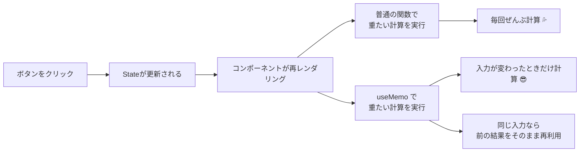

# 第87章：練習：`useMemo` で重たい計算をスキップする

---

## 1️⃣ 今日のゴール 🎯

この章では、

> 「めちゃくちゃ重たい計算があるけど、**必要なときだけ**実行したい！」

というときに使う `useMemo` を、**実際のミニアプリを作りながら体で覚える**ことがゴールです✨

やることはシンプル👇

* 「カウント」を増やすボタン ➕
* 「メモ用のテキスト入力欄」📝
* カウントに応じて **重たい計算を行う関数** を用意
* まずは **`useMemo` なしで動かして** 大変さを体感
* 次に **`useMemo` を入れてサクサクに改善** ✨

---

## 2️⃣ ざっくりイメージ：`useMemo` ってどこで効いてるの？🧐

Reactは「Stateが変わる」たびに、**そのコンポーネントをもう一度よみがえらせる（再レンダリング）** っていう動きをします。
このとき、コンポーネントの中で

* 超重たい計算関数（ループしまくりとか）
* フィルター・ソートしまくる処理

などがあると、**ちょっとした変更でも毎回それが走ってしまう**んですね😇

`useMemo` はざっくりいうと…

> 「**入力が変わってないなら、前に計算した結果を使い回そう**」

という、**結果のメモ帳（キャッシュ）** です✨

---

## 3️⃣ 図で見る：`useMemo` がない場合 vs ある場合 🧩

Mermaid図でイメージを整理してみます🌟



イメージとしては、

* **通常の関数**：再レンダリングのたびに毎回がっつり計算
* **`useMemo`**：

  * 「前と同じ入力かな？」とチェック
  * 同じなら「前の結果そのまま出すね〜」とラクをする🎵

という感じです。

---

## 4️⃣ 作るミニアプリの仕様 💻✨

こんな画面を目指します👇

* 「カウント」：`+1` / `-1` ボタン
* 「メモ用テキスト」：自由に入力できる
* 「重たい計算の結果」：`count` を元に計算した何かの数字
* **DevToolsのコンソールで**
  「重たい計算が実行されたよ！」というログを出す

ポイントはここ👇

> テキスト入力を打つだけで、
> 重たい計算が**毎回走るのはもったいない**よね？

これを、`useMemo` で解決していきます💪

---

## 5️⃣ STEP 0：準備（プロジェクトを起動）🚀

すでに Vite + React + TS プロジェクトがある前提で進みます。

1. プロジェクトフォルダを開く（例：`my-react-app`）

2. ターミナルで

   ```bash
   npm install
   npm run dev
   ```

3. ブラウザで `http://localhost:5173` を開く

OKなら、`src/App.tsx` を編集していきましょう🧑‍💻

---

## 6️⃣ STEP 1：`useMemo` なしバージョンを作る（あえて重くする）🔥

まずは **あえてダメなやり方** を作ります。
これで、`useMemo` のありがたみがハッキリわかります✨

`src/App.tsx` を、いったんまるっと書き換えてOKです👇

```tsx
import { useState, ChangeEvent } from "react";

function heavyCalculation(num: number): number {
  console.log("🔥 heavyCalculation が呼ばれました！");

  // 疑似的に「重たい処理」を再現する
  // 回数はPCに合わせて調整してね（最初は 20_000_000 くらいが無難）
  let total = 0;
  for (let i = 0; i < 20_000_000; i++) {
    total += i % 7;
  }

  // 実際の結果は num をちょっと加工しただけ
  return num * 2 + (total % 1000);
}

function App() {
  const [count, setCount] = useState<number>(0);
  const [text, setText] = useState<string>("");

  const handleIncrement = () => {
    setCount((prev) => prev + 1);
  };

  const handleDecrement = () => {
    setCount((prev) => prev - 1);
  };

  const handleChange = (e: ChangeEvent<HTMLInputElement>) => {
    setText(e.target.value);
  };

  // ❌ useMemo なしで、毎回重たい計算を実行している
  const result = heavyCalculation(count);

  return (
    <div style={{ padding: "24px", fontFamily: "system-ui" }}>
      <h1>useMemo 練習アプリ 💡</h1>

      <section style={{ marginBottom: "16px" }}>
        <h2>カウント 🔢</h2>
        <p>count: {count}</p>
        <button onClick={handleDecrement} style={{ marginRight: "8px" }}>
          -1
        </button>
        <button onClick={handleIncrement}>+1</button>
      </section>

      <section style={{ marginBottom: "16px" }}>
        <h2>メモ入力 ✍️</h2>
        <input
          type="text"
          value={text}
          onChange={handleChange}
          placeholder="ここにテキストを入力してね"
          style={{ padding: "4px 8px", width: "280px" }}
        />
        <p>入力中のテキスト：{text}</p>
      </section>

      <section>
        <h2>重たい計算の結果 🧮</h2>
        <p>結果: {result}</p>
        <p style={{ fontSize: "12px", color: "#666" }}>
          ※ コンソールを開くと、いつ計算が走っているか見えます 👀
        </p>
      </section>
    </div>
  );
}

export default App;
```

---

## 7️⃣ STEP 2：一度動かして「問題」を体感する 😵‍💫

1. ブラウザを開いてアプリにアクセス
2. Chrome DevTools などで **コンソールを表示** する
3. 次の動きを試してみてください👇

   * `+1` ボタンを押す → コンソールに
     `🔥 heavyCalculation が呼ばれました！` が出る
   * `メモ入力` のテキストボックスに文字を打つ
     → なんと、**1文字打つたびに** 同じログが出るはず！

> テキスト入力って、カウントとは関係ないのに、
> 毎回「重たい計算」が走ってしまっている…😇

これが、`useMemo` を入れる前の「イマイチな状態」です。

---

## 8️⃣ STEP 3：`useMemo` を追加して「必要なときだけ」計算させる ✨

ここからが本番です💪
`heavyCalculation(count)` を **`useMemo` で包む** ことで、

> 「`count` が変わったときだけ計算してね〜」

とReactに伝えてあげます。

`src/App.tsx` を、次のように少しだけ修正します👇

ポイントは 2つだけ：

1. `useMemo` をインポートする
2. `heavyCalculation(count)` を `useMemo` で包む

### 🔧 修正版コード（`useMemo` あり）

```tsx
import { useState, useMemo, ChangeEvent } from "react";

function heavyCalculation(num: number): number {
  console.log("🔥 heavyCalculation が呼ばれました！");

  let total = 0;
  for (let i = 0; i < 20_000_000; i++) {
    total += i % 7;
  }

  return num * 2 + (total % 1000);
}

function App() {
  const [count, setCount] = useState<number>(0);
  const [text, setText] = useState<string>("");

  const handleIncrement = () => {
    setCount((prev) => prev + 1);
  };

  const handleDecrement = () => {
    setCount((prev) => prev - 1);
  };

  const handleChange = (e: ChangeEvent<HTMLInputElement>) => {
    setText(e.target.value);
  };

  // ✅ useMemo を使って、count が変わったときだけ
  // heavyCalculation を実行するようにする
  const result = useMemo(() => {
    return heavyCalculation(count);
  }, [count]);
  //          👆👆 依存配列（この中の値が変わったら計算し直す）

  return (
    <div style={{ padding: "24px", fontFamily: "system-ui" }}>
      <h1>useMemo 練習アプリ 💡</h1>

      <section style={{ marginBottom: "16px" }}>
        <h2>カウント 🔢</h2>
        <p>count: {count}</p>
        <button onClick={handleDecrement} style={{ marginRight: "8px" }}>
          -1
        </button>
        <button onClick={handleIncrement}>+1</button>
      </section>

      <section style={{ marginBottom: "16px" }}>
        <h2>メモ入力 ✍️</h2>
        <input
          type="text"
          value={text}
          onChange={handleChange}
          placeholder="ここにテキストを入力してね"
          style={{ padding: "4px 8px", width: "280px" }}
        />
        <p>入力中のテキスト：{text}</p>
      </section>

      <section>
        <h2>重たい計算の結果 🧮</h2>
        <p>結果: {result}</p>
        <p style={{ fontSize: "12px", color: "#666" }}>
          ※ コンソールログの回数に注目してみてね 👀
        </p>
      </section>
    </div>
  );
}

export default App;
```

---

## 9️⃣ STEP 4：ほんとに速くなった？確認しよう ✅

もう一度ブラウザで試してみましょう👟

1. `+1` / `-1` ボタンを押す
   → コンソールに `🔥 heavyCalculation が呼ばれました！`
2. テキスト入力欄に文字をたくさん打つ
   → 今度は **ログが増えない** はずです ✨

つまり、

* `count` が変わる → `useMemo` が「入力が変わった！」と判断 → 計算する
* `text` だけ変わる → `count` は変わってない → 前の結果を再利用する

という流れになっています🎉

---

## 🔍 `useMemo` の型の話（軽くだけ）🧬

TypeScript 的には、`useMemo` の戻り値にもちゃんと型が付きます。

今回の例だと、

* `heavyCalculation` の型：`(num: number) => number`
* `useMemo` で包んだ結果：`result` の型は `number`

もし、もっと厳密に書きたいときはこんな書き方もできます👇

```tsx
const result = useMemo<number>(() => {
  return heavyCalculation(count);
}, [count]);
```

でも今回のレベルなら、**型推論に任せてOK** です👌

---

## 🔁 ここまでのまとめメモ 📝

* Reactは **Stateが変わるたびにコンポーネントを再レンダリング** する
* その中で **重たい計算** があると、関係ないStateの変更でも毎回走ってしまう😵
* `useMemo` を使うと…

  * `useMemo(() => 計算, [依存する値])`
  * 「この **依存配列の中の値** が変わったときだけ、もう一回計算してね」
  * それ以外は **前の計算結果を再利用** してくれる
* 今回の練習では

  * `heavyCalculation(count)` を `useMemo` で包んで
  * `count` が変わったときだけ実行されるようにした ✨

---

## 🎓 発展チャレンジ（余裕があったら）🚀

もし「もうちょっとやってみたい！」と思ったら、こんなチャレンジもおすすめです👇

1. **重たい計算の中身を変えてみる**

   * 例：`1`〜`count * 10000` までの素数の個数を数える関数にしてみる 🔢
2. **`count` とは別の State を増やしてみる**

   * 例：`theme`（ライト / ダーク）を切り替えるボタンを作る
   * → `theme` を切り替えても `heavyCalculation` が呼ばれないことを確認 👀
3. **依存配列をわざと間違えてみる**

   * 例：`[], [text], [count, text]` などに変えて挙動の違いをチェック
   * 「あ、これだと毎回計算されちゃうんだ…」と感覚がつかめます✨

---

次の章では、`useMemo` と `useCallback` を「いつ使うか？」という**判断基準**の話に進んでいきます💡
今回の `useMemo` 練習アプリは、ぜひそのまま手元に残して、あとから見返せるようにしておいてくださいね〜😊💻✨
