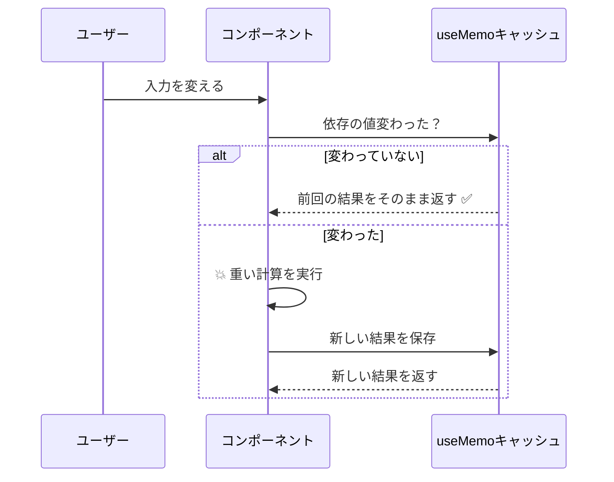

# 第88章：`useMemo` と `useCallback`、いつ使うの？
（使いすぎは逆にダメな理由もセットで覚えよう）

---

## 1️⃣ 今日のゴール

この章では、こんなことができるようになるのがゴールです ✨

* 「とりあえず全部 `useMemo` / `useCallback` つけとこ〜」を卒業する 🏃‍♀️💨
* 「**この場合は使う方がいい**」「**これはいらない**」を自分で判断できるようになる ✅
* React 19 時代（React Compiler あり）のメモ化の立ち位置をふんわり理解する 🌏([DEV Community][1])

---

## 2️⃣ まずはサクッと復習 🍵

### `useMemo` って何者？🧠

* **重たい計算の結果**を、依存している値が変わるまで覚えておいてくれるフック
* 「この計算、高いし毎回やりたくないんだけど？」って時に使う

React 公式では「再レンダリングの間で計算結果をキャッシュするフック」と説明されています。([React][2])

```
ts
import { useMemo } from "react";

const result = useMemo(() => {
  // 💥 重そうな計算
  return heavyCalculation();
}, [dependencies]);
```

---

### `useCallback` って何者？📞

* **関数そのもの**を覚えておくフック
* 「この関数、毎回新しく作らないで、同じやつを再利用してほしい」というときに使う

公式では「再レンダリングの間で関数定義をキャッシュするフック」と説明されています。([React][3])

```
ts
import { useCallback } from "react";

const handleClick = useCallback(() => {
  console.log("クリックされたよ！");
}, [dependencies]);
```

---

## 3️⃣ なんで「いつ使うか」がそんなに大事なの？💣

実は…

* `useMemo` / `useCallback` **自体もコストがかかる**（依存配列のチェックやキャッシュの管理など）([DEV Community][4])
* React 19 では **React Compiler** が導入されていて、コードを解析して自動でメモ化してくれる方向に進んでいます 🌈([レバテック][5])
* だから **「なんでもメモ化」すると逆に遅くなる**ケースもある、と指摘する記事も出ています ⚠️([Medium][6])

👉 つまり
**「本当に必要なところだけ、ピンポイントで使う」**のが大事、という話です。

---

## 4️⃣ ざっくりイメージ図で把握しよう ✍️（Mermaid）

### `useMemo` のイメージ（結果を覚えておく）



---

### `useCallback` のイメージ（関数を覚えておく）

```
mermaid
flowchart LR
  A[親コンポーネント再レンダリング] --> B{子に渡す関数の参照が<br>変わってる？}
  B -->|Yes| C[子コンポーネント再レンダリング 🔁]
  B -->|No (useCallbackで安定)| D[子コンポーネントはそのまま ✋]
```

---

## 5️⃣ `useMemo` を使うべきケース ✅ / いらないケース ❌

### ✅ 使うと嬉しいパターン

こんなときは `useMemo` を検討してOKです 💡

1. **明らかに重たい計算**

   * 例：何千件ものデータをフィルター・ソートする
   * 例：グラフ用のデータを複雑に集計する

2. **同じ計算結果を、画面のいろんな場所で何回も使う**

   * 例：`filteredList` を `<ul>` だけじゃなく、件数表示とかにも使う

3. **React.memo な子コンポーネントに「加工済みの配列 / オブジェクト」を渡す**

   * 加工が重たいなら、`useMemo` で一回だけ計算する価値あり

---

### ❌ わざわざ `useMemo` しなくていいパターン

逆に、こういうのはだいたい不要です 🧹

* 足し算・引き算レベルの軽い計算
* 小さな配列の `map` / `filter` だけ
* ほとんど再レンダリングされないコンポーネント
* パフォーマンス問題を感じていないのに「なんとなく不安だから」使う

---

## 6️⃣ `useCallback` を使うべきケース ✅ / いらないケース ❌

### ✅ 使うと嬉しいパターン

1. **`React.memo` な子コンポーネントに関数を渡すとき**

   * 親が再レンダリングされるたびに関数が毎回新しくなると、子が毎回再レンダリングされる
   * `useCallback` で関数の「参照」を安定させると、子がムダに動かない 🐈

2. **`useEffect` / `useMemo` の依存配列に関数を入れたいとき**

   * 関数が毎回新しくなる → エフェクトも毎回動いてしまう → 無駄 or 無限ループの原因
   * そこで `useCallback` で関数を固定するテクニックがよく使われます ([Qiita][7])

3. **カスタムフックの中で作る関数を、外に安定して渡したいとき**

   * 「このフックが返す `toggle` 関数は、依存が変わらない限り同じ参照でいてほしい」みたいな時

---

### ❌ わざわざ `useCallback` しなくていいパターン

* その関数を **子コンポーネントに渡していない**
* その関数を **`useEffect` の依存に入れていない**
* コンポーネント自体がほとんど再レンダリングされない

👉 つまり
**「関数の参照が変わって困る場所」がないなら、`useCallback` はいらないことが多い**です。

---

## 7️⃣ 判断フローチャート 🧭（Mermaid）

「とりあえず全部メモ化」を避けるためのミニフローです ✨

```
mermaid
flowchart TD
  Start[この処理 or 関数<br>メモ化した方がいい？] --> Q1{処理が<br>重たい？}
  Q1 -->|No| Q2{関数を<br>子に渡す？<br>or useEffect依存？}
  Q1 -->|Yes| UseMemo[useMemo を検討 ✅]

  Q2 -->|Yes| UseCallback[useCallback を検討 ✅]
  Q2 -->|No| NoMemo[とりあえずメモ化しないでOK 👍]

  UseMemo --> End[まずは計測 or 体感で<br>効果があるか確認]
  UseCallback --> End
  NoMemo --> End
```

---

## 8️⃣ 実例①：重たいフィルタリングに `useMemo` を使う 🎯

### やりたいこと

* 学生リストから、入力されたキーワードで絞り込み
* データ件数が多い想定（何千件〜）
* **フィルタ & ソートが重たい**ので、キーワードが変わったときだけ再計算したい

```
tsx
import { useMemo, useState } from "react";

type Student = {
  id: number;
  name: string;
  score: number;
};

const STUDENTS: Student[] = [
  { id: 1, name: "Alice", score: 92 },
  { id: 2, name: "Bob", score: 75 },
  { id: 3, name: "Chika", score: 88 },
  // ...本当は何百件もあるイメージ
];

export function StudentSearch() {
  const [keyword, setKeyword] = useState("");

  // ✅ キーワードが変わったときだけフィルタ＆ソートする
  const filteredStudents = useMemo(() => {
    console.log("💥 重たいフィルタ＆ソートを実行中…");

    const lower = keyword.toLowerCase();

    return STUDENTS
      .filter((student) =>
        student.name.toLowerCase().includes(lower)
      )
      .sort((a, b) => b.score - a.score);
  }, [keyword]);

  return (
    <div>
      <h2>学生検索 🔍</h2>
      <input
        type="text"
        placeholder="名前で検索"
        value={keyword}
        onChange={(e) => setKeyword(e.target.value)}
      />

      <p>ヒット件数：{filteredStudents.length} 件</p>

      <ul>
        {filteredStudents.map((student) => (
          <li key={student.id}>
            {student.name}（スコア: {student.score}）
          </li>
        ))}
      </ul>
    </div>
  );
}
```

ポイント 👇

* `useMemo` の依存配列は `[keyword]` だけ
  → キーワードが変わらない限り、前回の結果をそのまま再利用
* データが少ないうちは体感差ゼロでも、件数が増えると効いてくるパターン

---

## 9️⃣ 実例②：`React.memo` な子 + `useCallback` 🧒➡️👩

### やりたいこと

* TODO リストの各アイテムを別コンポーネントに切り出す
* アイテムが多くても、変わってない行は再レンダリングしたくない
* そこで `React.memo` + `useCallback` を組み合わせる

```
tsx
import { memo, useCallback, useState } from "react";

type Todo = {
  id: number;
  title: string;
  done: boolean;
};

type TodoItemProps = {
  todo: Todo;
  onToggle: (id: number) => void;
};

// ✅ React.memo で「propsが同じなら再レンダリングしない」子コンポーネント
const TodoItem = memo(function TodoItem({ todo, onToggle }: TodoItemProps) {
  console.log("🔁 子がレンダリング:", todo.title);

  return (
    <li>
      <label>
        <input
          type="checkbox"
          checked={todo.done}
          onChange={() => onToggle(todo.id)}
        />
        {todo.title}
      </label>
    </li>
  );
});

export function TodoList() {
  const [todos, setTodos] = useState<Todo[]>([
    { id: 1, title: "レポートを書く", done: false },
    { id: 2, title: "React 勉強する", done: false },
    { id: 3, title: "カフェで一息 ☕", done: true },
  ]);

  // ✅ useCallback で関数の参照を安定させる
  const handleToggle = useCallback((id: number) => {
    setTodos((prev) =>
      prev.map((todo) =>
        todo.id === id ? { ...todo, done: !todo.done } : todo
      )
    );
  }, []);

  return (
    <div>
      <h2>TODO リスト ✅</h2>
      <ul>
        {todos.map((todo) => (
          <TodoItem key={todo.id} todo={todo} onToggle={handleToggle} />
        ))}
      </ul>
    </div>
  );
}
```

ここでのポイント 💡

* `TodoItem` は `memo(...)` でラップされているので、
  **props が同じなら再レンダリングされない**([React][8])
* `handleToggle` を `useCallback` でメモ化しているので、
  **依存が変わらない限り同じ関数参照のまま** 👌
* その結果、チェックを変えた行だけ再レンダリングされて、他の行は静かなまま ✨

---

## 🔟 React 19 と React Compiler の話をちょっとだけ 🧬

React 19 では「React Compiler」という仕組みが出てきていて、

* コードを解析して
* いい感じにメモ化などの最適化を自動でやってくれる

…という方向に進んでいます。([DEV Community][1])

👉 なので、

* 小さいアプリや個人開発
* React Compiler を有効にしているプロジェクト

では、**自分で `useMemo` / `useCallback` を細かく書かなくてもそこそこ大丈夫**、という未来になりつつあります 🌈

でも！

* 「なぜメモ化が必要なのか」
* 「どんなときに最適化を考えるべきか」

を理解しておくと、**Compiler が何をやってくれているか**もイメージしやすくなります 👍

---

## 1️⃣1️⃣ まとめ & ミニクイズ 🎓

### 今日のまとめ

* `useMemo` → **重たい計算の結果を覚えておきたいとき** 🧠
* `useCallback` → **関数の参照が変わると困るとき**（`memo` な子 / `useEffect` の依存など）📞
* なんでもかんでも付けると、**逆にオーバーヘッドで遅くなることもある** ⚠️
* 「処理が重い？」「関数の参照が問題になる場所がある？」を考えてから使う 🧭
* React 19 では React Compiler もあるので、**まずは動くものを作ってから、本当に必要なところだけ最適化**でOK 🎯

---

### ミニクイズ（自分の頭で考えてみよ〜 👩‍🎓）

💡 Q1. フォームの入力値を `useState` で管理していて、
入力値をそのまま画面に表示しているだけ。
**`useMemo` は使う？使わない？**

👉 **答え：使わない**
→ 計算もほぼなくて軽いので、メモ化するメリットがほぼない。

---

💡 Q2. 親コンポーネントから、`onClick` 関数を 1 個だけ子に渡している。
子コンポーネントは `React.memo` でラップ済み。
親はよく再レンダリングされる。
**`useCallback` は使う？**

👉 **答え：使う価値あり**
→ 親が動くたびに関数の参照が変わると、子も毎回レンダリングされてしまうので、
`useCallback` で参照を固定すると効果が出やすいパターン。

---

💡 Q3. `useEffect` の依存配列に関数を入れたい。
その関数が毎回新しく作られるせいで、`useEffect` が何度も動いてしまう。
**どうする？**

👉 **答え：その関数を `useCallback` でメモ化する**
→ 依存配列に入っている関数の参照を安定させることで、
`useEffect` が必要なときだけ動くようにできる。

---

ここまでできれば、
**「`useMemo` / `useCallback` は“とりあえず付けるおまじない”じゃない」**
って感覚はかなり掴めているはずです 😊

次にコードを書くときは、

> 「この処理、ほんとにメモ化したいほど重い？👀」
> 「この関数、参照が変わると誰か困る？🤔」

って、一瞬だけ立ち止まってから使ってみてください ✨

[1]: https://dev.to/vishwark/react-19-the-complete-practical-guide-2025-2l73?utm_source=chatgpt.com "🚀 React 19 — All new features (2025)"
[2]: https://react.dev/reference/react/useMemo?utm_source=chatgpt.com "useMemo"
[3]: https://react.dev/reference/react/useCallback?utm_source=chatgpt.com "useCallback"
[4]: https://dev.to/a1guy/react-19-usememo-explained-how-to-make-react-remember-stuff-and-when-not-to-335k?utm_source=chatgpt.com "React 19 useMemo Explained How to Make ..."
[5]: https://levtech.jp/media/article/column/detail_754/?utm_source=chatgpt.com "Reactコンポーネントの不要な再レンダリングを制御する。 ..."
[6]: https://medium.com/%40md.alishanali/react-19-just-killed-usememo-forever-heres-what-to-use-instead-591ce295f397?utm_source=chatgpt.com "React 19 Just Killed useMemo Forever — Here's What to ..."
[7]: https://qiita.com/yun_bow/items/2327d5a6c68cb23f5a66?utm_source=chatgpt.com "パフォーマンス向上！useMemo と useCallback の正しい使い方"
[8]: https://react.dev/reference/react/memo?utm_source=chatgpt.com "memo"
