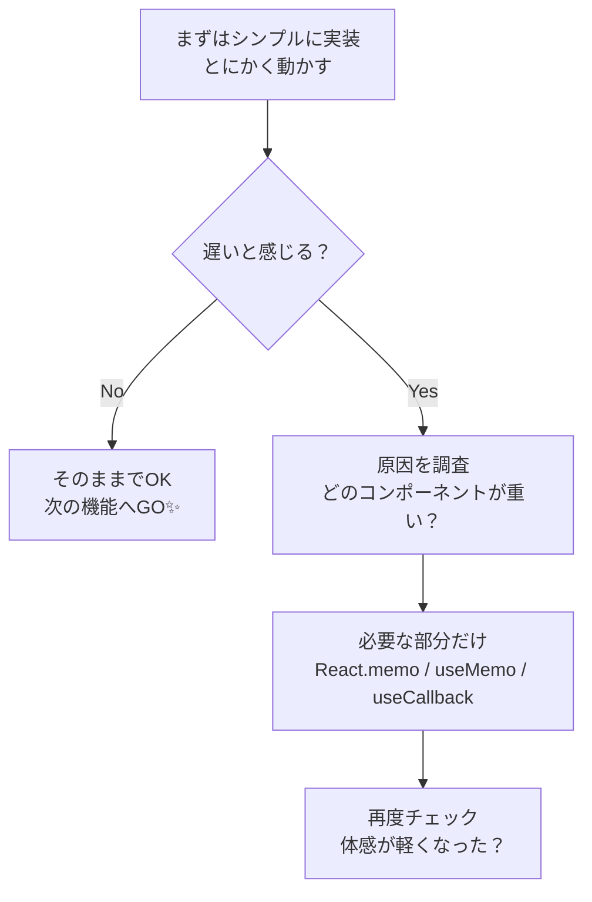

# 第90章：コラム：メモ化は「最適化」。まずは動くものを作ろう。

**メモ化はあくまで「最適化」✨ まずはちゃんと動くものを作ろう！**

---

ここまでで

* `React.memo`
* `useCallback`
* `useMemo`

…を使って「ムダな再レンダリングを減らすテクニック」を見てきましたよね 😊

でもここでいったん、**とても大事なマインドセット**を整理しておきます。

> 🔑 キーワード：
> **メモ化 = パフォーマンス最適化の“道具”であって、“義務”じゃない**

---

## 1️⃣ そもそも「メモ化」って何してるの？🧠

メモ化（memoization）はざっくり言うと…

> 「前に計算した結果を覚えておいて、
> 同じ入力ならもう一回計算しないようにするテクニック」✨

React の場合は…

* `React.memo` 👉 **同じ Props ならコンポーネントを描き直さない**
* `useCallback` 👉 **同じ依存関係なら「関数オブジェクト」を作り直さない**
* `useMemo` 👉 **同じ依存関係なら計算結果を使い回す**

みたいな感じで、**「変わってないならサボっちゃおう〜」**というお仕事をしてくれます 🛋️

---

## 2️⃣ でもね…「とりあえず全部メモ化」はNG 😵‍💫

React を勉強し始めると、ついこう思いがちです。

> 「`useMemo` とか `useCallback` とか、
> とにかく付けとけば速くなるんでしょ？💪」

### 実はこれ、よくある“罠”です ⚠️

理由はいくつかあって…

1. **コードが読みにくくなる**

   * ただのコンポーネントだったはずが
     `useMemo` / `useCallback` だらけで
     「え…依存配列なにこれ…😇」となりがち

2. **バグの温床になりやすい**

   * 依存配列に入れ忘れたせいで、
     「画面は変わってほしいのに変わらない」みたいな不具合が発生

3. **そもそも速くならないことも多い**

   * メモ化もタダじゃなくて、
     「比較する」「キャッシュを管理する」コストがかかります
   * 処理が軽いのにメモ化すると、逆に遅くなるケースもあります 🐢

だから、

> **「とりあえず全部メモ化」は、
> いい習慣というより“やりすぎダイエット”みたいなもの**

と思っておくと安心です ✨

---

## 3️⃣ React 19 時代の考え方：まずは“素直なコード”が最強 ✨

React 19 では、**React Compiler** という仕組みが入っていて、
**コンポーネントのレンダリングを自動でいい感じに最適化してくれる**ようになってきています。([QED42][1])

公式ドキュメントでも、React 19 は

* Actions
* 新しい `use()` API
* 自動最適化 など

を含んだ大きなリリースとして紹介されています。([ウィキペディア][2])

つまりこれからの時代は、

> 🧩 **人間が頑張ってあちこち `useMemo` するより、
> React に任せられるところは任せてOK**

という方向に進んでいます。

だからこそ、このコラムで一番伝えたいのは……

> ✅ **「読みやすく・バグりにくい“ふつうのコード”をまず書こう」**
> ✅ **「本当に必要になったところだけ、メモ化を考えよう」**

という順番です 🌸

---

## 4️⃣ じゃあ、いつメモ化を考えればいいの？🔍

「全部ダメ」ではなくて、**“ここで使うと気持ちいい”ポイント**があります。

### 💡 メモ化を検討したくなる“サイン”たち

次のような症状が出てきたときです 👇

* 🔁 **スクロールがガクガクする**

  * 例：大量のリストを表示していて、別のボタンを押すたびにカクつく
* 🐌 **入力がもっさりする**

  * 例：フォームに文字を打つときに、キー入力が遅れてついてくる
* 🎨 **小さなボタンを押しただけで、画面全体が再レンダリングされてる**

  * React DevTools を見てみると、「え、このコンポーネントまで毎回レンダリングされてるの？」となるとき

こういうときに、

* `React.memo` で「変わってない子コンポーネント」を止める
* `useCallback` で「毎回新しく生成される関数」を安定させる
* `useMemo` で重い計算結果をキャッシュする

…という選択肢が **“はじめて意味を持つ”** と思っておくと良いです ✨

---

## 5️⃣ ゴールは「ユーザー体験」🎧 そのためのメモ化

大事なのは、**数字ではなく体験**です。

* ユーザーが「サクサク動くな〜✨」と感じれば勝ち
* ユーザーが「なんか重い…」と感じれば改善ポイント

そして、**その改善のためのツールのひとつがメモ化**です。

> 🎯 目標：**「ちゃんと動く」＋「気持ちよく使える」**
> メモ化は、そのうちの後半（パフォーマンス担当）を助ける存在

---

## 6️⃣ 実務風ワークフロー：こう考えるとラクになるよフロー 🚶‍♀️🚶‍♀️

図でイメージしてみましょう ✨
（Mermaid で書いてあります）



このフローで進めると、

1. 🔹 **A：まずはシンプルに作る**
2. 🔹 **B：自分で触ってみて「重い？」と感じるかを見る**
3. 🔹 **D：DevTools などで原因を探す**
4. 🔹 **E：そこで初めてメモ化を適用**
5. 🔹 **F：また触ってみて、改善したか確認**

という、**「迷子になりにくいループ」**で開発できます 👍

---

## 7️⃣ 「最初はこれでOK！」なシンプル実装例 ✨

たとえば、TODO リストを表示するコンポーネントがあったとします。

> ✅ 最初の段階では、**あえてメモ化しない版**からスタートしてOKです。

```tsx
type TodoItem = {
  id: number;
  title: string;
};

type TodoListProps = {
  items: TodoItem[];
  onItemClick: (id: number) => void;
};

export function TodoList({ items, onItemClick }: TodoListProps) {
  return (
    <ul>
      {items.map((item) => (
        <li key={item.id}>
          <button onClick={() => onItemClick(item.id)}>
            {item.title}
          </button>
        </li>
      ))}
    </ul>
  );
}
```

これだけでも、まずは **「機能としては完成」🎉** です。

* クリックできる
* どの `id` が押されたか分かる
* TypeScript 的にも安全

ここで **「遅くないなら、そのままでいい」** という判断も全然アリです 🙆‍♀️

---

## 8️⃣ 本当に必要になったら、こうやってメモ化する 🛠️

もし「TODO が何千件もあって重い…」みたいな状況になったら、
はじめて「じゃあ分割してメモ化しようか」が登場します。

```tsx
import { memo, useCallback } from "react";

type TodoItem = {
  id: number;
  title: string;
};

type TodoListProps = {
  items: TodoItem[];
  onItemClick: (id: number) => void;
};

type TodoItemButtonProps = {
  item: TodoItem;
  onClick: (id: number) => void;
};

const TodoItemButton = memo(function TodoItemButton({
  item,
  onClick,
}: TodoItemButtonProps) {
  console.log("render:", item.title); // デバッグ用 🐛
  return (
    <li>
      <button onClick={() => onClick(item.id)}>{item.title}</button>
    </li>
  );
});

export function TodoList({ items, onItemClick }: TodoListProps) {
  const handleItemClick = useCallback(
    (id: number) => {
      onItemClick(id);
    },
    [onItemClick]
  );

  return (
    <ul>
      {items.map((item) => (
        <TodoItemButton
          key={item.id}
          item={item}
          onClick={handleItemClick}
        />
      ))}
    </ul>
  );
}
```

でも、これはあくまで

> 「**重くなってから**」「**原因がここだと分かってから**」
> 適用すれば十分 ✨

というイメージで大丈夫です。

---

## 9️⃣ まとめ：この章でいちばん伝えたいこと 🌈

最後に、このコラムのエッセンスをギュッとまとめます 🧃

* 🧠 メモ化（`React.memo` / `useCallback` / `useMemo`）は
  **“性能アップのための道具”であって、義務じゃない**
* 🚫 「全部とりあえずメモ化」は
  **読みづらさ・バグ・逆効果の原因になることも**
* 🧾 React 19 や React Compiler によって、
  **フレームワーク側でも最適化がどんどん進んでいる**([QED42][1])
* ✅ だからこそ、

  1. **まずは素直で分かりやすいコードを書く**
  2. **重いと感じたら原因を調べる**
  3. **必要になったところだけメモ化する**

この順番で考えれば OK です ✨

> 🌟 メッセージ：
> **「速さ」よりも、まずは「ちゃんと動く」「読みやすい」を大事にしよう。
> パフォーマンスは“あとから味付けする調味料”みたいなものだよ🍳**

次の章からも、**ムリに背伸びせず、まずは動くものを**。
そのうち、自然と「ここはメモ化したほうが良さそうだな〜」って
**肌で分かるようになってきますよ 🥰🚀**

[1]: https://www.qed42.com/insights/reacts-latest-evolution-a-deep-dive-into-react-19?utm_source=chatgpt.com "React's latest evolution: a deep dive into React 19"
[2]: https://en.wikipedia.org/wiki/React_%28software%29?utm_source=chatgpt.com "React (software)"
