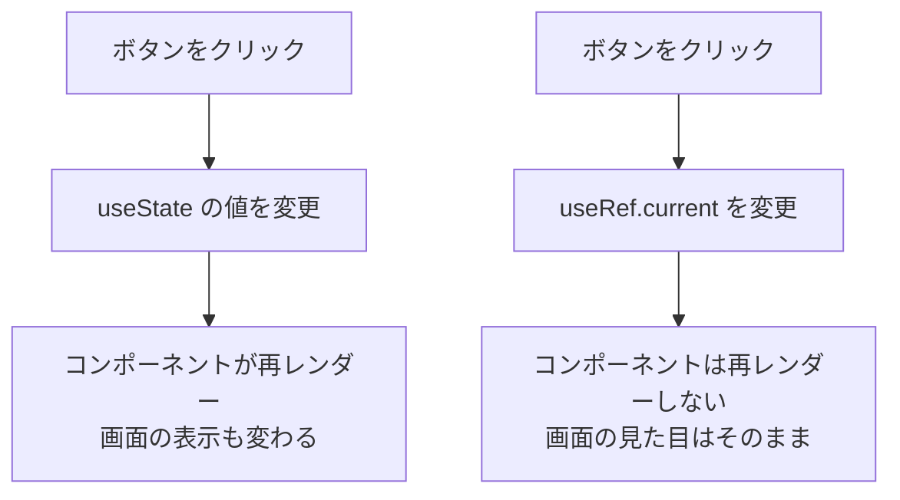

# 第91章：【フック】`useRef` ってなに？

---

## 1️⃣ 今日のゴール

この章では、こんなことができるようになるのがゴールです ✨

* 「`useRef`って何者？」をイメージでつかむ
* `useState` と `useRef` の違いを言葉で説明できる
* かんたんなサンプルコードで `useRef` を実際に使ってみる

---

## 2️⃣ ざっくりイメージ：「変わるけど、画面は変えたくない値」のメモ帳 ✍️

`useRef` は、一言でいうと…

> 💡「コンポーネントの中で **ずっと覚えておきたい値** をしまっておくための、ちっちゃい“箱（メモ帳）”」

みたいな存在です。

* `useState`
  → 値が変わると **画面が描き直される（再レンダー）**
* `useRef`
  → 値が変わっても **画面はそのまま**。でも、値はちゃんと保存されつづける

なので、こんなときに向いています 👇

* 画面には直接いらないけど、「裏でカウントしておきたい数」
* タイマーのID（後で止める用）
* 前回の値（「さっきは○○だったよね」を覚えておきたい）
* HTML要素そのもの（入力欄や動画タグなど）← これは次の章で扱うよ！

---

## 3️⃣ `useState` vs `useRef` を図で見てみよう 🧠

`useState` と `useRef` の違いを、イメージ図で比べてみます。



📝 まとめると…

|          | useState              | useRef                       |
| -------- | --------------------- | ---------------------------- |
| 値が変わったら？ | コンポーネントが **再レンダー**される | 再レンダーされない（画面はそのまま）           |
| どこで使う？   | 画面に表示したい「状態」          | 裏で持っておきたい値・要素の参照など           |
| 典型例      | カウンターの数、フォームの入力値      | タイマーID、前回の値、DOM要素（`input`など） |

---

## 4️⃣ 実際に使ってみる：見た目は変わらないカウンター 🤫

ここからは、実際にコードを書いてみます！
前の章までで作った Vite + React + TypeScript プロジェクトがある前提で進めます 💻

### 4-1. コンポーネントファイルを作る

`src` フォルダの中に、こんなファイルを作ってみてください。

> 📁 `src/UseRefBasic.tsx`

中身をいったん、ぜんぶこれで上書きします 👇

```tsx
import { useState, useRef } from "react";

export function UseRefBasic() {
  // 画面に表示する、ふつうのカウンター（useState）
  const [count, setCount] = useState(0);

  // 画面には直接出さない、「裏カウンター」（useRef）
  const hiddenCountRef = useRef(0);

  const handleVisibleClick = () => {
    setCount((prev) => prev + 1);
  };

  const handleHiddenClick = () => {
    hiddenCountRef.current = hiddenCountRef.current + 1;
    console.log("裏カウンター:", hiddenCountRef.current);
  };

  return (
    <div style={{ padding: "16px" }}>
      <h2>useRef 入門デモ ✨</h2>

      <div style={{ marginBottom: "16px" }}>
        <p>画面に見えるカウンター：{count}</p>
        <button onClick={handleVisibleClick}>
          表カウンターを増やす（画面も変わるよ）
        </button>
      </div>

      <div>
        <p>
          裏カウンター：
          <span style={{ fontStyle: "italic" }}>
            コンソールだけで確認してね 👀
          </span>
        </p>
        <button onClick={handleHiddenClick}>
          裏カウンターを増やす（画面は変わらない）
        </button>
      </div>
    </div>
  );
}
```

### 4-2. `App.tsx` から呼び出す 🔁

次に、`App.tsx` を開いて、さっき作った `UseRefBasic` を表示させます。

```tsx
import { UseRefBasic } from "./UseRefBasic";

export function App() {
  return (
    <div>
      <UseRefBasic />
    </div>
  );
}
```

Vite をまだ起動していない場合は、ターミナルで：

```bash
npm run dev
```

ブラウザで `http://localhost:5173`（ポート番号は環境で違うかも）にアクセスしてみてください 🌐

---

## 5️⃣ 動きを観察してみよう 🔍

### 5-1. 表カウンターのボタンを押すと… ✅

1. 「表カウンターを増やす」ボタンをクリック
2. `count` が `setCount` で増える
3. React が「値が変わった！」と気づいて、コンポーネントを **再レンダー**
4. 画面の「画面に見えるカウンター：◯」の数字が増える 🎉

これは、今までやってきた `useState` の普通の動きです。

---

### 5-2. 裏カウンターのボタンを押すと… 🕵️‍♀️

1. 「裏カウンターを増やす」ボタンをクリック
2. `hiddenCountRef.current` を `+1` する
3. `console.log("裏カウンター:", hiddenCountRef.current);` でログ出力
4. でも、画面の見た目は **一切変わらない**！

👉 ここが `useRef` のポイントです。

---

## 6️⃣ ブラウザのコンソールを見てみよう 🖥️

Windows の Chrome を例にします（他のブラウザでもほぼ同じです）。

1. 画面を表示したまま `F12` キー、または `Ctrl + Shift + I` で開発者ツールを開く
2. 上のタブから「Console」を選ぶ
3. 「裏カウンターを増やす」ボタンを何回かクリック
4. コンソールに

   `裏カウンター: 1`
   `裏カウンター: 2`
   `裏カウンター: 3`

   …みたいに増えていくのが見えるはずです 👀

💬 でも、画面のテキストは変わってないよね？
→ これが **「値は変わってるけど、再レンダーしない」** という `useRef` の性質です。

---

## 7️⃣ もう一度、`useRef` の正体を整理しよう 🧩

コードのこの部分をもう一度見てみます。

```tsx
const hiddenCountRef = useRef(0);
```

* `useRef(0)`
  → 「最初の値が `0` のメモ帳をちょうだい」という意味
* `hiddenCountRef.current`
  → そのメモ帳の **中身**（現在の値）

更新しているのはここ 👇

```tsx
hiddenCountRef.current = hiddenCountRef.current + 1;
```

ポイントは 2つ 🌟

1. `useRef` が返してくれるのは「オブジェクト」で、その中に `current` というプロパティがある
2. この `current` の中身を変えても、React は「再レンダーしなくていいや」と判断する

だから、

* 「裏でこっそり覚えておきたい値」
* 「画面には表示しないけど、何回押されたかは知りたい」

みたいな場面で大活躍します ✨

※ 型の書き方（`useRef<number>(0)` などのジェネリクス）は、第96章でしっかりやります 🧪
　今は「`current` に値が入ってるんだな〜」ぐらいでOKです！

---

## 8️⃣ どんなときに `useRef` を思い出せばいい？💡

この章のまとめとして、「あ、この状況なら `useRef` かも！」というサインを整理しておきます。

### ✅ `useRef` を使いたくなるサイン

* 画面には表示しない「カウンター」「フラグ」「前回の値」を持ちたい
* タイマー（`setInterval` / `setTimeout`）のIDをあとで止めたい
* `<input>` や `<video>` などの HTML 要素そのものを触りたい
* でも、そのたびに画面を再描画してほしいわけじゃない

逆に、ユーザーに見せる文章や数値なら、基本は `useState` でOKです ✅

---

## 9️⃣ ミニクイズでおさらい ✏️

ちょっとだけ自分で考えてみようクイズです 🧠

### Q1. 画面上のカウンターを増やしたいとき、どっちを使う？

A. `useState`
B. `useRef`

→ 正解：**A**
（画面の表示を変えたい = 再レンダーが必要なので `useState`）

---

### Q2. 「このボタンが何回押されたか」をログにだけ出したい。画面の見た目は変えなくていい。どっちを使う？

A. `useState`
B. `useRef`

→ 正解：**B**
（裏でカウントするだけなら `useRef` がぴったり）

---

### Q3. `useRef` の値を変えたとき、画面はどうなる？

A. 必ず再レンダーされる
B. 何も表示は変わらない（でも値は更新されている）

→ 正解：**B**
（ここが `useState` との一番大きな違い！）

---

## 🔚 この章のまとめ 🎀

* `useRef` は「再レンダーなしで値を覚えておけるメモ帳」みたいな存在 ✍️
* `.current` に値が入っていて、そこを書き換えることで更新できる
* 画面には見せない値・DOM 要素の参照・タイマーID などを覚えておくのに超便利
* `useState` は「画面に見せたい値」、`useRef` は「裏で持っておきたい値」とざっくりイメージすると分かりやすいよ ✅

次の章からは、この `useRef` を実際のケース（タイマーや入力フォームなど）で使っていきます 🚀
「なんとなく分かったかも？」ぐらいなら十分なので、むりに完璧を目指さず、ふわっと頭に置いておいてくださいね 😊
