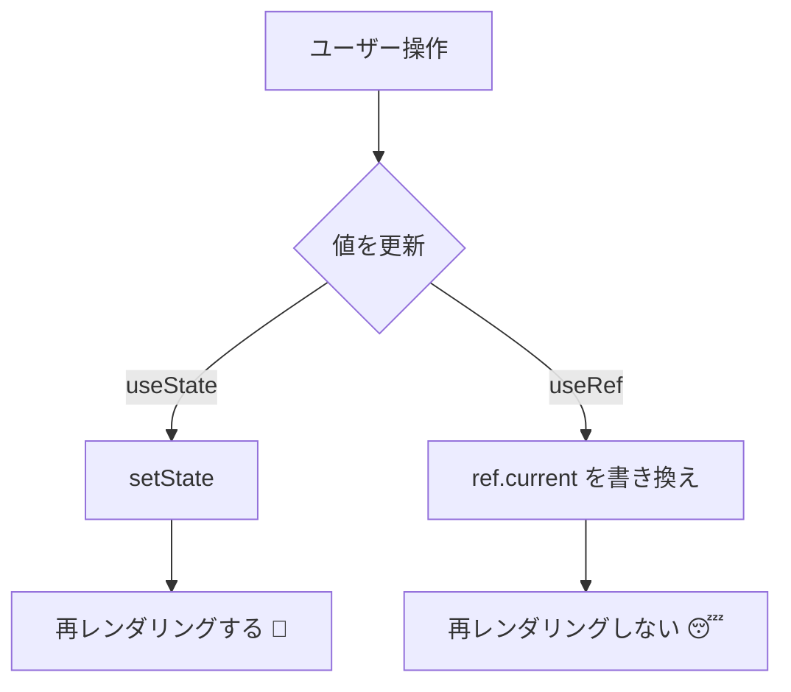

# 第93章：`useRef` の使い方 (1) 📝✨

**〜画面は変わらないけど、覚えておきたい値〜**

---

## 今日のゴール 🎯😊

* `useRef` が「コンポーネント内のメモ帳」だってわかる ✍️
* `useState` と何が違うか、感覚でつかむ 💡
* 「覚えるけど、画面は変えない」値を保存できるようになる 🧠✨

---

## `useRef` ってなに？🤔

`useRef` は、コンポーネントが**再レンダリングされても消えない**「小さな保管箱」です📦
中身は `.current` に入ります。

* ✅ 値を覚えられる（再レンダリングしても残る）
* ✅ `.current` を書き換えても **再レンダリングしない**
* ✅ 「画面表示に関係ないけど、あとで使いたい値」にピッタリ

---

## `useState` と `useRef` の違い 🌟



* `useState`：画面を変えたいとき（更新したら再描画）🖼️✨
* `useRef`：画面は変えないけど覚えたいとき（更新しても再描画しない）📝💤

---

## まずは形を覚えよう 🧩

```tsx
import { useRef } from "react";

const countRef = useRef<number>(0);

countRef.current += 1; // 値は増える
// でも画面は変わらない（再レンダリングしない）
```

ポイント👇

* `useRef<number>(0)` の `0` は **最初の1回だけ**使われるよ🙂
* その後はずっと同じ `ref` が生き続けます🌱

---

## 例①：レンダリング回数を「こっそり」数える 🕵️‍♀️✨

「今何回レンダリングされた？」って、画面に出す必要はないけど知りたい時あるよね😆

### `src/App.tsx` をこれにしてね👇

```tsx
import { useRef, useState } from "react";

export default function App() {
  const [text, setText] = useState("");
  const renderCountRef = useRef(0);

  // レンダリングのたびに増える（でもこれ自体は再レンダリングを起こさない）
  renderCountRef.current += 1;

  const handleClick = () => {
    alert(`レンダリング回数は ${renderCountRef.current} 回だよ！📣✨`);
  };

  return (
    <div style={{ padding: 16 }}>
      <h1>useRef メモ帳体験 📝</h1>

      <input
        value={text}
        onChange={(e) => setText(e.target.value)}
        placeholder="何か打ってみてね😊"
      />

      <div style={{ marginTop: 12 }}>
        <button onClick={handleClick}>レンダリング回数を見てみる👀</button>
      </div>

      <p style={{ marginTop: 12 }}>
        入力欄は <b>useState</b> で更新してるから、打つたびに再レンダリングされるよ🔄✨
      </p>
    </div>
  );
}
```

### ためしてみよう 🧪💕

1. 入力欄に文字を打つ ✍️
2. ボタン押す 👆
3. アラートで回数が増えてるのを確認🎉

`renderCountRef.current` は増えてるけど、
**それ自体が画面更新の原因にはなってない**ってのがミソだよ〜😴✨

---

## 例②：「最後にボタンを押した時刻」を覚える ⏰💖

画面には出さなくていいけど、あとで使えると便利！ってやつ☺️

```tsx
import { useRef } from "react";

export function LastClickMemo() {
  const lastClickedAtRef = useRef<Date | null>(null);

  const handleClick = () => {
    lastClickedAtRef.current = new Date();
    alert(`保存したよ！📝 最後のクリック：${lastClickedAtRef.current.toLocaleString()} ✨`);
  };

  return <button onClick={handleClick}>今の時刻をメモする⏰</button>;
}
```

* これ、`lastClickedAtRef.current` は更新されるけど
  **画面を変える必要がない**から `useRef` がちょうどいいやつ👍✨

---

## よくある注意ポイント ⚠️😵‍💫

* ❌ `ref.current` を更新しても、画面は自動で変わらない
  → 画面に出したいなら `useState` を使おう🖼️✨
* ✅ `ref` は「秘密のメモ」
  → ログ用、ID保存、前回値保存、タイマーID保存…とかに強い💪💕

---

## ミニ練習 🎮✨

次のどっちが `useRef` 向きか考えてみてね😊

1. 入力した文字を画面に表示したい 💬
2. 「前回クリックした時間」を覚えておきたい ⏰

答え👇

* 1. → `useState` 🖼️✨
* 2. → `useRef` 📝✨

---

## まとめ 🌈🎉

* `useRef` は **再レンダリングしても残るメモ帳**📝
* `.current` を変えても **再レンダリングしない**😴
* 「画面に関係ないけど覚えたい値」に使うのが正解✨

次の章（第94章）で、まさにこの強みを使って「タイマーIDを保存」するよ〜！⏱️🐣
