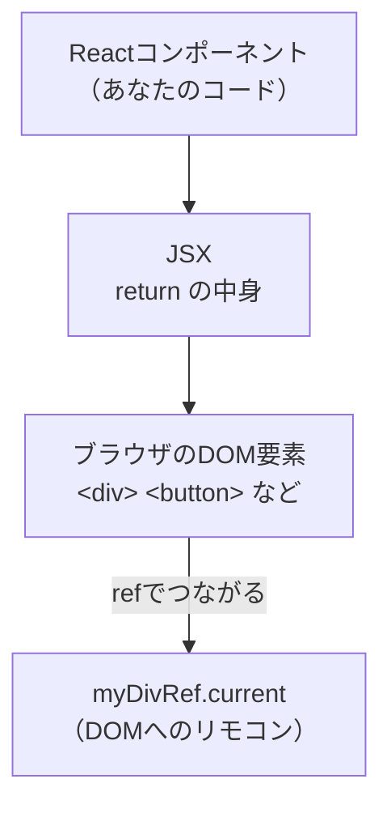

# 第94章：練習：タイマーIDを `useRef` に保存する ⏱️✨

この章は「タイマーを開始→止める」を**安全に**作れるようになる練習だよ〜！😊
ポイントはこれ👇

* 画面に出したい数字（経過秒数）は `useState` 🧠
* **タイマーのID（裏方のメモ）**は `useRef` 🧷

---

## まず結論：なんでタイマーIDを `useRef` に入れるの？🧷

`setInterval()` は「タイマーを止めるためのID」を返すんだけど、これを `useState` に入れると…

* IDを更新するたびに再レンダリングが走る 😵‍💫（いらないのに）
* タイマー開始ボタンを連打したときの事故が増える 💥

だから、**画面に関係ない“裏の情報”は `useRef` に保存**するのがベストだよ〜！🥳

---

## 図でイメージするよ 🗺️

```mermaid
flowchart TD
  A[Startボタン押す 🟢] --> B{timerIdRef.current は null？}
  B -- いいえ --> C[すでに動いてるので何もしない 🙅‍♀️]
  B -- はい --> D[setInterval を開始 ⏱️]
  D --> E[返ってきたIDを ref に保存 🧷]
  E --> F[1秒ごとに setSeconds(s=>s+1) 🔁]

  G[Stopボタン押す 🔴] --> H{ref にIDある？}
  H -- いいえ --> I[止まってるので何もしない 🙅‍♀️]
  H -- はい --> J[clearInterval(ID) 🧹]
  J --> K[ref を null に戻す 🧷]
```

---

## 作るもの：シンプルなタイマー（Start / Stop / Reset）⏱️💡

### ✅ ファイルを作ろう

`src/components/TimerRefPractice.tsx` を作って、下のコードをコピペしてね✍️

```tsx
import { useEffect, useRef, useState } from "react";

export function TimerRefPractice() {
  const [seconds, setSeconds] = useState(0);

  // ✅ タイマーIDは「画面に出さない裏方」なので useRef
  const timerIdRef = useRef<ReturnType<typeof setInterval> | null>(null);

  const start = () => {
    // ✅ 連打事故防止：すでに動いてたら何もしない
    if (timerIdRef.current !== null) return;

    timerIdRef.current = setInterval(() => {
      setSeconds((s) => s + 1);
    }, 1000);
  };

  const stop = () => {
    if (timerIdRef.current === null) return;

    clearInterval(timerIdRef.current);
    timerIdRef.current = null;
  };

  const reset = () => {
    stop();
    setSeconds(0);
  };

  // ✅ 画面から消える時に、タイマーが残って暴れないように保険🧯
  useEffect(() => {
    return () => {
      if (timerIdRef.current !== null) {
        clearInterval(timerIdRef.current);
      }
    };
  }, []);

  const isRunning = timerIdRef.current !== null;

  return (
    <div style={{ padding: 16, border: "1px solid #ddd", borderRadius: 12 }}>
      <h2 style={{ marginTop: 0 }}>Timer（useRef練習）⏱️</h2>

      <p style={{ fontSize: 24, margin: "8px 0" }}>
        経過：<b>{seconds}</b> 秒 ✨
      </p>

      <div style={{ display: "flex", gap: 8 }}>
        <button onClick={start} disabled={isRunning}>
          Start 🟢
        </button>

        <button onClick={stop} disabled={!isRunning}>
          Stop 🔴
        </button>

        <button onClick={reset}>Reset ♻️</button>
      </div>

      <p style={{ marginTop: 12, color: "#555" }}>
        状態：{isRunning ? "動作中 🏃‍♀️💨" : "停止中 🧘‍♀️"}
      </p>
    </div>
  );
}
```

---

## `App.tsx` に表示しよう 👀✨

```tsx
import { TimerRefPractice } from "./components/TimerRefPractice";

export default function App() {
  return (
    <div style={{ padding: 24 }}>
      <TimerRefPractice />
    </div>
  );
}
```

---

## 動作チェック ✅（ここ大事！）

* Startを連打しても **加速しない**（タイマーが増えない）😌
* Stopでちゃんと止まる 🧹
* Resetで **0に戻って止まる** ♻️
* 画面を切り替えても、タイマーが裏で動き続けない（保険の `useEffect`）🧯

---

## よくあるミス集 💥（回避できたら勝ち！）

### ❌ ミス1：Start押すたびに `setInterval` を増やしちゃう

→ `if (timerIdRef.current !== null) return;` で防げるよ🛡️

### ❌ ミス2：Stopで `clearInterval` したのに、IDを消さない

→ `timerIdRef.current = null;` を忘れると再スタート時に混乱しがち😵‍💫

---

## ちょい課題（できたら強い）💪✨

1. 「Pause / Resume」ボタンを1個にまとめてみてね ⏯️
2. `seconds` が 60 になったら表示を `1:00` みたいに整形してみよう 🕐
3. 「Lap（途中経過を記録）」を配列で保存して表示してみよう 📝

---

次の章（第95章）では、`useRef` を使って **HTML要素を直接さわる**方に進むよ〜！🧷✨

---

## 1️⃣ 今日やること 🎯

この章では、

* HTMLタグ（DOM要素）に **直接さわるための `useRef` の使い方**
* 「`document.getElementById` じゃダメなの？」をReact目線で理解する
* ボタンを押したら、**特定の場所までスクロール**したり、**入力欄にフォーカス**したりする小さな例

をやります 💪

前の章までで、

* `useRef` は「値を覚えておける箱📦（でも再レンダリングしない）」として使った
* タイマーIDを保存する、という使い方を見た

今回はそれの **「DOM要素版」** です ✨

---

## 2️⃣ `ref` は「DOMへのリモコン」だと思おう 🎮

Reactの世界をざっくり図にすると、こんな感じです：



* いつも書いている `return ( ... )` の中の JSX から
  ブラウザが本物の HTML要素（DOM）を作ってくれます 🧱
* `ref` を使うと、**「そのDOM要素を指す、特別なオブジェクト」** をもらえます
* そのオブジェクトが `myDivRef.current` です ✨

だから、

* `myDivRef.current.scrollIntoView(...)`
* `myInputRef.current.focus()`
* `myVideoRef.current.play()`

みたいに、**DOMのメソッドを直接呼び出せる**ようになります 🎮

---

## 3️⃣ 基本パターン：3ステップで覚えよう ✅

DOM要素に `ref` を使う基本形は、この3ステップです：

1. **コンポーネントの先頭で `useRef` を用意する**
2. **JSXで `ref={...}` を指定する**
3. **イベントの中で `ref.current` を使う**

順番に見ていきます 👀

---

### 🧩 ステップ1：`useRef` を宣言する

```tsx
import { useRef } from 'react';

function Example() {
  const boxRef = useRef<HTMLDivElement | null>(null);

  // ...
}
```

ポイント 👇

* `useRef<HTMLDivElement | null>(null)`

  * ここは **「このrefは `<div>` を指す予定だよ」** という型の指定です
  * `null` になっているのは、**まだDOMが作られていないタイミングがある**から
  * 型の意味は、第96章でガッツリ解説するので、今は

    > 「`<div>` 用のおまじない」
    > くらいに思ってOKです 🙆‍♀️

---

### 🧩 ステップ2：JSXで `ref` をくっつける

```tsx
return (
  <div>
    <div ref={boxRef}>
      ここがターゲットのボックスです 🎯
    </div>
  </div>
);
```

* `ref={boxRef}` と書くことで、
  この `<div>` と `boxRef.current` がリンクされます 🔗
* Reactが「レンダリング完了したよ〜」となったタイミングで
  `boxRef.current` に **本物のDOM要素** が代入されます

---

### 🧩 ステップ3：イベントの中で `ref.current` を使う

```tsx
const handleClick = () => {
  if (boxRef.current) {
    boxRef.current.scrollIntoView({ behavior: 'smooth' });
  }
};
```

* `boxRef.current` が `null` じゃないときだけ、メソッドを呼びます
* `scrollIntoView` は、

  > 「この要素が画面に見える位置までスクロールして〜」
  > というブラウザのメソッドです 📜

---

## 4️⃣ ミニ実験①：ボタンで「ここまでスクロール」するアプリ 🧪

「ボタンを押したら、ずっと下の方にある箱までスーッとスクロールする」
という小さなコンポーネントを作ってみましょう ✨

`src/ScrollToBox.tsx` というファイルを作るイメージです。

```tsx
import { useRef } from 'react';

export function ScrollToBox() {
  // ① 下のピンクのボックスを指す ref
  const boxRef = useRef<HTMLDivElement | null>(null);

  // ② ボタンが押されたときの処理
  const handleScrollClick = () => {
    if (boxRef.current) {
      boxRef.current.scrollIntoView({
        behavior: 'smooth', // なめらかスクロール ✨
        block: 'center',    // 画面の真ん中あたりに来るように
      });
    }
  };

  return (
    <div
      style={{
        height: '200vh', // わざと縦長ページにする
        padding: '16px',
      }}
    >
      <h1>useRef でスクロールしてみよう 🎀</h1>

      <button
        onClick={handleScrollClick}
        style={{
          padding: '8px 16px',
          borderRadius: '999px',
          border: 'none',
          cursor: 'pointer',
        }}
      >
        🎯 下のピンクのボックスまでスクロール
      </button>

      {/* 画面のだいぶ下にボックスを配置 */}
      <div style={{ marginTop: '120vh' }}>
        <div
          ref={boxRef}
          style={{
            padding: '24px',
            borderRadius: '16px',
            backgroundColor: '#fce7f3',
            boxShadow: '0 4px 12px rgba(0,0,0,0.1)',
          }}
        >
          ここがターゲットのボックスだよ 🎯💗
        </div>
      </div>
    </div>
  );
}
```

使い方メモ 📝

* `App.tsx` でこのコンポーネントを読み込めばOKです：

```tsx
import { ScrollToBox } from './ScrollToBox';

function App() {
  return <ScrollToBox />;
}

export default App;
```

ブラウザで試してみてください 👀

1. ページを開くと上の方にボタンがある
2. ボタンを押すと、画面がスーッと下にスクロールして
3. ピンクのボックスが真ん中にドンッと出てくるはずです 🎉

> 「このボックスにスクロールしたいな」
> → **`ref` を付けるだけでOK** という感覚をつかめればバッチリです 🙆‍♀️

---

## 5️⃣ ミニ実験②：ボタンで入力欄にカーソルを合わせる ✏️

次は、**ボタンを押したら `<input>` にフォーカス** する例です。

`src/FocusInput.tsx` を作るイメージでどうぞ 🌸

```tsx
import { useRef } from 'react';

export function FocusInput() {
  const inputRef = useRef<HTMLInputElement | null>(null);

  const handleFocusClick = () => {
    // ?. を付けると「current があれば実行してね」という書き方になるよ
    inputRef.current?.focus();
  };

  return (
    <div style={{ padding: '16px' }}>
      <h2>ボタンでフォーカスしてみよう 👀</h2>

      <input
        ref={inputRef}
        type="text"
        placeholder="ボタンを押すとここにカーソルが来るよ ✏️"
        style={{
          padding: '8px',
          borderRadius: '8px',
          border: '1px solid #ddd',
          width: '260px',
        }}
      />

      <div style={{ marginTop: '12px' }}>
        <button
          onClick={handleFocusClick}
          style={{
            padding: '6px 12px',
            borderRadius: '999px',
            border: 'none',
            cursor: 'pointer',
          }}
        >
          ✨ 入力欄にカーソルを移動する ✨
        </button>
      </div>
    </div>
  );
}
```

これも `App.tsx` から呼び出せばOKです：

```tsx
import { FocusInput } from './FocusInput';

function App() {
  return <FocusInput />;
}

export default App;
```

---

## 6️⃣ `document.getElementById` じゃダメなの？🤔

ブラウザだけやっていたときは、

* `document.getElementById('...')`
* `document.querySelector('...')`

をよく使っていましたよね 💡

Reactでは、**基本的にそれはあまり推奨されません**。理由は：

* Reactが「どのタイミングでDOMを作るか」「どう書き換えるか」を管理しているから
* 外から `document.getElementById` でいじると、
  Reactの考えている状態とズレることがある 🥲

代わりに：

* 「この要素だけ直接さわりたい」というときは
  👉 **`ref` を使って React に任せたまま、必要なところだけ触る**

というスタイルが、Reactっぽい書き方です 🌸

---

## 7️⃣ `ref` でやっていいこと / 避けたほうがいいこと ☯️

### ✅ やってOKなこと（一例）

* フォームの入力欄に `focus()` を当てる
* 特定のところまで `scrollIntoView()` でスクロール
* `<video>` の `play()` / `pause()` など、メディア操作
* キャンバスや地図ライブラリなど、
  「**Reactの外のライブラリ**」とつなぐとき

### ⚠️ ほどほどにしたいこと

* `ref.current.style.color = 'red';` みたいな、
  スタイル変更をごりごり直接やるやつ

これは **全部を`ref`でやり始めると、Reactを使う意味が薄れてしまう** ので、

* 見た目の変更は、できるだけ「状態 (`useState`) → JSX → CSS」でやる
* 「どうしてもDOMのメソッドを呼びたいところ」だけ、`ref` を使う

というバランスがおすすめです 🌈

---

## 8️⃣ よくあるエラー＆ひっかかりポイント 😵‍💫

### ❌ `boxRef.current` が `null` でエラーになる

**原因あるある：**

* まだDOMが作られていないタイミングで `.current` を触っている
* `ref={boxRef}` を書き忘れている

**対策：**

* `if (boxRef.current) { ... }` や
  `boxRef.current?.focus()` のように、nullチェックを入れる

---

### ❌ `Property 'focus' does not exist on type 'HTMLDivElement | null'` 的な型エラー

* 第96章で「`useRef` の型」の話をちゃんとやりますが、
  型が `null` を含むせいで、TSに怒られるパターンです ⚡
* 今は、

  * `if (inputRef.current) { inputRef.current.focus(); }`
  * `inputRef.current?.focus();`
    のどちらかの形を覚えておけばOKです ✅

---

## 9️⃣ まとめ 🎀

この章のゴールをおさらいすると…

* `useRef` は「ただの値」だけじゃなくて
  👉 **DOM要素（HTMLタグ）へのリモコン** としても使える 🎮

* 使い方の3ステップは：

  1. `const boxRef = useRef<HTMLDivElement | null>(null);`
  2. JSXで `<div ref={boxRef}>...</div>`
  3. イベント内で `boxRef.current?.メソッド()` を呼ぶ

* `document.getElementById` の代わりに、`ref` を使うのがReact流 💡

* スクロールしたり、フォーカスしたり、メディアを再生したり…
  **ちょっとした「魔法の一押し」ができるようになる** ✨

次の **第96章** では、
今回チラッと出てきた

* `useRef<HTMLInputElement>(null)` などの **型定義のちゃんとした意味**

を、TypeScript目線でじっくりやっていきます 🧠💻

ここまでできたら、`useRef` とDOMの仲良し関係はだいぶイメージできているはずです 💕
