# 第97章：`ref` プロパティ

---

「前の章で `useRef<HTMLInputElement>(...)` とか見たけど、
**これ JSX のどこにくっつけるの？** 🤔
というところを、この章でスッキリさせます✨

この章のゴールはこれです🎯

> ✅ `ref` 用の変数を作って
> ✅ JSX で `ref={...}` と書いて
> ✅ ボタンを押したときに、その要素にさわれるようになる

---

## 1. `ref` プロパティってなに？🧸

ざっくりいうと…

* `useRef` 👉 「なにかを入れておける箱」を作るフック
* `ref` プロパティ 👉 JSX で「この箱と、このHTMLタグをリンクしてね」とお願いするところ

イメージ図を Mermaid で描くとこんな感じです👇

```mermaid
flowchart LR
  hook["useRefで作った箱 (inputRef)"] -->|refとして渡す| jsx["<input ref={inputRef} />"]
  jsx --> dom["ブラウザ上の <input>"]
  hook -->|"current に DOM が入る"| dom
```



* `useRef` で作った **箱 (`inputRef`)** を
* JSX の `<input ref={inputRef} />` にくっつけると
* Reactが「この `<input>` の DOM を `inputRef.current` に入れておくね〜」とやってくれます 💡

---

## 2. まずは型付き `useRef` をおさらい✨

`ref` プロパティを使う前に、まずは TypeScript での `useRef` の型をちゃんと書きます。

`App.tsx`（または練習用のコンポーネントファイル）でこんな感じ👇

> 📁 `src/App.tsx`（例）

```tsx
import { useRef } from "react";

function App() {
  const inputRef = useRef<HTMLInputElement | null>(null);

  return (
    <div>
      <h1>ref の練習中 ✨</h1>
      <input type="text" />
    </div>
  );
}

export default App;
```

ここまでだと、まだ `ref` を JSX にくっつけていないので、
`inputRef.current` には何も入りません（ずっと `null` のまま）🙅‍♀️

---

## 3. JSX で `ref={inputRef}` を書いてみよう ✍️

いよいよ本題、「`ref` プロパティ」を JSX に書いてみます。

`<input>` に `ref={inputRef}` を付けるだけです👇

```tsx
import { useRef } from "react";

function App() {
  const inputRef = useRef<HTMLInputElement | null>(null);

  const handleFocusClick = () => {
    // ボタンが押されたときに、input にフォーカスを当てる
    inputRef.current?.focus();
  };

  return (
    <div style={{ padding: "16px" }}>
      <h1>ref プロパティの基本 ✨</h1>

      {/* ★ ここで ref をくっつける！ */}
      <input
        ref={inputRef}
        type="text"
        placeholder="ここをボタンでフォーカスさせるよ"
      />

      <button onClick={handleFocusClick} style={{ marginLeft: "8px" }}>
        フォーカスする 🔍
      </button>
    </div>
  );
}

export default App;
```

### 🌟 ここで大事なポイント

* `ref={inputRef}` と書いた瞬間に
  👉 React が「この `<input>` の DOM を `inputRef.current` に入れておこう〜」とやってくれる
* だから `handleFocusClick` の中で
  👉 `inputRef.current?.focus()` が呼べるようになります 🎉

`?.` は「もし `current` が `null` じゃなかったら」という安全チェックです。
（もしDOMがまだ用意されてなかったら、そこで止めてくれるやさしい演算子😊）

---

## 4. もうちょっとだけ詳しく：`ref` が使えるところ 📌

`ref` プロパティは **「なんでもかんでもOK」ではありません**。

基本ルールとしては：

1. ✅ **ネイティブなHTMLタグ**（`<input>`, `<button>`, `<div>` など）

   * `ref={inputRef}` で **DOM要素** が `current` に入る
2. ⚠️ **自分で作ったコンポーネント**（`<MyInput />` とか）

   * そのまま `ref` を付けても、思った通りには動きません
   * 別のテクニック（v19での書き方や、昔ながらの `forwardRef`）が必要になります
   * これは **後の章（105章以降）でじっくりやる**ので、今は「DOM専用だと思っておこう」でOK👌

なので、この章では

> `ref` は `<input>`, `<textarea>`, `<button>` みたいな**生のタグに付ける**

というイメージで進めましょう ✨

---

## 5. 動きを確認してみよう 🧪

VS Code でコードを書いたら、ターミナルでいつものコマンドを実行します。

```bash
npm run dev
```

ブラウザでアプリを開いて 👀

1. テキスト入力欄のどこでもいいのでクリックしなくてOK
2. `「フォーカスする 🔍」` ボタンをクリック
3. テキスト入力の枠が光って、カーソルが出てくれば成功です 🎉

> 「あ、JavaScriptだけじゃ取れなかった“DOM要素”を、
> React でもちゃんと直接触れるんだ〜」
> という感覚が持てればバッチリです ✨

---

## 6. よくあるつまずきポイント 😵💦

### ① 型を付けないで `useRef(null)` と書いた

```ts
const inputRef = useRef(null);
```

こうすると、TypeScript から見ると
`inputRef.current` の型は `null` のままになってしまいます。

👉 `inputRef.current.focus()` と書くと
「`focus` なんてプロパティないよ！」って怒られるやつです 😇

**必ず DOM の型を付けましょう。**

```ts
const inputRef = useRef<HTMLInputElement | null>(null);
```

---

### ② `current` が `null` かもしれない問題

このエラーもよく出ます👇

> Object is possibly 'null'.

これは TypeScript が
「まだ `ref` がセットされてないかもよ？」と心配してくれてる状態です。

おすすめの書き方はこの2つ ✨

1. `inputRef.current?.focus()`（オプショナルチェーンで安全に）
2. 先に if でチェックする

```ts
if (inputRef.current) {
  inputRef.current.focus();
}
```

---

## 7. ミニ練習課題 ✍️✨

最後に、ちょっとだけ自分で手を動かす時間です！

### 📝 お題

1. `<input>` をもう1つ増やして、

   * 1つ目は「名前」
   * 2つ目は「メールアドレス」
2. それぞれに別々の `ref` を付ける

   * `nameInputRef` と `emailInputRef` みたいな名前にしてみる
3. ボタンを2つ用意して

   * 「名前にフォーカス」ボタン
   * 「メールにフォーカス」ボタン
4. それぞれのボタンで、対応する入力欄に `focus()` する 🎯

ヒントとしてはこんな感じ👇

```tsx
const nameInputRef = useRef<HTMLInputElement | null>(null);
const emailInputRef = useRef<HTMLInputElement | null>(null);
```

```tsx
<input ref={nameInputRef} /* ... */ />
<input ref={emailInputRef} /* ... */ />

<button onClick={() => nameInputRef.current?.focus()}>
  名前にフォーカス ✨
</button>

<button onClick={() => emailInputRef.current?.focus()}>
  メールにフォーカス ✉️
</button>
```

---

## 8. まとめ 🌈

この章で学んだこと 🎉

* `useRef` で「箱」を作る
* JSX で `ref={その箱}` と書くと
  👉 そのDOM要素が `current` に入る
* `inputRef.current?.focus()` みたいにして、DOM に直接さわれる
* まずは **ネイティブタグ（`<input>` など）にだけ付ける** ところからスタートでOK

次の第98章では、
この `ref` を使って「ページを開いた瞬間に自動でフォーカスを当てる」など、
もう一歩進んだ使い方をやっていきます 🚀💻✨
