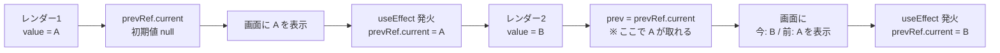

# 第99章：`useRef` で前の値（prevProps）を覚えておくテクニック

この章では、
**「いまの値」と「さっきまでの値（前の値）」を両方使えるようになるテクニック** をやっていきます 🎓

React ではコンポーネントが何回も描画（レンダー）されるので、

* 「さっきまでの `props`（prevProps）」
* 「さっきまでの `state`（prevState）」

を覚えておけると、めちゃくちゃ便利です 💡

ここでは、
👉 `useRef` ＋ `useEffect` を組み合わせて
**「前の値」をスマートに保存するパターン** をマスターします。([React][1])

---

## 1. そもそも「前の値」っていつ必要になるの？ 🤔

よくあるシチュエーションをいくつか挙げてみます 👇

* 「テストの点数が **上がったのか / 下がったのか** を表示したい」
* 「フォロワー数が **前より増えたらだけ** お祝いメッセージを出したい」
* 「ある `props` が **変わったタイミングだけ** アニメーションしたい」
* 「グラフを、前の値との **差分（+5, -3 など）** で表示したい」

こういうとき、
**「今の値」だけじゃなくて「さっきの値」も知りたい** ですよね 🧠

---

## 2. なんで普通の変数じゃダメなの？ 🧨

例えば、こんなイメージで書きたくなるかもです：

```ts
let prevScore = 0;

type Props = {
  score: number;
};

function ScoreView({ score }: Props) {
  const diff = score - prevScore;
  prevScore = score;

  return (
    <p>
      点数: {score}（前回との差: {diff}）
    </p>
  );
}
```

一見よさそうですが、これは **NG パターン** です 🙅‍♀️

理由は：

* React の関数コンポーネントは、**レンダーのたびに関数を呼び直す**
* そのたびにローカル変数は **最初からやり直し**
* さらに、複数のコンポーネントインスタンスを持ったときに、
  その `prevScore` を **全員で共有してしまってカオス** になる

つまり、
**「レンダーをまたいで値を覚えておく」ために、
普通の変数は向いていません** 🥲

---

## 3. `useRef` は「レンダーをまたいで使える箱」 📦

React の `useRef` は、

> 「画面の描画には直接いらないけど、コンポーネントが生きている間ずっと覚えておきたい値」

を保存しておくのにピッタリなフックです。([React][1])

* `useRef` が返すオブジェクトは `{ current: 値 }` という形
* `current` を書き換えても **再レンダーは発生しない**

👉 だから、
**「前回の値」を `ref.current` にしまっておいて、
次のレンダーで取り出す** という使い方ができます 💡

---

## 4. 「前の値」を覚える基本パターン 🧠🔁

React 公式の FAQ や多くの解説で使われている、
**「前の値を覚える」基本パターン** はこんな流れです：([Stack Overflow][2])

1. `useRef` で「前の値を保存する箱」を作る
2. `useEffect` で「レンダーのあと」に箱を更新する
3. 次のレンダーで `ref.current` を読むと、**前回の値** が入っている

### 🧬 図解（Mermaid）



---

## 5. 実例：テストの点数の「前回との差」を表示するコンポーネント 🎓📊

「テストの点数が前より上がったかどうか」を表示するコンポーネントを作ってみます ✨

### コンポーネントの役割

* 親から `score`（今回の点数）を `props` でもらう
* `useRef` で「前回の点数」を覚えておく
* 今回と前回の差分を表示する

### コード（`ScoreDiff.tsx` のイメージ）

```tsx
import { useEffect, useRef } from "react";

type ScoreDiffProps = {
  score: number;
};

export function ScoreDiff({ score }: ScoreDiffProps) {
  // 「前回の点数」を入れておく箱（最初は null）
  const prevScoreRef = useRef<number | null>(null);

  // いまのレンダー時点での「前回の値」
  const prevScore = prevScoreRef.current;

  let diffText = "今回が初めてのテストだよ ✨";

  if (prevScore !== null) {
    const diff = score - prevScore;

    if (diff > 0) {
      diffText = `前回より +${diff} 点アップ！🎉`;
    } else if (diff < 0) {
      diffText = `前回より ${diff} 点ダウン…💦`;
    } else {
      diffText = "前回と同じ点数だよ 😌";
    }
  }

  // レンダーが終わった「あと」で、今回の点数を保存する
  useEffect(() => {
    prevScoreRef.current = score;
  }, [score]);

  return (
    <div>
      <p>今回の点数: {score} 点</p>
      <p>{diffText}</p>
      {prevScore !== null && <p>（前回: {prevScore} 点）</p>}
    </div>
  );
}
```

### 動きのイメージ ✨

1. 最初の表示

   * `prevScoreRef.current` は `null`
   * 「今回が初めてのテストだよ ✨」と表示
   * そのあと `useEffect` で `prevScoreRef.current = score`

2. 2回目の表示（点数が 80 → 90 とか）

   * `prevScoreRef.current` に「80」が残っている
   * 今回の `score` は 90
   * → 差分は `+10` なので「前回より +10 点アップ！」

こうやって、
**`useRef` で前の `props` を覚えつつ、
`useEffect` で更新タイミングをコントロール** しています 💪

---

## 6. なんども使えるように：`usePrevious` カスタムフックを作る 🧰

いまのパターン、
「前の値を取りたいたびに同じコードを書く」のは面倒ですよね 🌀

そこでよく使われるのが、
**`usePrevious` というカスタムフック** です。([Developer Way][3])

### `usePrevious`（ジェネリック版）

```tsx
import { useEffect, useRef } from "react";

// どんな型の値でも受け取れるように <T> を使う
export function usePrevious<T>(value: T): T | undefined {
  const ref = useRef<T>();

  useEffect(() => {
    // レンダーが終わったあとで「今回の値」を保存
    ref.current = value;
  }, [value]);

  // 次のレンダー時にここから「前回の値」が取れる
  return ref.current;
}
```

### 使い方例：フォロワー数の前回との差を出す 💖

```tsx
import { usePrevious } from "./usePrevious";

type FollowerProps = {
  followers: number;
};

export function FollowerInfo({ followers }: FollowerProps) {
  const prevFollowers = usePrevious(followers);

  const hasPrev = prevFollowers !== undefined;

  return (
    <div>
      <p>フォロワー: {followers} 人</p>

      {hasPrev && (
        <p>
          前回からの変化:
          {" "}
          {followers - (prevFollowers as number)} 人
        </p>
      )}

      {!hasPrev && <p>今回が最初のカウントだよ 🌸</p>}
    </div>
  );
}
```

💡 こうしておけば、
**「前の `props` / 前の `state` を比較したい」**
という場面で、サクッと `usePrevious` を再利用できます ✨

---

## 7. TypeScript 的なポイント 🎯

### 7-1. `useRef<number | null>(null)` の意味

`useRef` に型をつけるときは、

```ts
const prevScoreRef = useRef<number | null>(null);
```

のように、

* 最初は `null`
* 途中から `number`

という可能性があるので、`number | null` にしています。

TypeScript では、`useRef` の型は
**「初期値の型」とセットで考える** のが大事です。([React TypeScript Cheatsheets][4])

### 7-2. `usePrevious<T>` の型

`usePrevious` は、

```ts
export function usePrevious<T>(value: T): T | undefined
```

と書いています。

* 最初のレンダーでは「前の値」がないので → `undefined`
* 2回目以降は `T` の値が入る

という意味になります ✅

---

## 8. よくあるミスと注意点 ⚠️

### ❌ ミス1：`ref.current` を依存配列に入れちゃう

```ts
useEffect(() => {
  prevRef.current = value;
}, [prevRef.current]); // ← これはダメ
```

`ref.current` を依存配列に入れても、
**`current` が変わってもレンダーは発生しない** ので、
挙動がややこしくなります。([Epic React][5])

👉 ここは素直に `value` だけを依存配列に入れておきましょう。

### ❌ ミス2：`useRef` を「画面の値」として使ってしまう

`ref.current` を直接 JSX に使ってしまうと、

* 値を変えてもレンダーされない
* 画面に反映されない

という状態になります。

**画面に出したい「いまの値」は `useState`**
**比較したい「前の値」は `useRef`**

という役割分担を意識するとスッキリします 🌟

### ❌ ミス3：初期値を考えずに `ref.current!` 連発

`ref.current!`（Non-null assertion）をクセで使うと、
初回レンダーで `undefined` / `null` が入っていてクラッシュ…
ということもあります 🥲

👉 なるべく

* ユニオン型（`number | null`）にして
* `if (prev !== null)` のようにチェック

する書き方に慣れておくと、安全で読みやすくなります ✅

---

## 9. まとめ ✨（チェックリスト）

この章で押さえておきたいポイント ✅

* `useRef` は「レンダーをまたいで値を保存できる箱」📦
* `useEffect` と組み合わせることで
  **「前回の値（prevProps / prevState）」** を覚えられる
* 何度も使うなら `usePrevious` カスタムフックにしておくと便利 💕
* TypeScript では

  * 初期値に合わせて `number | null` などの型をつける
  * `usePrevious<T>` の戻り値は `T | undefined` にする
* `ref.current` を依存配列に入れない、
  画面の値には `useState` を使う、というルールも大事 ✅

---

次のステップとしては、
この `usePrevious` を実際の小さなアプリ（カウンター・フォーム・TODO など）に
どんどん組み込んでみると、**「レンダーごとの変化」を意識する感覚** が
だいぶ育ってきますよ 🌱✨

「今の値」と「さっきの値」を自由に操れるようになれば、
リアクティブな UI 表現のレベルが一段アップします 💪💖

[1]: https://react.dev/reference/react/useRef?utm_source=chatgpt.com "useRef"
[2]: https://stackoverflow.com/questions/60221915/how-to-use-useref-to-reference-latest-value?utm_source=chatgpt.com "how to use useRef to reference latest value"
[3]: https://www.developerway.com/posts/implementing-advanced-use-previous-hook?utm_source=chatgpt.com "Implementing advanced usePrevious hook with React ..."
[4]: https://react-typescript-cheatsheet.netlify.app/docs/basic/getting-started/hooks/?utm_source=chatgpt.com "Hooks | React TypeScript Cheatsheets"
[5]: https://www.epicreact.dev/the-latest-ref-pattern-in-react?utm_source=chatgpt.com "The Latest Ref Pattern in React"
