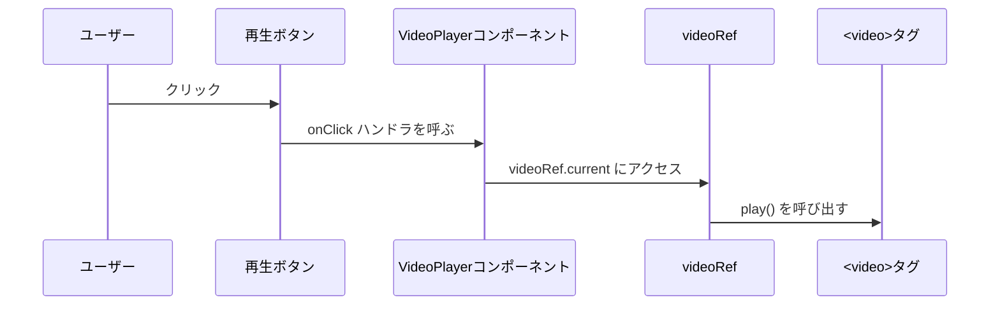

# 第100章：練習：`useRef` で `<video>` タグを再生・停止させる
**テーマ：`useRef` で `<video>` を「再生・停止」してみよう**

---

## 1. 今日のゴール 🎯

この章では、

* `<video>` タグに `ref` をつける ✅
* `useRef<HTMLVideoElement | null>` で型つきの参照を作る ✅
* ボタンを押したら `videoRef.current.play()` / `pause()` を呼ぶ ✅

…というミニアプリを作ります。
最終的にはこんなイメージ👇

* 「再生 ▶」「一時停止 ⏸」「最初から 🔁」ボタン付きの動画プレーヤー
* React v19 + TypeScript で実装
* 動画タグの **DOMそのもの** を `useRef` で操作する

---

## 2. 全体イメージを図でつかむ 🎨

`useRef` がどんな流れで動くか、Mermaidで図にしてみます。



* ボタンを押すと → コンポーネント内の関数が呼ばれる
* 関数の中で `videoRef.current` を通じて `<video>` のメソッドを呼ぶ
* これが **「画面は再レンダリングしないけど、DOMを直接さわりたい」** という `useRef` の得意分野です 💪

---

## 3. 事前準備 🎧

### 3-1. 動画ファイルを用意しよう

1. プロジェクトのルートに `public` フォルダがあるか確認

   * なければ作ってOK（`my-react-app/public` みたいな場所）
2. `public` フォルダの中に動画ファイルを置く

   * 例：`public/sample-video.mp4`

ブラウザからは、`/sample-video.mp4` というURLでアクセスできます。

---

## 4. `VideoPlayer` コンポーネントを作る 🧩

`src/VideoPlayer.tsx` を作って、次のコードを書きます。

```tsx
import { useRef } from "react";

type VideoPlayerProps = {
  src: string;
  width?: number;
};

export function VideoPlayer({ src, width = 480 }: VideoPlayerProps) {
  // HTMLVideoElement を指す ref を用意（最初は null）
  const videoRef = useRef<HTMLVideoElement | null>(null);

  const handlePlay = () => {
    // current が null じゃないときだけ play() する
    if (videoRef.current) {
      videoRef.current.play();
    }
  };

  const handlePause = () => {
    if (videoRef.current) {
      videoRef.current.pause();
    }
  };

  const handleRestart = () => {
    if (videoRef.current) {
      // 再生位置を先頭に戻してから再生
      videoRef.current.currentTime = 0;
      videoRef.current.play();
    }
  };

  return (
    <div className="video-player">
      <video
        ref={videoRef}
        src={src}
        width={width}
        // ブラウザ標準のコントロールは非表示（自作ボタンだけで操作してみる）
        controls={false}
      />
      <div className="video-controls">
        <button type="button" onClick={handlePlay}>
          ▶ 再生
        </button>
        <button type="button" onClick={handlePause}>
          ⏸ 一時停止
        </button>
        <button type="button" onClick={handleRestart}>
          🔁 最初から
        </button>
      </div>
    </div>
  );
}
```

### 4-1. 大事なポイント 📝

* `useRef<HTMLVideoElement | null>(null);`

  * `HTMLVideoElement` … `<video>` タグに対応するDOMの型
  * `| null` … 最初の描画のときはまだDOMがないので `null`
* JSX 側で `ref={videoRef}` と書くことで、

  * レンダリング後に `videoRef.current` に `<video>` のDOMが入るイメージ
* `videoRef.current?.play()` でもOK

  * ここでは if 文で `null` チェックしてます

---

## 5. `App.tsx` から呼び出してみる 🚀

`src/App.tsx` を編集して、`VideoPlayer` を表示してみます。

```tsx
import "./App.css";
import { VideoPlayer } from "./VideoPlayer";

function App() {
  return (
    <main style={{ padding: "16px" }}>
      <h1>React × useRef で動画プレーヤー 🎬</h1>
      <p>ボタンで動画を操作してみよう！</p>
      <VideoPlayer src="/sample-video.mp4" width={640} />
    </main>
  );
}

export default App;
```

そのあと、

* ターミナルで `npm run dev` を実行 ▶
* ブラウザで表示して、

  * ▶ を押したら再生されるか
  * ⏸ を押したら止まるか
  * 🔁 を押したら最初から再生されるか

をチェックしてみてください 👀✨

---

## 6. ちょっとだけ見た目を整える（お好みで）💅

`src/App.css` や `src/index.css` に、簡単なスタイルを足してみましょう。
（CSS Modules でもOKですが、ここではシンプルに全体CSSで）

```css
.video-player {
  display: flex;
  flex-direction: column;
  gap: 8px;
  align-items: flex-start;
  max-width: 640px;
}

.video-controls {
  display: flex;
  gap: 8px;
}

.video-controls button {
  padding: 6px 14px;
  border-radius: 999px;
  border: none;
  cursor: pointer;
  font-size: 14px;
  background-color: #2563eb;
  color: #ffffff;
  transition: transform 0.05s ease, filter 0.1s ease;
}

.video-controls button:hover {
  filter: brightness(1.1);
  transform: translateY(-1px);
}

.video-controls button:active {
  transform: translateY(0);
  filter: brightness(0.95);
}
```

可愛いボタンでテンション上げていきましょ〜 🎀

---

## 7. もう一度、`useRef` の役割を整理しよう 🤔

この章での `useRef` はこんな役割でした：

1. **「画面に表示されている `<video>` タグへの直接の参照」を持つ**

   * `const videoRef = useRef<HTMLVideoElement | null>(null);`

2. JSX の `ref` 属性で「どのDOMを指すか」を教える

   * `<video ref={videoRef} ... />`

3. イベントハンドラの中で `.current` 経由でDOMメソッドを呼ぶ

   * `videoRef.current.play()`
   * `videoRef.current.pause()`
   * `videoRef.current.currentTime = 0`

**ポイント：**
`useState` と違って `useRef` の値が変わっても再レンダリングは起きません。
だからこそ、
「**再描画は不要だけど、DOMを触りたいとき**」にぴったりな道具なんでしたね 🧰

---

## 8. 発展問題（チャレンジしてみたい人向け）🔥

時間と気力に余裕があったら、次のような機能もトライしてみてください！

### 発展1：再生速度を変えるボタン

* 「2倍速 🎵」ボタンを追加して、

  * `videoRef.current.playbackRate = 2;`
* 「通常速度 🐢」ボタンで、

  * `playbackRate` を `1` に戻す

### 発展2：ミュート切り替えボタン

* 「ミュート 🔇 / 解除 🔊」ボタンを作って、

  * `videoRef.current.muted = !videoRef.current.muted;`
* ボタンのラベルを状態に合わせて変えるには `useState` との組み合わせも練習になります 💡

### 発展3：`controls={true}` も試してみる

* `<video>` に `controls` をつけると、ブラウザ標準のコントローラも出てきます。
* 自作ボタン + 標準コントロールの両方で操作できるか、挙動を観察してみてください 👀

---

## 9. まとめ 🌈

この第100章では…

* `useRef<HTMLVideoElement | null>` で `<video>` のDOMを指す参照を作る
* `ref={videoRef}` で `<video>` と `useRef` をつなぐ
* ボタンクリック → `videoRef.current.play()` / `pause()` / `currentTime` 書き換え

という一連の流れを体験しました 🎬✨

「入力にフォーカスを当てる」「スクロール位置を保存する」「キャンバスを直接触る」など、
`<video>` 以外にも `useRef` はたくさん応用できます。

次に何かUIを作るとき、

> 「これは state かな？ それとも ref かな？」

とちょっと考えてみるクセをつけると、React脳がどんどん育っていきますよ 🧠🌱

---

もし「発展1やりたいからコード一緒に考えて〜」みたいなのがあれば、
いつでも声かけてくださいね 💌
