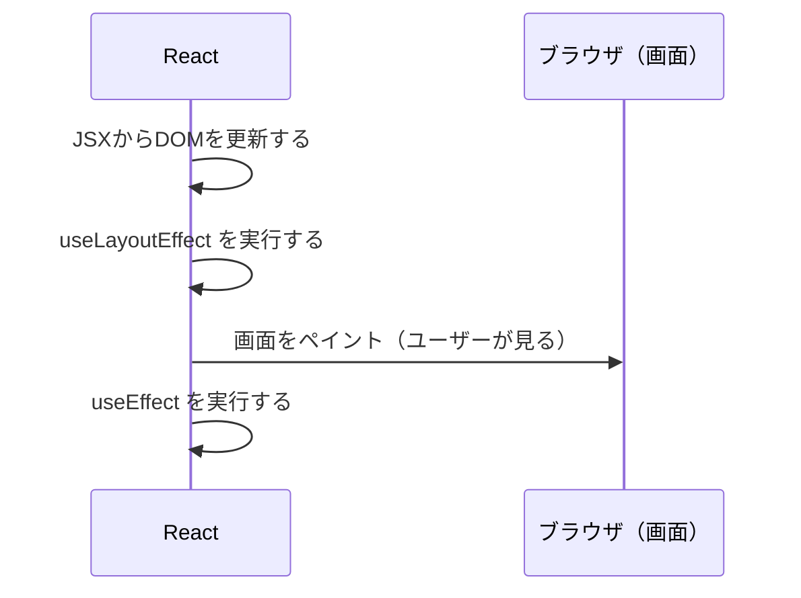

# 第101章：【フック】`useLayoutEffect`

---

#### 🎯 この章のゴール

この章では、こんなことができるようになるのが目標です👇

* `useLayoutEffect` が **どんなタイミングで動くフック** なのかイメージできる
* 「`useEffect` と似てるけど、ここが違う！」をざっくり説明できる
* かんたんな例で `useLayoutEffect` を **正しい場面で使える** ようになる
* 「どんなときに使わないほうがいいか」もなんとなく分かる

---

## 1️⃣ まずはざっくりイメージから 🌈

`useLayoutEffect` は、

> 「画面がユーザーに見える **直前** に、レイアウト（位置やサイズ）をチェックしたり微調整したりするためのフック」
> です。([React][1])

流れとしてはこんな感じになります👇

1. React が JSX をもとに DOM を更新する
2. `useLayoutEffect` の中のコードが動く
3. そのあとで **ブラウザが実際の画面をペイント（描画）** する
4. さらに後で `useEffect` が動く

つまり、

* 「DOM は更新されたけど、まだ画面には出ていない」タイミングで
* レイアウトを測ったり、スクロール位置を直したりできる
  という感じです✨([React][1])

---

## 2️⃣ タイムラインを図で見る 🕒✨

React の処理の流れを、`useEffect` と `useLayoutEffect` の両方を含めて図にしてみます。



ざっくり言うと：

* `useLayoutEffect`：**画面が描かれる前に動く** 🧵
* `useEffect`：**画面が描かれたあとに動く** 🌈

この「ちょっとだけ早いタイミング」が、
「チラッとレイアウトがズレて見える」問題を防ぐときに役立ちます💡([React][1])

---

## 3️⃣ どんなときに嬉しいの？🧐

`useLayoutEffect` が活躍するのは、たとえばこんな場面です👇

* ツールチップやポップアップの **位置を決めるために要素のサイズを測るとき**
* アニメーションの開始位置を、DOM のサイズや位置をもとに決めたいとき
* 「一瞬だけ変な位置に表示されてから正しい場所に動く」のを防ぎたいとき

公式ドキュメントでも、
「**ツールチップの高さを測ってから、正しい位置に再配置する**」ような場面を例に挙げています。([React][1])

---

## 4️⃣ 基本の書き方 📝

まずはシンプルに、書き方だけ覚えちゃいましょう✨

### 🧩 シグネチャ（ざっくり型）

```ts
useLayoutEffect(() => {
  // ここに「レイアウトに関係する処理」を書く
  // 例：DOMのサイズを測る、スクロール位置を調整する など

  return () => {
    // クリーンアップ（お片づけ）が必要ならここに書く
  };
}, [依存する値]);
```

* 第1引数：実行したい関数
* 第2引数：**「何を監視するか」リスト（依存配列）**

  * `[]` なら「最初の1回だけ」
  * `[count]` なら「`count` が変わるたび」

`useEffect` と書き方はほぼ同じです。
違うのは「**動くタイミング**」だけ⏱️

---

## 5️⃣ かんたんな例：ボックスの幅を測って表示してみる 📏

「ボックスの幅を測って、すぐ下に表示する」小さなコンポーネントを書いてみます。

ポイントは：

* `useRef` で `<div>` をつかまえる
* `getBoundingClientRect()` で幅を測る
* `useLayoutEffect` で「画面が描かれる前」にそれをやる

```tsx
import { useLayoutEffect, useRef, useState } from "react";

export function MeasureBox() {
  const boxRef = useRef<HTMLDivElement | null>(null);
  const [width, setWidth] = useState(0);

  useLayoutEffect(() => {
    if (!boxRef.current) return;

    const rect = boxRef.current.getBoundingClientRect();
    setWidth(rect.width);
  }, []);

  return (
    <div style={{ padding: "16px" }}>
      <div
        ref={boxRef}
        style={{
          padding: "16px",
          border: "1px solid #ccc",
          fontWeight: "bold",
        }}
      >
        📦 このボックスの幅を測っています…
      </div>
      <p style={{ marginTop: "8px" }}>
        ✅ 測った幅：<span>{width}</span> px
      </p>
    </div>
  );
}
```

### ここで大事なポイント 💡

* `boxRef.current` に **実際の `<div>` 要素** が入る
* `getBoundingClientRect()` で、その要素の大きさや位置を取得できる
* `useLayoutEffect` の中で測ることで、

  * **ユーザーが見る前** に width を決められるので
  * 「一瞬だけ `0px` と表示されてから正しい値に変わる」みたいなチラつきを減らせます✨([React][1])

---

## 6️⃣ `useEffect` とのざっくり違い（軽くおさらい）⚖️

詳しい比較は **第102章** でやりますが、
ここでは「雰囲気」だけつかんでおきましょう🌸

| フック               | 実行タイミング                  | よく使う用途            |
| ----------------- | ------------------------ | ----------------- |
| `useEffect`       | 画面が描かれた **あと**           | データ取得、ログ出力、タイマーなど |
| `useLayoutEffect` | 画面が描かれる **直前**（DOM更新の直後） | サイズ計測、スクロール位置調整など |

* レイアウトに **関係ない処理**
  → ほぼ全部 `useEffect` でOK 🌿
* レイアウト（位置・サイズ）を見てから JSX を決めたい
  → そこで初めて `useLayoutEffect` の出番 ✨([React][1])

---

## 7️⃣ 注意点：使いすぎると重くなるかも…⚠️

`useLayoutEffect` には大事な注意点もあります。

* `useLayoutEffect` の中の処理が終わるまで、
  **ブラウザは画面をペイントできません**。([React][1])
* つまり、ここで重い処理（時間のかかる計算・巨大なループなど）をすると、
  ユーザーから見ると「画面が固まってる…？」みたいに感じてしまいます🥲

公式ドキュメントでも、

> `useLayoutEffect` の中のコードや、その中で行う state 更新は
> ブラウザが画面を再描画するのをブロックするので、
> **使いすぎるとアプリが遅くなる**

と注意されています。([React][1])

👉 なので、基本ルールとしては：

* **まずは `useEffect` を使う**
* 「レイアウトがチラつく」「位置を測りたい」みたいな
  **見た目の問題が出たときだけ `useLayoutEffect` に切り替える**

くらいの気持ちでOKです💪

---

## 8️⃣ ちょっとだけ上級ネタ：サーバーレンダリングの場合 🖥️

今はまだ気にしなくて大丈夫ですが、
将来 Next.js などで **サーバーサイドレンダリング (SSR)** を使うようになると、

* サーバー上では「ブラウザの画面」が存在しないので
* `useLayoutEffect` は意味を持たず、
* そのために **「useLayoutEffect はサーバーでは何もしないよ」みたいな警告が出ることがあります**。([React][1])

今は

> 「`useLayoutEffect` は基本的に **ブラウザで動く処理のためのもの**」
> と覚えておけばOKです👌

---

## 9️⃣ ミニ練習問題 ✏️✨

最後に、軽い課題を置いておきます。
コードは次の章でじっくり書いていくので、ここでは **考え方だけ** で大丈夫です😊

### Q1. これは `useEffect`？それとも `useLayoutEffect`？

それぞれについて、どちらを使うのが良さそうか考えてみてください👇

1. ページを開いたときに、`document.title`（タブのタイトル）を「TODOアプリ」に変えたい
2. 入力フォームの下に、入力欄の **実際の幅 (px)** を表示したい
3. ボタンをクリックしたときに、API からデータを取ってきて表示したい
4. モーダルが開いたときに、ページのスクロール位置を必ず一番上に戻したい

💡 ヒント：

* 「レイアウト（位置・サイズ）を見る必要がある？」
* 「画面が描かれる前じゃないと困る？」

### Q2. 自分の言葉で説明してみよう

声に出して、あるいはノートに ✍️

> 「`useLayoutEffect` は、〇〇〇のために、画面が描かれる前に動くフックだ」

この「〇〇〇」の部分を、自分なりの言葉で埋めてみてください。
（例：サイズを測る、スクロール位置を直す、など）

---

## 10️⃣ この章のまとめ 🎀

* `useLayoutEffect` は **画面がペイントされる前に** 実行されるフック
* DOM はもう更新されているから、**正しいサイズ・位置を測れる**
* レイアウトに関係ない処理は、基本的に `useEffect` でOK
* `useLayoutEffect` を使いすぎると、ペイントが止まってアプリが重くなるので注意⚠️
* 「レイアウトを見てから表示を決めたいときの切り札」ぐらいの感覚で使うと良い🌟

次の **第102章** では、
`useEffect` と `useLayoutEffect` の「実行タイミングの違い」を、
もっと具体的に比べていきます💻✨

[1]: https://react.dev/reference/react/useLayoutEffect?utm_source=chatgpt.com "useLayoutEffect"
