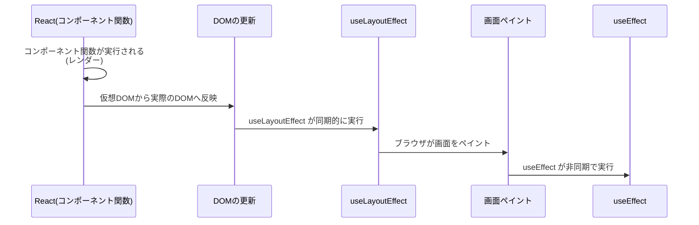

# 第102章：`useEffect` vs `useLayoutEffect`

💡「いつ動くの？」タイミングの違いをつかもう！

---

この章では、

* `useEffect` と `useLayoutEffect` の「実行タイミングの違い」
* それぞれ **どんな処理に向いているか**
* 実際のコードとログを見て、体感で覚える 👀

ここまでをゴールにします 🎓✨

---

## 1️⃣ ざっくり一言でまとめると…

| フック名              | いつ動く？                   | 何に向いてる？                                |
| ----------------- | ----------------------- | -------------------------------------- |
| `useEffect`       | **画面が描画されたあと** 💻       | 通信、ログ、データ保存など「見た目に関係ない処理」              |
| `useLayoutEffect` | **DOMが更新された直後〜描画の前** 🧱 | レイアウト測定、スクロール位置の調整など「見た目がズレないようにしたい処理」 |

> まずはこう覚えておけばOKです ✨
> 👉 「よく分からなかったら、とりあえず `useEffect`」
> 👉 「画面がチカチカしたら `useLayoutEffect` を思い出す」

---

## 2️⃣ タイミングの流れを図で見る 🧠✨

React がコンポーネントを描画するときの流れを、Mermaid でイメージしてみます。



（ざっくり言うと👇）

1. コンポーネント関数が呼ばれる（レンダー）
2. DOMが書き換わる（でもまだ画面には出てないイメージ）
3. `useLayoutEffect` が走る（このタイミングならレイアウトを安全にいじれる）
4. ブラウザが画面を表示する（ペイント）
5. そのあとに `useEffect` が走る（見た目に関係ない処理はここで）

---

## 3️⃣ 実験してみよう：ログで順番を確認 👀🧪

実際に小さなサンプルを作って、
**「どっちが先に実行されるのか」** を目で見て確認してみます。

### 3-1. コンポーネントを作る

`src/EffectTimingDemo.tsx` を新しく作って、次のコードを書いてみてください。

```tsx
import { useEffect, useLayoutEffect, useState } from "react";

export function EffectTimingDemo() {
  const [count, setCount] = useState(0);

  console.log("🧩 render: コンポーネント関数が実行された");

  useLayoutEffect(() => {
    console.log("🏗 useLayoutEffect: DOM更新直後（ペイント前）");
  });

  useEffect(() => {
    console.log("🎨 useEffect: 画面ペイント後");
  });

  return (
    <div
      style={{
        padding: "16px",
        border: "1px solid #ccc",
        borderRadius: "8px",
        maxWidth: "360px",
        margin: "24px auto",
      }}
    >
      <h2>useEffect vs useLayoutEffect ⏱</h2>
      <p>カウント：{count}</p>
      <button
        onClick={() => setCount((prev) => prev + 1)}
        style={{
          padding: "8px 16px",
          borderRadius: "999px",
          border: "none",
          cursor: "pointer",
        }}
      >
        +1 する ✨
      </button>
      <p style={{ marginTop: "8px", fontSize: "12px", color: "#666" }}>
        DevTools の Console を開いてログの順番を見てみてね 👀
      </p>
    </div>
  );
}
```

### 3-2. `App.tsx` から呼び出す

`src/App.tsx` をこんな感じにして、このコンポーネントを表示しましょう。

```tsx
import { EffectTimingDemo } from "./EffectTimingDemo";

function App() {
  return (
    <>
      <h1 style={{ textAlign: "center" }}>第102章：useEffect vs useLayoutEffect</h1>
      <EffectTimingDemo />
    </>
  );
}

export default App;
```

---

## 4️⃣ 実行してログをチェック 🖥️🔍

1. ターミナルで `npm run dev` を実行
2. ブラウザでアプリを開く
3. DevTools（F12）の「Console」タブを開く
4. 画面を読み込んだとき、ボタンを押したときのログを確認してみましょう

### たとえば、こんな順番になるはずです 👇

（Strict Mode の影響で 2回ずつ出ることがあります。その場合も **並び順** に注目！）

* ① `🧩 render: コンポーネント関数が実行された`
* ② `🏗 useLayoutEffect: DOM更新直後（ペイント前）`
* ③ `🎨 useEffect: 画面ペイント後`

👉 ポイントは **必ず `useLayoutEffect` が `useEffect` より先に走る** ということです ⏱✨

---

## 5️⃣ それぞれ「何に向いてる？」💁‍♀️💬

### 🟦 `useEffect` に向いている処理

`useEffect` は **画面がユーザーに見えたあと** に動くので、
見た目が多少遅れても問題ないものに使います。

例 🎀

* API からデータを取ってくる（**通信**）
* `console.log` でログを出す（**デバッグ**）
* `localStorage` にデータを保存する
* 外部サービスの計測（Google Analytics など）

> ✅ 基本的には「副作用＝まず `useEffect`」でOKです。

---

### 🟧 `useLayoutEffect` に向いている処理

`useLayoutEffect` は **DOM が更新されてから、ペイントされる前** に動きます。
つまり、

> 「画面が見える前に、ちょっと位置やサイズを調整したい…！」

みたいな場面で活躍します ✨

例 🎀

* 要素の幅・高さを測って、その結果でスタイルを調整する
* スクロール位置をきっちり合わせる（チャットの一番下にスクロールなど）
* レイアウトが一瞬ズレてから直る「チラつき」を消したいとき

> ⚠ 逆に、**重い処理をここに書くと画面の表示が遅くなる**ので注意です。
> 「どうしてもレイアウトに関係する処理だけ」に絞るのがコツです。

---

## 6️⃣ もう一歩：`useEffect` でOKなケース、ダメなケース 🎭

### ✅ `useEffect` で十分なケース

* ボタンを押したあとに
  **「サーバーに保存しました！」とログを送るだけ**
* フォームの内容を 1秒ごとに `localStorage` に保存する
* ページ閲覧中の時間を計測する

これらは、**画面の見た目がちょっと遅くなっても問題ない**ですよね。
なので `useEffect` でOKです 💮

---

### 😵 `useEffect` だとちょっと困るケース

* 「画面を開いた瞬間に、一番下にスクロールしたいチャット画面」
* 「要素の高さに応じてアニメーションの開始位置を調整したい」

`useEffect` だと、

1. いったん**適当な位置**で表示される
2. そのあと `useEffect` が動いてスクロール or レイアウト調整
3. ユーザーの目には「一瞬ズレてから直った」ように見える

という **チラッとした違和感** が出ます 👀💦

こういうときは `useLayoutEffect` を使うと、
**ユーザーに見える前に調整しておける**ので、画面が自然になります ✨

---

## 7️⃣ ミニ課題 🎓✨

最後に、理解を深めるためのプチ課題です。

### 📝 課題1：ログにコメントをつけてみる

さっきの `EffectTimingDemo` に、コメントを追加してみてください。

* `useLayoutEffect` の上に
  `// レイアウト確定前に動く処理`
* `useEffect` の上に
  `// 画面が描画されたあとに動く処理`

👉 自分の言葉でコメントを書き換えてみると、かなり理解が定着します ✍️✨

---

### 📝 課題2：`useEffect` をあえて `useLayoutEffect` に変えてみる

試しに、`useEffect` を `useLayoutEffect` に全部変えてみましょう。

* 動きはどう変わる？
* ログの順番はどう変わる？
* 画面の表示に違いはある？

**「見た目はほとんど変わらないけど、タイミングは違う」**
という感覚がつかめたら、この章はクリアです 🎉

---

## 8️⃣ まとめ 🌸

* `useEffect`：**ペイント後** に動く。通信・ログなど、見た目に関係ない処理向き。
* `useLayoutEffect`：**ペイント前** に動く。レイアウト調整など、見た目に直結する処理向き。
* 迷ったらまずは `useEffect`。
  「画面がチカチカする」「レイアウトが一瞬ズレる」時に `useLayoutEffect` を思い出す ✨

次の章（第103章）では、
**「じゃあ、具体的にどんな場面で `useLayoutEffect` が必要になるの？」**
を、もう少し実戦寄りの例で見ていきます 🚀💫
