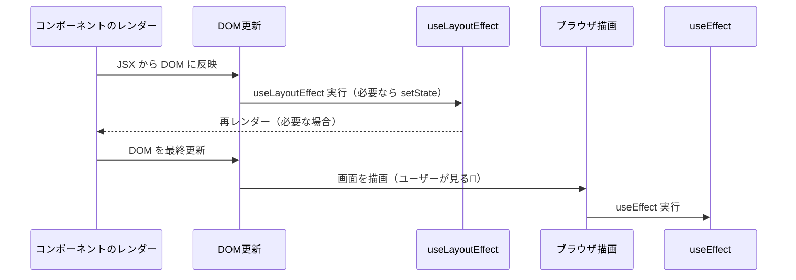

# 第103章：`useLayoutEffect` が必要な時

---

この章のゴールはこんな感じです👇

* `useEffect` と `useLayoutEffect` の**タイミングの違い**が分かる 💡
* どんなときに `useLayoutEffect` を使うと「画面がチカッ」とするのを防げるか分かる ✨
* 「基本は `useEffect`、どうしても必要なときだけ `useLayoutEffect`」という判断ができるようになる ✅

---

## 1️⃣ まずはタイミングのイメージをつかもう

公式ドキュメントでは、`useLayoutEffect` は

> 「ブラウザが画面を描き直す前に実行される `useEffect` のバージョン」

と説明されています。([React][1])

ざっくりタイムラインにするとこんな感じです👇

* **`useEffect`**

  * React が DOM を更新する
  * **ブラウザが画面を描画する（ユーザーが見る）**
  * そのあとで `useEffect` の中身が動く

* **`useLayoutEffect`**

  * React が DOM を更新する
  * **ブラウザが画面を描画する前に `useLayoutEffect` が動く**
  * 必要ならここで `setState` して、もう一回レンダーしてから描画

だから、**「ユーザーに見せる前に、DOM を計測したい・微調整したい」**ときに `useLayoutEffect` が役立ちます。([React][1])

---

## 2️⃣ タイミングを Mermaid 図で見てみよう 🧠✨

「チカッとする」を理解するには、処理の順番を見るのがいちばん分かりやすいです。

`useLayoutEffect` と `useEffect` が動く順番を、ざっくり図にするとこんな感じ 👇



ポイントはここ👇

* `useLayoutEffect` は **描画前** に実行されるので、
  「DOM のサイズを測る → それに合わせて State を更新 → レイアウトを調整」
  という流れを**ユーザーに見せずに**すませられます。([React][1])
* `useEffect` は **描画後** に実行されるので、
  「一瞬だけ“間違ったレイアウト”が見えてから、すぐ直る」という現象が起きやすいです。

この「一瞬だけ間違ったレイアウトが見える」のが、いわゆる

> 画面が「チカッ」とする✨

というやつです。

---

## 3️⃣ 「チカッ」が起こる典型パターン例 💥

よくあるのがこんなケースです👇

* 吹き出し / ツールチップの位置を決めたい
* ドロップダウンやモーダルの位置を、**要素のサイズに合わせて**調整したい
* スクロール位置を「一番下」にピタッと合わせたい

どれも共通しているのは、

> **「DOM のサイズや位置を読んでから、見た目を決めたい」**

という点です。
このときに `useEffect` を使うと、

1. まず「とりあえずの位置」でレンダーされて、ユーザーに一瞬見える
2. そのあと `useEffect` が走って、位置を修正する

という順番になるので、**「一瞬ズレた位置 → 正しい位置」**という変化が見えてしまいます。([React][1])

---

## 4️⃣ ダメな例：`useEffect` だとチカッとしてしまう版 ⚡

ツールチップっぽいコンポーネントをイメージしてみます。
※ここでは「雰囲気をつかむ」ことが目的なので、CSS はざっくりです 🐣

### 💥 Flicker しがちな `useEffect` 版

```tsx
import { useEffect, useRef, useState } from "react";

type TooltipProps = {
  text: string;
};

export function TooltipWithEffect({ text }: TooltipProps) {
  const tooltipRef = useRef<HTMLDivElement | null>(null);
  const [position, setPosition] = useState<"top" | "bottom">("top");

  useEffect(() => {
    const el = tooltipRef.current;
    if (!el) return;

    const rect = el.getBoundingClientRect();
    const isTooHigh = rect.top < 0;

    // 画面の上にはみ出してたら、下に出す
    if (isTooHigh) {
      setPosition("bottom");
    } else {
      setPosition("top");
    }
  }, [text]);

  return (
    <div className="tooltip-wrapper">
      <button>ホバーしてみてね</button>
      <div
        ref={tooltipRef}
        className={`tooltip tooltip-${position}`}
      >
        {text}
      </div>
    </div>
  );
}
```

このコードだと…

1. 最初は `position` が `"top"` なので、**必ず上に表示される状態**でレンダー
2. ブラウザがその状態を**一度描画**する
3. そのあと `useEffect` が走って、「はみ出してる！」と気づいて `position` を `"bottom"` に変更
4. もう一回レンダー → 下に移動

という流れになります。
ユーザーから見ると：

> 「一瞬上に出て、すぐ下にスッと移動する」 ⇒ チカッとしたように見える ⚡

---

## 5️⃣ 良い例：`useLayoutEffect` でチカッを防ぐ ✨

同じロジックでも、**位置の計算だけを `useLayoutEffect` に移す**と、描画前に位置が決まるのでチカッが消えます。

### ✅ `useLayoutEffect` 版（チカッ防止）

```tsx
import { useLayoutEffect, useRef, useState } from "react";

type TooltipProps = {
  text: string;
};

export function Tooltip({ text }: TooltipProps) {
  const tooltipRef = useRef<HTMLDivElement | null>(null);
  const [position, setPosition] = useState<"top" | "bottom">("top");

  useLayoutEffect(() => {
    const el = tooltipRef.current;
    if (!el) return;

    const rect = el.getBoundingClientRect();
    const isTooHigh = rect.top < 0;

    if (isTooHigh) {
      setPosition("bottom");
    } else {
      setPosition("top");
    }
  }, [text]);

  return (
    <div className="tooltip-wrapper">
      <button>ホバーしてみてね</button>
      <div
        ref={tooltipRef}
        className={`tooltip tooltip-${position}`}
      >
        {text}
      </div>
    </div>
  );
}
```

この場合の流れはこうです👇 ([React][1])

1. `Tooltip` がレンダーされて DOM に置かれる
2. **ブラウザが描画する前に** `useLayoutEffect` が実行される
3. ここで高さや位置を測って、必要なら `setPosition`
4. もう一回レンダーしてから、ブラウザが画面を描画
5. ユーザーが見るのは **「すでに正しい位置にあるツールチップ」** だけ

だから、**「上 → 下に移動」の瞬間をユーザーが見ることはありません** ✨

---

## 6️⃣ じゃあ、いつ `useLayoutEffect` を使うの？📌

ざっくりルールとしてはこんな感じでOKです👇

### ⭐ 基本ルール

* **基本はぜ〜んぶ `useEffect` で書く**
* 書いてみて、

  * 「一瞬レイアウトがズレる」
  * 「サイズが変わってガタッと動く」
  * 「スクロール位置が変な位置に一瞬なる」
    みたいな**“見た目の違和感”が出たときだけ**、`useLayoutEffect` を検討する

### ✅ `useLayoutEffect` が向いているケース

こういうときは `useLayoutEffect` 候補です👇 ([React][1])

* 要素の **サイズ・位置を測ってからレイアウトを決める** とき

  * ツールチップ / ポップオーバーの位置調整
  * モーダルを画面中央にピッタリ置きたいとき
* スクロール位置を**正確に合わせたい**とき

  * チャット画面で「常に一番下にスクロール」みたいなやつ
* アニメーションの開始位置など、**ピクセル単位で見た目が大事**なとき

---

## 7️⃣ 注意⚠️：`useLayoutEffect` は強いけど重たい💦

公式ドキュメントでも、

> `useLayoutEffect` の中の処理はブラウザの描画をブロックするので、
> 使いすぎるとアプリが重くなる。できるだけ `useEffect` を使ってね。([React][1])

という感じで**「ちょっと危険な力」**扱いになっています。

### 🧊 やりすぎ注意ポイント

* 重い計算や、ネットワーク通信を `useLayoutEffect` に書かない

  * それらは基本的に `useEffect` でOK
* ほんの一瞬の表示ズレくらいなら、**あえて `useEffect` のまま**でもいい状況も多い
* 「ほんとに今ここで `useLayoutEffect` が必要？」と毎回自問するクセをつけると◎

---

## 8️⃣ ミニチェック ✅：これはどっちを使う？

心の中で「useEffect / useLayoutEffect どっち？」と答えてみてください ✨

1. API からデータを取得して、画面に一覧を表示する

   * 👉 **ほぼ確実に `useEffect`**（レイアウト計測じゃない）([React][2])
2. チャットアプリで、新しいメッセージが来るたびに一番下までスクロールしたい

   * 👉 **ケースによっては `useLayoutEffect`**
     （一瞬スクロール位置がおかしく見えるようなら検討）
3. ツールチップが画面の外にはみ出さないように、位置を調整したい

   * 👉 **`useLayoutEffect` が有力**（ズレた位置が一瞬でも見えると違和感大）

---

## 9️⃣ まとめ 📝✨

* `useLayoutEffect` は **「描画前」に動く `useEffect`** みたいなフック
* DOM のサイズや位置を読んで、**ユーザーに見られる前に**レイアウトを整えたいときに使う
* ただし、描画をブロックするので**使いすぎると重くなる**
* 合言葉はこれでOK👇

> 🎯 **「まずは `useEffect`。どうしてもチカッとするなら、そこで初めて `useLayoutEffect` を検討」**

次の章では、実際に `useLayoutEffect` を使って **DOM のサイズを測る練習** をしていきます 📏✨

[1]: https://react.dev/reference/react/useLayoutEffect?utm_source=chatgpt.com "useLayoutEffect"
[2]: https://react.dev/reference/react/useEffect?utm_source=chatgpt.com "useEffect"
