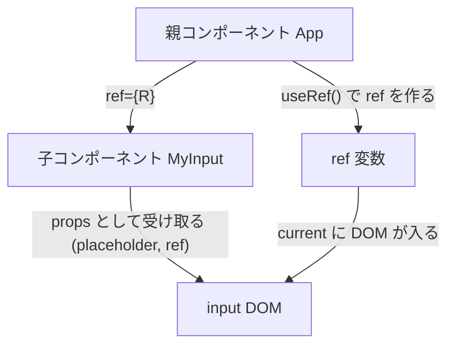

# 第105章：【v19】`ref` をPropsみたいに渡す

---

## 1️⃣ この章のゴール 🎯

この章がおわるころには、こんなことができるようになります👇

* `forwardRef` を使わずに、`ref` を子コンポーネントに渡せる
* 親コンポーネントから、子の `<input>` などにフォーカスを当てたりできる
* 「あ、`ref` って *普通の props みたいに* 渡せるんだ〜」とイメージできる

React 19 では、関数コンポーネントで `ref` を *そのまま props として受け取れる* ようになりました。([React][1])
その結果、昔は必須だった `forwardRef` は、基本的にもういりません。([callstack.com][2])

---

## 2️⃣ まずは軽く復習：`ref` ってなんだっけ？ 👀

`ref` は、ざっくりいうと…

> 「React の外見（=JSXの世界）から、**実際の DOM 要素にそっと触るためのリモコン**」

でしたね 🕹️

たとえば：

* ページを開いた瞬間、入力欄にカーソルを置きたい
* ボタンを押したら、特定の `<input>` にフォーカスしたい
* `<video>` を再生/停止したい

こういうときに `useRef` とセットで使いました。

```ts
// 以前やったシンプルな例（親から <input> を触る）
const inputRef = useRef<HTMLInputElement | null>(null);

return (
  <div>
    <input ref={inputRef} />
    <button onClick={() => inputRef.current?.focus()}>
      フォーカスする ✨
    </button>
  </div>
);
```

ここまでは OK 👍 という前提で進みます。

---

## 3️⃣ React 18 までの世界：`forwardRef` が必要だった時代 🧓

**昔（React 18まで）** は、`ref` を「親 → 子コンポーネント → その中の `<input>`」みたいに渡したいとき、`forwardRef` というちょっとややこしい関数が必要でした。([React][3])

イメージとしてはこんな感じ：

```ts
// 👵 昔の書き方（React 18 までのイメージ）

import { forwardRef, useRef } from "react";

type MyInputProps = {
  label: string;
};

const MyInput = forwardRef<HTMLInputElement, MyInputProps>(
  ({ label }, ref) => {
    return (
      <label>
        {label}
        <input ref={ref} />
      </label>
    );
  }
);

export function App() {
  const inputRef = useRef<HTMLInputElement | null>(null);

  return (
    <div>
      <MyInput label="お名前" ref={inputRef} />
      <button onClick={() => inputRef.current?.focus()}>
        フォーカス！
      </button>
    </div>
  );
}
```

* `forwardRef(...)` でコンポーネントを包む必要がある
* 型引数も増えて、TypeScript 的にも少し重たい感じ…😵‍💫

React 19 では、これが **ごっそりいらなくなる** のが今日の主役です ✨

---

## 4️⃣ React 19 の世界：`ref` はふつうの Props 🎉

React 19 からは、**関数コンポーネントの引数に `ref` をそのまま書いて OK** になりました。([React][1])

公式ドキュメントのイメージはこんな感じです👇([React][1])

```tsx
function MyInput({ placeholder, ref }) {
  return <input placeholder={placeholder} ref={ref} />;
}

// どこか別の場所
<MyInput ref={someRef} />;
```

つまり：

* 親側：`<MyInput ref={inputRef} />` と書くのは今までと同じ 💡
* 子側：`function MyInput(props)` の **パラメータに `ref` を追加するだけ**

という、とても素直な形になります。

---

## 5️⃣ 図でイメージしてみよう 🧠✨

`ref` がどう流れるか、Mermaid でざっくり図解してみます（イメージだけつかめればOKです 🌈）



---

## 6️⃣ TypeScript での基本パターン 🧪（まずはコピペでOK）

React 19 + TypeScript では、`ref` を扱うとき **「全部ひっくるめて props として受け取る」** パターンがラクです。([Stack Overflow][4])

### 💡 子コンポーネント：`MyInput.tsx`

* `<input>` にそのまま渡せるすべての props（`value`, `onChange`, `ref`, など）をまとめて受け取る
* そのまま `<input {...props} />` に流す

```ts
// MyInput.tsx
import type { ComponentPropsWithoutRef } from "react";

type MyInputProps = ComponentPropsWithoutRef<"input"> & {
  label?: string;
};

export function MyInput({ label, ...props }: MyInputProps) {
  return (
    <label style={{ display: "block", marginBottom: "8px" }}>
      {label && <span style={{ marginRight: "8px" }}>{label}</span>}
      {/* ここで props の中に ref も混ざっている */}
      <input {...props} />
    </label>
  );
}
```

ここで大事なのは：

* `ComponentPropsWithoutRef<"input">` の中に、
  **`ref` もふくめて `<input>` に渡せる props 一式** が入っている、ということ 💼
* `MyInput` の中では、`{ label, ...props }` で分けて、残りを `input` に流すだけ

> 型の意味は「いまはなんとなく」で大丈夫です。
> **次の第106章で、ここをじっくり分解していきます** 🧬

---

## 7️⃣ 親コンポーネントから `ref` を渡してフォーカスしてみよう 🔍

今度は親側です。
`App.tsx` から `MyInput` に `ref` を渡して、ボタンでフォーカスしてみましょう。

### 🧩 `App.tsx`

```ts
// App.tsx
import { useRef } from "react";
import { MyInput } from "./MyInput";

export function App() {
  const nameInputRef = useRef<HTMLInputElement | null>(null);

  const handleFocusClick = () => {
    // ref.current が null じゃなければ focus() を呼ぶ
    nameInputRef.current?.focus();
  };

  return (
    <div style={{ padding: "16px" }}>
      <h1>会員登録フォームっぽいなにか 💌</h1>

      <MyInput
        label="お名前"
        placeholder="山田 花子"
        ref={nameInputRef}
      />

      <button type="button" onClick={handleFocusClick}>
        「お名前」入力欄にフォーカスする ✨
      </button>
    </div>
  );
}
```

ポイントはこの2つだけです 🎯

1. `useRef<HTMLInputElement | null>(null)` で `ref` を作る
2. `<MyInput ref={nameInputRef} />` と渡す

あとは `MyInput` の中で `<input {...props} />` としているので、
`ref` がちゃんと `<input>` に届き、`nameInputRef.current` から触れるようになります 💪

---

## 8️⃣ 「昔との違い」をまとめると… 📚

React 19 では、`ref` 周りがこんな感じでスッキリしました 👇([React][1])

* ✅ **`forwardRef` なしで OK**

  * 新しく書くコンポーネントなら、基本的に `forwardRef` は使わない方向でOK
* ✅ `ref` は **`children` と同じような「特別な props」**

  * 親から渡せば、子の引数 or `ComponentProps` 経由で使える
* ✅ TypeScript 的には `ComponentPropsWithoutRef<"input">` などを使うとラク

逆に、これだけは覚えておいてね 👇

> `ref` は「DOM を直接さわる最終手段」なので、
> **何でもかんでも `ref` に頼るのはNG** ✋
> まずは `state` と `props` で表現できないか考えるのが基本です。([Qiita][5])

---

## 9️⃣ ミニ練習問題 📝（手を動かしてみよう）

時間があれば、こんな練習もしてみてください 💃

1. `MyInput` をもう1つ増やしてみる

   * 例：メールアドレス用 `<MyInput label="メールアドレス" />`
2. `emailInputRef` を作って、

   * 「メールアドレスにフォーカス」ボタンを作る
3. さらに、`Enter` を押したら **次の入力欄にフォーカス** するようにしてみる

   * `onKeyDown` で `e.key === "Enter"` のとき、次の `ref` に `focus()`

> ここまでできたら、「親 → 子 → DOM」への `ref` の流れはだいぶ掴めてます 🏆

---

## 10️⃣ この章のまとめ 🌈

* React 19 から、`ref` は **普通の props みたいに** 子コンポーネントに渡せる
* 新規コンポーネントでは、**`forwardRef` は基本いらない**
* TypeScript では `ComponentPropsWithoutRef<"input">` を使うと
  `ref` を含めた「`<input>` 用の全部入り props」を一気に受け取れて便利
* `ref` は「DOM への裏口」なので、乱用せず、必要なところだけで ✨

次の **第106章** では、

> 「`ref` を Props で渡すとき、**型をどう書くか**」

を、もう少しガッツリ TypeScript 目線でやっていきます 🧪
おつかれさまでした〜！☕💕

[1]: https://react.dev/blog/2024/12/05/react-19?utm_source=chatgpt.com "React v19"
[2]: https://www.callstack.com/blog/the-complete-developer-guide-to-react-19-part-2-new-enhancements?utm_source=chatgpt.com "Developer Guide to React 19: New Enhancements"
[3]: https://react.dev/reference/react/forwardRef?utm_source=chatgpt.com "forwardRef"
[4]: https://stackoverflow.com/questions/79300987/react-19-ref-as-prop-and-typescript?utm_source=chatgpt.com "React 19 \"ref as prop\" and TypeScript"
[5]: https://qiita.com/gilly/items/5df0f1852b71069d35bb?utm_source=chatgpt.com "【React 19対応】forwardRefはまだ必要？refの新しい渡し方と ..."
