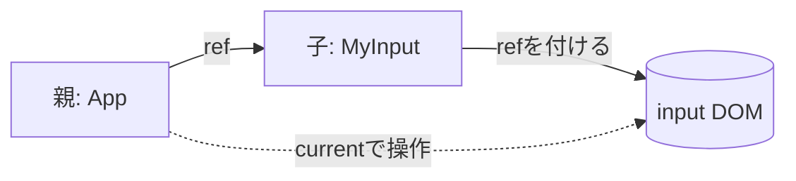

# 第106章：`ref` をPropsで渡す時の型定義 🧷✨

この章は「**React 19で `ref` を“普通のPropsみたいに”受け取れるようになった！**」という新しい世界で、**TypeScriptの型をどう書くのがいちばんラクで安全か**を覚える回だよ〜😊💡
（次の第107章で、実際に `ref` を受け取れる `MyInput` を作っていく準備になるよ！）

> React 19の `ref as a prop` は公式で紹介されてるよ 📌 ([React][1])

---

## 今日のゴール 🎯🌸

* `ref` をPropsとして受け取るときの **型定義テンプレ** を覚える
* とくに **`ComponentPropsWithRef<"input">`** を使う書き方に慣れる ✨ ([react-typescript-cheatsheet.netlify.app][2])

---

## まず「ref as a prop」って何がうれしいの？🥰

React 19からは、関数コンポーネントが **`ref` をPropsとして直接受け取れる**ようになったよ！

* ✅ もう `forwardRef(...)` の儀式がいらない
* ✅ TypeScriptの型もシンプルになりやすい

（将来的に `forwardRef` は非推奨/削除の方向とも言われてるよ） ([React][1])

---

## 図でイメージしよう 🗺️✨（Mermaid）



---

## ✅ いちばんおすすめの型：`ComponentPropsWithRef<"input">` 🏆✨

「`<input>` をラップする部品」を作るなら、まずこれが鉄板だよ！

* `placeholder` や `onChange` など **inputのProps全部**を引き継げる
* さらに **`ref` もちゃんと含まれる**（ここ大事！） ([react-typescript-cheatsheet.netlify.app][2])

---

## 実装：`MyInput`（refをPropsとして受け取る）🧁💕

### `src/components/MyInput.tsx`

```tsx
import type { ComponentPropsWithRef } from "react";

type MyInputProps = ComponentPropsWithRef<"input"> & {
  label?: string;
};

export function MyInput({ label, ref, ...props }: MyInputProps) {
  return (
    <label style={{ display: "grid", gap: 6 }}>
      {label && <span>{label}</span>}
      <input {...props} ref={ref} />
    </label>
  );
}
```

ポイントだよ👇😊

* `ref` を **普通に分割代入**してOK ✨
* `...props` で `<input>` にそのまま渡せるのが気持ちいい〜！

---

## 動作チェック：親からrefを渡してフォーカスする 👆✨

### `src/App.tsx`

```tsx
import { useRef } from "react";
import { MyInput } from "./components/MyInput";

export default function App() {
  const nameRef = useRef<HTMLInputElement>(null);

  return (
    <div style={{ padding: 24 }}>
      <h1>ref as a prop ためしてみよ〜✨</h1>

      <MyInput
        ref={nameRef}
        label="なまえ"
        placeholder="ここに入力してね"
      />

      <button
        onClick={() => nameRef.current?.focus()}
        style={{ marginTop: 12 }}
      >
        ここ押したらフォーカスするよ👀✨
      </button>
    </div>
  );
}
```

ボタン押すと入力欄にカーソルが行けば成功〜！🎉🥳

---

## もう1パターン：`ref` だけを自分で型付けする（最小構成）🧩

「inputのProps全部はいらない！自分のPropsだけで作りたい！」ってときはこれでもOKだよ👇

```tsx
import type { Ref } from "react";

type MiniInputProps = {
  label: string;
  ref?: Ref<HTMLInputElement>;
};

export function MiniInput({ label, ref }: MiniInputProps) {
  return (
    <label>
      {label}
      <input ref={ref} />
    </label>
  );
}
```

ただしこのやり方は、`placeholder` とか `onChange` とかを追加したくなるたびに自分で型を増やすことになるので、**ラップ系は `ComponentPropsWithRef` がラク**だよ〜😊✨

---

## よくあるつまずきポイント 😵‍💫➡️😺

### 1) 「`ref` がPropsに存在しない」って怒られる💥

だいたいこれ👇

* `@types/react` が古い（React 19対応の型になってない）

React 19の `ref as a prop` 自体は公式機能なので、型側が追いついてないと起こりやすいよ 📦💦 ([React][1])

### 2) `<input {...props} ref={ref} />` の順番どっち？🤔

この書き方（この章の例）みたいに **`ref` を分けて**渡してれば安心だよ😊✨
（`...props` の中に `ref` が混ざらないようにしてるからね！）

---

## ミニ練習 🎀✍️（5〜10分）

1. `MyInput` に `helpText?: string` を追加して、下に小さく表示してみよう 📝✨
2. `App.tsx` にもう1個 `MyInput` を増やして、ボタンで「2つ目にフォーカス」してみよう 👀💕

---

## まとめ 🧠✨

* React 19では **`ref` をPropsとして受け取れる** 🎉 ([React][1])
* `<input>` ラップ部品は **`ComponentPropsWithRef<"input">` が最強テンプレ** 🏆 ([react-typescript-cheatsheet.netlify.app][2])
* `ref` を分割代入して `<input ref={ref} />` でつなげばOK 😊🧷

次の **第107章** では、今作った流れを使って「`ref` を受け取れるカスタム `MyInput`」を練習として完成させるよ〜！💪💕

[1]: https://react.dev/blog/2024/12/05/react-19?utm_source=chatgpt.com "React v19"
[2]: https://react-typescript-cheatsheet.netlify.app/docs/basic/getting-started/forward_and_create_ref/?utm_source=chatgpt.com "forwardRef/createRef"
