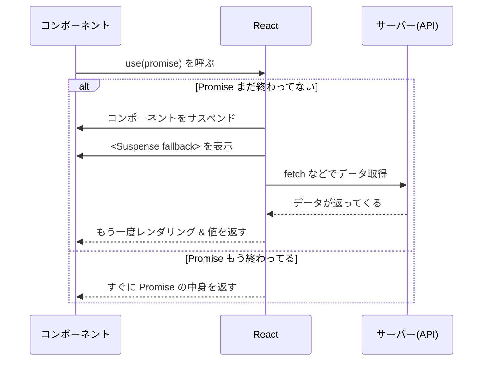

# 第112章：【v19フック】`use(Promise)`

---

#### この章でできるようになること 🎯

* 「ネットからデータを取ってきて表示する」最新のやり方がわかる
* 新フック `use(Promise)` のイメージがつかめる
* かんたんなサンプルを自分で書ける 💻

---

## 1. `use(Promise)` ってなに？🌊

React v19 で入った新しい API `use` は、

> 「Promise や Context から値を“そのまま”取り出すためのフック」

みたいな存在です。Promise を渡すと、解決されたあとに中身の値を返してくれます。([react.dev][1])

ざっくりいうと、

* `useEffect + useState` でやってた
  「データ取る → loading フラグ管理 → setState → エラー処理…」
  みたいなゴチャゴチャを
* `const data = use(somePromise);`
  の 1 行にギュッとまとめられるイメージです ✨([cybrosys.com][2])

しかも、Promise がまだ終わってないときはコンポーネントのレンダリングを一時停止（サスペンド）して、いちばん近くの `<Suspense>` の `fallback` を表示してくれます。([Qiita][3])

---

## 2. ざっくり動きのイメージ図 🧠

`use(Promise)` の裏側の流れを、かんたんに図で見てみます。

> ※図の `<Suspense>` とか「サスペンド」という言葉は、次の章（113 以降）でガッツリやるので、ここでは「読み込み中の画面を出してくれる仕組み」くらいのイメージで OK 🙆‍♀️



---

## 3. `useEffect` との違いを 10 秒でおさらい ⏱️

前の章（111）では、こんな流れでしたよね：

1. `useState` で `data` と `loading` を用意
2. `useEffect` の中で `fetch`
3. 取れたら `setData`、エラーなら `setError`
4. JSX の中で `loading ? '読み込み中...' : データ表示`

`use(Promise)` だと、同じことをざっくりこう書けます👇

* `const data = use(somePromise);`
* 読み込み中の画面は `<Suspense fallback={<p>読み込み中…</p>}>` におまかせ
* エラーは「エラーバウンダリ」という仕組みでまとめて処理（これは 118〜120 章で）

「状態を自分で管理する」というより、
**React に “待つこと” を丸投げする** 感じです 🙌([cybrosys.com][2])

---

## 4. まずは超シンプルなサンプルを書いてみよう 🐶

最初は「細かいことは気にしないで、とりあえず動かしてみる」がいちばんです 👍
ここでは **ランダムな犬画像 API** を使って、「ワンちゃん 1 枚だけ表示する」サンプルを作ってみます。

* API: `https://dog.ceo/api/breeds/image/random`
* 返ってくる JSON（だいたいこんな形）

```json
{
  "message": "画像のURL",
  "status": "success"
}
```

### 4-1. API 用のファイルを作る（`src/dogApi.ts`）📁

ポイントは 1 つだけ：

> **Promise を「コンポーネントの外」で作っておく**
> （＝モジュール読み込み時に 1 回だけ作る）

これで「毎回新しい Promise ができちゃって React が怒る問題」を避けられます 🧯([react.dev][4])

```ts
// src/dogApi.ts
export type DogApiResponse = {
  message: string; // 画像URL
  status: "success" | "error";
};

// モジュールが読み込まれたタイミングで 1 回だけ Promise を作っておく
export const randomDogImagePromise: Promise<DogApiResponse> = fetch(
  "https://dog.ceo/api/breeds/image/random"
).then((res) => {
  if (!res.ok) {
    throw new Error("ワンちゃん画像の取得に失敗しました 🥲");
  }
  return res.json() as Promise<DogApiResponse>;
});
```

> 💡 実務では「毎回違う ID を指定したい」などでもう少し工夫が必要ですが、
> **最初の一歩としては「モジュール外に Promise を置く」** パターンを覚えておけば OK です。

---

### 4-2. `use(Promise)` を使うコンポーネント ✨（`DogImage.tsx`）

次に、React コンポーネントの中で `use` を呼んで、さっきの Promise から値を取り出します。

```tsx
// src/DogImage.tsx
import { use } from "react";
import { randomDogImagePromise } from "./dogApi";

export function DogImage() {
  // 👇 Promise の「中身」が data に入ってくる
  const data = use(randomDogImagePromise);

  if (data.status !== "success") {
    // ここではざっくりエラーメッセージだけ
    return <p>画像の取得に失敗しました… 🥲</p>;
  }

  return (
    <div>
      <h2>今日のワンちゃん 🐶</h2>
      
    </div>
  );
}
```

ここでのポイント 📝

* `use(randomDogImagePromise)` と書くだけで、
  **`DogApiResponse` 型のオブジェクトが `data` に入る**（TS 的にも安心）
* `async/await` も `useState` も `useEffect` も書いてません ✨

---

### 4-3. `<Suspense>` で包んであげる（`App.tsx`）🛟

`use(Promise)` を使うコンポーネントは、**どこかの親で `<Suspense>` に包んでおく必要**があります。([react.dev][1])

`App.tsx` をこんな感じにしてみましょう。

```tsx
// src/App.tsx
import { Suspense } from "react";
import { DogImage } from "./DogImage";

function App() {
  return (
    <main style={{ padding: "24px", fontFamily: "system-ui, sans-serif" }}>
      <h1>React v19 データ取得デモ 🐾</h1>

      {/* 👇 DogImage の中で use(Promise) を使っている */}
      <Suspense fallback={<p>ワンちゃんを探してます… ⏳</p>}>
        <DogImage />
      </Suspense>
    </main>
  );
}

export default App;
```

これで流れはこうなります ✅

1. 最初のレンダリングで `DogImage` が `use(randomDogImagePromise)` を呼ぶ
2. Promise がまだ解決してない → React が「サスペンド」判定
3. いちばん近い `<Suspense>` が `fallback`（「ワンちゃんを探してます… ⏳」）を表示
4. Promise が終わったら再レンダリングされて、ワンちゃん画像が表示される

ブラウザで見ると、最初だけ「読み込み中…」がチラッと出て、その後に画像が出てくるはずです 🥰

---

## 5. `use(Promise)` を使うときのルールまとめ 📏

ちょっとだけ真面目な話もしましょう。

### ✅ やっていいこと

* **コンポーネント or カスタムフックの中で `use(promise)` を呼ぶ**
* **Promise は「外」で作る or ちゃんとキャッシュする**

  * モジュールスコープの `const promise = ...`
  * もしくは、`Map` や `React.cache` で「同じ引数なら同じ Promise」を返す ([Qiita][3])
* **`<Suspense>` で包んで `fallback` を用意する**

### ❌ やっちゃダメなこと

* **レンダーのたびに新しい Promise を作って、そのまま `use` に渡す**

  ```ts
  // ❌ これは NG 例（毎回 new Promise になっちゃう）
  function BadComponent() {
    const data = use(fetch("...").then((r) => r.json()));
    // ...
  }
  ```

  こういう書き方をすると、React 19 のブログにもあるとおり、
  「キャッシュされてない Promise をサスペンドさせてるよ！」という警告が出ます。([react.dev][4])

* **イベントハンドラの中で `use` を呼ぶ**

  ```ts
  // ❌ これも NG
  <button
    onClick={() => {
      const data = use(somePromise); // ← これはダメ
    }}
  >
    クリック
  </button>
  ```

  `use` は「レンダー中にしか呼んじゃダメな API」です。
  `useState` や `useEffect` と同じで、「クリックされたあとに使う」のは想定されていません。([Medium][5])

* **`try-catch` の中から `use` を呼ぶ**
  エラー処理は「エラーバウンダリ」という仕組みでやるのが基本スタイルです（118 章でやります）。([react.dev][1])

---

## 6. ちょっとだけ Q&A コーナー 💌

### Q1. `async/await` と何がちがうの？

* `async/await` は「普通の関数」で Promise を待つ文法
* `use(Promise)` は「React のレンダリングの中で Promise を待つための仕組み」

`use` を使うと、**「待っている間の画面」も React が自動でコントロールしてくれる** ところがいちばん大きな違いです ✨

---

### Q2. じゃあ `useEffect` はもういらないの？

いえいえ、まだまだ現役です 🧓✨

* `useEffect` は「DOM を直接さわる」「イベントリスナーを貼る」「外部ライブラリと同期する」みたいな **“副作用” 用**
* `use(Promise)` は「データを取ってきて表示する」みたいな **“データ取得” 用**

という感じで、役割がちょっと違います。
この章では「データ取得なら `use(Promise)` も選択肢だよ〜」と覚えてくれれば OK 🙆‍♀️

---

### Q3. ふつうの Vite + SPA でも `use(Promise)` 使っていいの？

* React 公式としては、「Promise はちゃんとキャッシュしてね」「`<Suspense>` と一緒に使ってね」という前提つきで OK、というスタンスです。([react.dev][4])
* Next.js などのフレームワークでは「Server Components で Promise を作って、それを Client Component に渡して `use` する」スタイルが主流になりつつあります。([react.dev][1])

この教材ではまず **Vite のシンプルな SPA で「動きのイメージ」をつかむ** →
そのあとで「フレームワークだとどう活かせるか」を見ていく、という流れにしていきます 🌈

---

## 7. ミニ練習問題 ✍️（やってみたらきっと身につく）

時間があるときに、VS Code で実際に手を動かしてみてください！

### 練習 1：ユーザーカードを `use(Promise)` で作る 👤

1. `https://jsonplaceholder.typicode.com/users/1` からユーザー情報を取ってくる
2. `UserApiResponse` 型を自分で定義する（`name`, `email` あたりだけでOK）
3. この章のワンちゃん例と同じように、

   * `userApi.ts` で Promise を 1 個だけ作る
   * `UserCard.tsx` で `const user = use(userPromise);` として表示
   * `App.tsx` の `<Suspense>` の中で `<UserCard />` を表示

👉 ポイント：型をちゃんと書いて、`user.name` にマウスを載せて型情報が見えるかチェックしてみてね 👀

---

### 練習 2：同じ Promise を 2 つのコンポーネントで共有してみる 👫

1. `UserName.tsx`：ユーザー名だけ表示するコンポーネント
2. `UserEmail.tsx`：メールアドレスだけ表示するコンポーネント
3. `App.tsx` で同じ `userPromise` を両方のコンポーネントに渡す

```tsx
<Suspense fallback={<p>ユーザー情報を読み込み中…</p>}>
  <UserName userPromise={userPromise} />
  <UserEmail userPromise={userPromise} />
</Suspense>
```

👉 ちゃんと **同じ Promise を共有できていれば、ネットワークタブで「1 回だけリクエストが飛んでいる」** はずです（余裕があれば確認してみてね）🐾

---

## 8. まとめ 🌸

* `use(Promise)` は **「Promise の中身を 1 行で取り出せる」** React v19 の新 API
* 読み込み中は `<Suspense>` におまかせ、手動の `loading` フラグいらず ✨
* Promise は「コンポーネントの外で作る or ちゃんとキャッシュする」のが超だいじ
* イメージがつかめたら、次の章で **「サスペンドって何？」「Suspense ってどう使うの？」** をもう少し深掘りしていきます 🚀

ここまで来たら、あなたはもう「React v19 世代のデータ取得」をちゃんと一歩リードしてますよ〜 👏💕

[1]: https://react.dev/reference/react/use?utm_source=chatgpt.com "use"
[2]: https://www.cybrosys.com/blog/how-to-use-the-new-use-api-in-react-19-for-smarter-data-fetching?utm_source=chatgpt.com "How to Use the New use() API in React 19 for Smarter Data ..."
[3]: https://qiita.com/reoring/items/177bff65a89a0c36d212?utm_source=chatgpt.com "React 19の新しい`use` APIとPromise処理の変化"
[4]: https://react.dev/blog/2024/12/05/react-19?utm_source=chatgpt.com "React v19"
[5]: https://harshq.medium.com/use-api-react-19-deep-dive-part-1-5e6a8383127e?source=rss------javascript-5&utm_source=chatgpt.com "Use API— React 19 Deep dive: Part 1 | by Harshana Abeyaratne"
