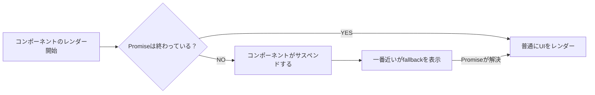

# 第114章：`Suspense`

---

この章では、いよいよ **`<Suspense>` コンポーネント** をちゃんと使えるようになるのがゴールです ✨

前の章でやったこと👇

* `use(Promise)` で「データがまだ来てないから一旦ストップ〜」＝ **サスペンド（suspend）** する仕組みを見ましたね。
* サスペンドした時に「代わりに何を見せるか？」を決めるのが **`<Suspense>` の役目** です。([react.dev][1])

ここからは

> 「データ待ちのあいだだけ、かわいい `読み込み中…` を出したい！🥺」

を、**超シンプルなコードで書けるようになる** のが目標です 💪

---

## 1. `Suspense` のざっくりイメージ 🎨

`Suspense` は、ざっくり言うと…

> 「中に入っているコンポーネントが **“まだ準備できてない”** と言ってきたら、
> そのあいだ **`fallback` で指定した UI を見せてくれる箱**」

です。

`use(Promise)` で「まだ終わってない Promise」を読んだとき、
React は内部的に「はいサスペンド〜！」となって、
**一番近くにある `<Suspense>` を探して、その `fallback` を表示** してくれます。([tasukehub.com][2])

---

## 2. `Suspense` の流れを図で見てみよう 🧠💡

Mermaid で「データ待ち → 読み込み中 → 本物の UI 表示」の流れを描いてみます。



こんなイメージです 👆

* `use(Promise)` が **「まだ終わってない！」** と判断
* コンポーネントが「サスペンド」状態になる
* すると **親の `<Suspense>` が `fallback` を表示**
* Promise が終わったら、本来の UI に切り替え 🎉

---

## 3. 最小構成で `Suspense` を使ってみる ✨

まずは **「なんとなく動く様子」** を感じる用の、すごくシンプルな例から。
ここでは実際の API 通信ではなく、`setTimeout` で 1.5 秒待つダミー Promise を使います ⏱️

### ファイル例：`App.tsx`

```tsx
import { Suspense, use } from "react";

// ① ダミーの「ユーザー情報」を返すPromise
const userPromise = new Promise<{ name: string }>((resolve) => {
  setTimeout(() => {
    resolve({ name: "りこ" });
  }, 1500);
});

// ② Promiseの結果をuse()で読むコンポーネント
function UserName() {
  const user = use(userPromise); // ← ここでPromiseがまだならサスペンド
  return <p>ユーザー名：{user.name}</p>;
}

// ③ SuspenseでUserNameを包む
export default function App() {
  return (
    <Suspense fallback={<p>読み込み中... ⏳</p>}>
      <UserName />
    </Suspense>
  );
}
```

ポイントを分解すると…👇

1. **外側で `userPromise` を作っておく**

   * コンポーネントの外に書いておくことで、毎回新しい Promise を作らずに済みます。
2. `UserName` コンポーネントの中で

   * `const user = use(userPromise);`
   * まだ解決されてないとき、コンポーネントは **「サスペンド」状態** になります。([tasukehub.com][2])
3. `App` では

   * `<Suspense fallback={<p>読み込み中... ⏳</p>}>` で `UserName` を包む
   * サスペンドしているあいだは `fallback` の中身だけが表示されます。

> ✨ 結果として：
>
> 1. 最初は「読み込み中... ⏳」
> 2. 1.5秒後に「ユーザー名：りこ」が表示

めっちゃシンプルに「読み込み中」を出せてますよね 🥰

---

## 4. 「一番近い `Suspense` だけが反応する」ってどういうこと？🧱

`Suspense` は「**一番近い親だけ** が反応する」というルールがあります。([react.dev][1])

もう少し複雑な例でイメージしてみましょう 👇

```tsx
import { Suspense, use } from "react";

const profilePromise = new Promise<{ name: string }>((resolve) => {
  setTimeout(() => resolve({ name: "りこ" }), 1500);
});

const timelinePromise = new Promise<string[]>((resolve) => {
  setTimeout(() => resolve(["初投稿！", "React勉強中✏️"]), 2500);
});

function Profile() {
  const profile = use(profilePromise);
  return <p>👤 プロフィール：{profile.name}</p>;
}

function Timeline() {
  const posts = use(timelinePromise);
  return (
    <ul>
      {posts.map((post, i) => (
        <li key={i}>{post}</li>
      ))}
    </ul>
  );
}

export default function App() {
  return (
    <div>
      {/* プロフィール用のSuspense */}
      <Suspense fallback={<p>プロフィール読み込み中… 💁‍♀️</p>}>
        <Profile />
      </Suspense>

      {/* タイムライン用のSuspense */}
      <Suspense fallback={<p>タイムライン読み込み中… 📰</p>}>
        <Timeline />
      </Suspense>
    </div>
  );
}
```

ここでの動きはこんな感じ 👉

* `Profile` がサスペンド → **上の `Suspense` だけが反応** して
  `プロフィール読み込み中… 💁‍♀️`
* `Timeline` がサスペンド → **下の `Suspense` だけが反応** して
  `タイムライン読み込み中… 📰`

全体を１つの Suspense で囲むと、どれか１つが遅れているだけで「全部まとめて `読み込み中…`」になってしまいます。
**部分ごとに Suspense を置いておくことで、細かく「読み込み中」を出し分ける** ことができるんです ✨

（複数の Suspense をどう組み合わせるかは、第117章でじっくりやります 🧪）

---

## 5. 「`Suspense` は何もしてないように見える」の正体 🪄

React の公式ドキュメントでも書かれていますが、`<Suspense>` だけを置いても **勝手には何も起きません**。([react.dev][1])

大事なのは「**中にいるコンポーネントがサスペンドできるかどうか**」です。

* `React.lazy(...)` で **コンポーネントを遅延読込み** するとき
* `use(Promise)` などで **Promise を読むコンポーネント** を入れるとき
* React Router / Next.js などの **フレームワーク側がサスペンド対応のデータ取得をしてくれるとき**([react-router-docs-ja.techtalk.jp][3])

👉 こういう **「待ちが発生したらサスペンドする」仕組み** とセットにすることで、
`<Suspense>` が本領発揮してくれます ✨

この本では、まずは **`use(Promise)` と組み合わせたパターン** を中心に手を動かしていきます 💻

---

## 6. 手を動かしてみようミニ課題 📝✨

> 🎯 目標：
>
> * 今ある小さな React アプリの中に
>   **`<Suspense>` + `use(Promise)`** を一か所だけ入れてみる

### やることステップ👣

1. どこかに「データっぽい表示」をするためのコンポーネントを作る

   * 例：`Quote.tsx` → 名言を1つ表示するイメージ
2. コンポーネントの外側に、`setTimeout` で 2 秒後に解決される Promise を作る
3. コンポーネントの中で `use(そのPromise)` を呼ぶ
4. そのコンポーネントを `<Suspense>` で包んで、`fallback` に
   「今日のひとことを取得中… ✨」みたいなメッセージを入れる

### 例：`Quote.tsx`

```tsx
import { use } from "react";

const quotePromise = new Promise<{ text: string }>((resolve) => {
  setTimeout(() => {
    resolve({ text: "小さな一歩も、未来の自分を変える大きな一歩になる✏️" });
  }, 2000);
});

export function Quote() {
  const quote = use(quotePromise);
  return <p>💬 今日のひとこと：{quote.text}</p>;
}
```

### 例：`App.tsx` に組み込む

```tsx
import { Suspense } from "react";
import { Quote } from "./Quote";

export default function App() {
  return (
    <main>
      <h1>React勉強ノート 📚</h1>

      <Suspense fallback={<p>今日のひとことを取得中… ✨</p>}>
        <Quote />
      </Suspense>
    </main>
  );
}
```

ブラウザで見ると…

1. 最初：

   * `今日のひとことを取得中… ✨` が表示される
2. 2秒後：

   * `💬 今日のひとこと：...` に切り替わる

ここまでできたら **`Suspense` の基本はもうバッチリ** です 🎉🎉

---

## 7. 本番アプリではどうなるの？ちょっとだけ先の話 🔍

この章では練習しやすいように、**生の Promise**（`new Promise(...)`）や `fetch` を直接 `use` に渡す例を使いました。

でも、React の公式ブログやドキュメントでは、**本番アプリではフレームワークやライブラリに Promise の管理を任せる** 使い方が推奨されています。([react.dev][1])

* Next.js
* React Router（データ API）
* SWR などの Suspense 対応ライブラリ

こういうツールたちが、

* Promise のキャッシュ
* エラー処理
* 再取得（リフレッシュ）

などをよしなにやってくれて、`<Suspense>` ときれいに連携してくれます ✨

でもいきなりそこまでやると頭が爆発しちゃうので 💥
**この本ではまず「素の React だけで動きを理解」→ 後半でフレームワーク連携**
という流れにしています。

---

## 8. この章のまとめ 🎀

* `Suspense` は

  * **「準備中のコンポーネントの代わりに、`fallback` を見せてくれる箱」** 🧺
* `use(Promise)` でサスペンドすると

  * 一番近い `<Suspense>` が `fallback` を表示してくれる
* `Suspense` は

  * 何かが「サスペンドする」仕組みとセットで使う（`use(Promise)` や `React.lazy` など）
* 複数の Suspense を使うと

  * それぞれのエリアごとに「読み込み中…」を出し分けできる

次の **第115章** では、
`fallback` プロパティだけをじっくりいじりながら、

> 「ローディング中の UI をどうオシャレにするか？💅」

っていうデザイン面も含めて、もう少し掘り下げていきます 🌈

おつかれさま〜！ここまでで `Suspense` の基本はしっかり掴めてるので、自信持って進んでOKです 🙌✨

[1]: https://react.dev/reference/react/Suspense?utm_source=chatgpt.com "<Suspense> – React"
[2]: https://tasukehub.com/articles/react-19-use-hook-guide-2025?utm_source=chatgpt.com "React 19の新機能 `use` フック実践ガイド【2025年版】"
[3]: https://react-router-docs-ja.techtalk.jp/how-to/suspense?utm_source=chatgpt.com "Suspense を使用したストリーミング"
