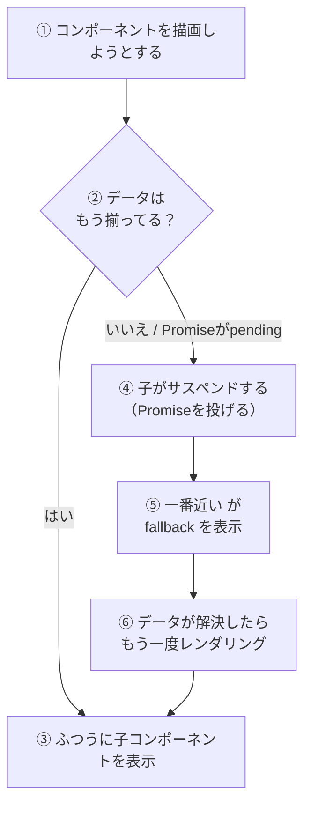

# 第115章：`Suspense` の `fallback` プロパティ

「`Suspense` の中に `fallback` 書くんでしょ？🤔
でも、**何をどんなふうに置けばいいの？**」
この章では、そのモヤモヤを一気にスッキリさせます💡

---

### 1️⃣ この章でできるようになること

この章を読み終わるころには、こんなことができるようになります👇

* 「データ読み込み中…」を **`Suspense` で自動表示** できるようになる
* `fallback` に **どんなUIを置くのが良いか** イメージできる
* **「ここだけ読み込み中にしたい！」** という範囲を意識して `fallback` を設計できる

---

### 2️⃣ ちょい復習：`Suspense` がやってること ⏳

`Suspense` は、ざっくり言うと：

> 「中のコンポーネントが『まだデータないから描けない〜！』ってなったら
> 代わりに `fallback` を表示してあげるよ👍」

というお世話係のコンポーネントです。
React 19 の `use` フックで Promise を読むと、その間コンポーネントが **「サスペンド（中断）」** されます。
そのとき、一番近くにある `<Suspense>` が **`fallback` を表示** します。([react.dev][1])

その流れを図にしてみます👇



こんなイメージです💭

---

### 3️⃣ `fallback` プロパティってなに？🎁

`Suspense` のシグネチャはざっくりこんな感じです：

* `children`: 本当に表示したいUI（データがそろったら出てくる）
* `fallback`: データ待ちのあいだに **一時的に表示しておく UI**

React の公式ドキュメントでは、`fallback` についてこう説明されています👇

* 「`fallback` は、読み込み中に表示する **軽量なプレースホルダーUI**」
* 「**どんな React ノードでもOK**（テキストでもコンポーネントでも）」([react.dev][2])

つまり、こんな感じのイメージです：

* ✅ よくある例

  * `"Loading..."` のテキスト
  * くるくる回るスピナー 🌀
  * コンテンツの形だけ見せる「スケルトンUI」

---

### 4️⃣ 一番シンプルな `fallback` の例 ✏️

まずは、**テキストだけの超シンプル版** から見てみましょう。

#### サンプル：ユーザー名を読み込むコンポーネント

```tsx
// App.tsx
import { Suspense, use } from "react";

type User = {
  id: number;
  name: string;
};

// 本番アプリではサーバー側で Promise を作って渡すことが多いけど、
// ここでは「動きのイメージ」をつかむためにシンプルに書いています。
function fetchUser(): Promise<User> {
  return fetch("https://jsonplaceholder.typicode.com/users/1")
    .then((res) => res.json());
}

// モジュールの外側で一度だけ Promise を作る
const userPromise = fetchUser();

function UserName() {
  // React 19 の use フックで Promise の中身を読む
  const user = use(userPromise);
  return <p>こんにちは、{user.name} さん 🌸</p>;
}

export function App() {
  return (
    <div>
      <h1>ユーザー情報</h1>

      <Suspense fallback={<p>ユーザー情報を読み込み中です…⏳</p>}>
        <UserName />
      </Suspense>
    </div>
  );
}
```

ポイントを順に見ていきます👇

1. `<Suspense>` で `UserName` を囲む
2. `fallback` に「読み込み中」のメッセージを置く
3. `UserName` の中で `use(userPromise)` を呼ぶ
4. `userPromise` がまだ終わっていない間、`UserName` は**サスペンド**
5. その間は `fallback` が画面に出て、終わったら本物の `UserName` が出てくる

イメージとしては👇

* 読み込み中：

  > ユーザー情報を読み込み中です…⏳
* 読み込み完了後：

  > こんにちは、○○ さん 🌸

---

### 5️⃣ `fallback` には何を置くと気持ちいい？ UX のコツ 💅

`fallback` は「待ち時間の顔」なので、**ユーザーの気持ちに優しい UI** にしてあげるのがポイントです💖

#### 🌱 まずは文字だけでもOK

```tsx
fallback={<p>読み込み中です…⏳</p>}
```

* これだけでも「固まってる？」という不安をかなり減らせます👏

#### 🌀 スピナーを使ってみる

少しだけリッチにしたいときは、簡単なスピナーコンポーネントを作ってみましょう。

```tsx
// LoadingSpinner.tsx
export function LoadingSpinner() {
  return (
    <div className="spinner" aria-label="読み込み中">
      {/* 中は空でもOK。CSSで丸を作る */}
    </div>
  );
}

// App.tsx
import { Suspense, use } from "react";
import { LoadingSpinner } from "./LoadingSpinner";

export function App() {
  return (
    <Suspense fallback={<LoadingSpinner />}>
      <UserName />
    </Suspense>
  );
}
```

CSS でくるくるアニメーションをつけてあげるとかわいいです✨

```css
/* index.css など */
.spinner {
  width: 24px;
  height: 24px;
  border: 3px solid #ddd;
  border-top-color: #555;
  border-radius: 50%;
  animation: spin 0.8s linear infinite;
  display: inline-block;
}

@keyframes spin {
  to {
    transform: rotate(360deg);
  }
}
```

#### 🧱 スケルトンUI（骨組みだけ見せる）

最近のWebサービスでは、「読み込み中でもレイアウトは崩さない」ために
**スケルトンUI**（グレーの箱だけ見えてるやつ）をよく使います。([contentful.com][3])

ざっくりイメージ：

* タイトル → グレーの太い棒
* テキスト → 細い棒を数本
* アイコン → 丸いグレー

「どこに何が出るのか」がわかるので、待っている間も安心感があります😊

---

### 6️⃣ `fallback` の「範囲」を意識してみよう 📦

`fallback` は、**`<Suspense>` で囲んだ部分ぜんぶ** を一気に置き換えます。([デバッグベア][4])

だから、こんなケースには気をつけてみてください👇

#### ❌ よくあるちょっと惜しい例

```tsx
export function App() {
  return (
    <Suspense fallback={<p>ページ全体を読み込み中…</p>}>
      <Header />
      <MainContent />
    </Suspense>
  );
}
```

この書き方だと、`MainContent` の中だけがサスペンドしても、
**`Header` までまるっと消えて** 「ページ全部が読み込み中」みたいに見えてしまいます😇

#### ✅ ちょっと良くした例（レイアウトは残す）

```tsx
export function App() {
  return (
    <div>
      <Header /> {/* ここは常に表示される */}

      <Suspense fallback={<p>メインコンテンツを読み込み中…🌀</p>}>
        <MainContent />
      </Suspense>
    </div>
  );
}
```

こうすると：

* ヘッダーやナビゲーションは **ずっと見えたまま**
* 真ん中のコンテンツだけが「読み込み中」に切り替わる

ユーザーからすると、

> 「サイト自体はちゃんと動いてて、真ん中だけ読み込み中なんだな〜」

というのが一目で分かります👀

このあたりは、Suspense の `fallback` を使うときによくハマるポイントとして
「レイアウトが全部消えてしまう問題」としてもよく話題になっています。([DEV Community][5])

---

### 7️⃣ ミニ練習：自分だけの `fallback` を作ってみよう ✍️

**お題：記事リストの読み込み `fallback` を作る**

1. `ArticleList` コンポーネントが、API から記事一覧を取得して表示するとします（中身はなんでもOK）
2. データが来るまでの間、以下のような「スケルトンUI」を `fallback` にしてみましょう

   * タイトルっぽい太い棒
   * テキストっぽい細い棒を 2 本

ヒント用のコード👇（自分でアレンジしてOK）

```tsx
// ArticleSkeleton.tsx
export function ArticleSkeleton() {
  return (
    <div className="article-skeleton">
      <div className="skeleton skeleton-title" />
      <div className="skeleton skeleton-line" />
      <div className="skeleton skeleton-line" />
    </div>
  );
}

// App.tsx
import { Suspense } from "react";
import { ArticleSkeleton } from "./ArticleSkeleton";
import { ArticleList } from "./ArticleList";

export function App() {
  return (
    <Suspense fallback={<ArticleSkeleton />}>
      <ArticleList />
    </Suspense>
  );
}
```

CSS のイメージ：

```css
.article-skeleton {
  padding: 16px;
  border-radius: 8px;
  background-color: #fafafa;
  margin-bottom: 12px;
}

.skeleton {
  background-color: #eee;
  border-radius: 4px;
  margin-bottom: 8px;
}

.skeleton-title {
  height: 20px;
  width: 60%;
}

.skeleton-line {
  height: 12px;
  width: 90%;
}
```

✅ やってみたら、こんなところを意識してみてください：

* 本番の `ArticleList` と **だいたい同じレイアウト** になってる？
* 「待ってる間も、どんなコンテンツが来るか想像しやすい」見た目になってる？

---

### 8️⃣ まとめ 📝

この章のポイントをぎゅっとまとめると…👇

* `Suspense` の `fallback` は、
  👉「**読み込み中に一時的に出しておく UI**」
* `fallback` には **どんな React ノードでも置ける**（テキスト、スピナー、スケルトン…）([react.dev][2])
* `fallback` は、`<Suspense>` で囲んだ **範囲ぜんぶ** を一気に置き換える

  * ヘッダーなど「ずっと見えていてほしい部分」は、`Suspense` の **外側** に出す
* ユーザーの気持ちを考えて：

  * 「固まってる？」と思わせないメッセージやアニメーションにする
  * レイアウトをなるべく保つスケルトンUIも◎

次の章では、`Suspense` を **複数並べたとき** にどう振る舞うか、
「滝のように順番に読み込む」パターンなどを見ていきます💧💧💧
`fallback` のイメージができたら、さらに一歩進めましょう🚀

[1]: https://react.dev/reference/react/use?utm_source=chatgpt.com "use"
[2]: https://react.dev/reference/react/Suspense?utm_source=chatgpt.com "<Suspense> – React"
[3]: https://www.contentful.com/blog/what-is-react-suspense/?utm_source=chatgpt.com "React Suspense explained: How to use it for lazy loading ..."
[4]: https://www.debugbear.com/blog/guide-to-react-suspense?utm_source=chatgpt.com "The Complete Guide To React Suspense"
[5]: https://dev.to/shieldstring/fixing-the-fallback-prop-problem-in-react-suspense-4i4d?utm_source=chatgpt.com "Fixing the fallback Prop Problem in React Suspense"
