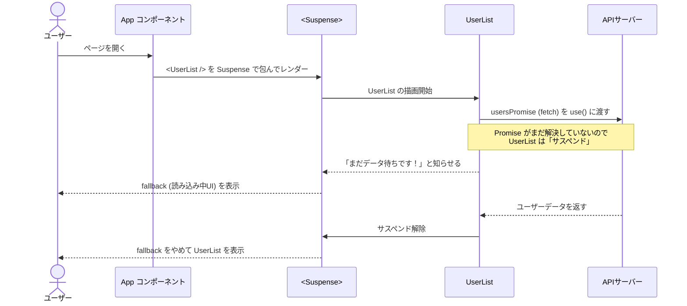

# 第116章：練習：`use` と `Suspense` でAPIデータをカッコよく表示する

この章では、

> 「`use` と `Suspense` を使って、APIから取ってきたデータを
> “読み込み中〜→キレイなカード表示” にする 💅」

というミニアプリを作っていきます。

React v19 で追加された `use(Promise)` は、Promise が解決されるまで
コンポーネントの描画を一時停止してくれる新フックです。([Zenn][1])

これに `Suspense` を組み合わせることで、

* ローディング中：`<Suspense fallback={...}>` が表示
* データ取得完了：本体コンポーネントが一気に表示

という“いい感じの体験”を、かなり少ないコードで作れます 🥰

---

## 0. 何を作るかイメージしよう 🖼

今回のゴールは、ざっくりこんな画面です：

* APIからユーザー一覧を取得
* 一人ずつカード表示
* ローディング中は「ぐるぐる表示」みたいな画面を出す

---

## 1. React 19 になっているかチェック 🧾

`package.json` を開いて、`react` と `react-dom` が **19系** になっているか確認します。

たとえばこんな感じ：

```json
{
  "dependencies": {
    "react": "^19.0.0",
    "react-dom": "^19.0.0",
    "typescript": "^5.0.0",
    "vite": "^6.0.0"
  }
}
```

もし 18 のままだったら、バージョンを書き換えてから：

```bash
npm install
```

をやっておきましょう 💪
（プロジェクトは前の章までで作ってある前提でOKです）

---

## 2. 今回使うAPIを決める 🌐

練習用として超有名なダミーAPI **JSONPlaceholder** を使います：

* URL: `https://jsonplaceholder.typicode.com/users`
* いろんなユーザー情報（`name`, `username`, `email` など）が入ってます

ブラウザで開いてみると、JSON がドーンと出てくるはずです 👀

---

## 3. 型とPromiseを用意しよう（コンポーネントの外に！）🧪

まずは、APIから返ってくるデータの「型」と、
`use` に渡す **Promise** を作るファイルを用意します。

`src/api/users.ts` を新規作成して、こう書きます：

```ts
// src/api/users.ts
export type User = {
  id: number;
  name: string;
  username: string;
  email: string;
};

const USERS_API_URL = "https://jsonplaceholder.typicode.com/users";

// ✅ コンポーネントの外で Promise を作るのがポイント！
export const usersPromise: Promise<User[]> = fetch(USERS_API_URL).then(
  async (res) => {
    if (!res.ok) {
      throw new Error("ユーザー情報の取得に失敗しました");
    }
    const data: User[] = await res.json();
    return data;
  }
);
```

### ここが大事ポイント ✨

* **Promise をコンポーネントの外で作る**
  React 19 の `use` は、
  「同じ Promise を何度も使う（安定している）」ことが前提です。([tolu.se][2])
  → コンポーネントの中で `fetch(...)` すると、再レンダーのたびに新しい Promise ができてしまうのでNG。

* `User` 型を作っておくことで、
  VSCode が `user.name` / `user.email` などを候補で出してくれるようになります ✨

---

## 4. `use` で Promise を「そのまま読む」コンポーネント 🎧

次に、ユーザー一覧を表示するコンポーネントを作ります。

`src/components/UserList.tsx` を作成：

```tsx
// src/components/UserList.tsx
import { use } from "react";
import type { User } from "../api/users";
import { usersPromise } from "../api/users";
import styles from "./UserList.module.css";

export function UserList() {
  // 🔮 use に Promise を渡すと、解決された中身（User[]）が返ってくる
  const users = use(usersPromise) as User[];

  return (
    <section className={styles.wrapper}>
      <h2 className={styles.title}>ユーザー一覧 📋</h2>
      <p className={styles.caption}>APIから取ってきたサンプルユーザーです ✨</p>

      <ul className={styles.list}>
        {users.map((user) => (
          <li key={user.id} className={styles.card}>
            <h3 className={styles.name}>{user.name}</h3>
            <p className={styles.username}>@{user.username}</p>
            <p className={styles.email}>{user.email}</p>
          </li>
        ))}
      </ul>
    </section>
  );
}
```

### `use(usersPromise)` ってなにをしてるの？🧐

* `usersPromise` は `Promise<User[]>`
* `use(usersPromise)` と書くと、

  * Promise が **まだ解決していないとき** → コンポーネントのレンダリングを一時停止（＝Suspenseにバトンタッチ）
  * 解決したら → `User[]` が `users` に入る

つまり、

> 「`await usersPromise` の結果だけ欲しい」
> という気持ちを、そのまま React 的に書いたもの

とイメージしてOKです 💡

---

## 5. `Suspense` でローディング画面を包む 🎁

`UserList` だけ書いても、まだローディング表示は出ません。
`Suspense` で包んであげる必要があります。

`src/App.tsx` を編集して、こんな感じにします：

```tsx
// src/App.tsx
import { Suspense } from "react";
import { UserList } from "./components/UserList";
import "./App.css";

function App() {
  return (
    <main className="app-root">
      <h1 className="app-title">React v19 × use × Suspense 練習アプリ 💻</h1>

      {/* ⏳ UserList が「サスペンド」してる間は fallback が表示される */}
      <Suspense
        fallback={
          <div className="loading">
            <div className="spinner" />
            <p>ユーザー情報を読み込み中です…⏳</p>
          </div>
        }
      >
        <UserList />
      </Suspense>
    </main>
  );
}

export default App;
```

ポイント 👇

* `<Suspense fallback={...}>`

  * 中の子コンポーネント（ここでは `<UserList />`）が
    「まだデータ待ちだよ〜」という状態になったとき、
    `fallback` に渡した JSX を代わりに表示してくれます
* `UserList` の中で `use(usersPromise)` を呼ぶことで
  「今はまだ Promise 待ちです！」と React に伝わる → Suspense 発動

---

## 6. ちょっとオシャレなCSSを当てる 🎨

最低限のスタイルを当てて、カードっぽくしてみましょう。

### `src/App.css`

```css
/* src/App.css */
.app-root {
  min-height: 100vh;
  padding: 32px 16px;
  display: flex;
  flex-direction: column;
  align-items: center;
  background: linear-gradient(135deg, #f9f1ff, #e1f0ff);
  font-family: system-ui, -apple-system, BlinkMacSystemFont, "Segoe UI", sans-serif;
}

.app-title {
  font-size: 1.6rem;
  margin-bottom: 24px;
  text-align: center;
}

.loading {
  display: flex;
  flex-direction: column;
  align-items: center;
  gap: 12px;
  margin-top: 24px;
}

.spinner {
  width: 32px;
  height: 32px;
  border-radius: 999px;
  border: 4px solid rgba(0, 0, 0, 0.05);
  border-top-color: rgba(99, 102, 241, 0.9);
  animation: spin 0.8s linear infinite;
}

@keyframes spin {
  to {
    transform: rotate(360deg);
  }
}
```

### `src/components/UserList.module.css`

```css
/* src/components/UserList.module.css */
.wrapper {
  width: 100%;
  max-width: 720px;
  background-color: #ffffffdd;
  border-radius: 16px;
  padding: 20px 18px 24px;
  box-shadow: 0 10px 25px rgba(15, 23, 42, 0.12);
  backdrop-filter: blur(6px);
}

.title {
  font-size: 1.3rem;
  margin-bottom: 4px;
}

.caption {
  font-size: 0.9rem;
  color: #6b7280;
  margin-bottom: 16px;
}

.list {
  list-style: none;
  padding: 0;
  margin: 0;
  display: grid;
  grid-template-columns: repeat(auto-fit, minmax(220px, 1fr));
  gap: 12px;
}

.card {
  border-radius: 12px;
  padding: 12px 14px;
  background: linear-gradient(135deg, #eef2ff, #ecfeff);
  border: 1px solid #e5e7eb;
}

.name {
  font-size: 1rem;
  font-weight: 600;
  margin: 0 0 4px;
}

.username {
  font-size: 0.85rem;
  color: #6366f1;
  margin: 0 0 2px;
}

.email {
  font-size: 0.85rem;
  color: #4b5563;
  word-break: break-all;
  margin: 0;
}
```

これで、カードっぽいユーザー一覧＋
ローディング中はクルクル回るスピナー…という感じになります ✨

---

## 7. 動きの流れを Mermaid でイメージしよう 🧠

`use` と `Suspense` がどう連携しているか、
ざっくり図にするとこんなイメージです：



なんとな〜くでも流れがイメージできればOKです 🙆‍♀️

---

## 8. 実行してみよう ▶️

ターミナルで：

```bash
npm run dev
```

ブラウザで `http://localhost:5173`（ポートは環境によって少し違うかも）にアクセスして、

1. 最初に「読み込み中です…⏳」が一瞬見える
2. そのあとユーザーのカード一覧がふわっと出てくる ✨

という動きになっていれば成功です 🎉

---

## 9. ちょっとチャレンジ課題 💡

余裕があれば、こんなアレンジも試してみてください：

1. **ユーザー件数を表示する**

   * `users.length` を使って「全○件」みたいなテキストを追加する
2. **ローディングUIをもっと可愛くする**

   * 絵文字を増やしたり、
     「いまサーバーからデータをダウンロード中…📡」などメッセージを工夫してみる
3. **別のAPIに差し替えてみる**

   * たとえば、ポケモンAPIや、天気APIなど
   * `User` 型を自分で定義し直す練習にもなります 🐱‍👤

---

## まとめ 🌈

この章でやったことを整理すると…

* React 19 の `use(Promise)` で、Promise の「結果だけ」をシンプルに受け取る
* Promise は **コンポーネントの外** で作るのがポイント
* `Suspense` に包むことで、ロード中は `fallback` を見せる
* ちょっとCSSを足して “APIから取ってきたデータをカッコよく表示する” UI を作った 💅

次の章では、この `Suspense` 周りに**エラー処理**も混ぜていくと
さらに実戦的なデータ取得パターンになっていきます ✨

おつかれさま〜！🍵
もしコードがうまく動かなかったら、エラー文をそのまま貼ってくれれば一緒に直していきましょ 💡

[1]: https://zenn.dev/yuhua_shi/articles/28ef374bc4b3b2?utm_source=chatgpt.com "React 19 の便利そうな新しい Hook を探ってみた"
[2]: https://tolu.se/blog/react-19-data-loading/?utm_source=chatgpt.com "React 19 data-loading with the use()-hook - Tolu Blog"
