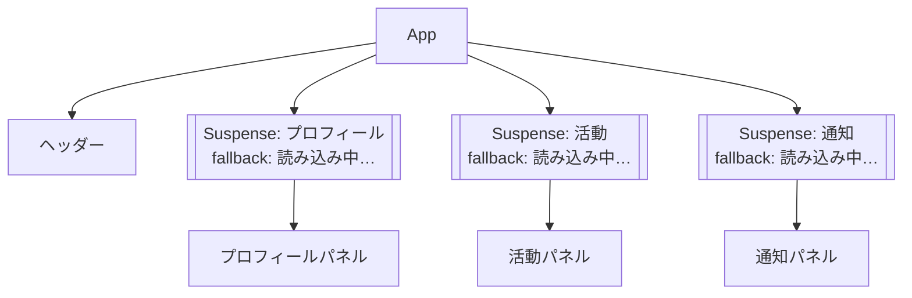

# 第117章：`Suspense` を複数置く

この章では、**`Suspense` を画面のあちこちに「いくつも置く」**ことで、
ユーザーにとって気持ちいい「順番付きの読み込み体験」を作る練習をしていきます 💻💫

---

## 1️⃣ まずはおさらい：`use(Promise)` と `Suspense` の関係

React v19 では、`use` フックを使って **Promise や Context から値を読む**ことができます。
`use` に Promise を渡すと、その Promise が解決するまでコンポーネントのレンダーが一時停止（suspend）して、
外側にある `Suspense` が「fallback（ローディング表示）」に切り替わります。([React][1])

```
import { use, Suspense } from "react";

type User = { name: string };

const userPromise: Promise<User> = fetch("/api/user").then((r) => r.json());

function UserInfo() {
  const user = use(userPromise); // ← ここで一旦「待つ」
  return <p>こんにちは、{user.name} さん 👋</p>;
}

export default function App() {
  return (
    <Suspense fallback={<p>ユーザー情報読み込み中… ⏳</p>}>
      <UserInfo />
    </Suspense>
  );
}
```

* `use(userPromise)` が「まだ終わってないよ〜」という状態だと、
* そのコンポーネントは一旦止まって、
* かわりに `Suspense` の `fallback` が表示されます。

この「止める範囲」をコントロールするのが **`Suspense` の置き方** です 💡

---

## 2️⃣ `Suspense` を複数置くと何がうれしい？🎯

React の公式ドキュメントでは、`Suspense` を使うと
**「どの部分をまとめて一気に出すか」「どの部分を順番に出すか」** をコントロールできる、と説明されています。([React][2])

* `Suspense` 1つだけ →
  ページ全体が「読み込み中…」になって、**全部そろってから一気に表示**。
* `Suspense` を部分ごとに分割 →
  **先に終わったところから順番に表示**（＝滝のように、上から下へ／左から右へ少しずつ出てくるイメージ）。

### ざっくり構造イメージ 🧠

ダッシュボード画面を例にします：

* プロフィールカード
* 最近の活動
* 通知一覧

を別々に読み込むような画面です。

````

````

それぞれの `Suspense` が、**自分の担当パネルだけを守る「カーテン」** みたいな役割をします 🎭

---

## 3️⃣ ハンズオン：ダッシュボードで `Suspense` を複数置いてみる

ここからは、実際にファイルを作って動かしてみましょう ✍️
（Vite + React + TypeScript でプロジェクトはできている前提にします）

### Step 1: 疑似APIを作る（全部時間差で終わるようにする）

`src/api/dashboard.ts` を作成します。
いろんなデータが **1秒・2秒・3秒ずつズレて終わる** ようにして、
見た目で「滝っぽさ」を体感できるようにします 💦

```
/* src/api/dashboard.ts */

export type Profile = {
  id: number;
  name: string;
  emoji: string;
};

export type Activity = {
  id: number;
  title: string;
};

export type Notification = {
  id: number;
  message: string;
};

function wait(ms: number) {
  return new Promise<void>((resolve) => {
    setTimeout(resolve, ms);
  });
}

async function fetchProfile(): Promise<Profile> {
  await wait(1000); // 1秒待つ
  return {
    id: 1,
    name: "ゆい",
    emoji: "🌸",
  };
}

async function fetchActivities(): Promise<Activity[]> {
  await wait(2000); // 2秒待つ
  return [
    { id: 1, title: "React 勉強会に参加" },
    { id: 2, title: "ポートフォリオサイトを更新" },
  ];
}

async function fetchNotifications(): Promise<Notification[]> {
  await wait(3000); // 3秒待つ
  return [
    { id: 1, message: "新しいコメントがつきました 💬" },
    { id: 2, message: "課題の締切が近づいています ⏰" },
  ];
}

// React 19 の use() で読むための Promise を「先に」作っておく
export const profilePromise = fetchProfile();
export const activitiesPromise = fetchActivities();
export const notificationsPromise = fetchNotifications();
```

👉 ポイント

* Promise を **モジュールのトップレベル** で作っているので、

  * アプリ起動時に **同時に全部スタート** します。
  * これで「ネットワークリクエストの滝（無駄に遅くなる）」を防ぎつつ、
    「表示だけ段階的に」することができます。([sergiodxa.com][3])

---

### Step 2: 各パネルコンポーネントで `use(Promise)` を使う

それぞれ `use` を使ってデータを読み取るコンポーネントを作ります。
`use` は Promise が解決するまで自動で `Suspense` と連携してくれます。([React][1])

#### `ProfilePanel.tsx`

```
/* src/components/ProfilePanel.tsx */
import { use } from "react";
import { profilePromise } from "../api/dashboard";

export function ProfilePanel() {
  const profile = use(profilePromise);

  return (
    <section className="card">
      <h2>プロフィール 👩‍🎓</h2>
      <p>
        <span style={{ fontSize: "2rem" }}>{profile.emoji}</span>
      </p>
      <p>{profile.name} さん、今日もがんばろ〜 ✨</p>
    </section>
  );
}
```

#### `ActivityPanel.tsx`

```
/* src/components/ActivityPanel.tsx */
import { use } from "react";
import { activitiesPromise } from "../api/dashboard";

export function ActivityPanel() {
  const activities = use(activitiesPromise);

  return (
    <section className="card">
      <h2>最近の活動 📚</h2>
      <ul>
        {activities.map((activity) => (
          <li key={activity.id}>・{activity.title}</li>
        ))}
      </ul>
    </section>
  );
}
```

#### `NotificationsPanel.tsx`

```
/* src/components/NotificationsPanel.tsx */
import { use } from "react";
import { notificationsPromise } from "../api/dashboard";

export function NotificationsPanel() {
  const notifications = use(notificationsPromise);

  return (
    <section className="card">
      <h2>通知 🔔</h2>
      <ul>
        {notifications.map((notice) => (
          <li key={notice.id}>・{notice.message}</li>
        ))}
      </ul>
    </section>
  );
}
```

---

### Step 3: `App.tsx` で `Suspense` を 1個 → 3個 に変えてみる

#### パターンA：大きな `Suspense` が1つの場合

まずは「全部まとめて」バージョンから。

```
/* src/App.tsx */
import { Suspense } from "react";
import { ProfilePanel } from "./components/ProfilePanel";
import { ActivityPanel } from "./components/ActivityPanel";
import { NotificationsPanel } from "./components/NotificationsPanel";
import "./App.css";

export default function App() {
  return (
    <main className="dashboard">
      <h1>マイダッシュボード 🌈</h1>

      <Suspense fallback={<p>画面を準備中です… ⏳</p>}>
        <div className="grid">
          <ProfilePanel />
          <ActivityPanel />
          <NotificationsPanel />
        </div>
      </Suspense>
    </main>
  );
}
```

この場合：

* 3つのデータ取得は並列で始まっていますが、
* **いちばん遅い（今回は通知 3秒）まで待ってから**、
* 3つのパネルが **同時にボンッと表示** されます。

---

#### パターンB：`Suspense` を3つ置いてみる（本番）

次に、**それぞれのパネルを個別の `Suspense` で包んで** みましょう。

```
/* src/App.tsx */
import { Suspense } from "react";
import { ProfilePanel } from "./components/ProfilePanel";
import { ActivityPanel } from "./components/ActivityPanel";
import { NotificationsPanel } from "./components/NotificationsPanel";
import "./App.css";

export default function App() {
  return (
    <main className="dashboard">
      <h1>マイダッシュボード 🌈</h1>

      <div className="grid">
        <Suspense fallback={<p>プロフィール読み込み中… ✨</p>}>
          <ProfilePanel />
        </Suspense>

        <Suspense fallback={<p>活動履歴を読み込み中… 📚</p>}>
          <ActivityPanel />
        </Suspense>

        <Suspense fallback={<p>通知を読み込み中… 🔔</p>}>
          <NotificationsPanel />
        </Suspense>
      </div>
    </main>
  );
}
```

この構成だと：

* 約1秒後 → プロフィールだけ先に出る
* 約2秒後 → 活動パネルも出る
* 約3秒後 → 最後に通知パネルが出る

という感じで、**画面が上から順番に「完成していく」滝っぽい動き** になります 🌊

---

### Step 4: かんたんなスタイルを付ける（お好みで）

`src/App.css` に、軽くカードっぽいスタイルを足しておくと見やすいです 🎨

```
/* src/App.css */

body {
  margin: 0;
  background: #f5f5fb;
}

.dashboard {
  max-width: 960px;
  margin: 0 auto;
  padding: 2rem 1.5rem 3rem;
  font-family: system-ui, -apple-system, BlinkMacSystemFont, "Segoe UI",
    sans-serif;
}

h1 {
  font-size: 1.8rem;
  margin-bottom: 1.5rem;
}

.grid {
  display: grid;
  gap: 1rem;
}

@media (min-width: 768px) {
  .grid {
    grid-template-columns: repeat(3, minmax(0, 1fr));
  }
}

.card {
  background: #ffffff;
  border-radius: 12px;
  padding: 1rem 1.2rem;
  box-shadow: 0 4px 14px rgba(0, 0, 0, 0.06);
}
```

---

## 4️⃣ 兄弟 `Suspense` vs ネストした `Suspense` 🧩

`Suspense` を複数置くときは、

* **兄弟として横に並べるか**
* **親子関係でネストするか**

で、**「どういう順番でロードされて見えるか」** が変わります。

### イメージ：`await` と `Promise.all` の違いに似てる話

ある記事では、これを `await` の書き方にたとえて説明しています。([sergiodxa.com][3])

#### ネストした `Suspense` → 順番に `await` してる感じ

```
let d1 = await getData1();
let d2 = await getData2();
```

* `getData2()` は `getData1()` が終わるまで**始まらない**
* ＝ **遅い方に引きずられがち**

UI 的には：

```
<Suspense fallback={<p>大きい読み込み中…</p>}>
  <SlowPart>
    <Suspense fallback={<p>中の読み込み中…</p>}>
      <InnerPart />
    </Suspense>
  </SlowPart>
</Suspense>
```

外側が終わらないと内側の描画も進まないので、
**まとめて遅くなるイメージ** です。

#### 兄弟 `Suspense` → `Promise.all` 的な感じ

```
let [d1, d2] = await Promise.all([getData1(), getData2()]);
```

* 両方とも **同時にスタート**
* 早く終わったほうから順に結果が揃う

UI 的には：

```
<Suspense fallback={<p>パートA読み込み中…</p>}>
  <PartA />
</Suspense>

<Suspense fallback={<p>パートB読み込み中…</p>}>
  <PartB />
</Suspense>
```

今回のダッシュボードは、この **兄弟 `Suspense`** パターンを使って、
「プロフィール → 活動 → 通知」と、**ちょっとずつ完成していく画面** を作りました ✅

---

## 5️⃣ `Suspense` を置くときのちょっとしたコツ 💡

React の公式ドキュメントでは、`Suspense` は
**「ユーザーにどういうロード体験をさせたいか」** を基準に置こうね、と言われています。([React][2])

ざっくりルール：

* ✅ **一緒に出てほしい部分** は、同じ `Suspense` の中にまとめる
* ✅ **別々に出てきてOKな部分** は、それぞれ `Suspense` で包む
* ❌ なんでもかんでも `Suspense` で包みまくるのはNG（分かりづらい＆複雑）

今回の例だと：

* タイトル（`<h1>`）は **すぐ表示しておきたい** ので `Suspense` の外側
* 3つのカードは **それぞれ別々の速度で出てきてOK** なので、`Suspense` を3つ

こんな感じで、**画面の「骨組み」と「中身」** を分けて考えると設計しやすいです 🦴✨

---

## 6️⃣ ミニ練習問題 🎓

時間があれば、次のようにアレンジしてみてください：

1. **プロフィールだけは絶対にすぐ出したい！**

   * プロフィールは `Suspense` の外に出して、
   * 活動と通知だけを `Suspense` で包んでみる。

2. **通知エリアだけは「小さめのローディング表示」にする**

   * 通知の fallback を `<p>🔔 …</p>` みたいな
     シンプルなアイコンだけにして、
   * 活動のほうはテキスト多めのローディング表示にしてみる。

3. **読み込み時間を変えてみる**

   * `wait(1000)` / `wait(2000)` / `wait(3000)` を入れ替えて、
   * どの順番でカードが出てくるか観察してみる 👀

---

## 7️⃣ 今日のまとめ ✨

* `use(Promise)` と `Suspense` を組み合わせると、
  **Promise が終わるまで特定のUIだけ「カーテン」をかけておける**。([React][1])
* `Suspense` を **複数** 置くことで、

  * 画面の一部だけ先に表示
  * 遅い部分は後からスルスル出てくる
    という「滝のような」ロード体験を作れる 🌊
* 兄弟 `Suspense` は `Promise.all` 的な並行ロードのイメージで考えると分かりやすい。([sergiodxa.com][3])
* 「どこで区切るか？」は、**ユーザーにどう見せたいか** を基準に設計するのがコツ。([React][2])

次の章では、エラーが起きたときにどう受け止めるか（エラーバウンダリ）も絡めて、
`Suspense` をさらに安全に使う方法を見ていきましょう 💥🐛➡️🛡️

[1]: https://react.dev/reference/react/use?utm_source=chatgpt.com "use"
[2]: https://react.dev/reference/react/Suspense?utm_source=chatgpt.com "<Suspense> – React"
[3]: https://sergiodxa.com/tutorials/avoid-waterfalls-in-react-suspense?utm_source=chatgpt.com "How toAvoid Waterfalls in React Suspense"
